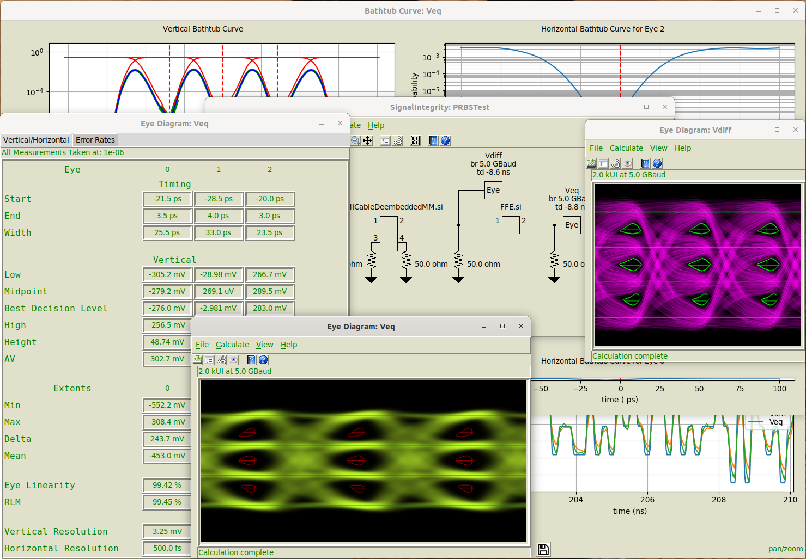
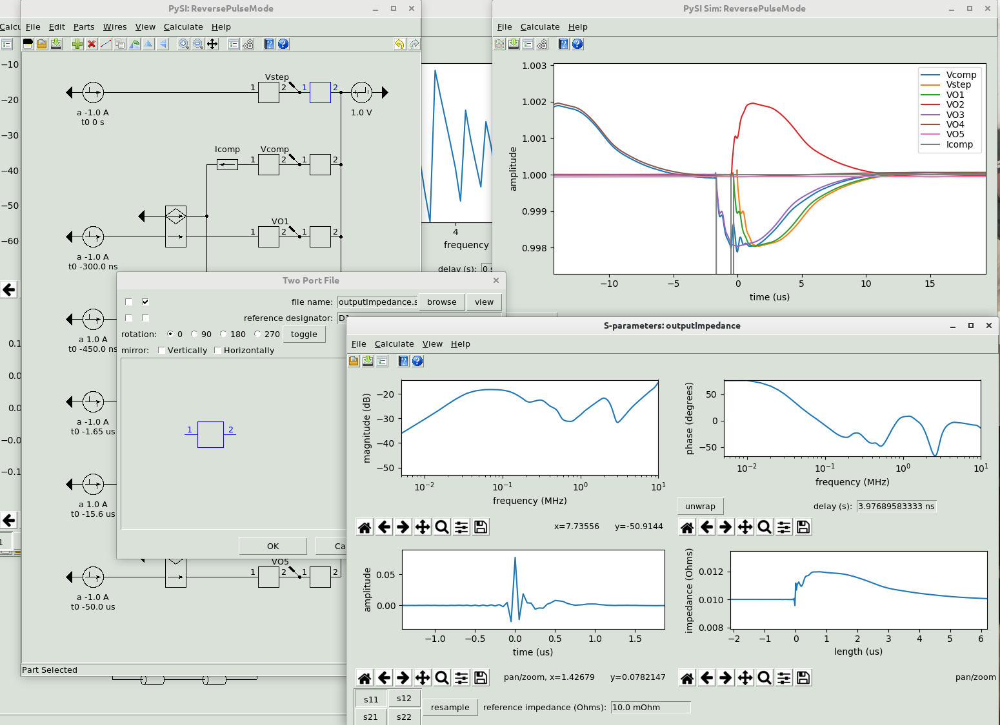

# About {#sec:About}

***SignalIntegrity*** is Python based tools for solving four basic signal integrity problems. (See the [Introduction](06-Introduction.md#sec:Introduction) for what these problems are).

The ***SignalIntegrity*** library is a Python package that is essentially a library of functions that can be used to solve these problems through Python scripts that you create.

***SignalIntegrityApp*** is a Tkinter based Python GUI application that relies on the SignalIntegrity library which allows users to solve problems in a graphical environment.

This software is the culmination of several years of effort. While writing a book on signal integrity (to be released by Cambridge University Press in mid-2019), I recognized patterns in the mathematics behind s-parameters and s-parameter based systems that allow the math to be tweaked slightly to perform simulation, virtual probing, s-parameter generation and de-embedding, all from the same basic mathematical concepts. The purpose and underlying principal of the book and theory is that:

1.  Engineers rely too heavily on tools that they don’t understand, and it is not only within their grasp to understand the theory, it is really imperative to understand the results.

2.  Once you understand the theory, you can do many things yourself and gain the benefit of releasing yourself from reliance on expensive, black-box tools that you don’t understand and which the vendors don’t always explain. And once you understand the theory (and can even look at the source code), you can rely on yourself to solve problems and examine and understand the results.

While writing this book on theory, I realized that even with an understanding of the theory, many relatively simple problems are still very complicated calculations and some software should be created based on this theory. So the book teaches the theory, but then also teaches how to use the software tools that utilize the theory. Originally all of these software tools were in the form of the ***SignalIntegrity*** library and were utilized from Python scripts.

And finally, again during the development of this book and tools, I realized that even the scripts get too complicated and it would be good to have a GUI based application - that is ***SignalIntegrityApp***. But the development of the ***SignalIntegrity*** library first provided huge advantages - it can be tested well and can be utilized very flexibly. Currently there are about 1000 tests that test for proper behavior of the underlying library. As for the GUI, these are very difficult to test in an automated manner and by definition, must be a bit less flexible.

This software is release as open-source software according to the [License](03-License.md#sec:License).

Peter J. Pupalaikis

[pete_pope@hotmail.com](mailto:Pete@Nubis-Communications.com?subject=SignalIntegrity Project)

