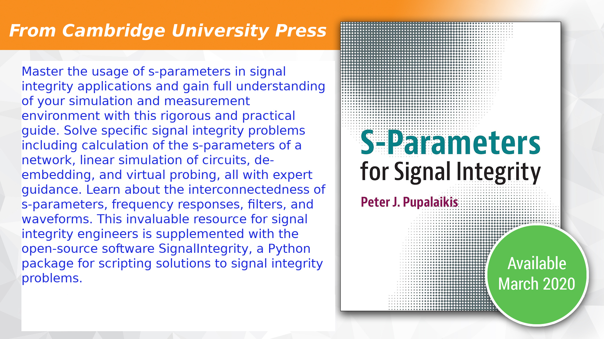

# Book {#sec:Book}

All of the software in *SignalIntegrity* is completely explained in the book [“S-Parameters for Signal Integrity”](https://www.cambridge.org/core/books/sparameters-for-signal-integrity/2FD44B994CD054E4B844B358E8903A09#fndtn-information) published by Cambridge University Press.

The book describes the math behind all of the software and describes the software itself, along with its organization.

