# S-Parameter Generation {#sec:S-parameter-Generation}

This section explains how to use ***SignalIntegrityApp*** to generate the s-parameters of a system. It involves the steps of:

- [Drawing a Schematic for S-parameter Generation](07-S-Parameter-Generation.md#sub:Drawing-a-Schematic-for-S-parameter-Generation)

- [Attaching Ports to a Schematic for S-parameter Calculation](07-S-Parameter-Generation.md#sub:Attaching-Ports-to-a-Schematic)

- [Setting Calculation Properties](07-S-Parameter-Generation.md#sub:Setting-Calculation-Properties)

- [Calculating S-parameters](07-S-Parameter-Generation.md#sub:Calculating-S-parameters)

Read through the following sections on how to accomplish this, or skip immediately to the [S-parameter Generation Example](07-S-Parameter-Generation.md#sub:S-parameter-Generation-Example).

## Drawing a Schematic for S-parameter Generation {#sub:Drawing-a-Schematic-for-S-parameter-Generation}

When ***SignalIntegrityApp*** opens, you have a blank canvas and are ready to draw a schematic.

Drawing the schematic is accomplished through the addition of parts, ports and wires.

To add parts to the schematic, see [Add Part](15-Main-Schematic-Dialog.md#Control-Help:Add-Part). To add wires to the schematic, see [Add Wire](15-Main-Schematic-Dialog.md#Control-Help:Add-Wire). See the next section about [Attaching Ports to a Schematic for S-parameter Calculation](07-S-Parameter-Generation.md#sub:Attaching-Ports-to-a-Schematic).

## Attaching Ports to a Schematic for S-parameter Calculation {#sub:Attaching-Ports-to-a-Schematic}

A [Port](23-Built-in-Devices-Parts.md#device:Port) helps define the s-parameters of the final circuit. As you must be aware, s-parameters are a vector of matrix elements, where each matrix element is for a particular frequency (these frequencies are defined by the calculation properties defined in the next section: [Setting Calculation Properties](07-S-Parameter-Generation.md#sub:Setting-Calculation-Properties)) and each matrix defines the complex port-port relationship at that frequency.

Thus, for a set of two-port s-parameters, $S_{21}$ refers to the port-port relationship as the output (reflected) wave from port 2 due to an incident wave on port 1 over all the frequencies. These port numbers are defined by the port element added in the schematic.

To add ports to a schematic, see [Add Port](15-Main-Schematic-Dialog.md#Control-Help:Add-Port).

## Setting Calculation Properties {#sub:Setting-Calculation-Properties}

To set the calculation properties for s-parameter calculation, see [Calculation Properties](15-Main-Schematic-Dialog.md#Control-Help:Calculation-Properties).

The calculation properties determine how the s-parameters are calculated, specifically the frequency points that are calculated. The calculation properties are the same set for all of the ***SignalIntegrityApp*** applications. With regard to s-parameter calculation, the elements of particular interest are the end frequency, which is the last frequency in the s-parameter calculation, and the frequency points, which are the number of frequency points that will be present in the final s-parameters calculated.

## Calculating S-parameters {#sub:Calculating-S-parameters}

After creating the schematic for s-parameter generation and setting the calculation properties, the s-parameters are calculated using either the [Calculate S-parameters](15-Main-Schematic-Dialog.md#Control-Help:Calculate-S-parameters) command or the [Calculate](15-Main-Schematic-Dialog.md#Control-Help:Calculate-Button) toolbar button.

Note that calculation will not be possible at all (i.e. the menu elements are disabled) if the schematic does not meet the criteria for s-parameter calculation. This criteria for the schematic regarding elements are that the schematic must:

- have at least one [Port](23-Built-in-Devices-Parts.md#device:Port) element (see [Add Port](15-Main-Schematic-Dialog.md#Control-Help:Add-Port))

- not have any other elements that don’t make sense for s-parameter generation including:

  - output probes

  - measure probes

  - stims

  - unknown devices

  - system devices

In calculating the s-parameters, the first step is to convert the schematic shown into a [Netlist](24-Netlist.md#sec:Netlist). This netlist puts the graphical schematic into a text based description. Note that this netlist can be created, examined and saved separately if you want. See [Export Netlist](15-Main-Schematic-Dialog.md#Control-Help:Export-Netlist) on ways of viewing and exporting the net lists.

The net list is passed to a **SystemSParametersNumericParser** class as described in software documentation after which the s-parameters are extracted.

During parsing of the net list, all devices listed are instantiated with the end frequency and number of frequency points specified in the [Calculation Properties](15-Main-Schematic-Dialog.md#Control-Help:Calculation-Properties). If a file device is encountered, the s-parameters read from the file are resampled onto the end frequency and number of frequency points specified.

Then, for each frequency point, the s-parameters are generated of the schematic.

Sometimes, things go wrong and an error is generated. See [Errors and Exceptions](27-Errors-and-Exceptions.md#sec:Errors-and-Exceptions) for an explanation of any errors generated during calculation.

If everything goes correctly, a dialog will open with the ability to view the s-parameters calculated and save them to a file in the [S-parameter Viewer](13-S-parameter-Viewer.md#sec:S-parameter-Viewer).

## S-parameter Generation Example {#sub:S-parameter-Generation-Example}

In this example we will generate the mixed-mode s-parameters of a differential transmission line.

We start by opening the file provided in the examples. The file is included with the ***SignalIntegrityApp*** and can be found at ./Examples/SParameterGenerationExample.xml:

Here we see three devices and four ports.

To build this example, we first create a [New Project](15-Main-Schematic-Dialog.md#Control-Help:New-Project).

We added the devices by executing [Add Part](15-Main-Schematic-Dialog.md#Control-Help:Add-Part), opening the Files category, and selecting the Four Port [File](23-Built-in-Devices-Parts.md#device:File) device.

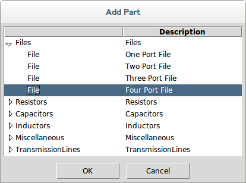

In the part properties dialog, we select the file: Sparq_demo_16.s4p.

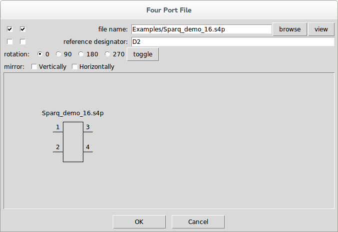

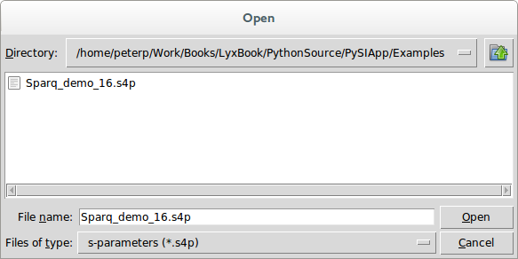

We also selected the left-most checkbox on the file name property so that it displays in the schematic.

Pressing OK and clicking the mouse causes the part to appear in the schematic.

At this point, our schematic looks like this:

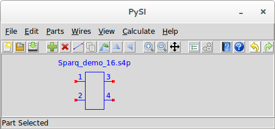

Notice the red x’s showing where the part pins are unconnected. Also note that the part is blue and the status message says *Part Selected*.

We then add the mixed-mode converter devices by again executing [Add Part](15-Main-Schematic-Dialog.md#Control-Help:Add-Part), opening the Miscellaneous category, and selecting the [Power Mixed Mode Converter](23-Built-in-Devices-Parts.md#device:Power-Mixed-Mode-Converter).

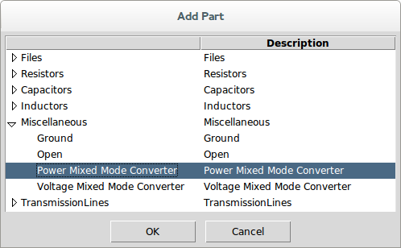

This part has no properties.

Pressing OK and clicking the mouse causes the part to appear in the schematic.

At this point, our schematic looks like this:

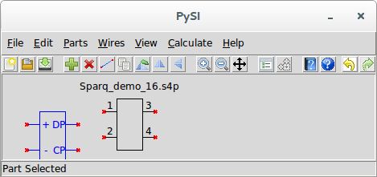

Since we are converting single-ended to mixed-mode s-parameters, we need to hook the positive and negative ports of the left and right sides of the four-port device to the mixed-mode converters. But we don’t really know for sure where the positive and negative ports are on this device.

To find out, we select our four port device and invoke [Edit Properties](15-Main-Schematic-Dialog.md#Control-Help:Edit-Properties). This brings up the part properties dialog again for the file device:

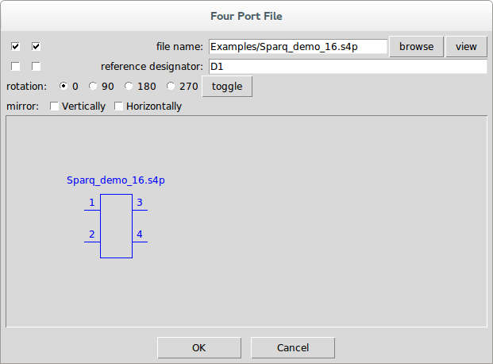

Next to the file name, we see the view button. Pressing this brings up the [S-parameter Viewer](13-S-parameter-Viewer.md#sec:S-parameter-Viewer).

The s-parameters to view are selected from the box of buttons in the lower left. Selecting s31, we see:

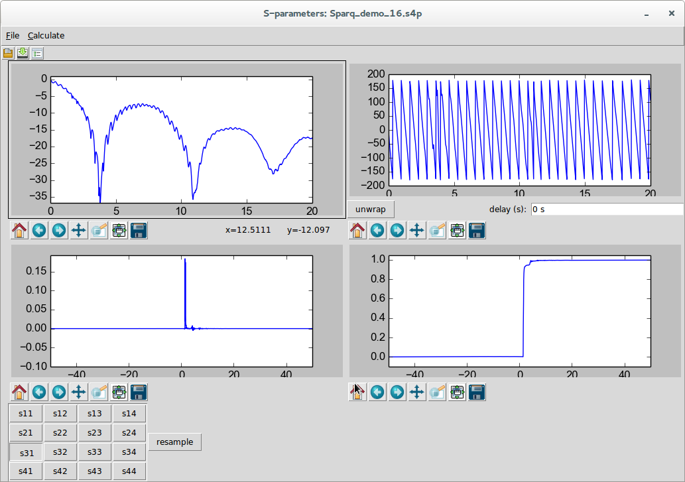

and selecting s41 we see:

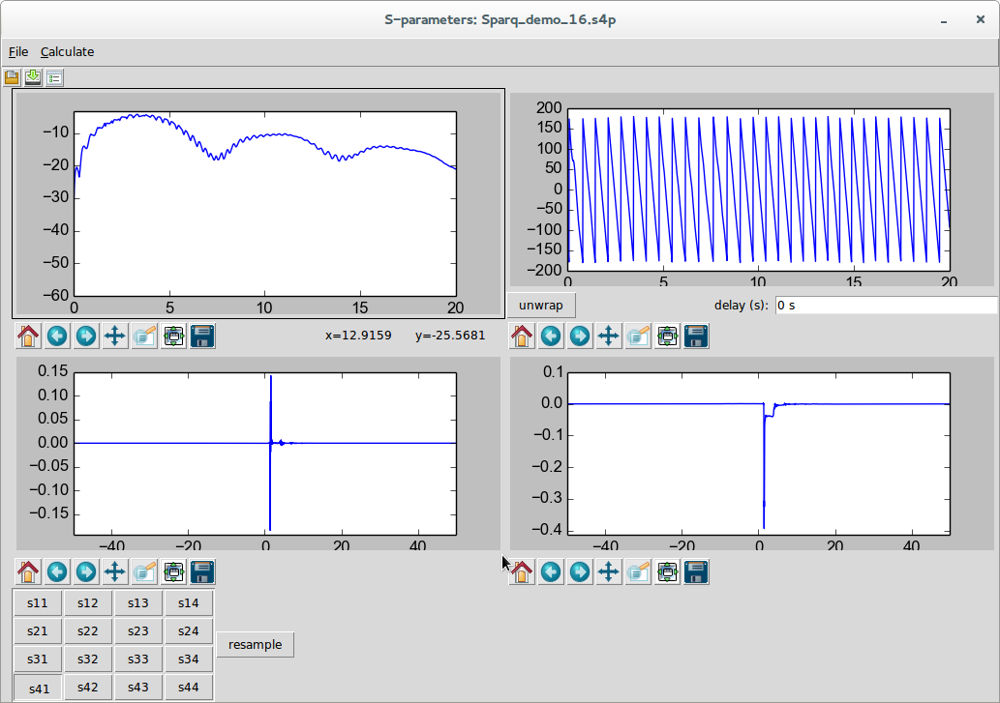

s31 is clearly the positive thru response for the single-ended ports 1 and 3 and s41 is clearly the ac-coupled response of the other input port to output port 3. There is no indication necessarily of which ports are inputs our outputs (i.e. on the left or right of the device) and no indication which of the input or output ports should be designated plus or minus, but it is safe to choose ports 1 and 2 as the left plus and minus ports and ports 3 and 4 as the right plus and minus ports (note that we should look at s42 and s41 to confirm this).

We will need two mixed-mode converters. We have one already, so we drag it over and connect the plus and minus ports to ports 3 and 4 of our four-port transmission line as shown:

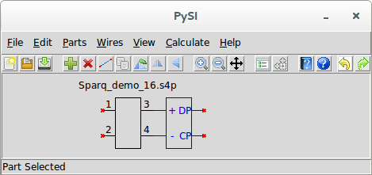

It’s easy to get another mixed-mode converter on the other side. Just invoke [Duplicate Part](15-Main-Schematic-Dialog.md#Control-Help:Duplicate-Part) with the mixed-mode converter selected and when the cursor changes to a finger, just click on the left of the file device to place a copy of the part. Since it is the wrong orientation, invoke [Flip Horizontally](15-Main-Schematic-Dialog.md#Control-Help:Flip-Horizontally) to flip it around and drag it into position as shown:

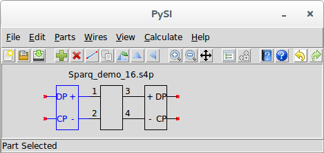

Now we invoke [Add Port](15-Main-Schematic-Dialog.md#Control-Help:Add-Port) to add a [Port](23-Built-in-Devices-Parts.md#device:Port) to the circuit. When we do this, we see the part properties dialog for the port:

Note that the port number 1 has already been filled in. Press OK and click and drag the port into place:

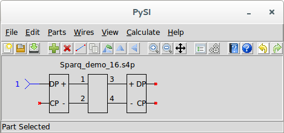

It is customary for mixed-mode s-parameters to have ports 1, 2, 3, and 4 to be D1, D2, C1, C2 where the D and C refer to the differential- and common-mode and the 1 and 2 refer to the left and right side of the transmission line. So we invoke [Duplicate Part](15-Main-Schematic-Dialog.md#Control-Help:Duplicate-Part) and click the mouse and drag the new port to the right side of the device. Use [Flip Horizontally](15-Main-Schematic-Dialog.md#Control-Help:Flip-Horizontally) to flip the port around and place it as shown:

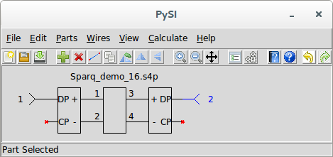

The rest of the ports are added in a similar manner:

The next step is to set the [Calculation Properties](15-Main-Schematic-Dialog.md#Control-Help:Calculation-Properties). By default they look like this:

When we looked at the s-parameters, we can see that the end frequency is 20 GHz and the impulse response length is 100 ns. It looks like the 100 ns impulse response length might be excessive, so we use 50 ns. We double click in the impulse response length entry box and type 50n and press enter. Now we see:

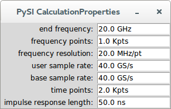

Note that, in general, we really don’t want to think of the number of frequency points in an s-parameter file. Instead, we choose to think in terms of impulse response length. In this example, this happens to mean one thousand frequency points.

Before calculating the s-parameters, it’s also good to look at the [Netlist](24-Netlist.md#sec:Netlist). Invoking [Export Netlist](15-Main-Schematic-Dialog.md#Control-Help:Export-Netlist), we see:

If you’ve read the book that accompanies the ***SignalIntegrity*** software, this netlist should be familiar to you. If you press OK, you can save this netlist to a file, if you wanted to.

To calculate the s-parameters, invoke [Calculate](15-Main-Schematic-Dialog.md#Control-Help:Calculate-Button) or [Calculate S-parameters](15-Main-Schematic-Dialog.md#Control-Help:Calculate-S-parameters). There should not be any errors (if there are, see [Errors and Exceptions](27-Errors-and-Exceptions.md#sec:Errors-and-Exceptions)) and you should see the [S-parameter Viewer](13-S-parameter-Viewer.md#sec:S-parameter-Viewer):

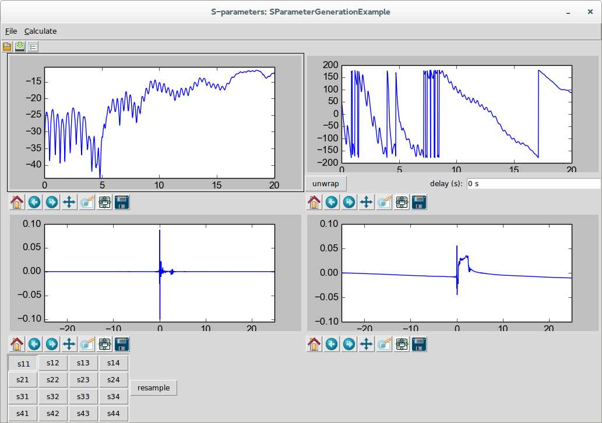

You can select the s-parameters you want to view from the buttons at the lower-left and save the results to a file if you want:

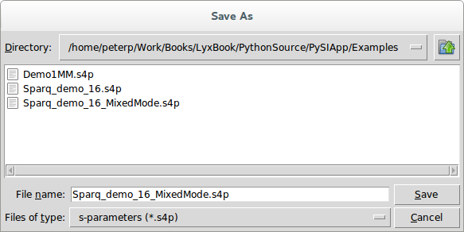

