# Simulation {#sec:Simulation}

Simulation is about applying voltage or current stimulus waveforms to a circuit and measuring the resulting waveforms at various nodes in the circuit.

This section provides step-by-step instructions for simulation. You can read through this, or go immediately to the [Simulation Example](08-Simulation.md#sub:Simulation-Example).

The circuit is drawing as a variety of devices and interconnected with wires. See [Drawing a Schematic for Simulation](08-Simulation.md#sub:Drawing-a-Schematic-for-Simulation).

The stimulus to the circuit is applied through special parts. These special parts are categorized as *[Sources and Generators](08-Simulation.md#sub:Sources-and-Generators)*. A source supplies an input [Waveform](28-Waveform.md#sec:Waveform) specified from a file. A generator supplies some specified input [Waveform](28-Waveform.md#sec:Waveform). Sources and generators can be voltages or currents and can supply input [Waveform](28-Waveform.md#sec:Waveform) from files, pulses, steps, and sine waves.

The probing points in the circuit for providing the output waveforms are specified through the use of *[Output Probes for Simulation](08-Simulation.md#sub:Output-Probes-for-Simulation)*. An [Voltage Output Probe](23-Built-in-Devices-Parts.md#device:Output-Probe) supplies the location of the node for which the output waveform is desired, the name of the waveform in the simulation, and any gain, offset, or delay to be applied. In that sense it operates like a real probe.

If you like, you can also place an [Eye Probe](23-Built-in-Devices-Parts.md#device:Eye-Probe) and generate an [Eye Diagram Dialog](16-Eye-Diagram-Dialog.md#sec:Eye-Diagram-Dialog) from your simulation.

Once you are ready for simulation, you should configure the [Calculation Properties](15-Main-Schematic-Dialog.md#Control-Help:Calculation-Properties). See [Setting Calculation Properties for Simulation](08-Simulation.md#sub:Setting-Calculation-Properties-for-Simulation).

Once a circuit is drawn containing at least one source or generator, and at least one [Voltage Output Probe](23-Built-in-Devices-Parts.md#device:Output-Probe), presumably with a circuit that has been properly configured, you can simulate the circuit. Simulation involves the calculation of transfer parameters which are applied to the input waveforms to generate the output waveforms and the waveforms are displayed in the [Simulator Dialog](14-Simulator-Dialog.md#sec:Simulator-Dialog). See [Simulating](08-Simulation.md#sub:Simulating).

## Drawing a Schematic for Simulation {#sub:Drawing-a-Schematic-for-Simulation}

When ***SignalIntegrityApp*** opens, you have a blank canvas and are ready to draw a schematic for simulation

Drawing the schematic is accomplished through the addition of parts, wires, and output probes. Some of the parts are special and must be generators or sources for simulation to be possible.

To add parts to the schematic, see [Add Part](15-Main-Schematic-Dialog.md#Control-Help:Add-Part). To add wires to the schematic, see [Add Wire](15-Main-Schematic-Dialog.md#Control-Help:Add-Wire).

To add sources or generators to the schematic, see [Sources and Generators](08-Simulation.md#sub:Sources-and-Generators). To add output probes, see [Output Probes for Simulation](08-Simulation.md#sub:Output-Probes-for-Simulation).

## Sources and Generators {#sub:Sources-and-Generators}

Sources and generators supply stimulus to the circuit in the form of an input [Waveform](28-Waveform.md#sec:Waveform).

They are added to the schematic by invoking [Add Part](15-Main-Schematic-Dialog.md#Control-Help:Add-Part) and selecting parts from the Sources and Generators categories in the Part Picker Dialog:

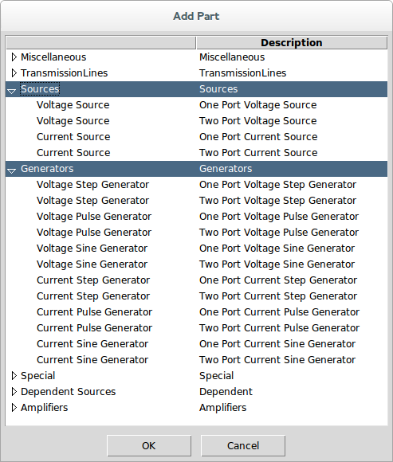

Here is a list of parts and links to the parts that qualify as sources and generators:

Sources:

- [Voltage Source](23-Built-in-Devices-Parts.md#device:Voltage-Source)

- [Current Source](23-Built-in-Devices-Parts.md#device:Current-Source)

Generators:

- [Voltage Step Generator](23-Built-in-Devices-Parts.md#device:Voltage-Step-Generator)

- [Voltage Pulse Generator](23-Built-in-Devices-Parts.md#device:Voltage-Pulse-Generator)

- [Voltage Sine Generator](23-Built-in-Devices-Parts.md#device:Voltage-Sine-Generator)

- [Current Step Generator](23-Built-in-Devices-Parts.md#device:Current-Step-Generator)

- [Current Pulse Generator](23-Built-in-Devices-Parts.md#device:Current-Pulse-Generator)

- [Current Sine Generator](23-Built-in-Devices-Parts.md#device:Current-Sine-Generator)

## Output Probes for Simulation {#sub:Output-Probes-for-Simulation}

The [Voltage Output Probe](23-Built-in-Devices-Parts.md#device:Output-Probe) defines the location, name and characteristics of an output [Waveform](28-Waveform.md#sec:Waveform) from the simulation.

They are added to the schematic by invoking either [Add Output Probe](15-Main-Schematic-Dialog.md#Control-Help:Add-Output-Probe) or by invoking [Add Part](15-Main-Schematic-Dialog.md#Control-Help:Add-Part) and selecting the [Voltage Output Probe](23-Built-in-Devices-Parts.md#device:Output-Probe) from the Ports and Probes category:

Note that the [Voltage Output Probe](23-Built-in-Devices-Parts.md#device:Output-Probe) has configurable gain, offset, and delay that can be applied to the output waveform calculated. This is usually used to line the waveform up for better comparison with another waveform or to separate the waveforms vertically on the display.

Note that [Eye Probe](23-Built-in-Devices-Parts.md#device:Eye-Probe) can be used also, which would bring up the [Eye Diagram Dialog](16-Eye-Diagram-Dialog.md#sec:Eye-Diagram-Dialog) after the simulation completes.

## Setting Calculation Properties for Simulation {#sub:Setting-Calculation-Properties-for-Simulation}

To set the calculation properties for simulation, see [Calculation Properties](15-Main-Schematic-Dialog.md#Control-Help:Calculation-Properties).

The calculation properties determine how the transfer parameters are calculated. Transfer parameters are frequency responses that define transfer characteristics from an input waveform to an output waveform. Input waveforms come from sources and output waveforms are provided at output probe locations in the circuit. An output waveform is a linear combination of input waveforms applied to filters that are the time-domain equivalent of the frequency responses.

The frequency responses are calculated to the end frequency withe the frequency spacing specified, and the filters are calculated by taking the inverse-FFT of these frequency responses. As such, they end up having a sample rate that is twice the end frequency and an impulse response length that is the inverse of the frequency resolution and a number of points that are twice the number of frequency points.

The base sample rate should be set to the sample rate that you want the simulation to run at, which is twice the end frequency.

The impulse responses generated for the filters are always centered on time zero, meaning half of the impulse response is before time zero and half is after.

Assuming that all of the s-parameters have been sampled sufficiently, meaning to the right end frequency and most importantly, with the proper spacing to provide an impulse response that does not have time-aliasing effects, then it is possible to specify an appropriate impulse response length in the calculation properties. But with the tool in its current state, there is no way to guarantee this - you must set it to a value that makes sense. But the key is that it must be long enough. If it is too short, the simulator produces incorrect waveforms. If it is too long, it just needs to do extra work.

The advice here is to set the impulse response length to a number that is twice the length of a finite impulse response (FIR) filter in time as how long you think the impulse response of the longest filter should be. Then, after the simulation completes, you should [View Transfer Parameters](14-Simulator-Dialog.md#Control-Help:View-Transfer-Parameters) from the [Simulator Dialog](14-Simulator-Dialog.md#sec:Simulator-Dialog) to make sure that this occurred.

## Simulating {#sub:Simulating}

After creating the schematic for simulation and setting the [Calculation Properties](15-Main-Schematic-Dialog.md#Control-Help:Calculation-Properties), the simulation is run using either the [Simulate](15-Main-Schematic-Dialog.md#Control-Help:Simulate) command or the [Calculate](15-Main-Schematic-Dialog.md#Control-Help:Calculate-Button) toolbar button.

Note that calculation will not be possible at all (i.e. the menu elements are disabled) if the schematic does not meet the criteria for simulation. This criteria for the schematic regarding elements are that the schematic must:

- have at least one source or generator element (see [Sources and Generators](08-Simulation.md#sub:Sources-and-Generators)).

- have at least one output [Port](23-Built-in-Devices-Parts.md#device:Port) (see [Output Probes for Simulation](08-Simulation.md#sub:Output-Probes-for-Simulation)).

- not have any other elements that don’t make sense for simulation including:

  - ports

  - measure probes

  - stims

  - unknown devices

  - system devices

In simulation, the first step is to convert the schematic shown into a [Netlist](24-Netlist.md#sec:Netlist). This netlist puts the graphical schematic into a text based description. Note that this netlist can be created, examined and saved separately if you want. See [Export Netlist](15-Main-Schematic-Dialog.md#Control-Help:Export-Netlist) on ways of viewing and exporting the net lists.

The net list is passed to a **SimulatorNumericParser** class as described in the software documentation after which the transfer parameters are extracted.

During parsing of the net list, all devices listed are instantiated with the end frequency and number of frequency points specified in the [Calculation Properties](15-Main-Schematic-Dialog.md#Control-Help:Calculation-Properties) (see [Setting Calculation Properties for Simulation](08-Simulation.md#sub:Setting-Calculation-Properties-for-Simulation)). If a [File](23-Built-in-Devices-Parts.md#device:File) device is encountered, the s-parameters read from the file are resampled onto the end frequency and number of frequency points specified.

Then, for each frequency point, the transfer parameters are generated.

After the transfer parameters are generated, the input waveforms are produced or read from files and applied to the filters corresponding to the transfer parameters to generate output waveforms.

Sometimes, things go wrong and an error is generated. See [Errors and Exceptions](27-Errors-and-Exceptions.md#sec:Errors-and-Exceptions) for an explanation of any errors generated during calculation.

If everything goes correctly, the [Simulator Dialog](14-Simulator-Dialog.md#sec:Simulator-Dialog) will open with the ability to view the output waveforms calculated and save them to a file.

If the schematic contains one or more enabled statistical noise sources (see [Voltage Statistical Noise Source](23-Built-in-Devices-Parts.md#device:Voltage-StatisticaL-Noise-Source) and [Current Statistical Noise Source](23-Built-in-Devices-Parts.md#device:Current-StatisticaL-Noise-Source)), the [Statistical Noise Dialog](31-Statistical-Noise-Dialog.md#sec:Statistical-Noise-Dialog) also opens, showing the output noise spectral densities and measurements.

## Simulation Example {#sub:Simulation-Example}

In this example, we will step through the simulation of an RLC network. this example will highlight a few things about simulation that you need to be aware of.

The circuit we will simulate will be a series 100 nH [Inductor](23-Built-in-Devices-Parts.md#device:Inductor), 1 pF [Capacitor](23-Built-in-Devices-Parts.md#device:Capacitor), and 50 ohm [Resistor](23-Built-in-Devices-Parts.md#device:Resistor). We will simulate with a step voltage applied to the input to the circuit through a [Voltage Step Generator](23-Built-in-Devices-Parts.md#device:Voltage-Step-Generator) and probe initially the voltage at the 50 ohm termination [Resistor](23-Built-in-Devices-Parts.md#device:Resistor).

When we open ***SignalIntegrityApp***, we have a blank canvas:

We invoke [Add Part](15-Main-Schematic-Dialog.md#Control-Help:Add-Part):

Select the Generators category, and select the One Port [Voltage Step Generator](23-Built-in-Devices-Parts.md#device:Voltage-Step-Generator):

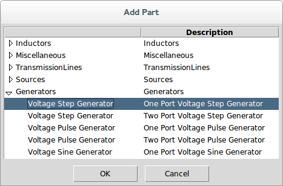

For now, we accept the default properties which state that the step generator will generate a [Waveform](28-Waveform.md#sec:Waveform) that starts at -100 ns, runs for 200 ns (i.e. ends at 100 ns) which is 0 V until 0 s after which it jumps to 1 V for the duration.

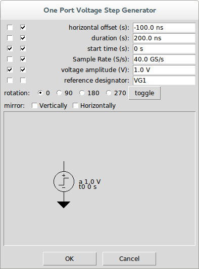

Press OK and left-click to place the part in the schematic and drag the part to where you want it:

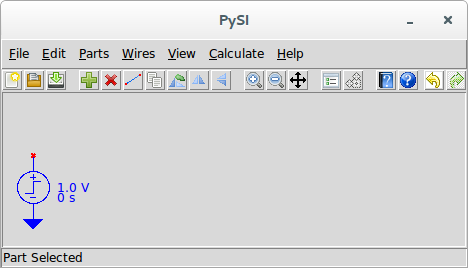

Now we use [Add Part](15-Main-Schematic-Dialog.md#Control-Help:Add-Part) to add an [Inductor](23-Built-in-Devices-Parts.md#device:Inductor):

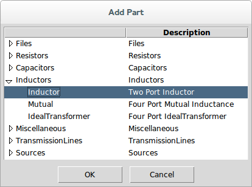

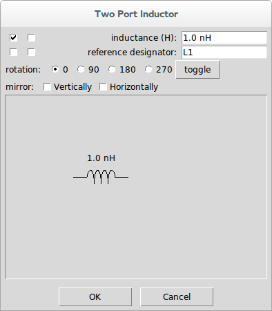

Double click in the inductance part property entry box and type 100n and hit enter:

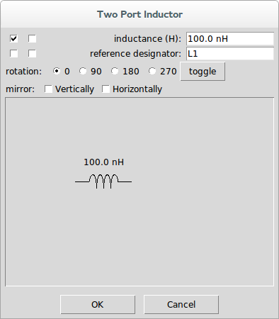

Press OK, click in the schematic and hold the left mouse button down to drag the part to the desired location to the right of the voltage generator:

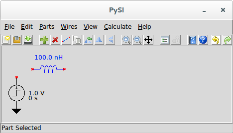

Repeat for a two-port, 1 pF [Capacitor](23-Built-in-Devices-Parts.md#device:Capacitor) and a one-port 50 ohm [Resistor](23-Built-in-Devices-Parts.md#device:Resistor).

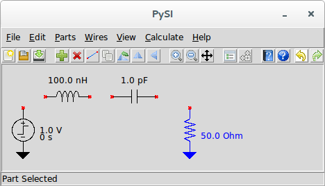

Now connect all of the devices using [Add Wire](15-Main-Schematic-Dialog.md#Control-Help:Add-Wire) commands. We start wire drawing by invoking [Add Wire](15-Main-Schematic-Dialog.md#Control-Help:Add-Wire) and we observe that the cursor turns into a pen, and we see Drawing Wires in the status bar. We left click on the top of the voltage generator and see a dot form at the generator connection point. We move the mouse up a bit and we see a rubber band wire form between the top of the generator and the cursor and we left click again. A line now extends upward from the voltage generator to a dot. We move the cursor to the right to the left side of the inductor and left click again. We right click to end the wire and move to the mouse to the right side of the inductor. There is no rubber band line because we completed the drawing of the last wire, but left clicking on the right port of the inductor places another dot and begins the next wire. We move the mouse to the left side of the capacitor, observing the rubber band line, and left click. Right clicking ends that wire and we move on to the connection of the right side of the capacitor to the top of the one-port resistor to ground. When we complete this wire, we right click twice to end drawing wires. Notice that the cursor returns to an arrow and the status bar message shows nothing.

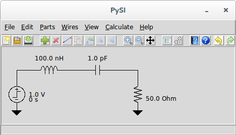

If you want, experiment with changing the wires by left clicking on a wire vertex and dragging:

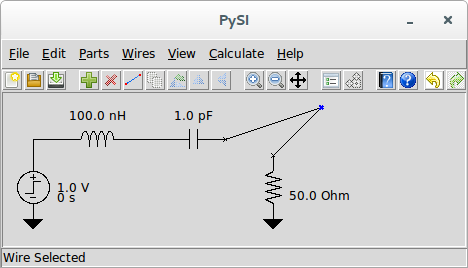

or by clicking in the middle of a wire and dragging:

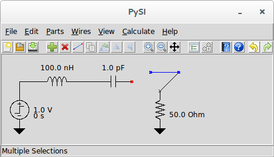

Now, use [Add Output Probe](15-Main-Schematic-Dialog.md#Control-Help:Add-Output-Probe) to add some probing points to the circuit. When we invoke [Add Output Probe](15-Main-Schematic-Dialog.md#Control-Help:Add-Output-Probe), we see the part properties dialog for the [Voltage Output Probe](23-Built-in-Devices-Parts.md#device:Output-Probe):

Click the leftmost checkbox for the reference designator (so it shows in the schematic), and double click in the reference designator entry box and type Vin followed by the enter key:

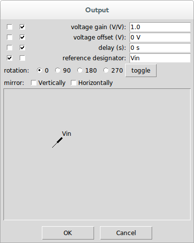

Press OK and place the probe on the wire connecting the voltage source to the inductor:

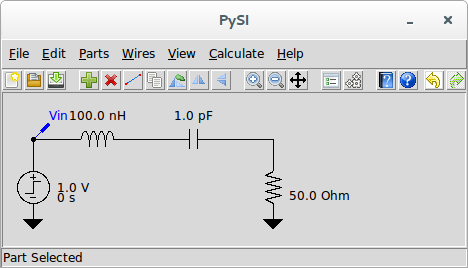

If you want to make it look better, use [Flip Horizontally](15-Main-Schematic-Dialog.md#Control-Help:Flip-Horizontally) to change the orientation.

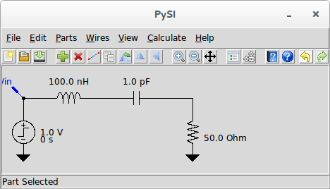

Use [Pan](15-Main-Schematic-Dialog.md#Control-Help:Pan) to pan the drawing a bit to the right.

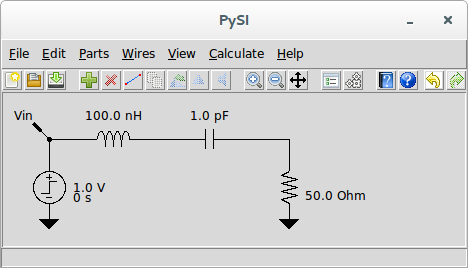

Select the [Voltage Output Probe](23-Built-in-Devices-Parts.md#device:Output-Probe) and use [Duplicate Part](15-Main-Schematic-Dialog.md#Control-Help:Duplicate-Part) to place another probe at the resistor. Use [Flip Horizontally](15-Main-Schematic-Dialog.md#Control-Help:Flip-Horizontally) to change the orientation, and [Edit Properties](15-Main-Schematic-Dialog.md#Control-Help:Edit-Properties) to change the reference designator to Vout.

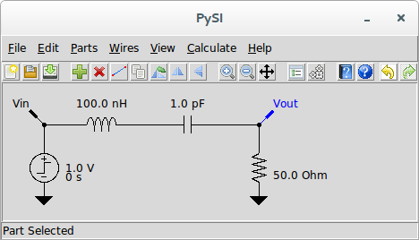

Notice now that [Calculate](15-Main-Schematic-Dialog.md#Control-Help:Calculate-Button) and [Simulate](15-Main-Schematic-Dialog.md#Control-Help:Simulate) are now enabled.

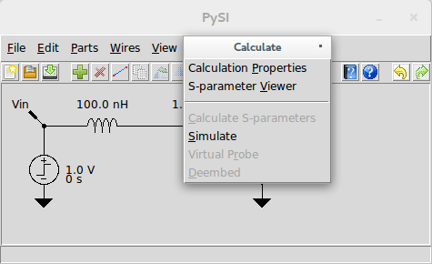

Go ahead and invoke [Simulate](15-Main-Schematic-Dialog.md#Control-Help:Simulate) and let’s see what happens. After a few seconds of calculation, we see the [Simulator Dialog](14-Simulator-Dialog.md#sec:Simulator-Dialog).

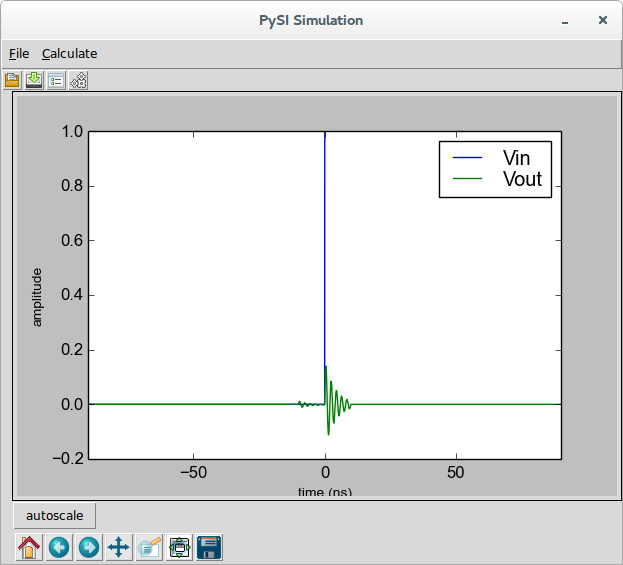

Let’s zoom in on the green Vout waveform to see what happened:

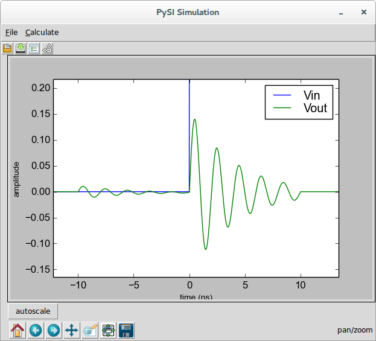

This is, of course nonsense, so let’s understand what happened here and how the simulator works. Understand this, we need on more set of information - the [Calculation Properties](15-Main-Schematic-Dialog.md#Control-Help:Calculation-Properties), where we see:

The simulator operates by generating transfer parameters that convert waveforms generated from sources, in this case the step generator, into the output waveforms. In this case, since we have only one source, these are essentially two filters that are applied to the source waveform, one filter converting the source to Vin, the other converting the source to Vout.

These filters are specified with a frequency response of 400 points with 50 MHz spacing out to 20 GHz. If s-parameter files had appeared in the schematic, all s-parameters would be resampled to this specification during calculation of the transfer parameters.

The net effect of the transfer parameters calculation is two finite-impulse response (FIR) filters whose impulse response length is 20 ns. In the accompanying book that describes the theory, we explain all about this, but suffice it to say that the filter impulse response is 20 ns long with time 0 appearing in the middle (i.e. has 10 ns of filter duration prior to time zero and 10 ns after time zero).

Since FFT methods are utilized, and since the FFT assumes that the frequency response represents the *impulse train response* (as opposed to a single impulse response), we have an opportunity for time-aliasing effects, which we’ve certainly created. To see this, invoke [View Transfer Parameters](14-Simulator-Dialog.md#Control-Help:View-Transfer-Parameters) from the [Simulator Dialog](14-Simulator-Dialog.md#sec:Simulator-Dialog) and we see:

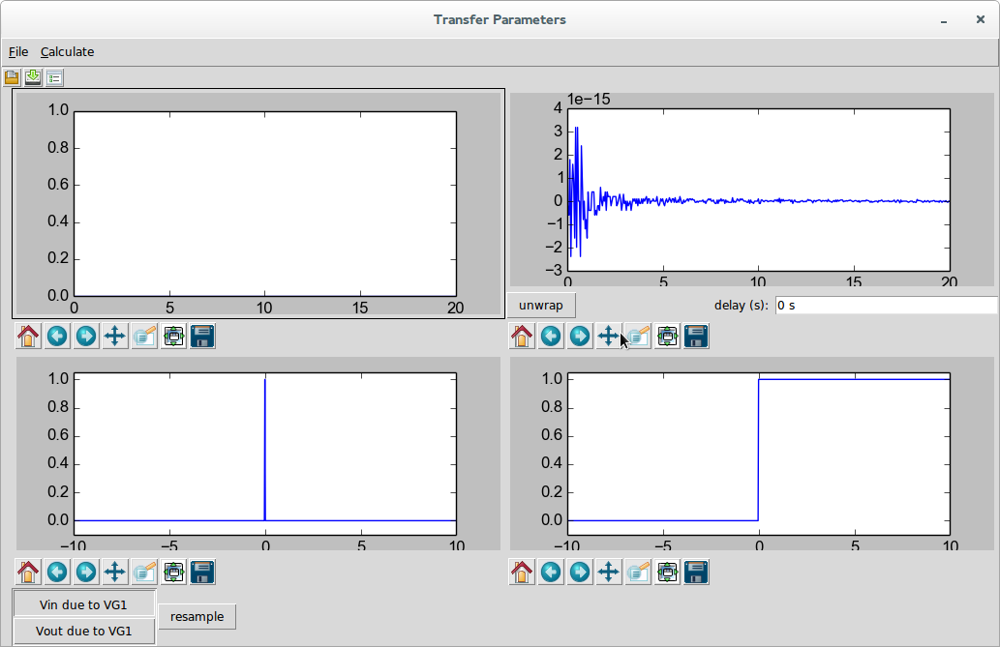

This is the trivial filter that converts the source waveform VG1 into Vin. this filter is, of course, a single impulse as these two are the same.

Selecting Vout due to VG1 shows something more interesting:

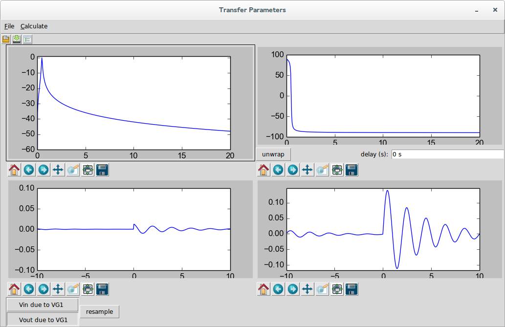

Here we see that the filter is highly resonant, which is not surprising. We see this in the magnitude response in the upper left, to some degree from the 180 degree phase transition in the phase response in the upper right, in the impulse response in the lower left which is clearly not settled at the end, and we see the problem the most clearly from the step response in the lower right.

Because of the FFT methods utilized, we see that the unsettled response to the right continues from the left (at negative time) and is clearly giving us the wrong answer.

In the future, we might provide better or automated ways of dealing with this, but this is a common problem, especially when s-parameters are used, and is worth seeing and dealing with manually.

Clearly, 20 ns worth of impulse response is insufficient. Let’s use something like 100 ns. So we edit the [Calculation Properties](15-Main-Schematic-Dialog.md#Control-Help:Calculation-Properties), change the impulse response length to 100 ns, close the dialog returning to the [Simulator Dialog](14-Simulator-Dialog.md#sec:Simulator-Dialog), and recalculate. After adjusting the zoom a bit, we have:

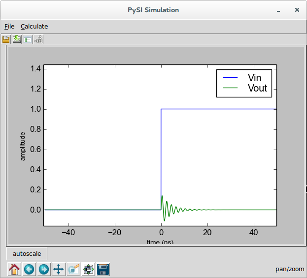

This is clearly a much better result. You can examine the transfer parameters to see that the 100 ns impulse response did the trick.

Examining the calculation properties we see the implications of the 100 ns impulse response:

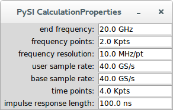

It means that two thousand frequency points were required at 10 MHz spacing. If this system were provided through s-parameter measurements, this would be the frequency resolution required to get a good time-domain simulation - regardless of what kind of simulator were employed.

As a final note, note that in the original, incorrect simulation, the waveform result was almost 200 ns long (it was 180 ns to be precise) and that the final result is 100 ns long. This is because the impulse response length is removed half from the front and half from the back of the waveform. This is explained in the accompanying book. This means that the input waveform must be sized properly to give you the result you want. If in my simulation, my desire was to see the step response starting at -10 ns until 30 ns, and understanding that the filter takes 50 ns from the front and back, we’d want an input waveform that starts at -60 ns and ends at 80 ns, for a 140 ns duration.

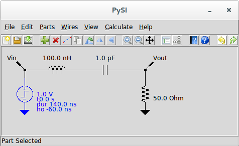

