# Deembedding {#sec:Deembedding}

Deembedding is related to [S-Parameter Generation](07-S-Parameter-Generation.md#sec:S-parameter-Generation). While [S-Parameter Generation](07-S-Parameter-Generation.md#sec:S-parameter-Generation) solves for a system resulting from a circuit containing interconnected, known devices, deembedding solves for unknowns given the resulting system and a circuit containing interconnected, known and unknown devices.

The deembedding problem is stated as: Given a circuit containing interconnected devices, some of whose s-parameters are known and some unknown, and given the s-parameters of the entire system, solve for the s-parameters of the unknown devices.

The steps required for deembedding are:

- [Drawing a Schematic for Deembedding](09-Deembedding.md#sub:Drawing-a-Schematic-for-Deembedding) containing interconnected devices and wires with [Unknowns](09-Deembedding.md#sub:Unknowns).

- [Attaching Ports to a Schematic for Deembedding](09-Deembedding.md#sub:Attaching-Ports-to-a-Schematic-for-Deembedding).

- [Defining the System](09-Deembedding.md#sub:Defining-the-System).

- [Setting Calculation Properties for Deembedding](09-Deembedding.md#sub:Setting-Calculation-Properties-for-Deembedding).

- Running the [Deembedding Calculation](09-Deembedding.md#sub:Deembedding-Calculation).

If you like, you can read the [Deembedding Example](09-Deembedding.md#sub:Deembedding-Example) where hopefully everything will be clear.

## Drawing a Schematic for Deembedding {#sub:Drawing-a-Schematic-for-Deembedding}

When ***SignalIntegrityApp*** opens, you have a blank canvas and are ready to draw a schematic.

Drawing the schematic for deembedding is accomplished through the addition of parts, ports and wires. At least one part will need to be an [Unknown](23-Built-in-Devices-Parts.md#device:Unknown) and there will need to be exactly one [System](23-Built-in-Devices-Parts.md#device:System) part.

To add parts to the schematic, see [Add Part](15-Main-Schematic-Dialog.md#Control-Help:Add-Part). To add wires to the schematic, see [Add Wire](15-Main-Schematic-Dialog.md#Control-Help:Add-Wire). See the next section about [Attaching Ports to a Schematic for S-parameter Calculation](07-S-Parameter-Generation.md#sub:Attaching-Ports-to-a-Schematic). See [Unknowns](09-Deembedding.md#sub:Unknowns) regarding unknowns. See [Defining the System](09-Deembedding.md#sub:Defining-the-System) with regard to the system.

## Attaching Ports to a Schematic for Deembedding {#sub:Attaching-Ports-to-a-Schematic-for-Deembedding}

In deembedding applications, ports equate the s-parameters of the circuit to the system (see [Defining the System](09-Deembedding.md#sub:Defining-the-System)).

As you must be aware, s-parameters are a vector of matrix elements, where each matrix element is for a particular frequency (these frequencies are defined by the calculation properties defined in the next section: [Setting Calculation Properties](07-S-Parameter-Generation.md#sub:Setting-Calculation-Properties)) and each matrix defines the complex port-port relationship at that frequency.

Thus, for a set of two-port s-parameters, $S_{21}$ refers to the port-port relationship as the output (reflected) wave from port 2 due to an incident wave on port 1 over all the frequencies. These port numbers are defined by the port element added in the schematic and match the system ports.

To add ports to a schematic, see [Add Port](15-Main-Schematic-Dialog.md#Control-Help:Add-Port).

## Unknowns {#sub:Unknowns}

Unknowns are placed in the schematic using [Add Unknown](15-Main-Schematic-Dialog.md#Control-Help:Add-Unknown) or by using [Add Part](15-Main-Schematic-Dialog.md#Control-Help:Add-Part) and selecting [Unknown](23-Built-in-Devices-Parts.md#device:Unknown) devices from the Unknowns category.

Once selected, the reference designator is used as the name for the unknown.

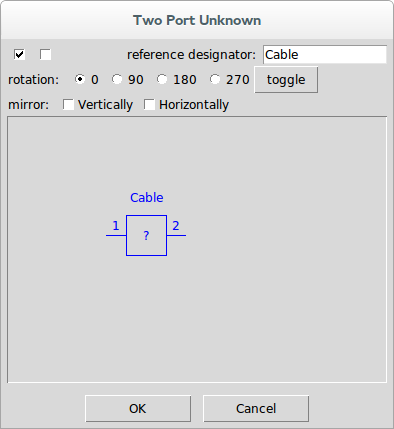

When the deembedding result is calculated, the s-parameters generated will have a default name of the project file concatenated with the reference designator for the unknown(s) in the system.

## Defining the System {#sub:Defining-the-System}

The system is defined by placing a special part in the schematic using [Add System](15-Main-Schematic-Dialog.md#Control-Help:Add-System) or by using [Add Part](15-Main-Schematic-Dialog.md#Control-Help:Add-Part) and selecting [System](23-Built-in-Devices-Parts.md#device:System) devices from the Systems category.

Once selected, a file is selected containing the s-parameters of the system.

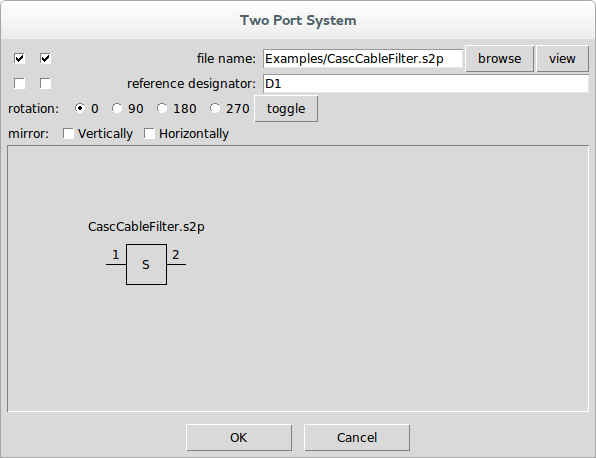

Note that when a system is placed, there are no red x’s on the unconnected ports. This is because system ports are never connected.

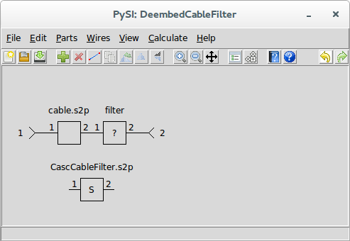

Note that there must be one system device in a schematic and the port numbering of the system must match the port number of the ports in the schematic. Essentially what you are telling the application is that the s-parameters of the remaining schematic represented by interconnected parts and ports matches the s-parameters of the system device.

## Setting Calculation Properties for Deembedding {#sub:Setting-Calculation-Properties-for-Deembedding}

To set the calculation properties for deembedding, see [Calculation Properties](15-Main-Schematic-Dialog.md#Control-Help:Calculation-Properties).

The calculation properties determine how the deembedded s-parameters are calculated, specifically the frequency points that are calculated. The calculation properties are the same set for all of the ***SignalIntegrityApp*** applications. With regard to deembedding, the elements of particular interest are the end frequency, which is the last frequency in the s-parameter calculation, and the frequency points, which are the number of frequency points that will be present in the final s-parameters calculated.

## Deembedding Calculation {#sub:Deembedding-Calculation}

After creating the schematic for s-parameter generation and setting the calculation properties, the s-parameters of the unknowns are calculated using either the [Deembed](15-Main-Schematic-Dialog.md#Control-Help:Deembed) command or the [Calculate](15-Main-Schematic-Dialog.md#Control-Help:Calculate-Button) toolbar button.

Note that deembedding will not be possible at all (i.e. the menu elements are disabled) if the schematic does not meet the criteria for deembedding. This criteria for the schematic regarding elements are that the schematic must:

- have at least one port element (see [Add Port](15-Main-Schematic-Dialog.md#Control-Help:Add-Port)).

- have at least one [Unknown](23-Built-in-Devices-Parts.md#device:Unknown) device.

- have one [System](23-Built-in-Devices-Parts.md#device:System) device.

- not have any other elements that don’t make sense for deembedding including:

  - output probes

  - measure probes

  - stims

In the deembedding calculation, the first step is to convert the schematic shown into a net list. This netlist puts the graphical schematic into a text based description. Note that this netlist can be created, examined and saved separately if you want. See [Netlist](24-Netlist.md#sec:Netlist) for more information on the net list and see [Export Netlist](15-Main-Schematic-Dialog.md#Control-Help:Export-Netlist) on ways of viewing and exporting the net lists.

The net list is passed to a **DeembedderNumericParser** class as described in the software documentation after which the s-parameters of the unknowns are extracted.

During parsing of the net list, all devices listed are instantiated with the end frequency and number of frequency points specified. If a file device is encountered, the s-parameters read from the file are resampled onto the end frequency and number of frequency points specified.

Then, for each frequency point, the s-parameters of the unknowns are calculated.

Sometimes, things go wrong and an error is generated. See [Errors and Exceptions](27-Errors-and-Exceptions.md#sec:Errors-and-Exceptions) for an explanation of any errors generated during calculation.

If everything goes correctly, a dialog will open for each of the unknowns with the ability to view the s-parameters calculated and save them to a file. See the section on the [S-parameter Viewer](13-S-parameter-Viewer.md#sec:S-parameter-Viewer) for more information on the viewing of the results.

## Deembedding Example {#sub:Deembedding-Example}

In this example, we will deembed a cable from the measurement of a cable cascaded with a filter. To generate this example, we created the cascaded cable and filter using [S-Parameter Generation](07-S-Parameter-Generation.md#sec:S-parameter-Generation):

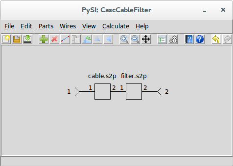

We saved the results of this calculation to the file CascCableFilter.s2p.

We start this example with a blank project:

Using [Add Part](15-Main-Schematic-Dialog.md#Control-Help:Add-Part), we select a two port file device:

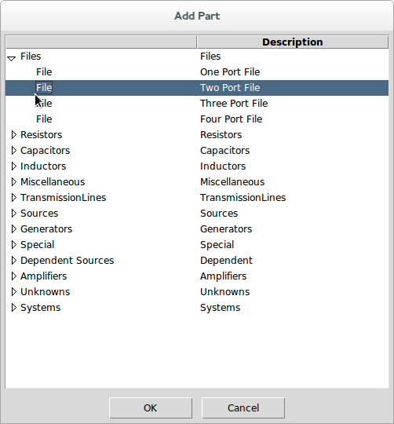

We browse to the file cable.s2p in the Examples directory:

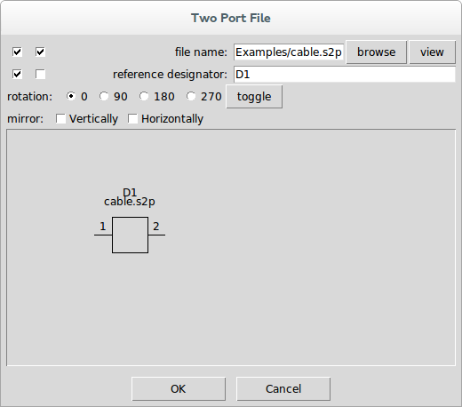

Pressing OK places the part in the schematic and we drag it to a good location:

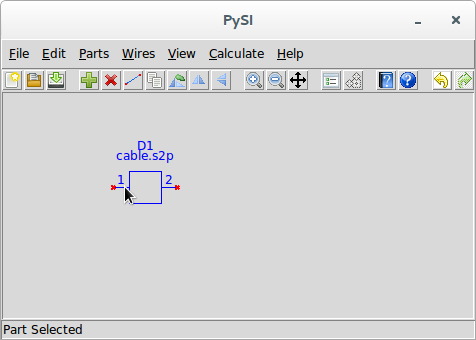

Next, we add the unknown filter device using [Add Unknown](15-Main-Schematic-Dialog.md#Control-Help:Add-Unknown).

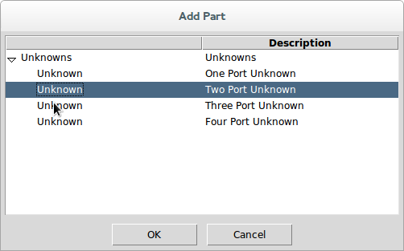

We enter Filter as the name of the unknown:

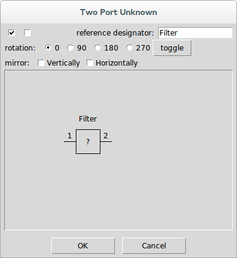

Pressing OK places the part in the schematic and we drag it and connect it to the cable:

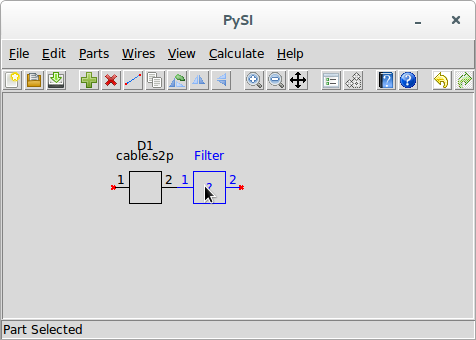

Next, we use [Add Port](15-Main-Schematic-Dialog.md#Control-Help:Add-Port) to add ports to the schematic. The properties dialog for the port shows port 1, so we use it as is. Pressing OK places the port in the schematic and we drag it so it is connected to the cable.

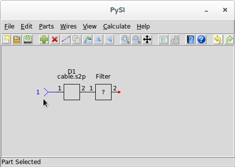

Using [Add Port](15-Main-Schematic-Dialog.md#Control-Help:Add-Port) again, we have the part properties showing port 2. In the part properties dialog, select the mirror horizontally checkbox:

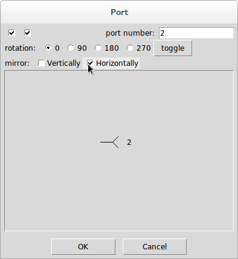

Press OK and drag the port so it is connected to the unknown filter:

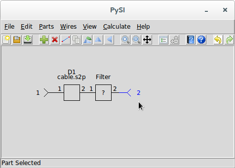

Almost done. We now add the system device by using [Add System](15-Main-Schematic-Dialog.md#Control-Help:Add-System) and selecting a two port system:

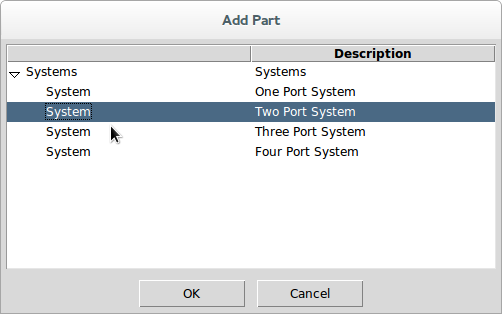

Browse to the CascCableFilter.s2p file:

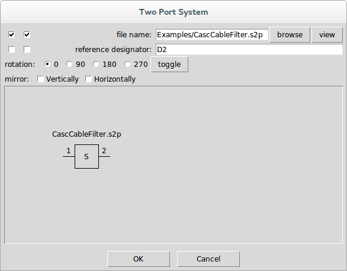

Press OK and place it anywhere in the schematic:

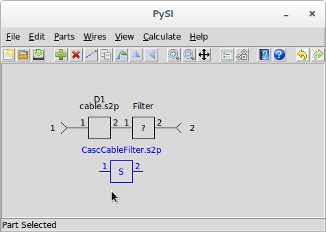

Assuming that the CascCableFilter.s2p file has the appropriate frequencies, we would want to retain them for the deembedding calculation, so we use [S-parameter Viewer](15-Main-Schematic-Dialog.md#Control-Help:S-parameter-Viewer) and select the CasCableFilter.s2p file for viewing:

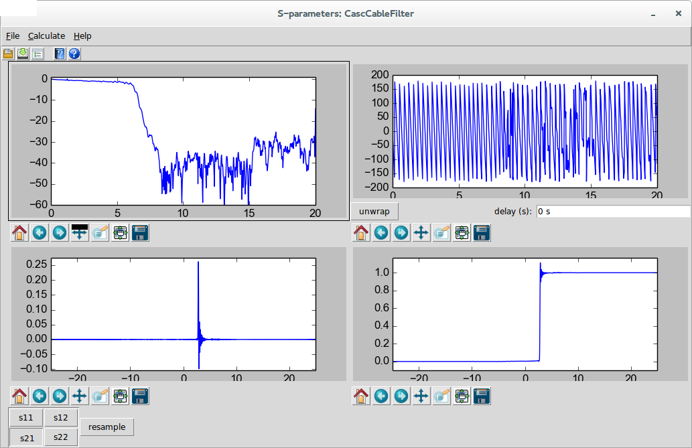

Here we can see that the end frequency is 20 GHz and the impulse response length is 50 ns.

We close this dialog and use [Calculation Properties](15-Main-Schematic-Dialog.md#Control-Help:Calculation-Properties) and set the end frequency and impulse response length appropriately:

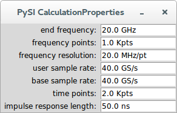

We not that this amounts to one thousand frequency points to 20 GHz.

Notice now that [Calculate](15-Main-Schematic-Dialog.md#Control-Help:Calculate-Button) and [Deembed](15-Main-Schematic-Dialog.md#Control-Help:Deembed) are now enabled.

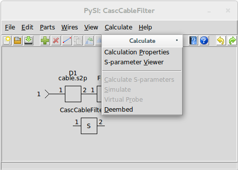

Use [Deembed](15-Main-Schematic-Dialog.md#Control-Help:Deembed) to start the calculation. Once the calculation is complete, the [S-parameter Viewer](13-S-parameter-Viewer.md#sec:S-parameter-Viewer) is opened with the result of the deembedding. Use [Save S-parameter File](13-S-parameter-Viewer.md#Control-Help:Save-S-parameter-File) to save the result to a file.

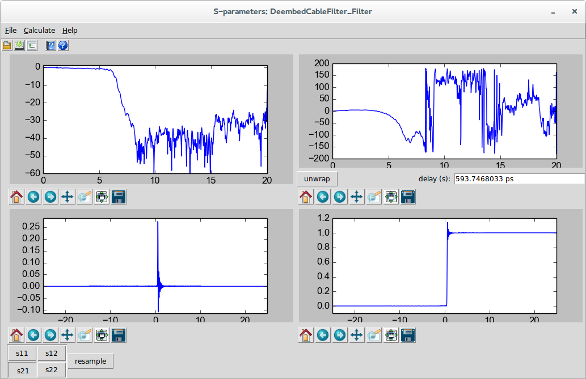

Note that I selected S21 for viewing in the above dialog, and pressed unwrap to remove the 593.7 ps of delay from the phase.

