# Virtual Probing {#sec:Virtual-Probing}

Virtual probing is about converting measurements made a various circuit locations to waveforms that would appear had the circuit been probed at other locations.

Virtual probing can be used for a number of purposes including:

- Time-domain deembedding - removing the effects of components, including probes from a measurement.

- Undoing the effects of probe loading from a measurement.

- Compliance testing or measuring well a system will perform under various conditions.

This section provides step-by-step instructions for virtual probing. You can read through this, or go immediately to the [Virtual Probing Example](10-Virtual-Probing.md#sub:Virtual-Probing-Example).

In order to virtually probe a circuit, you first need a schematic containing a number of devices and interconnected with wires. See [Drawing a Schematic for Virtual Probing](10-Virtual-Probing.md#sub:Drawing-a-Schematic-for-Virtual-Probing).

You will need to supply probing points in the circuit for providing measured waveforms ([Measure Probes](10-Virtual-Probing.md#sub:Measure-Probes)) and for specifying the output waveforms *([Output Probes for Virtual Probing](10-Virtual-Probing.md#sub:Output-Probes-for-Virtual-Probing)*).

A [Measure Probes](10-Virtual-Probing.md#sub:Measure-Probes) requires a [Waveform](28-Waveform.md#sec:Waveform) file that provides the waveform measured at that location. We talk about these in [Measure Probes](10-Virtual-Probing.md#sub:Measure-Probes).

An [Voltage Output Probe](23-Built-in-Devices-Parts.md#device:Output-Probe) supplies the location of the node for which the output waveform is desired, the name of the waveform in the simulation, and any gain, offset, or delay to be applied. In that sense it operates like a real probe (without loading effects). We talk about these in [Output Probes for Virtual Probing](10-Virtual-Probing.md#sub:Output-Probes-for-Virtual-Probing).

For virtual probing to work correctly, all sources of stimuli (i.e. waves entering the system, or sources of voltage and/or current) must be identified. In virtual probing, you don’t supply stimuli, only tell it how it enters the system. This identification of stimuli is achieved through the use of the [Stim](23-Built-in-Devices-Parts.md#device:Stim). This is discussed in [Stimuli](10-Virtual-Probing.md#sub:Stimuli).

Once you are ready for virtual probing, you should configure the Calculation properties. See [Setting Calculation Properties for Virtual Probing](10-Virtual-Probing.md#sub:Setting-Calculation-Properties-for-Virtual-Probing).

Once a circuit is drawn containing at least one [Stim](23-Built-in-Devices-Parts.md#device:Stim), at least one [Voltage Measure Probe](23-Built-in-Devices-Parts.md#device:Measure-Probe) and at least one [Voltage Output Probe](23-Built-in-Devices-Parts.md#device:Output-Probe), presumably with a circuit that has been properly configured, you can virtually probe the circuit. Virtual probing involves first the calculation of transfer parameters which are applied to the measured input waveforms to generate the output waveforms and the waveforms are displayed. See [Virtual Probing](10-Virtual-Probing.md#sub:Virtual-Probing).

## Drawing a Schematic for Virtual Probing {#sub:Drawing-a-Schematic-for-Virtual-Probing}

When ***SignalIntegrityApp*** opens, you have a blank canvas and are ready to draw a schematic for virtual probing.

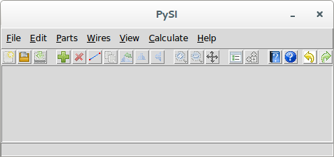

Drawing the schematic is accomplished through the addition of parts, wires, measure probes, output probes and stims.

To add parts to the schematic, see [Add Part](15-Main-Schematic-Dialog.md#Control-Help:Add-Part). To add wires to the schematic, see [Add Wire](15-Main-Schematic-Dialog.md#Control-Help:Add-Wire).

To add a [Voltage Measure Probe](23-Built-in-Devices-Parts.md#device:Measure-Probe) or an [Voltage Output Probe](23-Built-in-Devices-Parts.md#device:Output-Probe) to the schematic, see [Add Output Probe](15-Main-Schematic-Dialog.md#Control-Help:Add-Output-Probe) and [Add Measure Probe](15-Main-Schematic-Dialog.md#Control-Help:Add-Measure-Probe).

To add a [Stim](23-Built-in-Devices-Parts.md#device:Stim), use [Add Stim](15-Main-Schematic-Dialog.md#Control-Help:Add-Stim).

## Measure Probes {#sub:Measure-Probes}

Measure probes supply the location of an input [Waveform](28-Waveform.md#sec:Waveform) along with the location in the circuit where it was measured.

They are added to the schematic by invoking [Add Measure Probe](15-Main-Schematic-Dialog.md#Control-Help:Add-Measure-Probe) or by invoking [Add Part](15-Main-Schematic-Dialog.md#Control-Help:Add-Part) and selecting the Measure from the Special category in the Part Picker Dialog:

The reference designator need only be unique, but it useful to set it something explicit, especially when viewing the transfer parameters that get calculated. The waveform must be a file in the specified [Waveform](28-Waveform.md#sec:Waveform) format.

## Output Probes for Virtual Probing {#sub:Output-Probes-for-Virtual-Probing}

An output probes define the location, name and characteristics of an output [Waveform](28-Waveform.md#sec:Waveform) resulting from virtual probing.

They are added to the schematic by invoking either [Add Output Probe](15-Main-Schematic-Dialog.md#Control-Help:Add-Output-Probe) or by invoking [Add Part](15-Main-Schematic-Dialog.md#Control-Help:Add-Part) and selecting the [Voltage Output Probe](23-Built-in-Devices-Parts.md#device:Output-Probe) from the Special category:

You can set the reference designator to a useful name, if you want, as it will be the name of the waveform produced in the [Simulator Dialog](14-Simulator-Dialog.md#sec:Simulator-Dialog). You can set a gain, offset and/or delay to applied to the output waveform produced.

Note that [Eye Probe](23-Built-in-Devices-Parts.md#device:Eye-Probe) can be used also, which would bring up the [Eye Diagram Dialog](16-Eye-Diagram-Dialog.md#sec:Eye-Diagram-Dialog) after the simulation completes.

## Stimuli {#sub:Stimuli}

Stimuli in virtual probing is surely the most confusing aspect.

Virtual probing operates in theory by accounting for all of the *waves* flowing around a system using observations of *voltages* at the measurement probe points. Now, since voltages are proportional to the sum of the forward and backward going waves at a given node, so how can you tell which way they are going? Well, if you look long enough such that any waves entering prior to the time you started looking have either died down or are insignificant, then everything works out fine. But the application needs to know where they are and which device ports they *emanate* from.

For a properly constrained system, you should have as many measurement probes as stimuli. For example, barring other sorts of numerical problems, for a single-ended transmitter, one measurement probe and one stimulus is enough. If the system contains a differential transmitter, two stimulus are required. Two measurement probes are required, or some assumptions are needed to further constrain the stimuli is required. Constraining stimuli is performed using independent and dependent stimuli and specifying the constraints through interconnections and weights.

To place an independent stimulus, use [Add Stim](15-Main-Schematic-Dialog.md#Control-Help:Add-Stim), leave the weight as 1.0, and place the tip of the arrow directly on the port of a device as shown:

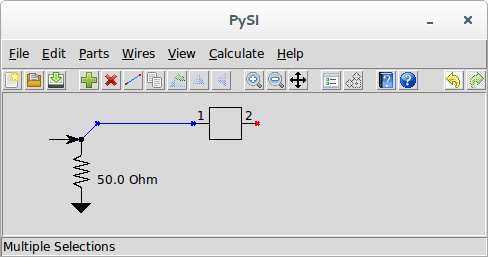

The [Stim](23-Built-in-Devices-Parts.md#device:Stim) must be connected to one and only one device port, as shown above. This means that if two device ports are connected together, you must separate them with a small bit of wire, and connect the [Stim](23-Built-in-Devices-Parts.md#device:Stim) to the device port you intend. In other words, don’t do this:

Remember, a [Stim](23-Built-in-Devices-Parts.md#device:Stim) defines the place of wave emanation from a port. Connecting it to two device ports, or in the middle of a wire, does not specify a device port from which waves emanate.

If you have a situation where you have have more stimuli than measurements, you can make the stimuli connected directly to the device ports *dependent* on an independent stimulus.

For example, suppose you have the following situation:

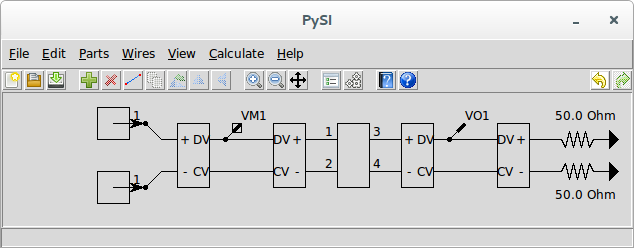

This virtual probing schematic says that you have two independent, single-ended sources of stimuli at a transmitter and that you are measuring the differential voltage at the transmitter and desiring to see the differential waveform at a perfectly terminated receiver. Here we have two stims and only one measurement probe which makes the system unsolvable.

We can rectify the situation by adding an independent stim and making the two stims at the transmitter output dependent on it, like this:

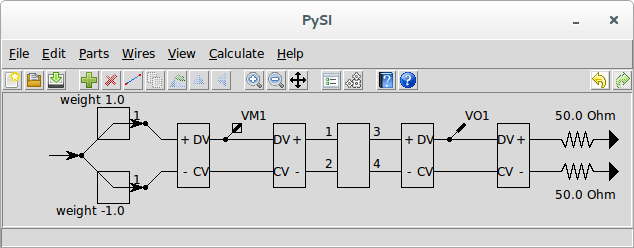

Although the two stims at the transmitter only showed one connection point at the arrow tip, the back of the arrow can also be connected. When the back of a stim is connected through a wire to arrow tip of another stim, it becomes dependent on it by an amount defined by the weight of the dependent stim. We change the weight by invoking [Edit Properties](15-Main-Schematic-Dialog.md#Control-Help:Edit-Properties) with the stim selected.

This arrangement says that the top stim is now the same as the independent stim and that the bottom stim is the negative of the independent stim. Since we now have only one independent stim, the system is solvable.

Note that this does not imply that the voltage waveform will be balanced at the transmitter (i.e. no common mode component), only that we have promised that the waves emanating from the transmitters are balanced.

## Setting Calculation Properties for Virtual Probing {#sub:Setting-Calculation-Properties-for-Virtual-Probing}

To set the calculation properties for virtual probing, see [Calculation Properties](15-Main-Schematic-Dialog.md#Control-Help:Calculation-Properties).

The calculation properties determine how the transfer parameters are calculated. Transfer parameters are frequency responses that define transfer characteristics from an input waveform to an output waveform. Input waveforms come from measurement probes and output waveforms are provided at output probe locations in the circuit. An output waveform is a linear combination of input waveforms applied to filters that are the time-domain equivalent of the frequency responses.

The frequency responses are calculated to the end frequency withe the frequency spacing specified, and the filters are calculated by taking the inverse-FFT of these frequency responses. As such, they end up having a sample rate that is twice the end frequency and an impulse response length that is the inverse of the frequency resolution and a number of points that are twice the number of frequency points.

The base sample rate should be set to the sample rate that you want the virtual calculation to run at, which is twice the end frequency.

These impulse responses generated for the filters are always centered on time zero, meaning half of the impulse response is before time zero and half is after.

Assuming that all of the s-parameters have been sampled sufficiently, meaning to the right end frequency and most importantly, with the proper spacing to provide an impulse response that does not have time-aliasing effects, then it is possible to specify an appropriate impulse response length in the calculation properties. But with the tool in its current state, there is no way to guarantee this - you must set it to a value that makes sense. But the key is that it must be long enough. If it is too short, the simulator produces incorrect waveforms. If it is too long, it just needs to do extra work.

The advice here is to set the impulse response length to a number that is twice the length of a finite impulse response (FIR) filter in time as how long you think the impulse response of the longest filter should be. Then, after the simulation completes, you should [View Transfer Parameters](14-Simulator-Dialog.md#Control-Help:View-Transfer-Parameters) from the [Simulator Dialog](14-Simulator-Dialog.md#sec:Simulator-Dialog) to make sure that this occurred.

To try to get some feeling on how the properties should be set, we can invoke the [S-parameter Viewer](15-Main-Schematic-Dialog.md#Control-Help:S-parameter-Viewer) and use the [S-parameter Viewer](13-S-parameter-Viewer.md#sec:S-parameter-Viewer) to examine the s-parameter files in the system and invoking [S-Parameter Properties](13-S-parameter-Viewer.md#Control-Help:S-Parameter-Properties) to see what the impulse responses look like resampled onto the desired calculation properties. But remember that your system contains many sets of such files that may cause the impulse response lengths needed for the transfer parameters to be different than what any individual s-parameter file shows.

## Virtual Probing {#sub:Virtual-Probing}

After creating the schematic for virtual probing and setting the calculation properties, the calculation is run using either the [Virtual Probe](15-Main-Schematic-Dialog.md#Control-Help:Virtual-Probe) command or the [Calculate](15-Main-Schematic-Dialog.md#Control-Help:Calculate-Button) toolbar button.

Note that virtual probing will not be possible at all (i.e. the menu elements are disabled) if the schematic does not meet the criteria for virtual probing. This criteria for the schematic regarding elements are that the schematic must:

- have at least one [Voltage Measure Probe](23-Built-in-Devices-Parts.md#device:Measure-Probe).

- have at least one [Voltage Output Probe](23-Built-in-Devices-Parts.md#device:Output-Probe).

- have at least one [Stim](23-Built-in-Devices-Parts.md#device:Stim)

- not have any other elements that don’t make sense for virtual probing including:

  - ports

  - unknown devices

  - system devices

In virtual probing, the first step is to convert the schematic shown into a net list. This netlist puts the graphical schematic into a text based description. Note that this netlist can be created, examined and saved separately if you want. See [Netlist](24-Netlist.md#sec:Netlist) for more information on the net list and see [Export Netlist](15-Main-Schematic-Dialog.md#Control-Help:Export-Netlist) on ways of viewing and exporting the net lists.

The net list is passed to a **VirtualProbeNumericParser** class as described in the software documentation after which the transfer parameters are extracted.

During parsing of the net list, all devices listed are instantiated with the end frequency and number of frequency points specified (see [Setting Calculation Properties for Virtual Probing](10-Virtual-Probing.md#sub:Setting-Calculation-Properties-for-Virtual-Probing)). If a file device is encountered, the s-parameters read from the file are resampled onto the end frequency and number of frequency points specified.

Then, for each frequency point, the transfer parameters are generated.

After the transfer parameters are generated, the input waveforms are produced or read from files and applied to the filters corresponding to the transfer parameters to generate output waveforms.

Sometimes, things go wrong and an error is generated. See [Errors and Exceptions](27-Errors-and-Exceptions.md#sec:Errors-and-Exceptions) for an explanation of any errors generated during calculation.

If everything goes correctly, the [Simulator Dialog](14-Simulator-Dialog.md#sec:Simulator-Dialog) will open with the ability to view the output waveforms calculated and save them to a file.

## Virtual Probing Example {#sub:Virtual-Probing-Example}

In this example, we are not going to explain how to draw the entire example in the schematic editor. Many of the other examples step you through this process. We will examine a canned example found in the folder ./Examples/VirtualProbingExample/VirtualProbeExample.xml.

When we open this example using [Open Project](15-Main-Schematic-Dialog.md#Control-Help:Open-Project), we see the following:

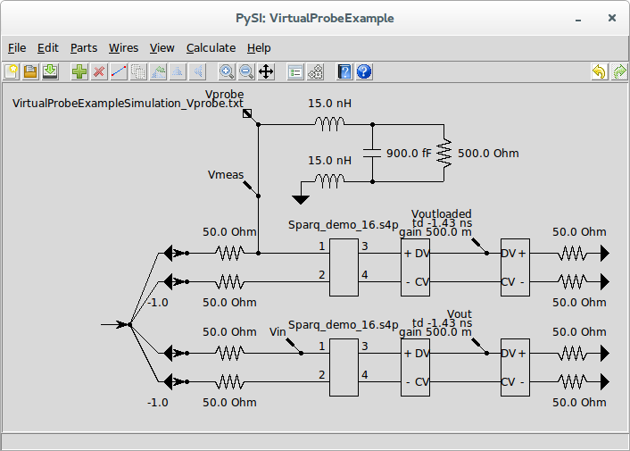

This example demonstrates many possible examples of virtual probing simultaneously. The top network containing inductors, a capacitor and a resistor is a *probe loading model*. This is a circuit which describes the effect that a probe has when inserted into a system. These models are generally published by manufacturers of high-frequency probes used for oscilloscopes. The probe loading model shown is for a single-ended probe.

The circuit beneath the probe loading model is the circuit being measured. Ignoring the stimuli for the moment, this circuit is for a 50  differential source driving a differential transmission line represented by a four-port s-parameter [File](23-Built-in-Devices-Parts.md#device:File) device. The s-parameters are contained in the file Sparq_demo_16.s4p. Notice that the probe loading model is connected to the circuit at the input termination.

The final circuit at the bottom is an exact duplicate of the previously described circuit section except that it does not have the probe loading model connected.

In the probe loading model section where the probe is connected to the circuit, we have a [Voltage Measure Probe](23-Built-in-Devices-Parts.md#device:Measure-Probe) device (see [Measure Probes](10-Virtual-Probing.md#sub:Measure-Probes) for more information). The measure probe is shows an input file name of VirtualProbingExampleSimulation_Vprobe.txt which is presumably a [Waveform](28-Waveform.md#sec:Waveform) file containing a waveform measured (by, for example an oscilloscope) while probing a circuit like the middle circuit section. In fact, in this contrived example, it is the output waveform of a ***SignalIntegrityApp*** [Simulation](08-Simulation.md#sec:Simulation) simulated under exactly these conditions.

Invoke [Edit Properties](15-Main-Schematic-Dialog.md#Control-Help:Edit-Properties) with the measure probe selected and press view to view the waveform in the [Simulator Dialog](14-Simulator-Dialog.md#sec:Simulator-Dialog):

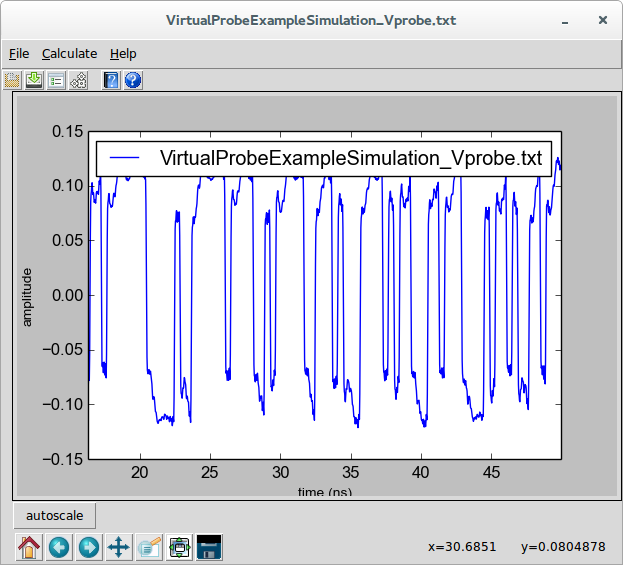

Throughout the rest of the schematic, we see various [Voltage Output Probe](23-Built-in-Devices-Parts.md#device:Output-Probe) devices (see [Output Probes for Virtual Probing](10-Virtual-Probing.md#sub:Output-Probes-for-Virtual-Probing) for more information). I will talk about these in a bit, but for now notice one interesting thing about the output probes named Voutloaded and Vout. These are in between two back-to-back [Voltage Mixed Mode Converter](23-Built-in-Devices-Parts.md#device:Voltage-Mixed-Mode-Converter) devices. These devices placed back-to-pack expose the plus and minus terminals of a single-ended line on each side and the differential- and common-mode lines in the middle. These devices connected in this arrangement have no effect on the circuit (the two plus pins or the two minus pins could even be shorted together if you wanted). Thus, these output probes are probing the differential output at the output termination.

Note that these output probes have keyword/values of td -1.43ns and gain 0.5. The gain is the gain applied to the output waveform. Since the input waveform is a single-ended measurement it is half the size of the differential waveform. We want to see relative changes is size, so we put the differential waveforms on the same relative scale as the single-ended waveforms. The time delay of -1.43 ns is to account for the delay through the channel. This was estimated by examining the s-parameters of the file Sparq_demo_16.s4p. You can do that by selecting the four-port file[File](23-Built-in-Devices-Parts.md#device:File) device, double-clicking on it to invoke [Edit Properties](15-Main-Schematic-Dialog.md#Control-Help:Edit-Properties) and then pressing view to invoke the [S-parameter Viewer](13-S-parameter-Viewer.md#sec:S-parameter-Viewer).

Selecting S31, we have:

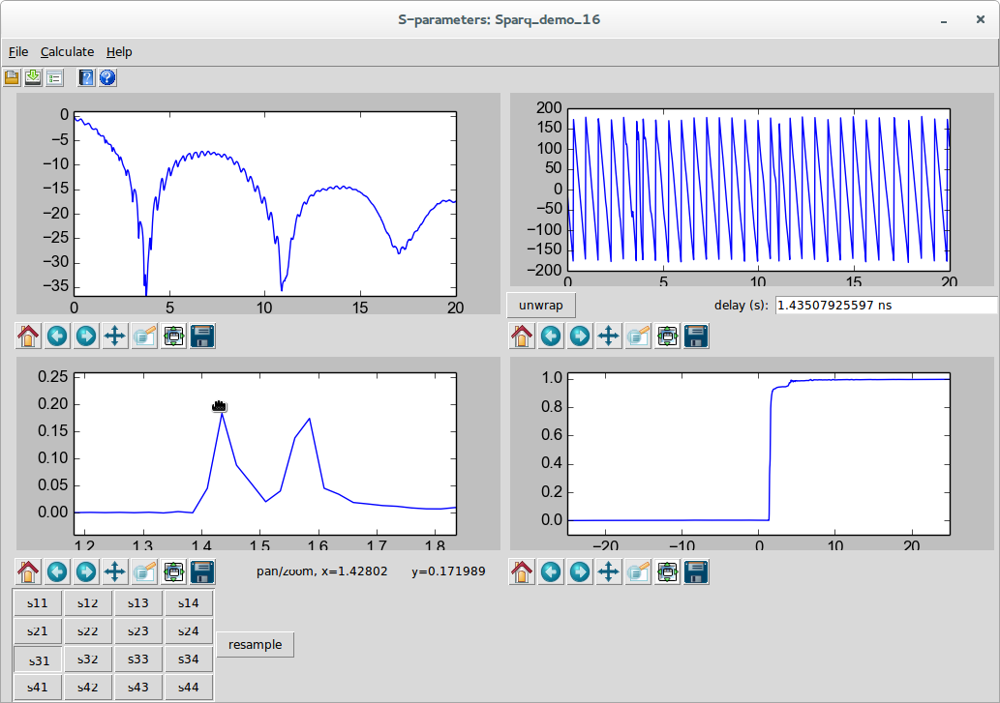

and by selecting S41, we have:

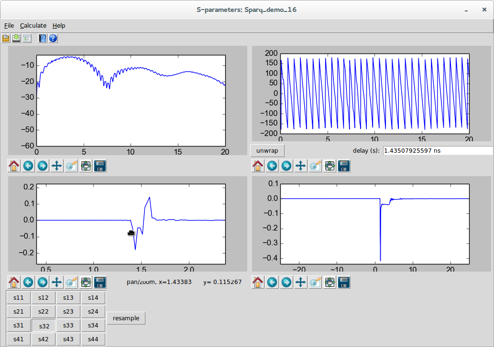

Since there are multiple spikes in the impulse response, the differential time delay through the channels is roughly the time of the positive going spike in the S31 that goes with the negative going spike in the S32.

Regarding the [Stimuli](10-Virtual-Probing.md#sub:Stimuli), we see four dependent stimuli and one independent stimuli. The dependent stimuli are connected to the pin of each [Ground](23-Built-in-Devices-Parts.md#device:Ground) device representing the transmitters (remember, a voltage source looks like a short with waves emanating from it). These grounds are connected through a small piece of wire to the pins of 50  resistors. (see [Stimuli](10-Virtual-Probing.md#sub:Stimuli) for why this small piece of wire is necessary). A [Stim](23-Built-in-Devices-Parts.md#device:Stim) is connected with the arrow touching each pin of the grounds, meaning the stimulus emanates from the grounds.

An independent stimulus is all the way to the left with wires connecting the arrow tip of the independent stimulus to the back of each of the stims. This means that the other stimuli depend on this stimulus. Note that in each of the circuit sections, the weights of the two bottom stims are -1.0 (the others are 1.0 and not shown). This means that the top stim in each circuit is the same as the independent stimulus and the bottom stim in each circuit is the negative of the independent stimulus. What we are saying here is that the waves emanating from the differential transmitters are balanced. See [Stimuli](10-Virtual-Probing.md#sub:Stimuli) for a discussion of this topic.

Now that we understand all of the interconnections, let’s understand what is the intent of this system.

We are providing a measured waveform Vprobe, and have output probes called:

- Vmeas - the measured input waveform at the transmitter. This waveform can be considered as the input waveform to the backplane with the probe loading the circuit.

- Voutloaded - the waveform at the receiver to be produced by Virtual Probing. This waveform is the output waveform with the probe loading the circuit.

- Vin - the waveform at the transmitter in the bottom circuit to be produced by Virtual Probing. This waveform is the input waveform to the circuit if the probe were not loading the circuit.

- Vout - the waveform at the receiver to be produced by Virtual Probing. This waveform is the output waveform without the probe loading the circuit.

Virtual Probe is being asked to provide these waveforms given a single, single-ended measurement at the transmitter.

So the problem being solved is three-fold:

- Voutloaded provides for a measurement in a different circuit location (the receiver) given a measurement taken at the transmitter.

- Vin provides for a measurement in the same system with the probe loading effects removed. In other words, it provides what the measurement would be were the probe perfect. In a sense, it is a deembedding of the loading effects of the probe.

- Vout provides for a measurement of the output waveform from a system, without the probe loading the system. This measurement is usually the actual goal. Note that this could be used for compliance testing of systems without having the actual backplane - and in fact could be used for monte-carlo testing of compliance if run with many different backplanes whose existance is virtual - in the form of s-parameter files. (These backplanes might not even exist and might be the product of other signal integrity analysis tools). All we would need to get right for this compliance testing would be a model of the probe and probing structure connected to the transmitter.

The first measurement we will take will be to see the effect of the probe loading in the measurement of the input waveform. So, select the two output probes at the output and move them off their connection points as shown.

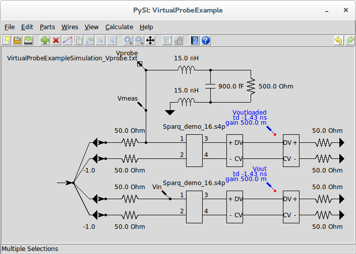

Before creating the output waveforms, you need to check that the calculation properties are appropriate. See [Setting Calculation Properties for Virtual Probing](10-Virtual-Probing.md#sub:Setting-Calculation-Properties-for-Virtual-Probing) for more information. Here we use the following settings:

Invoke [Calculate](15-Main-Schematic-Dialog.md#Control-Help:Calculate-Button) or [Virtual Probe](15-Main-Schematic-Dialog.md#Control-Help:Virtual-Probe) to create the output waveforms in the [Simulator Dialog](14-Simulator-Dialog.md#sec:Simulator-Dialog):

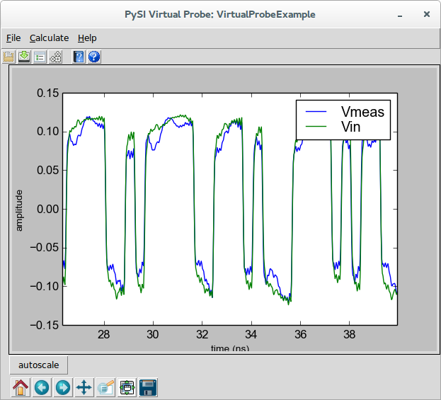

Amazingly, the new input waveform without the probe loading effects looks much better.

It’s always a good idea to invoke [View Transfer Parameters](14-Simulator-Dialog.md#Control-Help:View-Transfer-Parameters) to view the transfer parameters in the [S-parameter Viewer](13-S-parameter-Viewer.md#sec:S-parameter-Viewer). Selecting Vin due to Vprobe, we see:

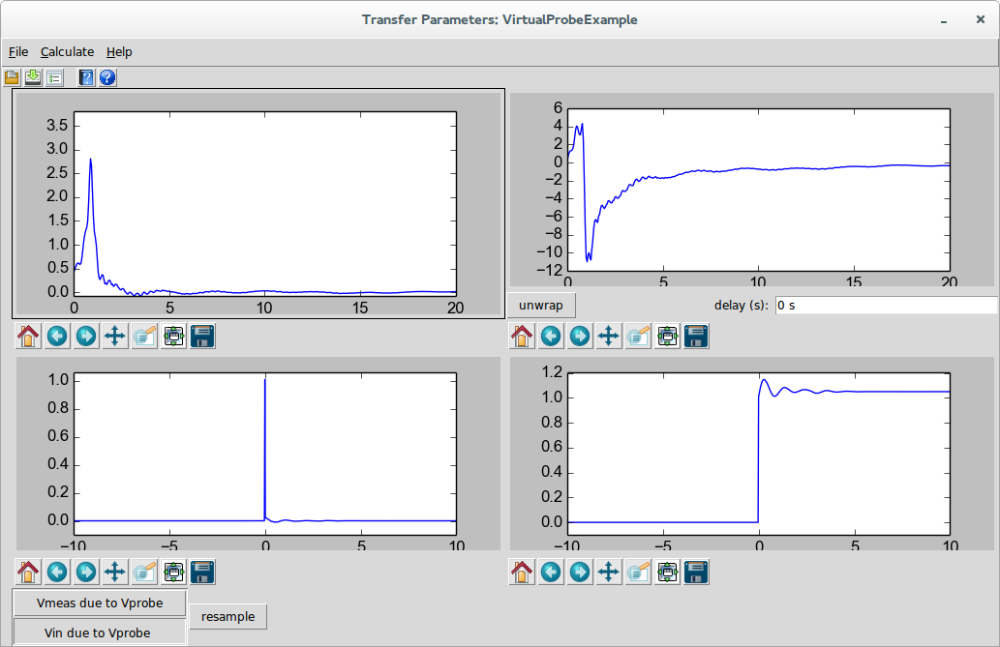

This is the filter that was created to convert the probed waveform to the waveform that would be present without the probe loading effects. Here we see a resonance at around 1 GHz accounting for a resonant cavity in the probes response (this would not be a great probe in real life). We see this resonance in the impulse and step response and fortunately it dies down before 10 ns, so the calculation settings are okay for this situation.

Now let’s go back to the schematic and view the output waveform. Disconnect the Vin output probe and connect the Voutloaded output probe like this:

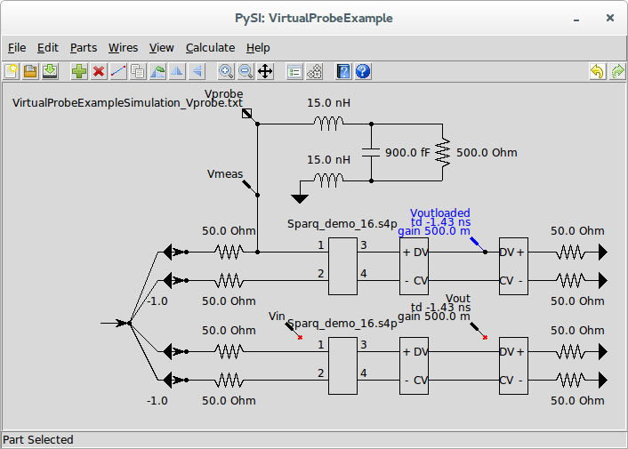

Invoke [Calculate](15-Main-Schematic-Dialog.md#Control-Help:Calculate-Button) or [Virtual Probe](15-Main-Schematic-Dialog.md#Control-Help:Virtual-Probe) to create the output waveforms in the [Simulator Dialog](14-Simulator-Dialog.md#sec:Simulator-Dialog):

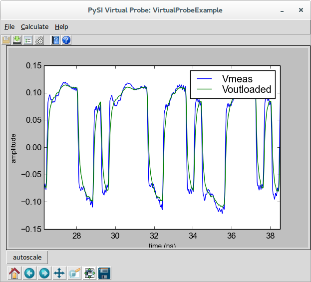

Note that because we applied the -1.43 ns delay and the half gain, they resemble each other. This is an example of using virtual probing to simply probe at a different location in the circuit than is actually being probed.

This portion of the example does not give us what we really want. We want to see what the output waveform would be were the probe not loading the system. For this, we go back to the schematic, and disconnect the two output probes at the input and connect the output probes at the output, like this:

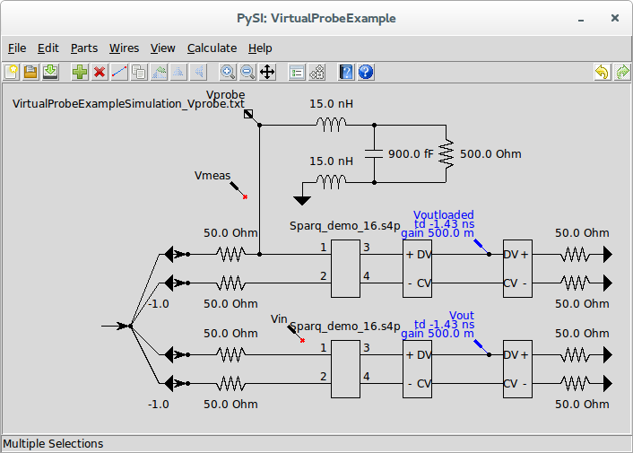

Invoke [Calculate](15-Main-Schematic-Dialog.md#Control-Help:Calculate-Button) or [Virtual Probe](15-Main-Schematic-Dialog.md#Control-Help:Virtual-Probe) to create the output waveforms in the [Simulator Dialog](14-Simulator-Dialog.md#sec:Simulator-Dialog):

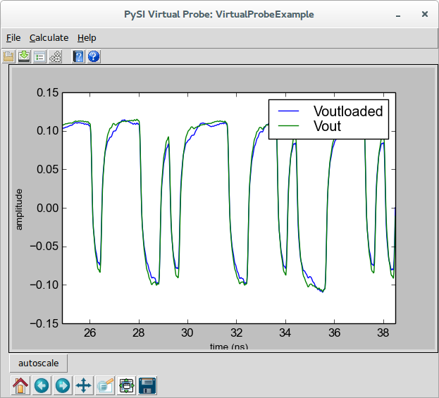

Here we see a not so negligible difference between the output waveforms with and without the probe loading accounted for.

Here, we were able to probe at the input and produce an output waveform at the receiver that is independent of the probe effects. In fact, if we simply probe the transmitter driving a known termination with known probe effects, we could have gotten this same result. Furthermore, we’d be able to replace the four-port backplane with varieties of corner cases to test compliance, for example.

Invoke [View Transfer Parameters](14-Simulator-Dialog.md#Control-Help:View-Transfer-Parameters) to view the transfer parameters in the [S-parameter Viewer](13-S-parameter-Viewer.md#sec:S-parameter-Viewer). Selecting Vout due to Vprobe, we see:

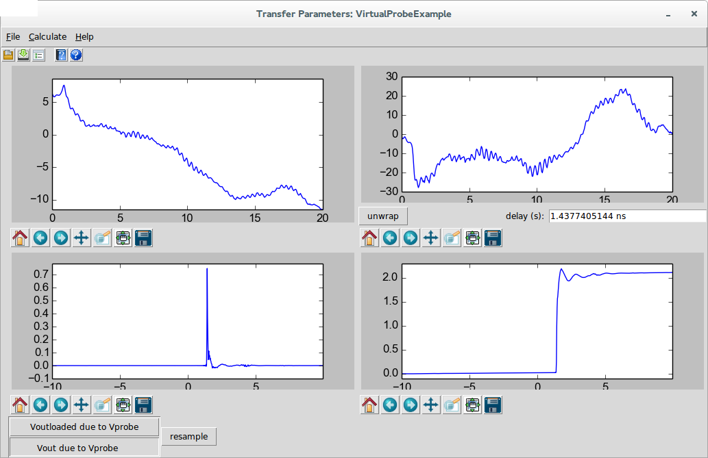

In the end, you can connect all of the output probes and run the calculation and save all of the waveforms by invoking [Save Waveforms](14-Simulator-Dialog.md#Control-Help:Save-Waveforms) from the [Simulator Dialog](14-Simulator-Dialog.md#sec:Simulator-Dialog) and save all of the transfer parameters by invoking [Save S-parameter File](13-S-parameter-Viewer.md#Control-Help:Save-S-parameter-File) in the [S-parameter Viewer](13-S-parameter-Viewer.md#sec:S-parameter-Viewer). Note that the transfer parameters will be an .s4p file with only S11, S21, S31, and S41 defined according to the ordering of the transfer parameters shown.

