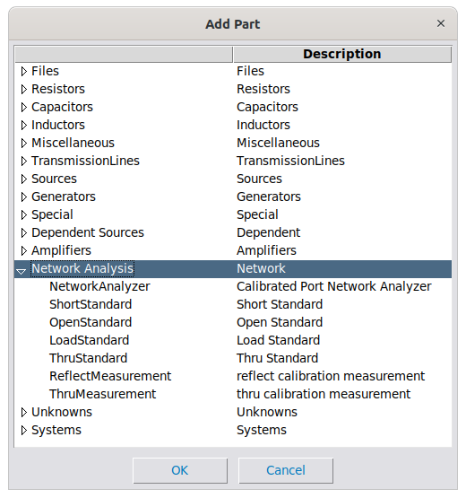
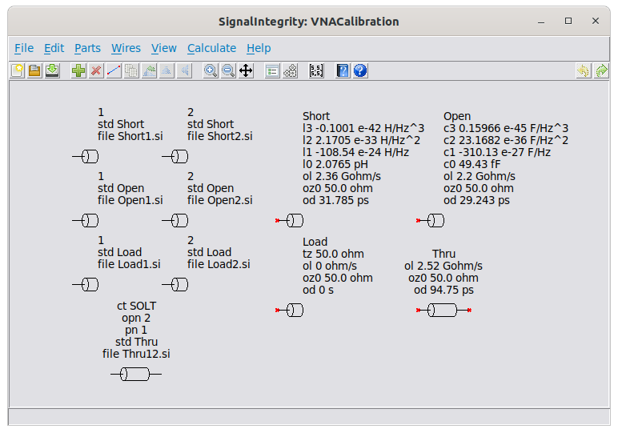
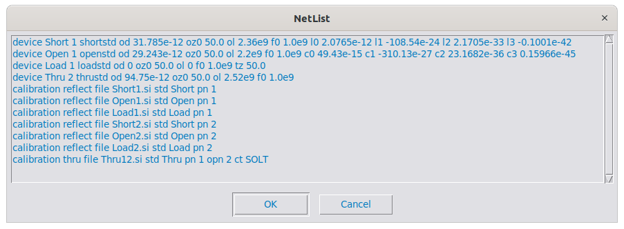
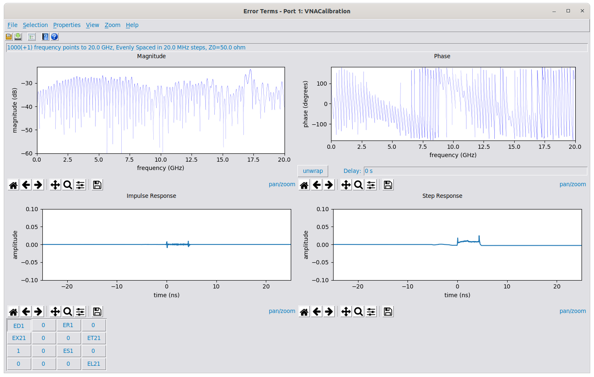
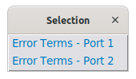
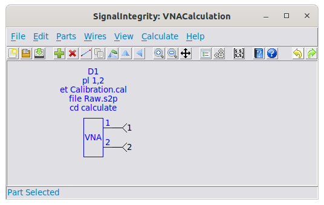

# Network Analyzer Measurements {#sec:Network-Analyzer-Measurements}

Network analyzer measurements allow the user to perform a [Network Analyzer Calibration](12-Network-Analyzer-Measurements.md#sub:Network-Analyzer-Calibration), producing error terms, and to use these error terms along with raw measurements of the device under test to produce calibrated measurements. [Network Analyzer Calibration](12-Network-Analyzer-Measurements.md#sub:Network-Analyzer-Calibration) has two main uses:

1.  To calibrate an instrument like a vector network analyzer (VNA).

2.  To perform fixture de-embedding in the form of a second-tier calibration.

For most VNA users, this kind of capability is not really useful for accomplishing item 1, since the VNA itself provides methods and algorithms for performing the calibration of the instrument. That being said, it can still be useful under this situation when calibrations not supported by the VNA are desired, such as overconstrained calibrations (using more standards than are needed), unknown thru calibrations (SOLR) if not supported, or transfer thru calibrations (when an incomplete set of thru measurements are made). It can also be used to check the calibration and certainly to learn about calibration, when coupled with examination of the source code or with the accompanying [Book](04-Book.md#sec:Book).

For solving problems in item 2, the application is particularly useful. Often probes and fixtures are de-embedded from measurements using the calibration process. This involves calibration standards usually built into a fixture, or calibration substrates. In these cases, the VNA is first calibrated at the end of its cables, then measurements are made of the calibration standards on the fixture and used to produce error terms. Then these error terms are used to make second-tier calibrated measurements of the DUT, de-embedding the fixture in the process.

The parts used in network analysis are shown below:

They fall into three categories:

1.  Calibration Standards – these are definition of standards applied to the instrument during calibration. They include:

    1.  [Short Standard](23-Built-in-Devices-Parts.md#device:Short-Standard) - the one-port definition of a short.

    2.  [Open Standard](23-Built-in-Devices-Parts.md#device:Open-Standard) - the one-port definition of an open.

    3.  [Load Standard](23-Built-in-Devices-Parts.md#device:Load-Standard) - the one-port definition of a termination.

    4.  [Thru Standard](23-Built-in-Devices-Parts.md#device:Thru-Standard) - the two-port definition of a thru.

2.  Calibration Measurements – these are the raw measurements taken of the calibration standards used for the calibration and for the generation of the error terms. These include:

    1.  [Reflect Measurement](23-Built-in-Devices-Parts.md#device:Reflect-Measurement) - single-port measurements of the standards, usually three per port, each being a short, open, or load.

    2.  [Thru Measurement](23-Built-in-Devices-Parts.md#device:Thru-Measurement) - two-port measurements of the thru standard, usually one per every port–port combination.

    3.  (optional) [Xtalk Measurement](23-Built-in-Devices-Parts.md#device:Xtalk-Measurement) - two-port measurements made while the ports are not connected. If used, usually on per every port-port combination.

3.  Network Analyzer Measurements – the [Network Analyzer](23-Built-in-Devices-Parts.md#device:Network-Analyzer) is used in conjunction with error terms previously calculated to convert raw s-parameter measurements into calibrated s-parameter measurements.

The two steps for network analyzer measurements are:

1.  [Network Analyzer Calibration](12-Network-Analyzer-Measurements.md#sub:Network-Analyzer-Calibration) – the process of determining the error terms using calibration standards and calibration measurements.

2.  [Network Analyzer Measurement](12-Network-Analyzer-Measurements.md#sub:Network-Analyzer-Measurement) – the process of using the error terms in conjunction with raw s-parameter measurements to calculate calibrated s-parameter measurements.

## Network Analyzer Calibration {#sub:Network-Analyzer-Calibration}

To perform a network analyzer calibration, one creates a project using [New Project](15-Main-Schematic-Dialog.md#Control-Help:New-Project) and places down parts on the schematic using [Add Part](15-Main-Schematic-Dialog.md#Control-Help:Add-Part). All of the parts used will be in the Network Analysis category shown below:

For calibration, the calibration measurements are mandatory – these are the raw measurements taken of the calibration standards used for the calibration and for the generation of the error terms. These include:

1.  [Reflect Measurement](23-Built-in-Devices-Parts.md#device:Reflect-Measurement) - single-port measurements of the standards, usually three per port, each being a short, open, or load.

2.  [Thru Measurement](23-Built-in-Devices-Parts.md#device:Thru-Measurement) - (if two ports or greater) two-port measurements of the thru standard, usually one per every port–port combination.

3.  [Xtalk Measurement](23-Built-in-Devices-Parts.md#device:Xtalk-Measurement) - (optional, if two ports or greater) two-port measurements with the ports unconnected, usually one per every port-port combination.

If calibration standards are used, and the calibration constants in the calibration kit are in a LeCroy format (which is the same as the Keysight format), then calibration standard devices can be used – these are definition of standards applied to the instrument during calibration. They include:

1.  [Short Standard](23-Built-in-Devices-Parts.md#device:Short-Standard) - the one-port definition of a short.

2.  [Open Standard](23-Built-in-Devices-Parts.md#device:Open-Standard) - the one-port definition of an open.

3.  [Load Standard](23-Built-in-Devices-Parts.md#device:Load-Standard) - the one-port definition of a termination.

4.  [Thru Standard](23-Built-in-Devices-Parts.md#device:Thru-Standard) - the two-port definition of a thru.

If calibration standards that don’t adhere to the LeCroy format are used, or in other situations such as fixtures or probes, then s-parameters can be supplied as standards.

Below is a project showing a two-port calibration:

The calibration measurements are shown on the left, and the calibration standards are supplied on the right. Note that you don’t have to supply the calibration standards in the schematic, if the standards are referred to as s-parameters, either with a .s1p or .s2p file, or as a project that produces one-port or two-port s-parameters of the standard. If you are using calibration standards from a calibration kit, it’s easiest to simply drop the standards in the schematic, in which case one refers to the standard by the reference designator name, which is shown here as simply:

- Short – The [Short Standard](23-Built-in-Devices-Parts.md#device:Short-Standard)

- Open – The [Open Standard](23-Built-in-Devices-Parts.md#device:Open-Standard)

- Load – The [Load Standard](23-Built-in-Devices-Parts.md#device:Load-Standard)

- Thru – The [Thru Standard](23-Built-in-Devices-Parts.md#device:Thru-Standard)

The definition of these standards can be seen by following the links.

The calibration measurements on the left. There are three instances of [Reflect Measurement](23-Built-in-Devices-Parts.md#device:Reflect-Measurement) per port, where each [Reflect Measurement](23-Built-in-Devices-Parts.md#device:Reflect-Measurement) shows the port it pertains to, the calibration standard used, and the s-parameter measurement. Here, the s-parameter measurements are not shown as .s1p files, as they usually are, but as projects that presumably produce one-port s-parameters. There is one [Thru Measurement](23-Built-in-Devices-Parts.md#device:Thru-Measurement) shown, representing the single thru calibration between ports 1 and 2.

The [Netlist](24-Netlist.md#sec:Netlist) corresponding to the schematic is exported below:

This netlist could be used within a Python scripted environment (see the [Software Documentation](https://teledynelecroy.github.io/SignalIntegrity/Doc/xhtml/index.xhtml), specifically [CalibrationNumericParser](https://teledynelecroy.github.io/SignalIntegrity/Doc/xhtml/classSignalIntegrity_1_1Lib_1_1Parsers_1_1CalibrationNumericParser_1_1CalibrationNumericParser.xhtml#details)).

Prior to performing the calibration, one should view and edit the [Calculation Properties](15-Main-Schematic-Dialog.md#Control-Help:Calculation-Properties) (see [Setting Calculation Properties](07-S-Parameter-Generation.md#sub:Setting-Calculation-Properties)).

After editing the [Calculation Properties](15-Main-Schematic-Dialog.md#Control-Help:Calculation-Properties), the calibration is invoked using [Calculate Error Terms](15-Main-Schematic-Dialog.md#Control-Help:Calculate-Error-Terms) or by pressing the [Calculate](15-Main-Schematic-Dialog.md#Control-Help:Calculate-Button) in the toolbar.

Once the error terms are calculated, the [S-parameter Viewer](13-S-parameter-Viewer.md#sec:S-parameter-Viewer) is opened as shown below:

In the viewer window, two special accommodations are made. First the s-parameters for the fixtures corresponding to the error terms are shown (for a definition of the fixtures see the [Book](04-Book.md#sec:Book)) with the buttons labeled appropriately, with the following definitions for error terms:

- $ED_{x}$ – Directivity term for port $x$

- $ER_{x}$ – Reverse Transmission term for port $x$

- $ES_{x}$ – Source Match term for port $x$

- $EX_{yx}$ – Crosstalk term for port $y$ with port $x$ driven

- $ET_{yx}$ – Forward Transmission term for port $y$ with port $x$ driven

- $EL_{yx}$ – Load Match term for port $y$ with port $x$ driven

The description of all of these error terms are beyond the scope of this users manual.

To select error terms for different ports, use [S-Parameter Viewer Selection Menu](13-S-parameter-Viewer.md#sub:S-Parameter-Viewer-Selection)

The error terms can be saved for use in a [Network Analyzer Measurement](12-Network-Analyzer-Measurements.md#sub:Network-Analyzer-Measurement) using [Save S-parameter File](13-S-parameter-Viewer.md#Control-Help:Save-S-parameter-File), but the default extension recommended will be calibration (.cal).

## Network Analyzer Measurement {#sub:Network-Analyzer-Measurement}

To perform a calibrated network analyzer measurement, one creates a project using [New Project](15-Main-Schematic-Dialog.md#Control-Help:New-Project) and places a [Network Analyzer](23-Built-in-Devices-Parts.md#device:Network-Analyzer) in the schematic using [Add Part](15-Main-Schematic-Dialog.md#Control-Help:Add-Part), as in the following picture:

The description of the configurable parameters are in the description of the [Network Analyzer](23-Built-in-Devices-Parts.md#device:Network-Analyzer) device. Here, the calibration file is specified as Calibration.cal, and the raw, uncalibrated s-parameters are specified as Raw.s2p. The port list is set to 1,2, indicating that the first two ports of the VNA are being used for the measurement.

Ports are numbered and applied to the device in the order of the port ordering desired for the output.

The project is the same as an [S-Parameter Generation](07-S-Parameter-Generation.md#sec:S-parameter-Generation) project.

Prior to performing the calculation, one should view and edit the [Calculation Properties](15-Main-Schematic-Dialog.md#Control-Help:Calculation-Properties) (see [Setting Calculation Properties](07-S-Parameter-Generation.md#sub:Setting-Calculation-Properties)).

After editing the [Calculation Properties](15-Main-Schematic-Dialog.md#Control-Help:Calculation-Properties), the calculation is invoked using [Calculate S-parameters](15-Main-Schematic-Dialog.md#Control-Help:Calculate-S-parameters) or by pressing the [Calculate](15-Main-Schematic-Dialog.md#Control-Help:Calculate-Button) in the toolbar.

Once the s-parameters are calculated, the [S-parameter Viewer](13-S-parameter-Viewer.md#sec:S-parameter-Viewer) is opened.

