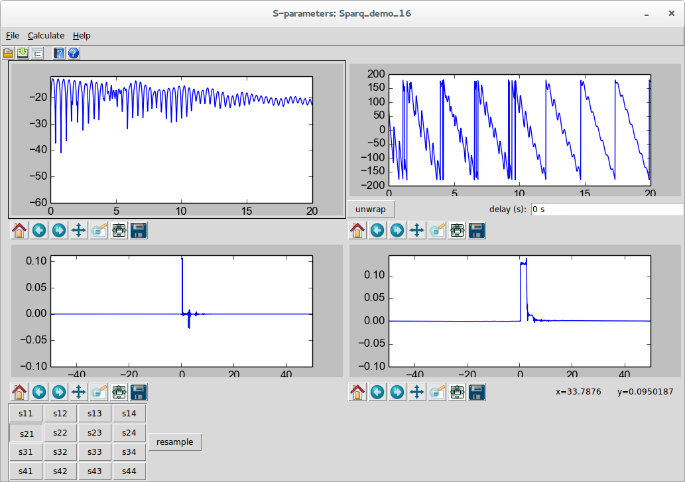
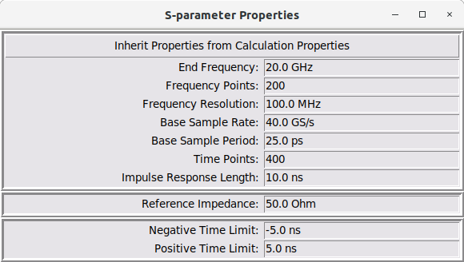
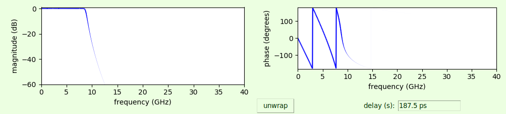
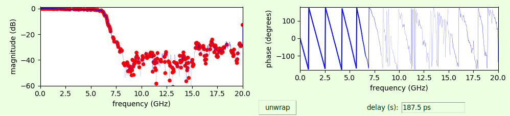
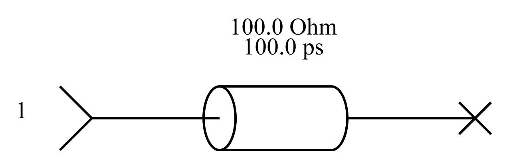
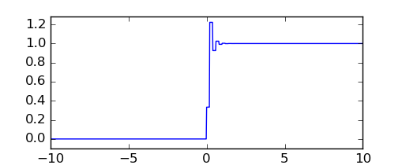
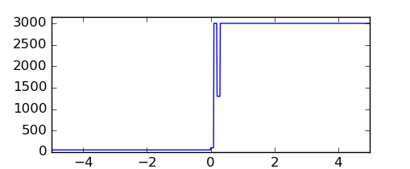
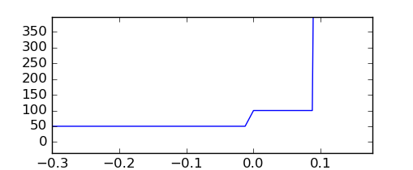
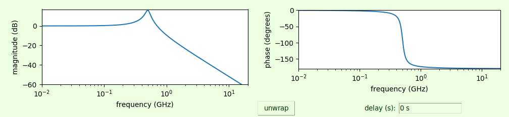

# S-parameter Viewer {#sec:S-parameter-Viewer}

The s-parameter viewer is a dialog that allows viewing of s-parameters or s-parameter-like things. An example of an s-parameter-like think are the transfer parameters used in the [Virtual Probing](10-Virtual-Probing.md#sec:Virtual-Probing) and [Simulation](08-Simulation.md#sec:Simulation) applications. S-parameters are the primary result of the [S-Parameter Generation](07-S-Parameter-Generation.md#sec:S-parameter-Generation) application.

The S-parameter viewer is invoked in the following ways:

- As a result of a successful [S-Parameter Generation](07-S-Parameter-Generation.md#sec:S-parameter-Generation) or [Deembedding](09-Deembedding.md#sec:Deembedding) calculation.

- When the transfer parameters are viewed from the [Simulator Dialog](14-Simulator-Dialog.md#sec:Simulator-Dialog) during [Simulation](08-Simulation.md#sec:Simulation) or [Virtual Probing](10-Virtual-Probing.md#sec:Virtual-Probing).

- When browsing an s-parameter file in the part property dialog of a file device. (see the [Add Part](15-Main-Schematic-Dialog.md#Control-Help:Add-Part) and [Edit Properties](15-Main-Schematic-Dialog.md#Control-Help:Edit-Properties) commands, or the [File](23-Built-in-Devices-Parts.md#device:File) device)

- When invoked from the ***SignalIntegrityApp*** main menu using the [S-parameter Viewer](15-Main-Schematic-Dialog.md#Control-Help:S-parameter-Viewer) command at any time to view any file.

When the s-parameter viewer dialog is invoked from the menu, the user is asked to select a file for viewing. This file must have the extension .s\[x\]p where x is the number of ports. It must also be a valid touchstone file.

The dialog is broken into four panes:

- Upper Left - Magnitude Response

- Upper Right - Phase Response

- Lower Left - Impulse Response

- Lower Right - Step Response

When s-parameters are read from a file, they are plotted exactly as read at the exact frequency points present in the file.

When s-parameters have been calculated, they are calculated according to the [Calculation Properties](15-Main-Schematic-Dialog.md#Control-Help:Calculation-Properties) as specified.

The calculation properties that you are allowed to specify force the result to be evenly spaced points from zero frequency to the end frequency specified. But for files read from the disk and produced outside these tools, the frequencies are often at odd locations and frequently don’t include the zero frequency points. In these cases, the impulse response and step response cannot be shown and the panes are blank.

Each of the dialog panes have their own, independent control of panning and zooming. These controls come standard with MatPlotLib (see <http://matplotlib.org>), the standard Python way of plotting things.

Below the panes are an array of buttons determining the s-parameters being shown. If transfer parameters are being shown, the buttons are named not by port numbers but rather as relationships between, in the case of simulation, output probe voltages and source voltages or, in the case of virtual probing, output probe voltages and measurement probe voltages.

The theory behind the s-parameter viewer dialog is that examination of s-parameters, particularly for signal integrity, must include the time-domain, as the time-domain tells you how the s-parameters will perform in time-domain simulations. Speaking simply, the impulse response of the s-parameter shown is equivalent to a time-domain filter that filters waveforms. When viewing the impulse response, you should be looking for causality and settling issues caused mostly by insufficient frequency resolution. If there are bumps in the impulse response prior to time zero or prior to the electrical length of the device (that are not insignificant), then you have causality violations. If the impulse occurs near the end of the impulse response and you see remnants that wrap to the beginning of the response, you have insufficient frequency resolution. The step response highlights these type of problems and additionally show problems when impulse responses settle to non-zero values at the beginning and end of the response. If you have these response problems from s-parameters read from a file, then there is really nothing you can do with them. If you have these issues as a result of a calculation, then sometimes these problems can be repaired by changing the [Calculation Properties](15-Main-Schematic-Dialog.md#Control-Help:Calculation-Properties).

If the s-parameter file being viewed is an input file to any of the ***SignalIntegrityApp*** applications, then the file will end up getting resampled according to the [Calculation Properties](15-Main-Schematic-Dialog.md#Control-Help:Calculation-Properties) and the viewer is a good way to see the effects of this resampling, most importantly in the time-domain. As mentioned, if the s-parameter viewer dialog is invoked on a file, then the file is shown as read. Selecting resample from either the Calculate menu or the resample button shows what the s-parameters will look like when resampled by the application. If the time-domain results look poor after resampling, then you have a problem. Currently, in this version of ***SignalIntegrityApp***, the resampling algorithms are geared towards strictly proper resampling of files with equally spaced points and the application does a poor job of extrapolation. Part of this is on purpose, because you really should make sure that your measurement instruments or other simulation tools provide the proper s-parameter files, but in the future, the intent is to add many more tools and algorithms for properly dealing with these situations.

Finally, in the s-parameter viewer dialog, you have the ability to read another file, or write the file to the disk using the file menu commands or toolbar buttons.

You can also view the magnitude response and phase response with a [Variable Line Width](13-S-parameter-Viewer.md#Control-Help:Variable-Line-Width) which helps especially in viewing the phase response.

Note that in the phase response there is the ability to unwrap the phase. Pressing this button does not strictly unwrap the phase, but calculates the principle delay in the impulse response (if the impulse response can be calculated) and removes this delay from the phase response shown. In the future, the intent is to probably entirely unwrap the phase, and to show the phase only when the magnitude response is not unreasonably small.

In the s-parameter viewer there are various menus that are available:

- [S-Parameter Viewer File Menu](13-S-parameter-Viewer.md#sub:S-Parameter-Viewer-File) – read and write files.

- [S-Parameter Viewer Selection Menu](13-S-parameter-Viewer.md#sub:S-Parameter-Viewer-Selection) – select other s-parameter files (or port error terms, when used in [Network Analyzer Calibration](12-Network-Analyzer-Measurements.md#sub:Network-Analyzer-Calibration)).

- [S-Parameter Viewer Properties Menu](13-S-parameter-Viewer.md#sub:S-Parameter-Viewer-Properties) – s-parameter properties and enforcements.

- [S-Parameter Viewer View Menu](13-S-parameter-Viewer.md#sub:S-Parameter-Viewer-View) – various viewing options.

- [S-Parameter Viewer Zoom Menu](13-S-parameter-Viewer.md#Control-Help:S-Parameter-Viewer-Zoom) – various zooming options.

- [S-Parameter Viewer Help](13-S-parameter-Viewer.md#sub:S-Parameter-Viewer-Help) – help system.

## S-Parameter Viewer File Menu {#sub:S-Parameter-Viewer-File}

The File tasks are:

- [Save S-parameter File](13-S-parameter-Viewer.md#Control-Help:Save-S-parameter-File)

- [Open S-parameter File](13-S-parameter-Viewer.md#Control-Help:Open-S-parameter-File)

### Open S-parameter File {#Control-Help:Open-S-parameter-File}

| *Dialog* | S-parameter Viewer Dialog |
|:--:|:--:|
| *Menu System* | File Open |
| *Navigation* | Alt+F,O |
| *Key Binding* | None |
| *Toolbar* |  |
| *Availability* | When s-parameter files are being viewed |

browses to an s-parameter file to read in. The user is asked to select a file for viewing. This file must have the extension .s\[x\]p where x is the number of ports. It must also be a valid touchstone file.

This command is not available when viewing transfer parameters.

### Save S-parameter File {#Control-Help:Save-S-parameter-File}

| *Dialog* | S-parameter Viewer Dialog |
|:--:|:--:|
| *Menu System* | File Save |
| *Navigation* | Alt+F,S |
| *Key Binding* | None |
| *Toolbar* |  |
| *Availability* | Always |

This saves the current s-parameter file being viewed to disk. When saving a file, it must have the extension .s\[x\]p where x is the number of ports.

## S-Parameter Viewer Selection Menu {#sub:S-Parameter-Viewer-Selection}

Usually, the selection is grayed out, as only one s-parameter file is shown at a time. An exception to this is when viewing calibration files resulting from [Network Analyzer Calibration](12-Network-Analyzer-Measurements.md#sub:Network-Analyzer-Calibration), in which the error terms for each port can be selected.

Future enhancements will enable viewing of multiple s-parameters that will be selectable through this menu.

## S-Parameter Viewer Properties Menu {#sub:S-Parameter-Viewer-Properties}

The s-parameter properties menu allows viewing and editing of s-parameter properties, allowing for editing of response limits, resampling, reference impedance changes, and for enforcement of various physicality aspects.

The Properties tasks are:

- [S-Parameter Properties](13-S-parameter-Viewer.md#Control-Help:S-Parameter-Properties)

- [Enforce Passivity](13-S-parameter-Viewer.md#Control-Help:Enforce-Passivity)

- [Enforce Causality](13-S-parameter-Viewer.md#Control-Help:Enforce-Causality)

- [Enforce Both Passivity and Reciprocity](13-S-parameter-Viewer.md#Control-Help:Enforce-Both-Passivity-and-Reciprocity)

- [Enforce Reciprocity](13-S-parameter-Viewer.md#Control-Help:Enforce-Reciprocity)

- [Enforce All](13-S-parameter-Viewer.md#Control-Help:Enforce-All)

- [Wavelet Denoise](13-S-parameter-Viewer.md#Control-Help:Wavelet-Denoise)

- [Remove Impulse Response Offset](13-S-parameter-Viewer.md#Control-Help:Remove-Offset)

- [Preserve DC in Causality Enforcement](13-S-parameter-Viewer.md#Control-Help:Preserve-DC)

### S-Parameter Properties {#Control-Help:S-Parameter-Properties}

|    *Dialog*    |     S-parameter Viewer Dialog     |
|:--------------:|:---------------------------------:|
| *Menu System*  | Properties S-parameter Properties |
|  *Navigation*  |              Alt+P,S              |
| *Key Binding*  |               None                |
|   *Toolbar*    |               None                |
| *Availability* |              Always               |

This opens the s-parameters properties dialog. All things in this dialog can be modified to alter the s-parameters.

The top third contains all of the things that end up affecting the end frequency and frequency points. The other parameters are simply other ways of saying the same thing. See [Setting Calculation Properties](07-S-Parameter-Generation.md#sub:Setting-Calculation-Properties). When s-parameters are produced as a result of a [S-Parameter Generation](07-S-Parameter-Generation.md#sec:S-parameter-Generation) or [Deembedding](09-Deembedding.md#sec:Deembedding) application, they are sampled with the [Calculation Properties](15-Main-Schematic-Dialog.md#Control-Help:Calculation-Properties) set at the time of the calculation. If they are changed after the calculation, the results can be resampled by editing the values in this dialog.

Also, oftentimes s-parameters are being viewed from files and are therefore sampled however they are on the disk. Resampling them allows the user to see ahead of time how they will be resampled during calculation to look for bad behavior.

The reference impedance of the s-parameters can be changed from the default, which is the reference impedance of the s-parameters calculated or read in from a file.

The negative and positive time limit contains the time limits for the impulse responses that have non-zero data. lower the magnitude of these limits causes the s-parameters to be limited in non-zero response to these limits. This is helpful to smooth out s-parameter data.

Note, the best effects for limiting negative time, as for enforcing causality, is by setting the negative time limit the negative of the base sample period.

### Enforce Passivity {#Control-Help:Enforce-Passivity}

|    *Dialog*    |        S-parameter Viewer Dialog        |
|:--------------:|:---------------------------------------:|
| *Menu System*  |      Properties Enforce Passivity       |
|  *Navigation*  |                 Alt+P,P                 |
| *Key Binding*  |                  None                   |
|   *Toolbar*    |                  None                   |
| *Availability* | When s-parameter files are being viewed |

This removes any passivity violations by making the minimum changes to the s-parameters to enforce passivity.

Passivity violations are shown using [Show Passivity Violations](13-S-parameter-Viewer.md#Control-Help:Show-Passivity-Violations).

This command is not available (and does not make sense) when viewing transfer parameters.

Note that sometimes enforcing passivity causes causality violations. See [Show Causality Violations](13-S-parameter-Viewer.md#Control-Help:Show-Causality-Violations). When this occurs, repeatedly enforcing causality and passivity over and over again converges to an s-parameter set that is both causal and passive. See [Enforce Causality](13-S-parameter-Viewer.md#Control-Help:Enforce-Causality)

### Enforce Causality {#Control-Help:Enforce-Causality}

|    *Dialog*    |        S-parameter Viewer Dialog        |
|:--------------:|:---------------------------------------:|
| *Menu System*  |      Properties Enforce Causality       |
|  *Navigation*  |                 Alt+P,C                 |
| *Key Binding*  |                  None                   |
|   *Toolbar*    |                  None                   |
| *Availability* | When s-parameter files are being viewed |

This removes any causality violations by zeroing the impulse response prior to time zero to enforce causality.

Causality violations are shown using [Show Causality Violations](13-S-parameter-Viewer.md#Control-Help:Show-Causality-Violations).

This command is not available (and does not make sense) when viewing transfer parameters.

Note that sometimes enforcing causality causes passivity violations. See [Show Passivity Violations](13-S-parameter-Viewer.md#Control-Help:Show-Passivity-Violations). When this occurs, repeatedly enforcing causality and passivity over and over again converges to an s-parameter set that is both causal and passive. See [Enforce Passivity](13-S-parameter-Viewer.md#Control-Help:Enforce-Passivity).

Better yet, if you want to enforce both passivity and causality simultaneously, use .

### Enforce Both Passivity and Reciprocity {#Control-Help:Enforce-Both-Passivity-and-Reciprocity}

|    *Dialog*    |            S-parameter Viewer Dialog            |
|:--------------:|:-----------------------------------------------:|
| *Menu System*  | Properties Enforce Both Passivity and Causality |
|  *Navigation*  |                     Alt+P,B                     |
| *Key Binding*  |                      None                       |
|   *Toolbar*    |                      None                       |
| *Availability* |     When s-parameter files are being viewed     |

This command enforces both passivity and causality by repeatedly issuing the commands [Enforce Passivity](13-S-parameter-Viewer.md#Control-Help:Enforce-Passivity) and [Enforce Causality](13-S-parameter-Viewer.md#Control-Help:Enforce-Causality) up to thirty times. This is because each of these commands issued alone tends to cause violations of the other, but tends to converge if done repeatedly.

See [Enforce Passivity](13-S-parameter-Viewer.md#Control-Help:Enforce-Passivity) for passivity enforcement.

See [Enforce Causality](13-S-parameter-Viewer.md#Control-Help:Enforce-Causality) for causality enforcement.

### Enforce Reciprocity {#Control-Help:Enforce-Reciprocity}

|    *Dialog*    |        S-parameter Viewer Dialog        |
|:--------------:|:---------------------------------------:|
| *Menu System*  |     Properties Enforce Reciprocity      |
|  *Navigation*  |                 Alt+P,R                 |
| *Key Binding*  |                  None                   |
|   *Toolbar*    |                  None                   |
| *Availability* | When s-parameter files are being viewed |

Most passive elements are reciprocal, meaning that they ought to have s-parameters such that $S_{xy}=S_{yx}$. This command makes the device reciprocal by setting:

$$S_{xy}=S_{yx}=\frac{S_{xy}+S_{yx}}{2}\mbox{.}$$

### Enforce All {#Control-Help:Enforce-All}

|    *Dialog*    |        S-parameter Viewer Dialog        |
|:--------------:|:---------------------------------------:|
| *Menu System*  |         Properties Enforce All          |
|  *Navigation*  |                 Alt+P,A                 |
| *Key Binding*  |                  None                   |
|   *Toolbar*    |                  None                   |
| *Availability* | When s-parameter files are being viewed |

Enforces all possible enforcements. It first invokes [Enforce Reciprocity](13-S-parameter-Viewer.md#Control-Help:Enforce-Reciprocity), and then invokes [Enforce Both Passivity and Reciprocity](13-S-parameter-Viewer.md#Control-Help:Enforce-Both-Passivity-and-Reciprocity). If reciprocity is not appropriate, then use [Enforce Both Passivity and Reciprocity](13-S-parameter-Viewer.md#Control-Help:Enforce-Both-Passivity-and-Reciprocity).

### Wavelet Denoise {#Control-Help:Wavelet-Denoise}

|    *Dialog*    |        S-parameter Viewer Dialog        |
|:--------------:|:---------------------------------------:|
| *Menu System*  |       Properties Wavelet Denoise        |
|  *Navigation*  |                 Alt+P,W                 |
| *Key Binding*  |                  None                   |
|   *Toolbar*    |                  None                   |
| *Availability* | When s-parameter files are being viewed |

This denoises the s-parameters by performing the discrete wavelet transform (DWT) on the impulse response, removing any wavelet coefficients that are small and performing the IDWT to restore the impulse response.

Wavelet denoising is inappropriate on:

- already clean s-parameters

- s-parameters for systems that produce oscillatory impulse responses (like many types of filters).

This command is not available (and does not make sense) when viewing transfer parameters.

Note that sometimes wavelet denoising causes causality and/or passivity violations. See [Show Causality Violations](13-S-parameter-Viewer.md#Control-Help:Show-Causality-Violations) and [Show Passivity Violations](13-S-parameter-Viewer.md#Control-Help:Show-Passivity-Violations).

### Remove Impulse Response Offset {#Control-Help:Remove-Offset}

|    *Dialog*    |         S-parameter Viewer Dialog         |
|:--------------:|:-----------------------------------------:|
| *Menu System*  | Properties Remove Impulse Response Offset |
|  *Navigation*  |                  Alt+P,f                  |
| *Key Binding*  |                   None                    |
|   *Toolbar*    |                   None                    |
| *Availability* |  When s-parameter files are being viewed  |

Sometimes an s-parameter, when viewed in the time-domain, has a DC offset of the impulse response leading to a tilt in the step response. Sometimes, this offset can be removed and the tilt in the step response corrected by employing this correction.

### Preserve DC in Causality Enforcement {#Control-Help:Preserve-DC}

|    *Dialog*    |            S-parameter Viewer Dialog            |
|:--------------:|:-----------------------------------------------:|
| *Menu System*  | Properties Preserve DC in Causality Enforcement |
|  *Navigation*  |                     Alt+P,D                     |
| *Key Binding*  |                      None                       |
|   *Toolbar*    |                      None                       |
| *Availability* |     When s-parameter files are being viewed     |

Causality enforcement involves zeroing out all of the portion of the time-domain views of the s-parameters that represents negative time. Sometimes, when doing this, the DC response is affected. In most applications, this is not a big effect, but for PDN analysis, it is critical to preserve the DC response. Checking this selection causes the causality enforcement to preserve the DC response behavior.

## S-Parameter Viewer View Menu {#sub:S-Parameter-Viewer-View}

The View settings are:

- [Show Grids](13-S-parameter-Viewer.md#Control-Help:Show-Grids)

- [Variable Line Width](13-S-parameter-Viewer.md#Control-Help:Variable-Line-Width)

- [Show Passivity Violations](13-S-parameter-Viewer.md#Control-Help:Show-Passivity-Violations)

- [Show Causality Violations](13-S-parameter-Viewer.md#Control-Help:Show-Causality-Violations)

- [Show Impedance](13-S-parameter-Viewer.md#Control-Help:Show-Impedance)

- [Show Excess Inductance](13-S-parameter-Viewer.md#Control-Help:Show-Excess-Inductance)

- [Show Excess Capacitance](13-S-parameter-Viewer.md#Control-Help:Show-Excess-Capacitance)

- [Log Frequency Scale](13-S-parameter-Viewer.md#Control-Help:SP-Log-Scale)

- [Linear Vertical Scale](13-S-parameter-Viewer.md#Control-Help:Linear-Vertical-Scale)

### Show Grids {#Control-Help:Show-Grids}

|    *Dialog*    |   Show Grids    |
|:--------------:|:---------------:|
| *Menu System*  | View Show Grids |
|  *Navigation*  |     Alt+V,G     |
| *Key Binding*  |      None       |
|   *Toolbar*    |      None       |
| *Availability* |     Always      |

Toggles the display of grids on the plots. The choice of whether to show grids is held in the [Preferences](29-Preferences.md#sec:Preferences) and persists over different sessions.

### Variable Line Width {#Control-Help:Variable-Line-Width}

|    *Dialog*    | S-parameter Viewer Dialog |
|:--------------:|:-------------------------:|
| *Menu System*  | View Variable Line Width  |
|  *Navigation*  |          Alt+V,L          |
| *Key Binding*  |           None            |
|   *Toolbar*    |           None            |
| *Availability* |          Always           |

Allows viewing magnitude and phase response with a variable line width.

This is helpful in viewing the s-parameter with an intensity that depends on whether the value actually matters. This is especially helpful when looking at the phase response, which tends to vary wildly when the magnitude response is small. When the magnitude response is small, the phase response doesn’t matter anyway, and this setting helps the user ignore these frequency locations.

The line width of the magnitude response and phase response vary depending on the magnitude response of the s-parameter. If the magnitude is large, a large line width is used and if the magnitude is small, a small line width is used.

Unfortunately, variable line width cannot operate properly along with [Log Frequency Scale](13-S-parameter-Viewer.md#Control-Help:SP-Log-Scale). When both modes are set, they are both shown checked, but the variable line width overrides and the plot is shown with a linear frequency axis with variable line width.

The choice of variable line width is held in the [Preferences](29-Preferences.md#sec:Preferences) and persists over different sessions.

### Show Passivity Violations {#Control-Help:Show-Passivity-Violations}

|    *Dialog*    |        S-parameter Viewer Dialog        |
|:--------------:|:---------------------------------------:|
| *Menu System*  |     View Show Passivity Violations      |
|  *Navigation*  |                 Alt+V,P                 |
| *Key Binding*  |                  None                   |
|   *Toolbar*    |                  None                   |
| *Availability* | When s-parameter files are being viewed |

Shows locations of passivity violations. These are shown as red dots on the magnitude response plot (the top left plot) of the [S-parameter Viewer](13-S-parameter-Viewer.md#sec:S-parameter-Viewer).

The dot sizes are large for relatively large passivity violations (singular values greater than 1.01) and are smaller for smaller violations.

Passivity violation detection is subject to the numerical accuracy of the SVD algorithm used and sometimes leads to very small passivity violations due to numerical error. These are shown as very faint red dots.

Circuits that are passive are circuits that can never, under any circumstances, deliver power. They are either entirely reflective, and/or absorb or dissipate power under certain circumstances.

Passivity violations can be removed from known passive circuits using [Enforce Passivity](13-S-parameter-Viewer.md#Control-Help:Enforce-Passivity).

This command is not available (and does not make sense) when viewing transfer parameters.

The choice of showing passivity violations is held in the [Preferences](29-Preferences.md#sec:Preferences) and persists over different sessions.

### Show Causality Violations {#Control-Help:Show-Causality-Violations}

|    *Dialog*    |        S-parameter Viewer Dialog        |
|:--------------:|:---------------------------------------:|
| *Menu System*  |     View Show Causality Violations      |
|  *Navigation*  |                 Alt+V,A                 |
| *Key Binding*  |                  None                   |
|   *Toolbar*    |                  None                   |
| *Availability* | When s-parameter files are being viewed |

Shows locations of causality violations. These are shown as red dots on the impulse response plot (the bottom left plot) of the [S-parameter Viewer](13-S-parameter-Viewer.md#sec:S-parameter-Viewer).

The dot sizes are large for relatively large causality violations and are smaller for smaller violations. Causality violations below $1\ \mu$ ($-100\ \mathrm{dB)}$ are not shown as violations, as they are so small to have negligible effect.

Causality violations are sometimes caused by sampling effects.

Causality violations can be removed using [Enforce Causality](13-S-parameter-Viewer.md#Control-Help:Enforce-Causality).

This command is not available (and does not make sense) when viewing transfer parameters.

The choice of showing causality violations is held in the [Preferences](29-Preferences.md#sec:Preferences) and persists over different sessions.

### Show Impedance {#Control-Help:Show-Impedance}

|    *Dialog*    |        S-parameter Viewer Dialog        |
|:--------------:|:---------------------------------------:|
| *Menu System*  |           View Show Impedance           |
|  *Navigation*  |                 Alt+V,I                 |
| *Key Binding*  |                  None                   |
|   *Toolbar*    |                  None                   |
| *Availability* | When s-parameter files are being viewed |

This setting causes the step responses (the lower right plot) to be displayed as impedance for the diagonal element s-parameters (S11, S22, S33, etc.).

for a $K$ element step response, for $k\in0\ldots K-1$, where $s\left[k\right]$ represents a value of the step response at a time $t\left[k\right]$, the following formula approximates the line impedance at time $t\left[k\right]$/2:

$$i\left[k\right]\approx Z0\cdot\frac{1+s\left[k\right]}{1-s\left[k\right]}$$

The factor of $1/2$ on the time is because the reflection must go into and out of the system (i.e. go twice the time).

Generally, this is called the impedance profile. It is not really appropriate for lumped element systems and is really only appropriate for transmission lines and cables, etc. That being said, sometimes the launches into these systems have impedance discontinuities that look like lumped excess inductance (high impedance) or lumped excess capacitance (low impedance).

This calculation is an approximation because in systems with lots of or large reflections, the approximation of the impedance gets worse the further into the line you go. Here’s an example of a open transmission line:

Here is the step response:

And here is the impedance profile calculated from the step response:

Note that something unnatural had to be done about the step response going above unity, which was to clip it at 3000 ohms.

Here is a zoom of the impedance profile:

Thus, we see that the early part of the impedance profile shows a jump to 100 ohms for 100 ps as expected, and then a large impedance jump (the open). What goes on beyond this zoomed portion is a result of the multiple reflections and is not correct.

There are more accurate methods possible (called peeling), but these are not implemented at this time.

This command is not available (and does not make sense) when viewing transfer parameters.

The choice of showing impedance is held in the [Preferences](29-Preferences.md#sec:Preferences) and persists over different sessions.

### Show Excess Inductance {#Control-Help:Show-Excess-Inductance}

|    *Dialog*    |        S-parameter Viewer Dialog        |
|:--------------:|:---------------------------------------:|
| *Menu System*  |       View Show Excess Inductance       |
|  *Navigation*  |                 Alt+V,n                 |
| *Key Binding*  |                  None                   |
|   *Toolbar*    |                  None                   |
| *Availability* | When s-parameter files are being viewed |

This setting causes the step responses (the lower right plot) to be displayed as excess inductance for the diagonal element s-parameters (S11, S22, S33, etc.). The excess inductance is another way of plotting the impedance profile shown when setting [Show Impedance](13-S-parameter-Viewer.md#Control-Help:Show-Impedance). For a given impedance $Z$, a given reference impedance $Z0$, and a given impedance profile time per section $T$, the excess inductance is given as:

$$\Delta L=L-L0=\left(Z-Z0\right)\cdot T$$

The choice of showing excess inductance is held in the [Preferences](29-Preferences.md#sec:Preferences) and persists over different sessions.

### Show Excess Capacitance {#Control-Help:Show-Excess-Capacitance}

|    *Dialog*    |        S-parameter Viewer Dialog        |
|:--------------:|:---------------------------------------:|
| *Menu System*  |      View Show Excess Capacitance       |
|  *Navigation*  |                 Alt+V,C                 |
| *Key Binding*  |                  None                   |
|   *Toolbar*    |                  None                   |
| *Availability* | When s-parameter files are being viewed |

This setting causes the step responses (the lower right plot) to be displayed as excess capacitance for the diagonal element s-parameters (S11, S22, S33, etc.). The excess capacitance is another way of plotting the impedance profile shown when setting [Show Impedance](13-S-parameter-Viewer.md#Control-Help:Show-Impedance). For a given impedance $Z$, a given reference impedance $Z0$, and a given impedance profile time per section $T$, the excess capacitance is given as:

$$\Delta C=C-C0=\left(\frac{1}{Z}-\frac{1}{Z0}\right)\cdot T$$

Note that excess capacitance becomes more negative as the impedance rises above $Z0$.

The choice of showing excess capacitance is held in the [Preferences](29-Preferences.md#sec:Preferences) and persists over different sessions.

### Log Frequency Scale {#Control-Help:SP-Log-Scale}

|    *Dialog*    | S-parameter Viewer Dialog |
|:--------------:|:-------------------------:|
| *Menu System*  | View Log Frequency Scale  |
|  *Navigation*  |          Alt+V,S          |
| *Key Binding*  |           None            |
|   *Toolbar*    |           None            |
| *Availability* |          Always           |

Allows viewing magnitude and phase response on a logarithmic scale.

This view is like a Bode plot and is useful when viewing things with poles and zeros where Bode plots are useful.

It is also most useful in power integrity applications.

Unfortunately, Log Scale cannot operate properly along with [Variable Line Width](13-S-parameter-Viewer.md#Control-Help:Variable-Line-Width). When both modes are set, they are both shown checked, but the variable line width overrides and the plot is shown with a linear frequency axis with variable line width.

The choice of showing log scale is held in the [Preferences](29-Preferences.md#sec:Preferences) and persists over different sessions.

### Linear Vertical Scale {#Control-Help:Linear-Vertical-Scale}

|    *Dialog*    | S-parameter Viewer Dialog  |
|:--------------:|:--------------------------:|
| *Menu System*  | View Linear Vertical Scale |
|  *Navigation*  |          Alt+V,e           |
| *Key Binding*  |            None            |
|   *Toolbar*    |            None            |
| *Availability* |           Always           |

Shows frequency domain magnitudes, which are usually in dB, on a linear vertical scale. This mode is particularly useful for PDN analysis.

## S-Parameter Viewer Zoom Menu {#Control-Help:S-Parameter-Viewer-Zoom}

|    *Dialog*    | S-parameter Viewer Zoom |
|:--------------:|:-----------------------:|
| *Menu System*  |          Zoom           |
|  *Navigation*  |          Alt+Z          |
| *Key Binding*  |          None           |
|   *Toolbar*    |          None           |
| *Availability* |         Always          |

The zoom settings determine how zooming is performed and how zooms of various plot elements are joined.

The zoom settings are in three categories:

- [S-Parameter Viewer Frequency Zoom Options](13-S-parameter-Viewer.md#Control-Help:S-Parameter-Viewer-Frequency-Zoom) - how the frequency axis is zoomed.

- [S-Parameter Viewer Time Zoom Options](13-S-parameter-Viewer.md#Control-Help:S-Parameter-Viewer-Time-Zoom) - how the time axis is zoomed.

- [S-Parameter Viewer Vertical Zoom Options](13-S-parameter-Viewer.md#Control-Help:S-Parameter-Viewer-Vertical-Zoom) - how the vertical axis is zoomed.

The default is that:

- All frequencies zooms are joined for all s-parameter plots.

- All reflect (on diagonal) s-parameter time zooms are joined.

- All off-diagonal s-parameter time zooms are joined.

- All reflect (on diagonal) s-parameter vertical zooms are joined for each plot type.

- All reciprocal (i.e. $S_{r,c}$ and $S_{c,r}$) s-parameter vertical zooms are joined for each plot type.

### S-Parameter Viewer Frequency Zoom Options {#Control-Help:S-Parameter-Viewer-Frequency-Zoom}

|    *Dialog*    | S-parameter Viewer Frequency Zoom |
|:--------------:|:---------------------------------:|
| *Menu System*  |         Zoom Frequencies          |
|  *Navigation*  |              Alt+Z,F              |
| *Key Binding*  |               None                |
|   *Toolbar*    |               None                |
| *Availability* |              Always               |

This determines how the zooms of the horizontal axis of plots where the axis is frequency are joined together.

The default is that all frequency axes are joined.

The options are:

- Join within views (default) - this joins the phase and magnitude frequency axis for a given s-parameter view.

- Join with other views (default) - this joins the zoom to other s-parameters not being viewed. If this is set, then the rules for joining with the other plots are:

  - Join all views (default) - all s-parameter plots frequency axes are joined. Otherwise, you can:

    - Join off-diagonal views - all s-parameter plots frequency axes that are off the diagonal are joined. Otherwise, you can:

      - Join reciprocal views - all reciprocal s-parameters (i.e. $S_{r,c}$ with $S_{c,r}$ are joined).

    - Join reflect views - all s-parameter plots that are on the diagonal (i.e. are reflect s-parameters $S_{r,c}$, $r==c$ are joined).

These options are saved in the [S-Parameter Viewer Preferences](29-Preferences.md#sub:S-Parameter-Viewer-Preferences).

### S-Parameter Viewer Time Zoom Options {#Control-Help:S-Parameter-Viewer-Time-Zoom}

|    *Dialog*    | S-parameter Viewer Times Zoom |
|:--------------:|:-----------------------------:|
| *Menu System*  |          Zoom Times           |
|  *Navigation*  |            Alt+Z,T            |
| *Key Binding*  |             None              |
|   *Toolbar*    |             None              |
| *Availability* |            Always             |

This determines how the zooms of the horizontal axis of plots where the axis is time are joined together.

The default is that time axes within a given view are joined, and that reflect plots are joined with all others, and off-diagonal plots are joined with all others.

The options are:

- Join within views (default) - this joins the impulse response, step response, and impedance time axis for a given s-parameter view.

- Join with other views (default) - this joins the zoom to other frequency-domain s-parameters not being viewed. If this is set, then the rules for joining with the other plots are:

  - Join all views - all s-parameter plots time axes are joined. Otherwise, you can:

    - Join off-diagonal views (default) - all s-parameter plots time axes that are off the diagonal are joined. Otherwise, you can:

      - Join reciprocal views - all reciprocal s-parameters (i.e. $S_{r,c}$ with $S_{c,r}$ are joined).

    - Join reflect views (default) - all time-domain s-parameter plots that are on the diagonal (i.e. are reflect s-parameters $S_{r,c}$, $r==c$ are joined).

These options are saved in the [S-Parameter Viewer Preferences](29-Preferences.md#sub:S-Parameter-Viewer-Preferences).

### S-Parameter Viewer Vertical Zoom Options {#Control-Help:S-Parameter-Viewer-Vertical-Zoom}

|    *Dialog*    | S-parameter Viewer Frequency Zoom |
|:--------------:|:---------------------------------:|
| *Menu System*  |           Zoom Vertical           |
|  *Navigation*  |              Alt+Z,V              |
| *Key Binding*  |               None                |
|   *Toolbar*    |               None                |
| *Availability* |              Always               |

This determines how the zooms of the vertical axis of plots are joined together.

The default is that reflect and reciprocal s-parameters zooms are all joined vertically.

The options are:

- Join magnitude response zooms vertically. (default)

- Join phase response zooms vertically. (default)

- Join impulse response zooms vertically. (default)

- Join step response/impedance profile zooms vertically. (default)

All plots that are joined vertically follow a common set of rules:

- Join all views - all common vertical zooms are joined. Otherwise, you can:

  - Join off-diagonal views - all common vertical zooms for s-parameter off the diagonal are joined. Otherwise, you can:

    - Join reciprocal views (default) - all common vertical zooms for reciprocal s-parameters (i.e. $S_{r,c}$ with $S_{c,r}$) are joined.

    - Join reflect views (default) - all common vertical zooms for s-parameters that are on the diagonal (i.e. are reflect s-parameters $S_{r,c}$, $r==c$) are joined.

These options are saved in the [S-Parameter Viewer Preferences](29-Preferences.md#sub:S-Parameter-Viewer-Preferences).

## S-Parameter Viewer Help {#sub:S-Parameter-Viewer-Help}

The Help tasks are a category in the [S-parameter Viewer](13-S-parameter-Viewer.md#sec:S-parameter-Viewer) for dealing with the help system:

- [Open Help File](13-S-parameter-Viewer.md#Control-Help:S-Parameter-Viewer-Open-Help-File) - opens the help file to the [S-parameter Viewer](13-S-parameter-Viewer.md#sec:S-parameter-Viewer) section.

- [Control Help](13-S-parameter-Viewer.md#Control-Help:S-Parameter-Viewer-Control-Help) - for help on any menu elements or toolbar buttons.

- [S-Parameter Viewer Preferences](13-S-parameter-Viewer.md#Control-Help:S-Parameter-Viewer-Preferences) - for editing s-parameter viewer preferences.

### Open Help File {#Control-Help:S-Parameter-Viewer-Open-Help-File}

| *Dialog* | [S-parameter Viewer](13-S-parameter-Viewer.md#sec:S-parameter-Viewer) |
|:--:|:--:|
| *Menu System* | [S-Parameter Viewer Help](13-S-parameter-Viewer.md#sub:S-Parameter-Viewer-Help) Open Help File |
| *Navigation* | Alt+H,O |
| *Key Binding* | None |
| *Toolbar* |  |
| *Availability* | Always |

This command opens the help system to the [S-parameter Viewer](13-S-parameter-Viewer.md#sec:S-parameter-Viewer) section.

### Control Help {#Control-Help:S-Parameter-Viewer-Control-Help}

| *Dialog* | [S-parameter Viewer](13-S-parameter-Viewer.md#sec:S-parameter-Viewer) |
|:--:|:--:|
| *Menu System* | [S-Parameter Viewer Help](13-S-parameter-Viewer.md#sub:S-Parameter-Viewer-Help) Control Help |
| *Navigation* | Alt+H,C |
| *Key Binding* | None |
| *Toolbar* |  |
| *Availability* | Always |

Control help allows you to get help on any command.

When in control help, all of the commands are activated. This includes key bindings, toolbar buttons, and menu elements. However, issuing any of the possible commands takes you to a location in the help system corresponding to the desired control instead of actually issuing the command.

Control help stays active until you either press the escape key, or touch somewhere in the canvas.

### S-Parameter Viewer Preferences {#Control-Help:S-Parameter-Viewer-Preferences}

| *Dialog* | [S-parameter Viewer](13-S-parameter-Viewer.md#sec:S-parameter-Viewer) |
|:--:|:--:|
| *Menu System* | [S-Parameter Viewer Help](13-S-parameter-Viewer.md#sub:S-Parameter-Viewer-Help) Preferences |
| *Navigation* | Alt+H,P |
| *Key Binding* | None |
| *Toolbar* | None |
| *Availability* | Always |

Preferences allows editing of the [S-Parameter Viewer Preferences](29-Preferences.md#sub:S-Parameter-Viewer-Preferences) for the application.

