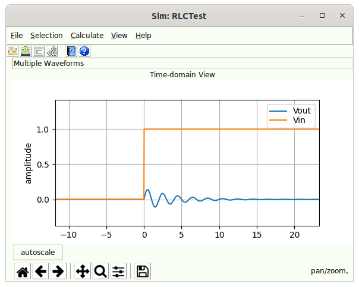

# Simulator Dialog {#sec:Simulator-Dialog}

The simulator dialog (which is really a waveform viewer dialog) appears under the following conditions:

- After [Simulating](08-Simulation.md#sub:Simulating) is invoked by either [Simulate](15-Main-Schematic-Dialog.md#Control-Help:Simulate) or [Calculate](15-Main-Schematic-Dialog.md#Control-Help:Calculate-Button) and the simulation completes properly in a [Simulation](08-Simulation.md#sec:Simulation) application.

- After [Virtual Probing](10-Virtual-Probing.md#sub:Virtual-Probing) is invoked by either a [Virtual Probe](15-Main-Schematic-Dialog.md#Control-Help:Virtual-Probe) or [Calculate](15-Main-Schematic-Dialog.md#Control-Help:Calculate-Button) and the calculation completes properly in a [Virtual Probing](10-Virtual-Probing.md#sec:Virtual-Probing) application.

- When viewing the [Waveform](28-Waveform.md#sec:Waveform) associated with a [Voltage Measure Probe](23-Built-in-Devices-Parts.md#device:Measure-Probe), [Current Source](23-Built-in-Devices-Parts.md#device:Current-Source) or [Voltage Source](23-Built-in-Devices-Parts.md#device:Voltage-Source) in a schematic through the [Edit Properties](15-Main-Schematic-Dialog.md#Control-Help:Edit-Properties) command.

When the simulated schematic contains one or more enabled statistical noise sources, the [Statistical Noise Dialog](31-Statistical-Noise-Dialog.md#sec:Statistical-Noise-Dialog) opens in addition to this dialog, showing the output noise spectral densities and measurements.

This dialog has a menu and toolbar with commands that handle:

- [Simulator File Menu](14-Simulator-Dialog.md#sub:Simulator-File-Menu)

- [Simulator Selection Menu](14-Simulator-Dialog.md#sub:Simulator-Selection-Menu)

- [Simulator Calculation Menu](14-Simulator-Dialog.md#sub:Simulator-Calculation-Menu)

- [Simulator View Menu](14-Simulator-Dialog.md#sub:Simulator-View-Menu)

- [Help](14-Simulator-Dialog.md#sub:Simulator-Help)

Along with context sensitive help.

The main part of the dialog is a MatPlotLib plot (see <http://matplotlib.org>) with control of panning and zooming. These controls come standard with MatPlotLib, the standard Python way of plotting things. The plots have a legend in the upper right containing the name of the waveform plot being displayed and indication of its color in the plot. The axis for the plots are amplitude in Volts on the y axis, time in ns on the x axis. The waveform(s) are scaled and aligned as appropropriate originally.

## Simulator File Menu {#sub:Simulator-File-Menu}

The File tasks are:

- [Save Waveforms](14-Simulator-Dialog.md#Control-Help:Save-Waveforms)

- [Read Waveforms](14-Simulator-Dialog.md#sub:Read-Waveforms)

- [Simulator output to LaTeX](14-Simulator-Dialog.md#Control-Help:Simulator-output-to-LaTeX)

Reading waveforms is not implemented

### Save Waveforms {#Control-Help:Save-Waveforms}

| *Dialog* | Simulator and Virtual Probe Dialog |
|:--:|:--:|
| *Menu System* | File Save |
| *Navigation* | Alt+F,S |
| *Key Binding* | None |
| *Toolbar* |  |
| *Availability* | Always |

Saves an output [Waveform](28-Waveform.md#sec:Waveform) from [Simulation](08-Simulation.md#sec:Simulation) and [Virtual Probing](10-Virtual-Probing.md#sec:Virtual-Probing).

### Read Waveforms {#sub:Read-Waveforms}

| *Dialog* | Simulator and Virtual Probe Dialog |
|:--:|:--:|
| *Menu System* | File Open |
| *Navigation* | Alt+F,R |
| *Key Binding* | None |
| *Toolbar* |  |
| *Availability* | Always |

This is currently disabled and not implemented.

### Open Help File {#Control-Help:Simulator-Open-Help-File}

Opens the help system in a browser.

### Control Help {#Control-Help:Simulator-Control-Help}

Provides context-sensitive help on a control. Select this and then click on a control in the dialog to open the help for that control.

### Preferences {#Control-Help:Simulator-Preferences}

Edit the preferences.

### Output to LaTeX (TikZ) {#Control-Help:Simulator-output-to-LaTeX}

|    *Dialog*    | Simulator and Virtual Probe Dialog |
|:--------------:|:----------------------------------:|
| *Menu System*  |    File Output to LaTeX (TikZ)     |
|  *Navigation*  |              Alt+F,L               |
| *Key Binding*  |                None                |
|   *Toolbar*    |                None                |
| *Availability* |               Always               |

This causes the current plot to be output in a graphical file format called [TikZ](https://www.ctan.org/pkg/pgf?lang=en) which is interpreted in TeX and LaTeX based documents (see [TeX Users Group (TUG)](https://tug.org/).

The TikZ file is directly importable into a LaTeX based document.

This will only be available if matplotlib2tikz is installed in your Python installation. See <https://github.com/nschloe/matplotlib2tikz>.

Because of differences between graphics drawing commands, the TikZ will vary slightly from the actual plot shown in ***SignalIntegrityApp***.

For .png or other rasterized graphics use the disk button on the plot toolbar.

## Simulator Selection Menu {#sub:Simulator-Selection-Menu}

The selection menu shows the selection tasks along with a list of all available waveforms. This is a tear-off menu and clicking in the dotted line area will cause this menu to be permanently displayed, which is useful for turning on and off waveform displays. Clicking on any waveform in the list of available waveforms causes them to turn on or off. The section tasks are:

- [Display All](14-Simulator-Dialog.md#Control-Help:Display-All) - selects all waveforms for displaying.

- [Display None](14-Simulator-Dialog.md#Control-Help:Display-None) - turns off display of all waveforms.

- [Toggle All](14-Simulator-Dialog.md#Control-Help:Toggle-Selections) - toggles all display states.

### Display All {#Control-Help:Display-All}

|    *Dialog*    | Simulator and Virtual Probe Dialog |
|:--------------:|:----------------------------------:|
| *Menu System*  |       Selection Display All        |
|  *Navigation*  |              Alt+S,A               |
| *Key Binding*  |                None                |
|   *Toolbar*    |                None                |
| *Availability* |               Always               |

Selects all available waveforms for display. Selecting [Display All](14-Simulator-Dialog.md#Control-Help:Display-All) causes all waveforms to be displayed and their selections checked in the [Simulator Selection Menu](14-Simulator-Dialog.md#sub:Simulator-Selection-Menu).

### Display None {#Control-Help:Display-None}

|    *Dialog*    | Simulator and Virtual Probe Dialog |
|:--------------:|:----------------------------------:|
| *Menu System*  |       Selection Display All        |
|  *Navigation*  |              Alt+S,N               |
| *Key Binding*  |                None                |
|   *Toolbar*    |                None                |
| *Availability* |               Always               |

Turns off all waveforms for display. Selecting [Display None](14-Simulator-Dialog.md#Control-Help:Display-None) causes all waveforms to be turned off and their selections unchecked in the [Simulator Selection Menu](14-Simulator-Dialog.md#sub:Simulator-Selection-Menu).

### Toggle All {#Control-Help:Toggle-Selections}

|    *Dialog*    | Simulator and Virtual Probe Dialog |
|:--------------:|:----------------------------------:|
| *Menu System*  |        Selection Toggle All        |
|  *Navigation*  |              Alt+S,T               |
| *Key Binding*  |                None                |
|   *Toolbar*    |                None                |
| *Availability* |               Always               |

Toggles the display state of all available waveforms. Selecting [Toggle All](14-Simulator-Dialog.md#Control-Help:Toggle-Selections) causes all waveforms that were previously checked to be unchecked, and all waveforms that were previously unchecked to be checked in [Simulator Selection Menu](14-Simulator-Dialog.md#sub:Simulator-Selection-Menu).

## Simulator Calculation Menu {#sub:Simulator-Calculation-Menu}

The Calculate tasks are:

- [Calculation Properties](15-Main-Schematic-Dialog.md#Control-Help:Calculation-Properties)

- [View Transfer Parameters](14-Simulator-Dialog.md#Control-Help:View-Transfer-Parameters)

- [Recalculate](14-Simulator-Dialog.md#Control-Help:Recalculate)

### View Transfer Parameters {#Control-Help:View-Transfer-Parameters}

|    *Dialog*    | Simulator and Virtual Probe Dialog |
|:--------------:|:----------------------------------:|
| *Menu System*  |   File View Transfer Parameters    |
|  *Navigation*  |              Alt+C,V               |
| *Key Binding*  |                None                |
|   *Toolbar*    |                None                |
| *Availability* |               Always               |

In [Virtual Probing](10-Virtual-Probing.md#sec:Virtual-Probing) and [Simulation](08-Simulation.md#sec:Simulation) applications, transfer parameters are created during the calculation. See [Simulation Example](08-Simulation.md#sub:Simulation-Example) or [Virtual Probing Example](10-Virtual-Probing.md#sub:Virtual-Probing-Example) for examples of this. These transfer parameters can be viewed in the [S-parameter Viewer](13-S-parameter-Viewer.md#sec:S-parameter-Viewer).

### Recalculate {#Control-Help:Recalculate}

| *Dialog* | [Simulator Dialog](14-Simulator-Dialog.md#sec:Simulator-Dialog) (simulation and virtual probing), and [Eye Diagram Dialog](16-Eye-Diagram-Dialog.md#sec:Eye-Diagram-Dialog) |
|:--:|:--:|
| *Menu System* | File Recalculate |
| *Navigation* | Alt+C,R |
| *Key Binding* | None |
| *Toolbar* | None |
| *Availability* | Always |

This recalculates the results of the [Simulation](08-Simulation.md#sec:Simulation) or [Virtual Probing](10-Virtual-Probing.md#sec:Virtual-Probing) application.

## Simulator View Menu {#sub:Simulator-View-Menu}

The [Simulator File Menu](14-Simulator-Dialog.md#sub:Simulator-File-Menu) defaults to showing simulation or virtual probing results in the time domain (i.e. with [View Time-domain](14-Simulator-Dialog.md#Control-Help:View-Time-domain) selected in the [Simulator View Menu](14-Simulator-Dialog.md#sub:Simulator-View-Menu)). However, the results can be viewed in the time or frequency domain depending on selection:

- [Show Grids](14-Simulator-Dialog.md#Control-Help:Show-Grids-1)

- [View Time-domain](14-Simulator-Dialog.md#Control-Help:View-Time-domain)

- [\[Control-Help:Sim-Log-Scale\]](14-Simulator-Dialog.md#Control-Help:Sim-Log-Scale){reference-type="ref" reference="Control-Help:Sim-Log-Scale"}

- [View Spectral Content](14-Simulator-Dialog.md#Control-Help:View-Spectral-Content)

- [View Spectral Density](14-Simulator-Dialog.md#Control-Help:View-Spectral-Density)

### Show Grids {#Control-Help:Show-Grids-1}

|    *Dialog*    |   Show Grids    |
|:--------------:|:---------------:|
| *Menu System*  | View Show Grids |
|  *Navigation*  |     Alt+V,G     |
| *Key Binding*  |      None       |
|   *Toolbar*    |      None       |
| *Availability* |     Always      |

Toggles the display of grids on the plots.

### View Time-domain {#Control-Help:View-Time-domain}

|    *Dialog*    | Simulator and Virtual Probe Dialog |
|:--------------:|:----------------------------------:|
| *Menu System*  |          View Time-domain          |
|  *Navigation*  |              Alt+V,T               |
| *Key Binding*  |                None                |
|   *Toolbar*    |                None                |
| *Availability* |               Always               |

Selects the mode of viewing waveforms as time domain. All simulation or virtual probe results are plotted in the time domain.

##### Log Frequency ScaleX“‘

|    *Dialog*    | Simulator and Virtual Probe Dialog |
|:--------------:|:----------------------------------:|
| *Menu System*  |      View Log Frequency Scale      |
|  *Navigation*  |              Alt+V,L               |
| *Key Binding*  |                None                |
|   *Toolbar*    |                None                |
| *Availability* |               Always               |

Sets the frequency axis to log for all frequency domain results.

### View Spectral Content {#Control-Help:View-Spectral-Content}

|    *Dialog*    | Simulator and Virtual Probe Dialog |
|:--------------:|:----------------------------------:|
| *Menu System*  |          View Time-domain          |
|  *Navigation*  |              Alt+V,C               |
| *Key Binding*  |                None                |
|   *Toolbar*    |                None                |
| *Availability* |               Always               |

Selects the mode of viewing waveforms as frequency content. All simulation or virtual probe results are plotted in the frequency domain.

### View Spectral Density {#Control-Help:View-Spectral-Density}

|    *Dialog*    | Simulator and Virtual Probe Dialog |
|:--------------:|:----------------------------------:|
| *Menu System*  |          View Time-domain          |
|  *Navigation*  |              Alt+V,D               |
| *Key Binding*  |                None                |
|   *Toolbar*    |                None                |
| *Availability* |               Always               |

Selects the mode of viewing waveforms as spectral density in the frequency domain. All simulation or virtual probe results are plotted as spectral density.

## Help {#sub:Simulator-Help}

The Help tasks are a category in the [Simulator Dialog](14-Simulator-Dialog.md#sec:Simulator-Dialog) for dealing with the help system:

- [Open Help File](14-Simulator-Dialog.md#Control-Help:Simulator-Open-Help-File) - opens the help system to the [Simulator Dialog](14-Simulator-Dialog.md#sec:Simulator-Dialog) page.

- [Control Help](14-Simulator-Dialog.md#Control-Help:Simulator-Control-Help) - for help on any menu elements or toolbar buttons.

- [Preferences](14-Simulator-Dialog.md#Control-Help:Simulator-Preferences) - for editing any sim\>\<654

\6S U\\

|    *Dialog*    | [Simulator Dialog](14-Simulator-Dialog.md#sec:Simulator-Dialog) |
|:--------------:|:-----------------------------------------:|
| *Menu System*  |  [Help](14-Simulator-Dialog.md#sub:Simulator-Help) Preferences  |
|  *Navigation*  |                  Alt+H,P                  |
| *Key Binding*  |                   None                    |
|   *Toolbar*    |                   None                    |
| *Availability* |                  Always                   |

Preferences allows editing of any of the various [Simulator Dialog Preferences](29-Preferences.md#sub:Simulator-Dialog-Preferences) for the application.

