# Main Schematic Dialog {#sec:Main-Schematic-Dialog}

When ***SignalIntegrityApp*** opens, the user sees a dialog with a menu bar, a toolbar, a canvas, and a status line. The menu bar, toolbar buttons and various key bindings enable certain tasks to be executed. The menu bar is broken into sections where appropriate. These are:

- [File](15-Main-Schematic-Dialog.md#sub:File) – tasks for dealing with the project file.

- [Edit](15-Main-Schematic-Dialog.md#sub:Edit) – tasks for undoing and redoing tasks in the schematic.

- [Parts](15-Main-Schematic-Dialog.md#sub:Parts) – tasks for dealing with schematic elements in the drawing.

- [Wires](15-Main-Schematic-Dialog.md#sub:Wires) – tasks for dealing with wires connecting schematic elements.

- [View](15-Main-Schematic-Dialog.md#sub:View) – tasks for controlling the view of the schematic.

- [Calculate](15-Main-Schematic-Dialog.md#sub:Calculate) – tasks for performing calculations on the schematic.

- [Variables](15-Main-Schematic-Dialog.md#sub:Variables) – tasks for dealing with schematic variables.

- [Help](15-Main-Schematic-Dialog.md#sub:Help) – tasks dealing with the help system.

## File {#sub:File}

File tasks are a category in the [Main Schematic Dialog](15-Main-Schematic-Dialog.md#sec:Main-Schematic-Dialog). They are broken into two basic areas:

- Dealing with the project file.

- Exporting netlists and pictures of the drawing.

- [Archive Project](15-Main-Schematic-Dialog.md#Control-Help:Archive) the project.

The File tasks are:

- [Open Recent File](15-Main-Schematic-Dialog.md#Control-Help:Open-Recent-File)

- [New Project](15-Main-Schematic-Dialog.md#Control-Help:New-Project)

- [Open Project](15-Main-Schematic-Dialog.md#Control-Help:Open-Project)

- [Save Project](15-Main-Schematic-Dialog.md#Control-Help:Save-Project)

- [Save Project As…](15-Main-Schematic-Dialog.md#Control-Help:Save-As-Project)

- [Clear Schematic](15-Main-Schematic-Dialog.md#Control-Help:Clear-Schematic)

- [Export Netlist](15-Main-Schematic-Dialog.md#Control-Help:Export-Netlist)

- [Export LaTeX](15-Main-Schematic-Dialog.md#Control-Help:Export-LaTeX)

- [Archive Project](15-Main-Schematic-Dialog.md#Control-Help:Archive)

- [Extract Archived Project](15-Main-Schematic-Dialog.md#Control-Help:Extract-Archive)

- [Freshen Archived Project](15-Main-Schematic-Dialog.md#Control-Help:Freshen-Archive)

- [Unextract Archived Project](15-Main-Schematic-Dialog.md#Control-Help:Unextract-Archive)

### Open Recent File {#Control-Help:Open-Recent-File}

| *Dialog* | [Main Schematic Dialog](15-Main-Schematic-Dialog.md#sec:Main-Schematic-Dialog) |
|:--:|:--:|
| *Menu System* | [File](15-Main-Schematic-Dialog.md#sub:File) Open Recent Project |
| *Navigation* | Alt+F,R |
| *Key Binding* | None |
| *Toolbar* | None |
| *Availability* | based on preference ([ProjectFiles.RetainLastFilesOpened](29-Preferences.md#sub:RetainLastFilesOpened)) |

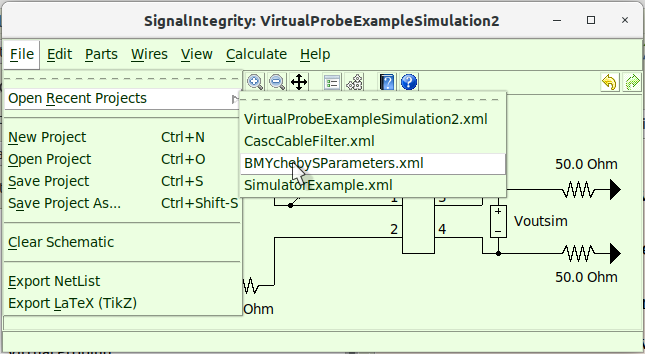

This allows recently opened files to be selected easily, without having to navigate to them, with the assumption that the recent files are the most likely to be used.

The availability of the last four files depends on the preference to retain the last files opened ([ProjectFiles.RetainLastFilesOpened](29-Preferences.md#sub:RetainLastFilesOpened)).

### New Project {#Control-Help:New-Project}

| *Dialog* | [Main Schematic Dialog](15-Main-Schematic-Dialog.md#sec:Main-Schematic-Dialog) |
|:--:|:--:|
| *Menu System* | [File](15-Main-Schematic-Dialog.md#sub:File) New Project |
| *Navigation* | Alt+F,N |
| *Key Binding* | Ctrl+N |
| *Toolbar* |  |
| *Availability* | Always |

A request to create a new project brings up a file dialog so you can choose the file you want to create.

This will clear the current schematic and an empty project file is created. This can be undone using [Undo](15-Main-Schematic-Dialog.md#Control-Help:Undo).

A dialog will ask you for the file name. If an existing file is selected, that file will be overwritten and cleared.

No matter the file name you use, it will have the extension .xml placed on it.

### Open Project {#Control-Help:Open-Project}

| *Dialog* | [Main Schematic Dialog](15-Main-Schematic-Dialog.md#sec:Main-Schematic-Dialog) |
|:--:|:--:|
| *Menu System* | [File](15-Main-Schematic-Dialog.md#sub:File) Open Project |
| *Navigation* | Alt+F,O |
| *Key Binding* | Ctrl+O |
| *Toolbar* |  |
| *Availability* | Always |

A request to open a project brings up a file dialog so you can choose the file you want to work with.

It only accepts files with the .xml extension and the file must have been previously generated with ***SignalIntegrityApp***.

It clears the current project, but this can be undone using [Undo](15-Main-Schematic-Dialog.md#Control-Help:Undo).

### Save Project {#Control-Help:Save-Project}

| *Dialog* | [Main Schematic Dialog](15-Main-Schematic-Dialog.md#sec:Main-Schematic-Dialog) |
|:--:|:--:|
| *Menu System* | [File](15-Main-Schematic-Dialog.md#sub:File) Save Project |
| *Navigation* | Alt+F,S |
| *Key Binding* | Ctrl+S |
| *Toolbar* |  |
| *Availability* | When the project is not empty |

This saves the project to the disk with the current file name of the project in use.

It overwrites the existing file.

### Save Project As… {#Control-Help:Save-As-Project}

|    *Dialog*    | [Main Schematic Dialog](15-Main-Schematic-Dialog.md#sec:Main-Schematic-Dialog) |
|:--------------:|:---------------------------------------------------:|
| *Menu System*  |        [File](15-Main-Schematic-Dialog.md#sub:File) Save Project As...         |
|  *Navigation*  |                       Alt+F,A                       |
| *Key Binding*  |                    Ctrl+Shift-S                     |
|   *Toolbar*    |                        None                         |
| *Availability* |            When the project is not empty            |

This prompts for a filename to save to.

The default file name is the current project file in use.

A dialog will ask you for the file name. If an existing file is selected, that file will be overwritten with the new one.

No matter the file name you use, it will have the extension .xml placed on it.

### Clear Schematic {#Control-Help:Clear-Schematic}

| *Dialog* | [Main Schematic Dialog](15-Main-Schematic-Dialog.md#sec:Main-Schematic-Dialog) |
|:--:|:--:|
| *Menu System* | [File](15-Main-Schematic-Dialog.md#sub:File) Clear Schematic |
| *Navigation* | Alt+F,C |
| *Key Binding* | None |
| *Toolbar* |  |
| *Availability* | When the project is not empty |

It clears the current project, but this can be undone using [Undo](15-Main-Schematic-Dialog.md#Control-Help:Undo)

### Export Netlist {#Control-Help:Export-Netlist}

|    *Dialog*    | [Main Schematic Dialog](15-Main-Schematic-Dialog.md#sec:Main-Schematic-Dialog) |
|:--------------:|:---------------------------------------------------:|
| *Menu System*  |          [File](15-Main-Schematic-Dialog.md#sub:File) Export Netlist           |
|  *Navigation*  |                       Alt+F,N                       |
| *Key Binding*  |                        None                         |
|   *Toolbar*    |                        None                         |
| *Availability* |            When the project is not empty            |

During all of the calculations, a text-based net list is created that is passed to the ***SignalIntegrity*** toolbox software.

The format of this net list is described in the accompanying book but somewhat under [Netlist](24-Netlist.md#sec:Netlist).

Usually, you don’t need to look at or save this net list, but examining it is helpful sometimes for debugging problems and saving it allows the schematic to be be utilized within customized Python based user applications that rely on the ***SignalIntegrity*** toolbox, but do not rely on the ***SignalIntegrityApp*** application.

Invoking this command causes the netlist to be generated that would be the same for any calculation and shown. For example, for this type of schematic:

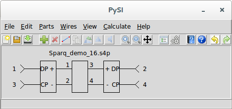

We would have a net list that looked like this:

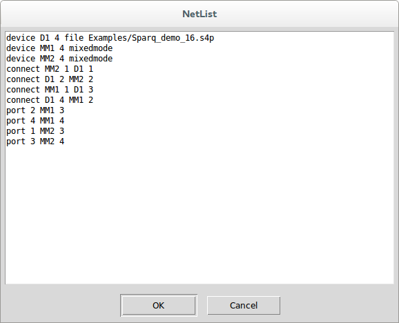

Pressing OK prompts you for a text file to save it to. Pressing Cancel or escape leaves without saving the file.

### Export LaTeX (TikZ) {#Control-Help:Export-LaTeX}

|    *Dialog*    | [Main Schematic Dialog](15-Main-Schematic-Dialog.md#sec:Main-Schematic-Dialog) |
|:--------------:|:---------------------------------------------------:|
| *Menu System*  |        [File](15-Main-Schematic-Dialog.md#sub:File) Export LaTeX (TikZ)        |
|  *Navigation*  |                       Alt+F,L                       |
| *Key Binding*  |                        None                         |
|   *Toolbar*    |                        None                         |
| *Availability* |            When the project is not empty            |

This causes the current schematic to be output in a graphical file format called [TikZ](https://www.ctan.org/pkg/pgf?lang=en) which is interpreted in TeX and LaTeX based documents (see [TeX Users Group (TUG)](https://tug.org/).

While the TikZ file is directly importable into a LaTeX based document, it is difficult to edit. Fortunately a (old) free tool exists called [TpX](http://tpx.sourceforge.net/) for creating graphics. The file format of a TpX file is actual TikZ code for the drawing with the TpX drawing information *commented out*. Thus, a TpX file is directly importable into a LaTeX based document and only the TikZ code is interpreted. ***SignalIntegrityApp*** outputs the schematic this way, in TpX format so you can either directly import the schematic into a LaTeX based document, or if you install TpX, you can actually edit the schematic and save it as TikZ again.

Because of differences between graphics drawing commands, the TpX and TikZ will vary slightly from the actual schematic shown in ***SignalIntegrityApp***.

In the future, a .png or some other rasterized graphics version should be created, but believe it or not, this is more difficult. For now, you’re left with the screen capture methods built into the operating system to get this.

### Archive Project {#Control-Help:Archive}

|    *Dialog*    | [Main Schematic Dialog](15-Main-Schematic-Dialog.md#sec:Main-Schematic-Dialog) |
|:--------------:|:---------------------------------------------------:|
| *Menu System*  |          [File](15-Main-Schematic-Dialog.md#sub:File) Archive Project          |
|  *Navigation*  |                       Alt+F,V                       |
| *Key Binding*  |                        None                         |
|   *Toolbar*    |                        None                         |
| *Availability* |            When the project is not empty            |

Archiving a project takes the project file and all files referenced by it, either directly or indirectly and creates a zipped file containing all of these files. Furthermore, all of the project files that are moved to the archive will have their file references modified so that when the archive is extracted, the file references point to the correct location in the extracted archive.

An example is shown below that highlights how this works. First, let’s examine the directory structure prior to archiving. Here, the project to archive is called Project.si and it is located in the DirBBB directory. Project.si references two files: the project file bbb.si in the DirDDD directory below and aaa.trc located in the DirCCC directory. The project file bbb.si further references the file ccc.s2p located in the DirBBB directory above.

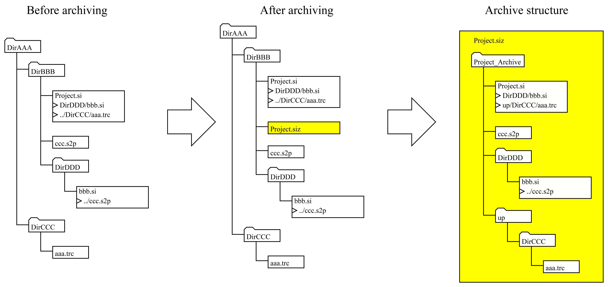

After archiving, an archive file is created using the name of the project with the file extension .siz. The file is actually a zip file. Many file systems recognize it as a zip file, and if you wanted, you could change the extension to .zip. The .siz extension tells SignalIntegrity that it is a special type of zip file with a certain directory structure:

- The top directory is the name of the archive file with ’\_Archive’ appended to it.

- Inside the top directory will be found the project file with the same name as the archive.

Note that the archive structure did something special with the DirCCC directory. Because it’s relative path involved a path above the project file, it creates directories named ’up’ for every directory needed above the project file, and it appears in the archive below the archive directory.

After archiving, an information box is presented showing the exact location of the archive:

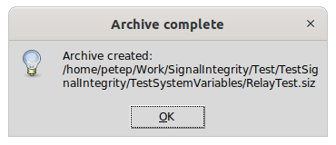

When extracted (see [Extract Archived Project](15-Main-Schematic-Dialog.md#Control-Help:Extract-Archive)), the exact directory structure will be created alongside the archive file.

### Extract Archived Project {#Control-Help:Extract-Archive}

|    *Dialog*    | [Main Schematic Dialog](15-Main-Schematic-Dialog.md#sec:Main-Schematic-Dialog) |
|:--------------:|:---------------------------------------------------:|
| *Menu System*  |     [File](15-Main-Schematic-Dialog.md#sub:File) Extract Archived Project      |
|  *Navigation*  |                       Alt+F,X                       |
| *Key Binding*  |                        None                         |
|   *Toolbar*    |                        None                         |
| *Availability* |            When the project is not empty            |

This command extracts an archived project. Executing this causes a browser to open allowing you to browse to the desired archive file.

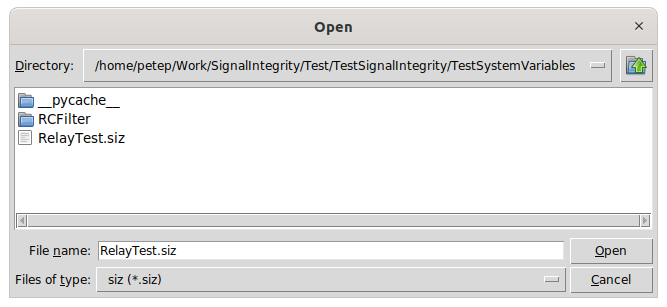

The following picture shows the result of extracting an archive:

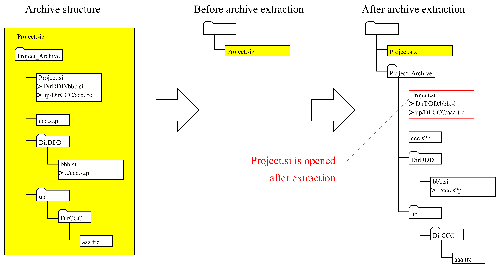

On the left is shown an archive structure that was used as an example for archiving (see [Archive Project](15-Main-Schematic-Dialog.md#Control-Help:Archive)) and the file is shown before extraction. After extraction, the directory structure in the archive file is dropped at the same location of the archive file and the project file inside of the archive is opened.

Note that when a project is opened that is underneath a directory of the same name, with the suffix ’\_Archive’, it is considered in an archive, which is shown in the title of the project.

### Freshen Archived Project {#Control-Help:Freshen-Archive}

|    *Dialog*    |    [Main Schematic Dialog](15-Main-Schematic-Dialog.md#sec:Main-Schematic-Dialog)    |
|:--------------:|:---------------------------------------------------------:|
| *Menu System*  |        [File](15-Main-Schematic-Dialog.md#sub:File) Freshen Archived Project         |
|  *Navigation*  |                          Alt+F,F                          |
| *Key Binding*  |                           None                            |
|   *Toolbar*    |                           None                            |
| *Availability* | When the open project is in a directory below its archive |

When a project is open whereby the directory location of the project is the project name with the suffix ’\_Archive’ appended, the project is considered in an archive. This is usually the result of performing an [Extract Archived Project](15-Main-Schematic-Dialog.md#Control-Help:Extract-Archive) previously, on an archive file with the same name as the current project with the extension .siz.

After extraction, the archive might be adjusted by dragging some new files in, or producing some results that you want to keep with the archive.

Freshening the archive takes the entire directory structure including all files at and below the current project and places this in an archive file above the current directory, replacing the .siz file that might exist there and that was presumably used for extraction.

Note that the entire archive is completely replaced by these contents. This is shown graphically below:

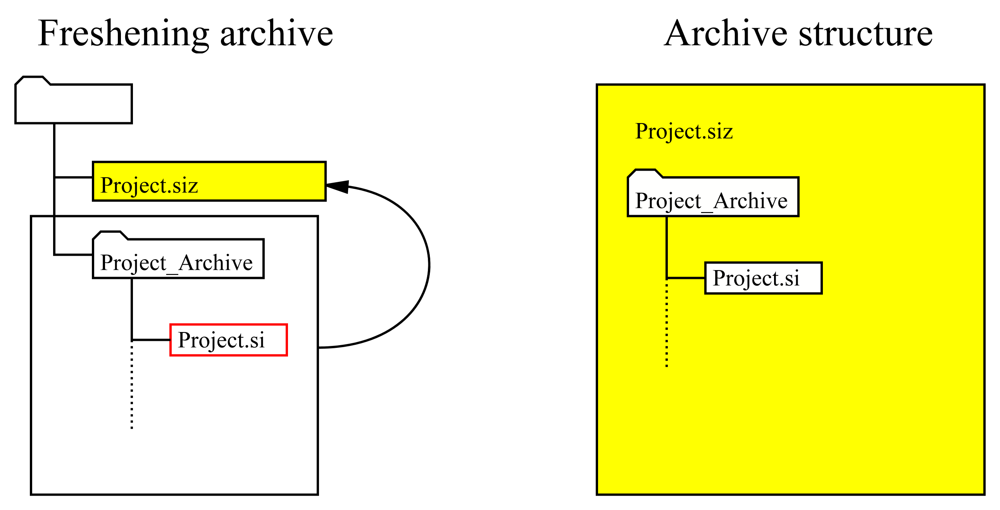

### Unextract Archived Project {#Control-Help:Unextract-Archive}

|    *Dialog*    |    [Main Schematic Dialog](15-Main-Schematic-Dialog.md#sec:Main-Schematic-Dialog)    |
|:--------------:|:---------------------------------------------------------:|
| *Menu System*  |       [File](15-Main-Schematic-Dialog.md#sub:File) Unextract Archived Project        |
|  *Navigation*  |                          Alt+F,U                          |
| *Key Binding*  |                           None                            |
|   *Toolbar*    |                           None                            |
| *Availability* | When the open project is in a directory below its archive |

When a project is open underneath a directory of the same name with ’\_Archive’ appended, it is presumed to be in an archive. Usually, in this case, there is an archive file above this directory of the same name, with the .siz extension.

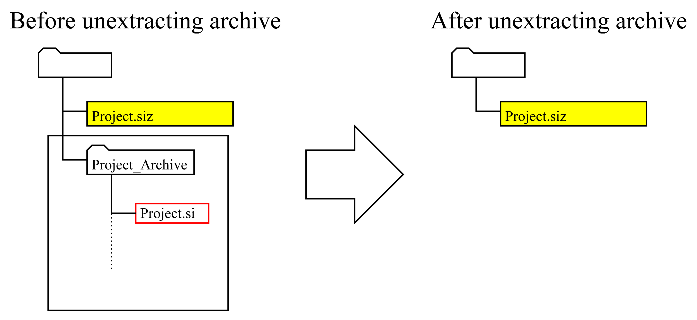

Unextracting the archive deletes the project file and the entire directory structure at and below the project file. Usually, this is performed after a [Freshen Archived Project](15-Main-Schematic-Dialog.md#Control-Help:Freshen-Archive) operation. It is a dangerous operation.

## Edit {#sub:Edit}

The Edit tasks are a category in the [Main Schematic Dialog](15-Main-Schematic-Dialog.md#sec:Main-Schematic-Dialog) and are broken into two sections, one involving undo and redo of schematic edits and the other dealing with multiple selections:

- [Undo](15-Main-Schematic-Dialog.md#Control-Help:Undo)

- [Redo](15-Main-Schematic-Dialog.md#Control-Help:Redo)

and:

- [Delete Selected](15-Main-Schematic-Dialog.md#Control-Help:Delete-Selected)

- [Duplicate Selected](15-Main-Schematic-Dialog.md#Control-Help:Duplicate-Selected)

- [Cut Selected](15-Main-Schematic-Dialog.md#Control-Help:Cut-Selected)

The undo and redo tasks depend on the [History Buffer](15-Main-Schematic-Dialog.md#sub:History-Buffer) which records the state of the schematic at various events.

### History Buffer {#sub:History-Buffer}

The ***SignalIntegrityApp*** maintains a buffer containing the history of changes made to the project since the application started.

Currently it records the last 100 changes.

Each change is labelled, so as a change is undid and redid, the name of the event that is undid is displayed in the status message area.

### Undo {#Control-Help:Undo}

| *Dialog* | [Main Schematic Dialog](15-Main-Schematic-Dialog.md#sec:Main-Schematic-Dialog) |
|:--:|:--:|
| *Menu System* | [Edit](15-Main-Schematic-Dialog.md#sub:Edit) Undo |
| *Navigation* | Alt+E,U |
| *Key Binding* | Ctrl+Z |
| *Toolbar* |  |
| *Availability* | When there is something to undo in the history buffer |

This undoes whatever has been done since the last event stored in the [History Buffer](15-Main-Schematic-Dialog.md#sub:History-Buffer).

It is available whenever something has been done since the last event, otherwise it is disabled.

The event that is undone is shown in the status message area.

Whenever something gets undone, [Redo](15-Main-Schematic-Dialog.md#Control-Help:Redo) becomes available.

### Redo {#Control-Help:Redo}

| *Dialog* | [Main Schematic Dialog](15-Main-Schematic-Dialog.md#sec:Main-Schematic-Dialog) |
|:--:|:--:|
| *Menu System* | [Edit](15-Main-Schematic-Dialog.md#sub:Edit) Redo |
| *Navigation* | Alt+E,R |
| *Key Binding* | Ctrl+Shift+Z |
| *Toolbar* |  |
| *Availability* | When there is something that can be redone in the history buffer |

This redoes the last undo.

This is available whenever an [Undo](15-Main-Schematic-Dialog.md#Control-Help:Undo) was issued.

It becomes unavailable whenever a change occurs that causes an event to store the state in the [History Buffer](15-Main-Schematic-Dialog.md#sub:History-Buffer).

In other words, if you undo something or many things and then make a change to the schematic, the redo becomes unavailable.

### Delete Selected {#Control-Help:Delete-Selected}

| *Dialog* | [Main Schematic Dialog](15-Main-Schematic-Dialog.md#sec:Main-Schematic-Dialog) |
|:--:|:--:|
| *Menu System* | [Edit](15-Main-Schematic-Dialog.md#sub:Edit) Delete Selected |
| *Navigation* | Alt+E,D |
| *Key Binding* | Delete |
| *Toolbar* |  |
| *Availability* | When one or more drawing element is selected |

This command is available whenever a device is selected, a wire is selected, or if multiple items are selected. Which of these states is shown in the status message area.

The items selected to be deleted are shown as blue items in the schematic.

This command is also available by right clicking while multiple devices are selected through a context sensitive menu.

### Duplicate Selected {#Control-Help:Duplicate-Selected}

| *Dialog* | [Main Schematic Dialog](15-Main-Schematic-Dialog.md#sec:Main-Schematic-Dialog) |
|:--:|:--:|
| *Menu System* | [Edit](15-Main-Schematic-Dialog.md#sub:Edit) Duplicate Selected |
| *Navigation* | Alt+E,U |
| *Key Binding* | Ctrl+C |
| *Toolbar* |  |
| *Availability* | When one or more drawing element is selected |

This command is available whenever a device is selected, a wire is selected, or if multiple items are selected. Which of these states is shown in the status message area.

The items selected to be duplicated are shown as blue items in the schematic.

When invoked, the selections are copied to memory and the mouse cursor changes to a finger indicating that the new copied parts will be placed where the finger points on the next mouse click.

When the new parts are placed, all of the reference designators are updated to be unique names based on the default designator rules for the part.

This command is also available by right clicking while multiple devices are selected through a context sensitive menu.

### Cut Selected {#Control-Help:Cut-Selected}

|    *Dialog*    | [Main Schematic Dialog](15-Main-Schematic-Dialog.md#sec:Main-Schematic-Dialog) |
|:--------------:|:---------------------------------------------------:|
| *Menu System*  |           [Edit](15-Main-Schematic-Dialog.md#sub:Edit) Cut Selected            |
|  *Navigation*  |                       Alt+E,C                       |
| *Key Binding*  |                       Ctrl+X                        |
|   *Toolbar*    |                        None                         |
| *Availability* |    When one or more drawing element is selected     |

This command is available whenever a device is selected, a wire is selected, or if multiple items are selected. Which of these states is shown in the status message area.

The items selected to be cut are shown as blue items in the schematic.

When invoked, the selections are copied to memory and removed from the schematic and the mouse cursor changes to a finger indicating that the new copied parts will be placed where the finger points on the next mouse click.

This command is also available by right clicking while multiple devices are selected through a context sensitive menu.

## Parts {#sub:Parts}

The Parts tasks are a category in the [Main Schematic Dialog](15-Main-Schematic-Dialog.md#sec:Main-Schematic-Dialog) for adding all elements of the schematic (except the connection [Wires](15-Main-Schematic-Dialog.md#sub:Wires)). All elements of the schematic are parts, but some parts are special and can be added more easily through menu commands:

- [Add Part](15-Main-Schematic-Dialog.md#Control-Help:Add-Part) – Adds any part to the schematic. These parts are cataloged in [Built-in Devices (Parts)](23-Built-in-Devices-Parts.md#sec:Built-in-Devices).

- [Add Net Name](15-Main-Schematic-Dialog.md#Control-Help:Add-Net-Name) – Adds a [Net Name](23-Built-in-Devices-Parts.md#device:Net-Name) to the schematic.

The remaining add tasks are for adding special parts used for specific applications:

- [Add Port](15-Main-Schematic-Dialog.md#Control-Help:Add-Port) - Adds a [Port](23-Built-in-Devices-Parts.md#device:Port). (used for [S-Parameter Generation](07-S-Parameter-Generation.md#sec:S-parameter-Generation) and [Deembedding](09-Deembedding.md#sec:Deembedding))

- [Add Output Probe](15-Main-Schematic-Dialog.md#Control-Help:Add-Output-Probe) - Adds an [Voltage Output Probe](23-Built-in-Devices-Parts.md#device:Output-Probe). (used for [Simulation](08-Simulation.md#sec:Simulation) and [Virtual Probing](10-Virtual-Probing.md#sec:Virtual-Probing))

- [Add Measure Probe](15-Main-Schematic-Dialog.md#Control-Help:Add-Measure-Probe) - Adds a [Voltage Measure Probe](23-Built-in-Devices-Parts.md#device:Measure-Probe). (used only for [Virtual Probing](10-Virtual-Probing.md#sec:Virtual-Probing))

- [Add Stim](15-Main-Schematic-Dialog.md#Control-Help:Add-Stim) - Adds a [Stim](23-Built-in-Devices-Parts.md#device:Stim). (used only for [Virtual Probing](10-Virtual-Probing.md#sec:Virtual-Probing))

- [Add Unknown](15-Main-Schematic-Dialog.md#Control-Help:Add-Unknown) - Adds a device whose s-parameters are unknown. (used only for [Deembedding](09-Deembedding.md#sec:Deembedding))

- [Add System](15-Main-Schematic-Dialog.md#Control-Help:Add-System) - Adds a device that represents the s-parameters of a system. (used only for [Deembedding](09-Deembedding.md#sec:Deembedding))

If a part is selected, the following tasks are also possible:

- [Delete Part](15-Main-Schematic-Dialog.md#Control-Help:Delete-Part)

- [Edit Properties](15-Main-Schematic-Dialog.md#Control-Help:Edit-Properties)

- [Duplicate Part](15-Main-Schematic-Dialog.md#Control-Help:Duplicate-Part)

- [Rotate Part](15-Main-Schematic-Dialog.md#Control-Help:Rotate-Part)

- [Flip Horizontally](15-Main-Schematic-Dialog.md#Control-Help:Flip-Horizontally)

- [Flip Vertically](15-Main-Schematic-Dialog.md#Control-Help:Flip-Vertically)

### Add Part {#Control-Help:Add-Part}

| *Dialog* | [Main Schematic Dialog](15-Main-Schematic-Dialog.md#sec:Main-Schematic-Dialog) |
|:--:|:--:|
| *Menu System* | [Parts](15-Main-Schematic-Dialog.md#sub:Parts) Add Part |
| *Navigation* | Alt+P,A |
| *Key Binding* | None |
| *Toolbar* |  |
| *Availability* | Always |

This adds one of the [Built-in Devices (Parts)](23-Built-in-Devices-Parts.md#sec:Built-in-Devices) to the schematic.

The most useful and generic type of part for s-parameter files is the [File](23-Built-in-Devices-Parts.md#device:File) part.

When you add a part, you first see the part picker, which lists all of the part categories:

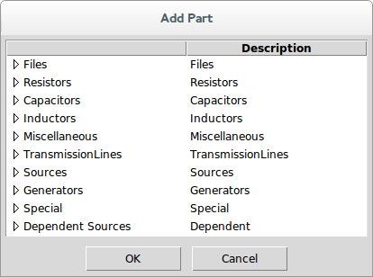

By selecting a part category, you find the parts listed in that category:

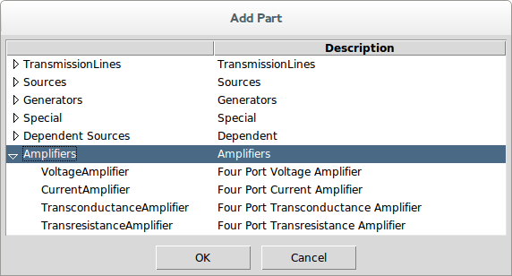

You select a part and press OK to bring up the part properties dialog:

In the part properties dialog, you see the part properties at the top, followed by the part orientation settings, followed by a picture of the part as it will be shown in the schematic.

The part properties are shown with two checkboxes, followed by a label, followed by the value. When first opened for a part, the default values are shown.

The first checkbox determines whether the property is to be shown in the schematic.

The second checkbox determines whether the keyword for the property is displayed (unchecking this box just shows the value).

The value is modified by clicking inside the white area where the property value is shown. Note that all property values that are numbers are shown in engineering notation (i.e. a number with a suffix indicating the exponent). ***SignalIntegrityApp*** never uses scientific notation or anything like that. Also, if the number has units, the units are shown.

To change the value, you can either click once or double-click inside the value entry box. When you click once, the cursor is placed at the location clicked and you can edit the value that is already there. If you double-click, the entry is cleared and you can enter an entirely new value.

The units never need to be entered (but can be).

Numbers can be entered with exponents or with the engineering notation suffix. For example, 100 Mohm can be entered as 100 Mohm, 100 M, 100M, 100e6, or 10e7.

The reference designator is entered by ***SignalIntegrityApp*** and is always unique at the time of entry. In that sense, it does not need to be modified or viewed in the schematic.

The orientation of a part can be altered through rotation and mirroring. The rotation shown is always for a rotation in the counter-clockwise direction, but usually one just presses the toggle button until it looks right. Mirroring vertically or horizontally is accomplished by checking the boxes.

You have no control over the exact placement of the text displayed with each part. It is placed justified properly depending on the orientation.

For many parts, there are alternate part pictures available. These are chosen by simply clicking inside the the part picture area of the dialog. For example, for the voltage amplifier shown, there is an alternate picture that has the voltage reference reversed at the input. Clicking in the part picture changes the picture to the following:

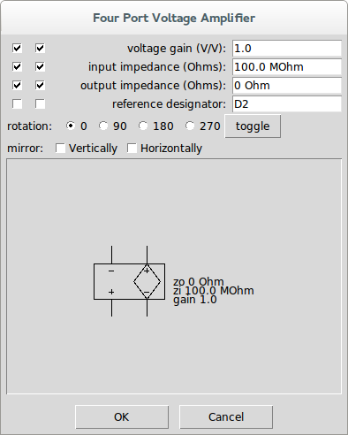

After you are satisfied with all of the part property settings and the orientation, press okay. The part properties dialog disappears and, when hovered over the canvas, you will see that your mouse cursor has now changed to a finger to indicate that the part can now be placed. left-clicking now has the part shown and selected:

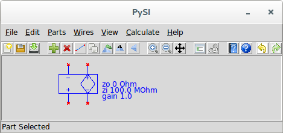

Keeping the button pressed, the part remains selected and can be precisely placed.

Note that until a part is connected, you will see red x’s wherever the unconnected pins are on the device.

To change the part properties after the part has been placed, simply double-click on the part to bring up the part properties, or select the device and use the [Edit Properties](15-Main-Schematic-Dialog.md#Control-Help:Edit-Properties) command.

If at any time in the process of adding a part, you press the Cancel button (or \<escape\>), the part addition is aborted and you return to the schematic with no new part added.

### Add Net Name {#Control-Help:Add-Net-Name}

|    *Dialog*    | [Main Schematic Dialog](15-Main-Schematic-Dialog.md#sec:Main-Schematic-Dialog) |
|:--------------:|:---------------------------------------------------:|
| *Menu System*  |          [Parts](15-Main-Schematic-Dialog.md#sub:Parts) Add Net Name           |
|  *Navigation*  |                       Alt+P,N                       |
| *Key Binding*  |                        None                         |
|   *Toolbar*    |                        None                         |
| *Availability* |                       Always                        |

This command is used to add net names to a schematic. See [Net Name](23-Built-in-Devices-Parts.md#device:Net-Name).

### Add Port {#Control-Help:Add-Port}

|    *Dialog*    | [Main Schematic Dialog](15-Main-Schematic-Dialog.md#sec:Main-Schematic-Dialog) |
|:--------------:|:---------------------------------------------------:|
| *Menu System*  |            [Parts](15-Main-Schematic-Dialog.md#sub:Parts) Add Port             |
|  *Navigation*  |                       Alt+P,R                       |
| *Key Binding*  |                        None                         |
|   *Toolbar*    |                        None                         |
| *Availability* |                       Always                        |

This command is used to add ports to a schematic.

A [Port](23-Built-in-Devices-Parts.md#device:Port) is only added to schematics intended for [S-Parameter Generation](07-S-Parameter-Generation.md#sec:S-parameter-Generation) or for [Deembedding](09-Deembedding.md#sec:Deembedding) applications.

See [Attaching Ports to a Schematic for S-parameter Calculation](07-S-Parameter-Generation.md#sub:Attaching-Ports-to-a-Schematic) for s-parameter calculation applications.

See [Attaching Ports to a Schematic for Deembedding](09-Deembedding.md#sub:Attaching-Ports-to-a-Schematic-for-Deembedding) for deembedding applications.

This command is a shortcut which is the same as invoking [Add Part](15-Main-Schematic-Dialog.md#Control-Help:Add-Part) and selecting Port from the Special parts category.

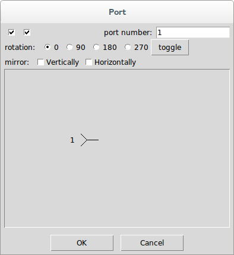

On this dialog, you see the only property, the port number, the orientation settings for the port, and a picture of the port element.

The port part property are shown with two checkboxes, followed by a label, followed by the port number. The port number is filled in by default as the lowest port number not already in the schematic.

The first checkbox determines whether the port number should be shown in the schematic.

The second checkbox is superfluous for ports. For part properties it determines whether the keyword for the property should be shown, but a port number does not have a keyword, just the number.

The port number is modified by clicking inside the white area where the port number value is shown.

To change the value, you can either click once or double-click inside the value entry box. When you click once, the cursor is placed at the location clicked and you can edit the port number that is already there. If you double-click, the entry is cleared and you can enter an entirely new port number.

keep in mind that when you have completed drawing your schematic, the port number values must be numbered from 1 to however many ports are present with no gaps in the numbers. Otherwise you will get an error when you go to calculate.

When you are satisfied with the port number and orientation, press OK.

The part properties dialog disappears and, when hovered over the canvas, you will see that your mouse cursor has now changed to a finger to indicate that the port can now be placed. left-clicking now has the port shown and selected:

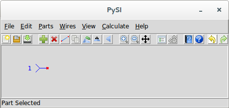

Keeping the button pressed, the port remains selected and can be precisely placed.

Note that until a port is connected, you will see a red x at the port connection point.

To change the port number after the port has been placed, simply double-click on the part to bring up the part properties, or select the port and use the [Edit Properties](15-Main-Schematic-Dialog.md#Control-Help:Edit-Properties) command.

If at any time in the process of adding a port, you press the Cancel button (or \<escape\>), the port addition is aborted and you return to the schematic with no new port added.

### Add Output Probe {#Control-Help:Add-Output-Probe}

|    *Dialog*    | [Main Schematic Dialog](15-Main-Schematic-Dialog.md#sec:Main-Schematic-Dialog) |
|:--------------:|:---------------------------------------------------:|
| *Menu System*  |        [Parts](15-Main-Schematic-Dialog.md#sub:Parts) Add Output Probe         |
|  *Navigation*  |                       Alt+P,O                       |
| *Key Binding*  |                        None                         |
|   *Toolbar*    |                        None                         |
| *Availability* |                       Always                        |

This adds an [Voltage Output Probe](23-Built-in-Devices-Parts.md#device:Output-Probe) to the schematic.

It is used for [Simulation](08-Simulation.md#sec:Simulation) and [Virtual Probing](10-Virtual-Probing.md#sec:Virtual-Probing) applications.

See [Output Probes for Simulation](08-Simulation.md#sub:Output-Probes-for-Simulation) or [Output Probes for Virtual Probing](10-Virtual-Probing.md#sub:Output-Probes-for-Virtual-Probing).

This command is a shortcut which is the same as invoking [Add Part](15-Main-Schematic-Dialog.md#Control-Help:Add-Part) and selecting Output from the Special parts category.

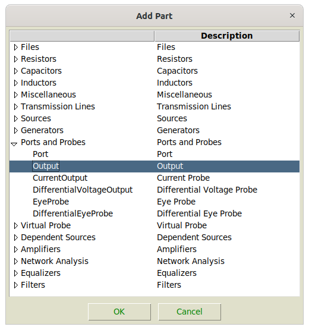

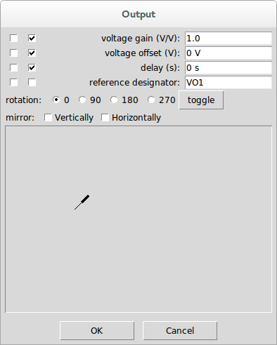

The output probe part has one port that can be connected to a wire or device port to select a voltage [Waveform](28-Waveform.md#sec:Waveform) to be output during a [Simulation](08-Simulation.md#sec:Simulation) or [Virtual Probing](10-Virtual-Probing.md#sec:Virtual-Probing).

### Add Measure Probe {#Control-Help:Add-Measure-Probe}

|    *Dialog*    | [Main Schematic Dialog](15-Main-Schematic-Dialog.md#sec:Main-Schematic-Dialog) |
|:--------------:|:---------------------------------------------------:|
| *Menu System*  |        [Parts](15-Main-Schematic-Dialog.md#sub:Parts) Add Measure Probe        |
|  *Navigation*  |                       Alt+P,M                       |
| *Key Binding*  |                        None                         |
|   *Toolbar*    |                        None                         |
| *Availability* |                       Always                        |

This adds an [Voltage Measure Probe](23-Built-in-Devices-Parts.md#device:Measure-Probe) to the schematic.

It is used only for [Virtual Probing](10-Virtual-Probing.md#sec:Virtual-Probing) applications.

See [Measure Probes](10-Virtual-Probing.md#sub:Measure-Probes).

This command is a shortcut which is the same as invoking [Add Part](15-Main-Schematic-Dialog.md#Control-Help:Add-Part) and selecting Measure from the Special parts category.

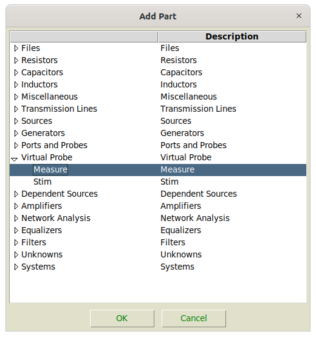

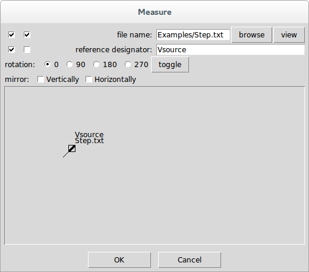

The measure probe part has one port that can be connected to a wire or device port to specify a measured [Waveform](28-Waveform.md#sec:Waveform) to be supplied during or [Virtual Probing](10-Virtual-Probing.md#sec:Virtual-Probing) calculation.

### Add Stim {#Control-Help:Add-Stim}

|    *Dialog*    | [Main Schematic Dialog](15-Main-Schematic-Dialog.md#sec:Main-Schematic-Dialog) |
|:--------------:|:---------------------------------------------------:|
| *Menu System*  |            [Parts](15-Main-Schematic-Dialog.md#sub:Parts) Add Stim             |
|  *Navigation*  |                       Alt+P,T                       |
| *Key Binding*  |                        None                         |
|   *Toolbar*    |                        None                         |
| *Availability* |                       Always                        |

This adds a [Stim](23-Built-in-Devices-Parts.md#device:Stim) to the schematic.

It is used only for [Virtual Probing](10-Virtual-Probing.md#sec:Virtual-Probing) applications.

See [Stimuli](10-Virtual-Probing.md#sub:Stimuli).

This command is a shortcut which is the same as invoking [Add Part](15-Main-Schematic-Dialog.md#Control-Help:Add-Part) and selecting Stim from the Special parts category.

### Add Unknown {#Control-Help:Add-Unknown}

|    *Dialog*    | [Main Schematic Dialog](15-Main-Schematic-Dialog.md#sec:Main-Schematic-Dialog) |
|:--------------:|:---------------------------------------------------:|
| *Menu System*  |           [Parts](15-Main-Schematic-Dialog.md#sub:Parts) Add Unknown           |
|  *Navigation*  |                       Alt+P,U                       |
| *Key Binding*  |                        None                         |
|   *Toolbar*    |                        None                         |
| *Availability* |                       Always                        |

This adds a [Unknown](23-Built-in-Devices-Parts.md#device:Unknown) to the schematic for use only in [Deembedding](09-Deembedding.md#sec:Deembedding) applications.

See [Unknowns](09-Deembedding.md#sub:Unknowns).

This command is a shortcut which is the same as invoking [Add Part](15-Main-Schematic-Dialog.md#Control-Help:Add-Part) and selecting the Unknowns category.

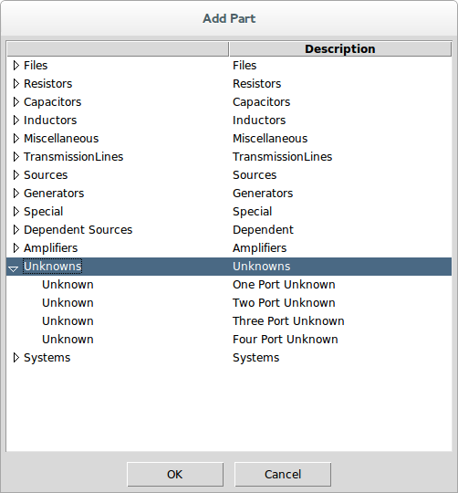

### Add System {#Control-Help:Add-System}

|    *Dialog*    | [Main Schematic Dialog](15-Main-Schematic-Dialog.md#sec:Main-Schematic-Dialog) |
|:--------------:|:---------------------------------------------------:|
| *Menu System*  |           [Parts](15-Main-Schematic-Dialog.md#sub:Parts) Add System            |
|  *Navigation*  |                       Alt+P,S                       |
| *Key Binding*  |                        None                         |
|   *Toolbar*    |                        None                         |
| *Availability* |                       Always                        |

This adds a [System](23-Built-in-Devices-Parts.md#device:System) to the schematic for use only in [Deembedding](09-Deembedding.md#sec:Deembedding) applications.

See [Defining the System](09-Deembedding.md#sub:Defining-the-System).

This command is a shortcut which is the same as invoking [Add Part](15-Main-Schematic-Dialog.md#Control-Help:Add-Part) and selecting the Systems category.

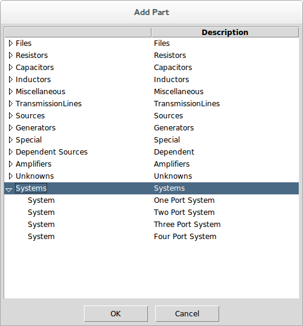

### Delete Part {#Control-Help:Delete-Part}

| *Dialog* | [Main Schematic Dialog](15-Main-Schematic-Dialog.md#sec:Main-Schematic-Dialog) |
|:--:|:--:|
| *Menu System* | [Parts](15-Main-Schematic-Dialog.md#sub:Parts) Delete Part |
| *Navigation* | Alt+P,D |
| *Key Binding* | Delete |
| *Toolbar* |  |
| *Availability* | When a part is selected |

This deletes the selected part.

The selected part is indicated by a blue color in the schematic.

When a part is selected it shows this in the status message area.

This is also available through the context sensitive menu (right-click when part selected).

### Edit Properties {#Control-Help:Edit-Properties}

|    *Dialog*     | [Main Schematic Dialog](15-Main-Schematic-Dialog.md#sec:Main-Schematic-Dialog) |
|:---------------:|:---------------------------------------------------:|
|  *Menu System*  |         [Parts](15-Main-Schematic-Dialog.md#sub:Parts) Edit Properties         |
|  *Navigation*   |                       Alt+P,E                       |
|  *Key Binding*  |                        None                         |
|    *Toolbar*    |                        None                         |
| *Availability*  |               When a part is selected               |
| *Mouse Binding* |                    double-click                     |

This edits the part properties for the selected part.

The selected part is indicated by a blue color in the schematic.

When a part is selected it shows this in the status message area.

This is also available through the context sensitive menu (right-click when part selected).

When a part is selected, editing the part properties brings up the part properties dialog:

In the part properties dialog, you see the part properties at the top, followed by the part orientation settings, followed by a picture of the part as it will be shown in the schematic.

The part properties are shown with two checkboxes, followed by a label, followed by the value. When first opened for a part, the default values are shown.

The first checkbox determines whether the property is to be shown in the schematic.

The second checkbox determines whether the keyword for the property is displayed (unchecking this box just shows the value).

The value is modified by clicking inside the white area where the property value is shown. Note that all property values that are numbers are shown in engineering notation (i.e. a number with a suffix indicating the exponent). ***SignalIntegrityApp*** never uses scientific notation or anything like that. Also, if the number has units, the units are shown.

To change the value, you can either click once or double-click inside the value entry box. When you click once, the cursor is placed at the location clicked and you can edit the value that is already there. If you double-click, the entry is cleared and you can enter an entirely new value.

The units never need to be entered (but can be).

Numbers can be entered with exponents or with the engineering notation suffix. For example, 100 Mohm can be entered as 100 Mohm, 100 M, 100M, 100e6, or 10e7.

The reference designator is entered by ***SignalIntegrityApp*** and is always unique at the time of entry. In that sense, it does not need to be modified or viewed in the schematic.

The orientation of a part can be altered through rotation and mirroring. The rotation shown is always for a rotation in the counter-clockwise direction, but usually one just presses the toggle button until it looks right. Mirroring vertically or horizontally is accomplished by checking the boxes.

You have no control over the exact placement of the text displayed with each part. It is placed justified properly depending on the orientation.

For many parts, there are alternate part pictures available. These are chosen by simply clicking inside the the part picture area of the dialog. For example, for the voltage amplifier shown, there is an alternate picture that has the voltage reference reversed at the input. Clicking in the part picture changes the picture to the following:

After you are satisfied with all of the part property settings and the orientation, press OK. The part is now edited in the schematic.

If at any time you press Cancel, the properties of the part are left unchanged in the schematic.

Some devices have file properties. For example, the [File](23-Built-in-Devices-Parts.md#device:File) and [System](23-Built-in-Devices-Parts.md#device:System) devices have s-parameter files and the [Voltage Measure Probe](23-Built-in-Devices-Parts.md#device:Measure-Probe), [Voltage Source](23-Built-in-Devices-Parts.md#device:Voltage-Source) and [Current Source](23-Built-in-Devices-Parts.md#device:Current-Source) have [Waveform](28-Waveform.md#sec:Waveform) files associated. In these cases, the files can be browsed to and selected and viewed in either the [S-parameter Viewer](13-S-parameter-Viewer.md#sec:S-parameter-Viewer) or the [Simulator Dialog](14-Simulator-Dialog.md#sec:Simulator-Dialog).

### Duplicate Part {#Control-Help:Duplicate-Part}

| *Dialog* | [Main Schematic Dialog](15-Main-Schematic-Dialog.md#sec:Main-Schematic-Dialog) |
|:--:|:--:|
| *Menu System* | [Parts](15-Main-Schematic-Dialog.md#sub:Parts) Duplicate Part |
| *Navigation* | Alt+P,D |
| *Key Binding* | None |
| *Toolbar* |  |
| *Availability* | When a part is selected |

This command is available whenever a device is selected.

The item selected to be duplicated is shown as blue in the schematic.

When invoked, the part is copied to memory and the mouse cursor changes to a finger indicating that the new copied part will be placed where the finger points on the next mouse click.

When the new part is placed, the reference designator is updated to be a unique name based on the default designator rules for the part.

This command is also available by right clicking while a part is selected through a context sensitive menu.

### Rotate Part {#Control-Help:Rotate-Part}

| *Dialog* | [Main Schematic Dialog](15-Main-Schematic-Dialog.md#sec:Main-Schematic-Dialog) |
|:--:|:--:|
| *Menu System* | [Parts](15-Main-Schematic-Dialog.md#sub:Parts) Rotate Part |
| *Navigation* | Alt+P,R |
| *Key Binding* | None |
| *Toolbar* |  |
| *Availability* | When a part is selected |

This rotates the picture of the part 90 degrees counter-clockwise.

### Flip Horizontally {#Control-Help:Flip-Horizontally}

| *Dialog* | [Main Schematic Dialog](15-Main-Schematic-Dialog.md#sec:Main-Schematic-Dialog) |
|:--:|:--:|
| *Menu System* | [Parts](15-Main-Schematic-Dialog.md#sub:Parts) Flip Horizontally |
| *Navigation* | Alt+P,H |
| *Key Binding* | None |
| *Toolbar* |  |
| *Availability* | When a part is selected |

This mirrors the picture of the part horizontally about a vertical axis.

### Flip Vertically {#Control-Help:Flip-Vertically}

| *Dialog* | [Main Schematic Dialog](15-Main-Schematic-Dialog.md#sec:Main-Schematic-Dialog) |
|:--:|:--:|
| *Menu System* | [Parts](15-Main-Schematic-Dialog.md#sub:Parts) Flip Vertically |
| *Navigation* | Alt+P,V |
| *Key Binding* | None |
| *Toolbar* |  |
| *Availability* | When a part is selected |

This mirrors the picture of the part vertically about a horizontal axis.

## Wires {#sub:Wires}

The Wires tasks are a category in the [Main Schematic Dialog](15-Main-Schematic-Dialog.md#sec:Main-Schematic-Dialog) for dealing with wires:

- [Add Wire](15-Main-Schematic-Dialog.md#Control-Help:Add-Wire).

- [Delete Vertex](15-Main-Schematic-Dialog.md#Control-Help:Delete-Vertex).

- [Duplicate Vertex](15-Main-Schematic-Dialog.md#Control-Help:Duplicate-Vertex).

- [Delete Wire](15-Main-Schematic-Dialog.md#Control-Help:Delete-Wire).

Wires are simply collections of vertices with implied lines between each adjacent vertex.

Although wires might look continuous in the schematic, a wire only every actually joins two nodes with a node being either a device port or a dot in the schematic where two or more wires or device ports connect. A wire joining two nodes may still contain several vertices as it snakes around the schematic.

wires are consolidated continuously as the schematic is drawn so a wire might be split or combined as things are connected.

Wires can be selected by:

- a vertex - in which case just the vertex can be deleted or moved or the entire wire containing the vertex can be deleted.

- a segment (a line between two vertices), which is really just multiple selections of two vertices - in which case the two vertices can be moved or deleted.

- multiple vertices.

Currently, wire handling is a bit awkward and will be improved in the future.

### Add Wire {#Control-Help:Add-Wire}

| *Dialog* | [Main Schematic Dialog](15-Main-Schematic-Dialog.md#sec:Main-Schematic-Dialog) |
|:--:|:--:|
| *Menu System* | [Wires](15-Main-Schematic-Dialog.md#sub:Wires) Add Wire |
| *Navigation* | Alt+W,A |
| *Key Binding* | None |
| *Toolbar* |  |
| *Availability* | Always |

The Add Wire command puts the schematic state-machine in the drawing wires state. When in this state, the cursor turns into a pencil and a wire is begun. A wire is defined by a sequence of vertices. clicking the left mouse button drops another vertex onto the schematic. If at least one vertex has been placed for a wire, a rubber band line extends from the last vertex placed to the grid coordinate closest to the cursor location.

wires can only be placed on the grid.

When you right click, that ends the current wire. If a vertex has been placed for the current wire (and a rubber band line is extending to the cursor), the rubber band line disappears, the vertices place define the wire drawn in the schematic and a new wire starts. The next left click places a vertex for that wire and the process continues.

Wire drawing ends when you right click twice. In other words, it ends when you right click in the middle of drawing a wire and no vertices for that wire have been placed. Pressing escape will also end wire drawing.

### Delete Vertex {#Control-Help:Delete-Vertex}

|    *Dialog*    | [Main Schematic Dialog](15-Main-Schematic-Dialog.md#sec:Main-Schematic-Dialog) |
|:--------------:|:---------------------------------------------------:|
| *Menu System*  |          [Wires](15-Main-Schematic-Dialog.md#sub:Wires) Delete Vertex          |
|  *Navigation*  |                       Alt+W,V                       |
| *Key Binding*  |                        None                         |
|   *Toolbar*    |                        None                         |
| *Availability* |   When a single wire vertex of a wire is selected   |

Deletes a single wire vertex selected. If the vertex deleted is in between other vertices of a wire, the wire connects the adjacent vertices after deletion.

### Duplicate Vertex {#Control-Help:Duplicate-Vertex}

|    *Dialog*    | [Main Schematic Dialog](15-Main-Schematic-Dialog.md#sec:Main-Schematic-Dialog) |
|:--------------:|:---------------------------------------------------:|
| *Menu System*  |        [Wires](15-Main-Schematic-Dialog.md#sub:Wires) Duplicate Vertex         |
|  *Navigation*  |                       Alt+W,U                       |
| *Key Binding*  |                        None                         |
|   *Toolbar*    |                        None                         |
| *Availability* |   When a single wire vertex of a wire is selected   |

This function does not work properly at this time.

### Delete Wire {#Control-Help:Delete-Wire}

|    *Dialog*    | [Main Schematic Dialog](15-Main-Schematic-Dialog.md#sec:Main-Schematic-Dialog) |
|:--------------:|:---------------------------------------------------:|
| *Menu System*  |           [Wires](15-Main-Schematic-Dialog.md#sub:Wires) Delete Wire           |
|  *Navigation*  |                       Alt+W,D                       |
| *Key Binding*  |                        None                         |
|   *Toolbar*    |                        None                         |
| *Availability* |   When a single wire vertex of a wire is selected   |

This deletes the entire wire (i.e. all wire vertices) in the wire containing the vertex selected.

## View {#sub:View}

The View tasks are a category in the [Main Schematic Dialog](15-Main-Schematic-Dialog.md#sec:Main-Schematic-Dialog) for dealing with the drawing canvas:

- [Zoom In](15-Main-Schematic-Dialog.md#Control-Help:Zoom-In).

- [Zoom Out](15-Main-Schematic-Dialog.md#Control-Help:Zoom-Out).

- [Pan](15-Main-Schematic-Dialog.md#Control-Help:Pan).

The drawing canvas starts out with a grid size of 32 pixels per grid point with grid origin at the upper left edge of the drawing canvas.

### Zoom In {#Control-Help:Zoom-In}

| *Dialog* | [Main Schematic Dialog](15-Main-Schematic-Dialog.md#sec:Main-Schematic-Dialog) |
|:--:|:--:|
| *Menu System* | [View](15-Main-Schematic-Dialog.md#sub:View) Zoom In |
| *Navigation* | Alt+V,I |
| *Key Binding* | None |
| *Toolbar* |  |
| *Availability* | Always |

Zooms in on the schematic picture by incrementing the number of pixels per grid unit.

The default number of pixels per grid unit are controlled by [Appearance.InitialGrid](29-Preferences.md#sub:Appearance.InitialGrid) in the [Preferences](29-Preferences.md#sec:Preferences).

### Zoom Out {#Control-Help:Zoom-Out}

| *Dialog* | [Main Schematic Dialog](15-Main-Schematic-Dialog.md#sec:Main-Schematic-Dialog) |
|:--:|:--:|
| *Menu System* | [View](15-Main-Schematic-Dialog.md#sub:View) Zoom Out |
| *Navigation* | Alt+V,O |
| *Key Binding* | None |
| *Toolbar* |  |
| *Availability* | Always |

Zooms out of the schematic picture by decrementing the number of pixels per grid unit.

The default number of pixels per grid unit are controlled by [Appearance.InitialGrid](29-Preferences.md#sub:Appearance.InitialGrid) in the [Preferences](29-Preferences.md#sec:Preferences).

### Pan {#Control-Help:Pan}

| *Dialog* | [Main Schematic Dialog](15-Main-Schematic-Dialog.md#sec:Main-Schematic-Dialog) |
|:--:|:--:|
| *Menu System* | [View](15-Main-Schematic-Dialog.md#sub:View) Pan |
| *Navigation* | Alt+V,P |
| *Key Binding* | None |
| *Toolbar* |  |
| *Availability* | Always |

Panning allows you to change the offset of the grid in the drawing.

It’s kind of like selecting everything and moving it, but instead of moving the elements in the drawing, the coordinates of the origin are modified instead.

When you invoke panning, the panning toolbar button stays down and the status message area shows Panning. The cursor changes to a panning symbol. You then pan by holding down the left mouse button and dragging the drawing origin relative to where the mouse button was pressed.

Releasing the mouse button or right clicking or pressing escape turns off panning.

## Calculate {#sub:Calculate}

The Calculate tasks are a category in the [Main Schematic Dialog](15-Main-Schematic-Dialog.md#sec:Main-Schematic-Dialog) for dealing calculations for the ***SignalIntegrityApp*** applications:

- [Calculation Properties](15-Main-Schematic-Dialog.md#Control-Help:Calculation-Properties) - for editing the properties for the calculations.

- [Post-Processing](15-Main-Schematic-Dialog.md#Control-Help:Post-Processing) - for editing post-processing commands for the calculations.

- [S-parameter Viewer](15-Main-Schematic-Dialog.md#Control-Help:S-parameter-Viewer) - for viewing s-parameters.

- [Calculate S-parameters](15-Main-Schematic-Dialog.md#Control-Help:Calculate-S-parameters) - for running an [S-Parameter Generation](07-S-Parameter-Generation.md#sec:S-parameter-Generation).

- [Simulate](15-Main-Schematic-Dialog.md#Control-Help:Simulate) - for running a [Simulation](08-Simulation.md#sec:Simulation).

- [Virtual Probe](15-Main-Schematic-Dialog.md#Control-Help:Virtual-Probe) - for running [Virtual Probing](10-Virtual-Probing.md#sec:Virtual-Probing).

- [Deembed](15-Main-Schematic-Dialog.md#Control-Help:Deembed) - for running [Deembedding](09-Deembedding.md#sec:Deembedding).

- [RLGC Fit](15-Main-Schematic-Dialog.md#Control-Help:RLGC-Fit) - for performing an [RLGC Fit](11-RLGC-Fit.md#sec:RLGC-Fit) to the s-parameters.

- [Calculate Error Terms](15-Main-Schematic-Dialog.md#Control-Help:Calculate-Error-Terms) - for computing error terms in a [Network Analyzer Calibration](12-Network-Analyzer-Measurements.md#sub:Network-Analyzer-Calibration).

You also invoke the [S-parameter Viewer](15-Main-Schematic-Dialog.md#Control-Help:S-parameter-Viewer).

The [Calculate](15-Main-Schematic-Dialog.md#Control-Help:Calculate-Button) toolbar button is ganged to perform whatever calculation makes sense based on the schematic configuration.

### Calculation Properties {#Control-Help:Calculation-Properties}

| *Dialog* | [Main Schematic Dialog](15-Main-Schematic-Dialog.md#sec:Main-Schematic-Dialog), [S-parameter Viewer](13-S-parameter-Viewer.md#sec:S-parameter-Viewer), and [Simulator Dialog](14-Simulator-Dialog.md#sec:Simulator-Dialog) |
|:--:|:--:|
| *Menu System* | [Calculate](15-Main-Schematic-Dialog.md#sub:Calculate) Calculation Properties |
| *Navigation* | Alt+C,P |
| *Key Binding* | None |
| *Toolbar* |  |
| *Availability* | Always |

Issuing the Calculation Properties command brings up the calculation properties dialog:

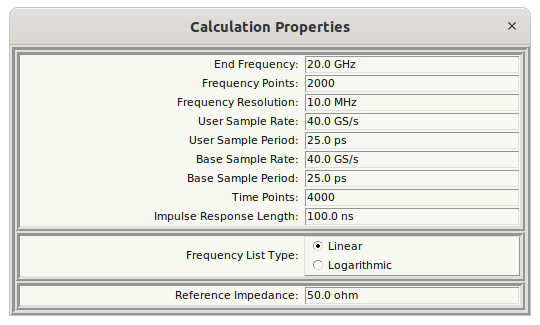

The calculation properties govern how all calculations are performed, and are broken into five sections:

1.  The main, linear calculation properties,

2.  The impulse response length limit, as explained under [Limit Impulse Response Length](15-Main-Schematic-Dialog.md#sub:Limit-Impulse-Response-Length) (shown only if the preference [Calculation.AllowMaximumImpulseResponseLength](29-Preferences.md#sub:Calculation.AllowMaximumImpulseResponseLength) is True),

3.  The frequency list type, for calculations on a logarithmically spaced frequency spacing, as explained under [Logarithmically Spaced Frequencies Solutions](15-Main-Schematic-Dialog.md#sub:Logarithmically-Spaced-Frequencies-Solutions) (only shown if the preference [Calculation.LogarithmicSolutions](29-Preferences.md#sub:Calculation.LogarithmicSolutions) is True),

4.  The reference impedance, as explained under [Non 50 Ohm Reference Impedance](15-Main-Schematic-Dialog.md#sub:Non-50-Ohm-Reference-Impedance) (shown only if the preference [Calculation.Non50OhmSolutions](29-Preferences.md#sub:Calculation.Non50OhmSolutions) is True), and

5.  The parallelization setting, as explained under [Allow Parallelization](15-Main-Schematic-Dialog.md#sub:Allow-Parallelization) (shown only if the preference [Calculation.AllowParallelization](29-Preferences.md#sub:Calculation.AllowParallelization) is True).

The main, linear calculation properties are intended for use with all of the ***SignalIntegrityApp*** applications and consist of virtually entirely interrelated properties. The base properties are the end frequency and the impulse response length. All other properties are based on one or both of these properties:

| **Property** | **Type** | **Equation** | **Internal Property Name** |
|:---|:---|:---|:---|
| user sample rate | base | $userSampleRate$ | UserSampleRate |
| end frequency | base | $endfrequency$ | EndFrequency |
| number of frequency points | base | $frequencyPoints$ | FrequencyPoints |
| base sample rate | derived | $baseSampleRate=2\cdot endFrequency$ | BaseSampleRate |
| number of time points | derived | $timePoints=2\cdot frequencyPoints$ | TimePoints |
| frequency resolution | derived | $frequencyResolution=\frac{endFrequency}{frequencyPoints}$ | FrequencyResolution |
| time length of impulse response | derived | $impulseResponseLength=\frac{frequencyPoints}{endFrequency}$ | ImpulseResponseLength |
| user sample period | derived | $userSamplePeriod=\frac{1}{userSampleRate}$ | [UserSamplePeriod](UserSamplePeriod){.uri} |

The value is modified by clicking inside the white area where the property value is shown. Note that all property values that are numbers are shown in engineering notation (i.e. a number with a suffix indicating the exponent). ***SignalIntegrityApp*** never uses scientific notation or anything like that. Also, if the number has units, the units are shown.

To change the value, you can either click once or double-click inside the value entry box. When you click once, the cursor is placed at the location clicked and you can edit the value that is already there. If you double-click, the entry is cleared and you can enter an entirely new value.

The units never need to be entered (but can be).

Numbers can be entered with exponents or with the engineering notation suffix. For example, 20 GHz can be entered as 20 GHz, 20 G, 20G, 20e6, or 2e7.

Whenever either the end frequency or the impulse response length are modified, all of the other properties are calculated as in the equations above. If any of the properties are modified that directly affect one of these base properties, then the affected base property is modified and all of the other properties are recalculated as stated. These properties include the frequency resolution, which is simply another expression of the impulse response length, and the base sample rate, which is simply another expression of the end frequency.

Otherwise, if either the frequency points or the time points are modified, which are functions of both of the base properties, then the end frequency is held constant and the impulse response length is modified to accommodate the new property value.

To summarize, all of the properties can be modified. Any modification first tries to hold the end frequency (and base sample rate) constant first and the impulse response length second.

One interesting thing to note is that the frequency points are actually the number of frequencies minus one. Said differently, the number of actual frequencies calculated is always the number shown plus one. In other words, for $N$ frequency points and an end frequency $Fe$, the actual frequency points are, for $n\in0\ldots N$:

$$f\left[n\right]=\frac{n}{N}\cdot Fe$$

The time points for the impulse response is specified for $K=2\cdot N$ time points and a sample rate $Fs=2\cdot Fe$, as having times of, for $k\in0\ldots K-1$ :

$$t\left[k\right]=\left(k-\frac{K}{2}\right)\cdot\frac{1}{Fs}$$

Depending on the application, it is useful to also read:

- [Calculating S-parameters](07-S-Parameter-Generation.md#sub:Calculating-S-parameters) for s-parameter calculation.

- [Setting Calculation Properties for Simulation](08-Simulation.md#sub:Setting-Calculation-Properties-for-Simulation).

- [Setting Calculation Properties for Deembedding](09-Deembedding.md#sub:Setting-Calculation-Properties-for-Deembedding).

- [Setting Calculation Properties for Virtual Probing](10-Virtual-Probing.md#sub:Setting-Calculation-Properties-for-Virtual-Probing).

### Limit Impulse Response Length {#sub:Limit-Impulse-Response-Length}

Limit impulse response length can only be selected if the [Calculation.AllowMaximumImpulseResponseLength](29-Preferences.md#sub:Calculation.AllowMaximumImpulseResponseLength) preference is set to True. (It may still be available if you open a project for which the impulse response length has been previously limited).

It's importance is mainly when a schematic is included as a sub-schematic of another project, and the calculation properties are being passed down.  If the user knows the limits in electrical length of a particular schematic, the impulse response limit can trim down the number of frequency points calculated, even when a larger number of frequency points is being requested from the top level schematic.

As explained under [Calculation Properties](15-Main-Schematic-Dialog.md#Control-Help:Calculation-Properties), the impulse response length is one of the base calculation properties. It is inversely proportional to the frequency resolution, so that a longer impulse response requires a finer frequency resolution and therefore more frequency points. Since the amount of work in a calculation grows with the number of frequency points, a large impulse response length - whether entered deliberately or arrived at while adjusting other properties - can make a calculation very slow.

This section provides a way to place an upper bound on the impulse response length so that the number of frequency points cannot grow without limit. It consists of two controls:

- **Limit Impulse Response Length** - a True/False button that enables or disables the cap. It is stored with the project (internal property name `LimitImpulseResponseLength`) and defaults to False.

- **Maximum Impulse Response Length** - the maximum impulse response length allowed, in seconds (internal property name `MaximumImpulseResponseLength`). This entry is only shown when the limit is enabled.

When the limit is enabled and the impulse response length implied by the calculation properties exceeds the maximum, the number of frequency points actually used in the calculation is reduced so that the impulse response length does not exceed the maximum. The cap is *approximate* - the number of frequency points is kept an integer number to the end frequency - so the effective impulse response length will be at or just below the maximum specified.

It is important to understand that this cap does not alter any of the stored calculation properties shown in the dialog (the end frequency, frequency points, impulse response length, etc. are all left unchanged). The cap is applied only to the number of frequency points that are handed to the actual calculation. In other words, the displayed impulse response length is what you asked for, while the calculation quietly uses a shorter one when the cap is in effect. The end frequency (and therefore the base sample rate) is always preserved; only the frequency resolution is coarsened to shorten the impulse response.

This capability is different from limiting the impulse response length of an individual set of s-parameters (which zeroes the impulse response outside a time window - see the negative and positive time limits in [S-Parameter Properties](13-S-parameter-Viewer.md#Control-Help:S-Parameter-Properties) and the ’limit’ [Post-Processing](25-Post-Processing.md#sec:Post-Processing) command). Here, no response is windowed or zeroed; the length is limited by controlling the frequency resolution of the whole calculation.

### Logarithmically Spaced Frequencies Solutions {#sub:Logarithmically-Spaced-Frequencies-Solutions}

Logarithmically spaced frequencies solutions can only be selected if the [Calculation.LogarithmicSolutions](29-Preferences.md#sub:Calculation.LogarithmicSolutions) preference is set to True. (They may still be available if you open a project for which logarithmically spaced frequencies have been chosen).

It was found that for certain solutions, something other than linear frequency spacing might be useful. The characteristics that dictate a need for something other than linear frequency spacing would be especially when:

- the end frequency must be set to a high frequency, and

- the need to retain low frequency behavior required a very low frequency point, right after the DC point.

Since *SignalIntegrity* performs time-domain convolution for simulations, the frequency domain result must be placed on a linear scale for use with the discrete Fourier transform to obtain an impulse response, and the need for a very low frequency point automatically dictates possibly an unreasonable frequency resolution, leading to a huge number of frequency points, and an unreasonably long simulation.

With logarithmic frequency spacing, an effort was made to solve the transfer parameters or s-parameters on a logarithmically spaced grid, and resample these onto a linearly spaced grid at the end. If logarithmic frequency spacing is selected, the user is able to choose:

- the logarithmic start frequency,

- the logarithmic end frequency,

- the points per decade.

When chosen, a frequency grid is chosen starting at the decade at or below the logarithmic start frequency, ending with the decade at or above the logarithmic end frequency, with frequencies at a log-linear spacing for each decade given by the points per decade. Then, only those frequencies between the logarithmic start and end frequencies (inclusive) are chosen, and if needed, the start and end frequencies are tacked on to the beginning and end of the frequency list, respectively, if needed.

For s-parameter calculations, the results are provided on this logarithmic scale, but for simulation calculations, the resulting logarithmically spaced solution is resampled onto the linear scale that is specified prior to convolution.

This is all explained in <https://www.researchgate.net/publication/378007493_Techniques_and_Considerations_for_Using_S-Parameters_in_Power_Delivery_Network_Analysis>

Logarithmic frequencies is experimental, and in development, and should not be used, as the results were not satisfactory.

### Non 50 Ohm Reference Impedance {#sub:Non-50-Ohm-Reference-Impedance}

Non 50 ohm reference impedance can only be selected if the [Calculation.Non50OhmSolutions](29-Preferences.md#sub:Calculation.Non50OhmSolutions) preference is set to True. (It may still be available if you open a project for which a non 50 ohm solution has been previously chosen).

In the past, within *SignalIntegrity*, when solving, all devices were read in, converted to 50 ohms reference impedance, and all solutions provided were in a 50 ohm reference impedance. The result could be converted to a non 50 ohm reference impedance, if desired, using [Post-Processing](15-Main-Schematic-Dialog.md#Control-Help:Post-Processing) and [Post-Processing](25-Post-Processing.md#sec:Post-Processing) commands, namely the ’reference impedance’ command.

Later, it was found that, especially with regards to resampling of s-parameters, that it was important to resample the s-parameters in a reference impedance that was favorable. In other words, in some reference impedances, like 50 ohms, the s-parameters might be seen to be insufficiently sampled, however, in other reference impedances, they were sufficiently sampled.

Now, all s-parameter reference impedances read in are honored, resampled in their native reference impedance, and converted to the reference impedance specified for the project. This reference impedance may be specified in the [Calculation Properties](15-Main-Schematic-Dialog.md#Control-Help:Calculation-Properties).

This is all explained in <https://www.researchgate.net/publication/378007493_Techniques_and_Considerations_for_Using_S-Parameters_in_Power_Delivery_Network_Analysis>

### Allow Parallelization {#sub:Allow-Parallelization}

Allow parallelization can only be selected if the [Calculation.AllowParallelization](29-Preferences.md#sub:Calculation.AllowParallelization) preference is set to True. (It may still be available if you open a project for which parallelization has been previously enabled).

This property permits the calculations for *this project* to be distributed across multiple processor cores. It is stored with the project and defaults to False. See [Parallel Calculations](32-Parallel-Calculations.md#sec:Parallel-Calculations) for a full explanation of how parallelization works and when it is beneficial.

A calculation is only permitted to run in parallel when both this property and the global [Calculation.AllowParallelization](29-Preferences.md#sub:Calculation.AllowParallelization) preference are True. Even then, a cost model decides, per solve, whether parallel execution is actually worthwhile, so small problems continue to run serially. Enabling this property never changes the numeric result of a calculation; it only affects how long the calculation takes.

This property is deliberately **not** passed down into sub-blocks. Every block &ndash; the top-level project and each sub-block &ndash; honors its own allow parallelization property for its own solve. See [Parallelization Is Not Passed Into Sub-blocks](32-Parallel-Calculations.md#sub:Parallel-Calculations-Sub-blocks).

### Post-Processing {#Control-Help:Post-Processing}

|    *Dialog*    | [Main Schematic Dialog](15-Main-Schematic-Dialog.md#sec:Main-Schematic-Dialog) |
|:--------------:|:---------------------------------------------------:|
| *Menu System*  |     [Calculate](15-Main-Schematic-Dialog.md#sub:Calculate) Post-Processing     |
|  *Navigation*  |                       Alt+C,P                       |
| *Key Binding*  |                        None                         |
|   *Toolbar*    |                        None                         |
| *Availability* |                       Always                        |

This command opens a text notepad where the user can enter [Post-Processing](25-Post-Processing.md#sec:Post-Processing) commands.

### S-parameter Viewer {#Control-Help:S-parameter-Viewer}

| *Dialog* | [Main Schematic Dialog](15-Main-Schematic-Dialog.md#sec:Main-Schematic-Dialog) |
|:--:|:--:|
| *Menu System* | [Calculate](15-Main-Schematic-Dialog.md#sub:Calculate) S-parameter Viewer |
| *Navigation* | Alt+C,V |
| *Key Binding* | None |
| *Toolbar* | 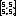 |
| *Availability* | Always |

This command invokes the [S-parameter Viewer](13-S-parameter-Viewer.md#sec:S-parameter-Viewer) dialog to view s-parameter files.

### Calculate {#Control-Help:Calculate-Button}

| *Dialog* | [Main Schematic Dialog](15-Main-Schematic-Dialog.md#sec:Main-Schematic-Dialog) |
|:--:|:--:|
| *Menu System* | None |
| *Navigation* | None |
| *Key Binding* | None |
| *Toolbar* |  |
| *Availability* | When there is something to calculate |

The [Calculate](15-Main-Schematic-Dialog.md#Control-Help:Calculate-Button) toolbar button is ganged to perform whatever calculation makes sense based on the schematic configuration. If it is enabled, you can see which calculation will take place by looking at which calculation is enabled under [Calculate](15-Main-Schematic-Dialog.md#sub:Calculate).

### Calculate S-parameters {#Control-Help:Calculate-S-parameters}

| *Dialog* | [Main Schematic Dialog](15-Main-Schematic-Dialog.md#sec:Main-Schematic-Dialog) |
|:--:|:--:|
| *Menu System* | [Calculate](15-Main-Schematic-Dialog.md#sub:Calculate) Calculate S-parameters |
| *Navigation* | Alt+C,C |
| *Key Binding* | None |
| *Toolbar* |  |
| *Availability* | When s-parameters can be calculated |

This invokes the [S-Parameter Generation](07-S-Parameter-Generation.md#sec:S-parameter-Generation). See [Calculating S-parameters](07-S-Parameter-Generation.md#sub:Calculating-S-parameters) for what happens when invoked and for the conditions for enabling this.

### Simulate {#Control-Help:Simulate}

| *Dialog* | [Main Schematic Dialog](15-Main-Schematic-Dialog.md#sec:Main-Schematic-Dialog) |
|:--:|:--:|
| *Menu System* | [Calculate](15-Main-Schematic-Dialog.md#sub:Calculate) Simulate |
| *Navigation* | Alt+C,S |
| *Key Binding* | None |
| *Toolbar* |  |
| *Availability* | When the schematic can be simulated |

This invokes a [Simulation](08-Simulation.md#sec:Simulation). See [Simulating](08-Simulation.md#sub:Simulating) for what happens when invoked and for the conditions for enabling this.

### Virtual Probe {#Control-Help:Virtual-Probe}

| *Dialog* | [Main Schematic Dialog](15-Main-Schematic-Dialog.md#sec:Main-Schematic-Dialog) |
|:--:|:--:|
| *Menu System* | [Calculate](15-Main-Schematic-Dialog.md#sub:Calculate) Virtual Probe |
| *Navigation* | Alt+C,R |
| *Key Binding* | None |
| *Toolbar* |  |
| *Availability* | When the schematic can be virtual probed |

This invokes [Virtual Probing](10-Virtual-Probing.md#sec:Virtual-Probing). See [Virtual Probing](10-Virtual-Probing.md#sub:Virtual-Probing) for what happens when invoked and for the conditions for enabling this.

### Deembed {#Control-Help:Deembed}

| *Dialog* | [Main Schematic Dialog](15-Main-Schematic-Dialog.md#sec:Main-Schematic-Dialog) |
|:--:|:--:|
| *Menu System* | [Calculate](15-Main-Schematic-Dialog.md#sub:Calculate) Deembed |
| *Navigation* | Alt+C,D |
| *Key Binding* | None |
| *Toolbar* |  |
| *Availability* | When the schematic can be deembedded |

This invokes [Deembedding](09-Deembedding.md#sec:Deembedding). See [Deembedding Calculation](09-Deembedding.md#sub:Deembedding-Calculation) for what happens when invoked and for the conditions for enabling this.

### RLGC Fit {#Control-Help:RLGC-Fit}

| *Dialog* | [Main Schematic Dialog](15-Main-Schematic-Dialog.md#sec:Main-Schematic-Dialog) |
|:--:|:--:|
| *Menu System* | [Calculate](15-Main-Schematic-Dialog.md#sub:Calculate) RLGC Fit |
| *Navigation* | Alt+C,F |
| *Key Binding* | None |
| *Toolbar* | None |
| *Availability* | When s-parameters can be calculated and there are two ports |

This invokes [RLGC Fit](11-RLGC-Fit.md#sec:RLGC-Fit) to fit the s-parameters of a [COM Transmission Line](23-Built-in-Devices-Parts.md#device:Transmission-Line-COM) device to schematic.

See [RLGC Fit](11-RLGC-Fit.md#sec:RLGC-Fit) for what happens when invoked and for the conditions for enabling this.

### Calculate Error Terms {#Control-Help:Calculate-Error-Terms}

|    *Dialog*    | [Main Schematic Dialog](15-Main-Schematic-Dialog.md#sec:Main-Schematic-Dialog) |
|:--------------:|:---------------------------------------------------:|
| *Menu System*  |  [Calculate](15-Main-Schematic-Dialog.md#sub:Calculate) Calculate Error Terms  |
|  *Navigation*  |                       Alt+C,E                       |
| *Key Binding*  |                        None                         |
|   *Toolbar*    |                        None                         |
| *Availability* |      When the project is a calibration project      |

Invoking this command computes error terms in a [Network Analyzer Calibration](12-Network-Analyzer-Measurements.md#sub:Network-Analyzer-Calibration) project used in [Network Analyzer Measurements](12-Network-Analyzer-Measurements.md#sec:Network-Analyzer-Measurements).

Whether this command is available is based on whether the project can be identified as a *calibration* project. This identification is determined automatically by the presence of a calibration measurement (either a [Reflect Measurement](23-Built-in-Devices-Parts.md#device:Reflect-Measurement) or [Thru Measurement](23-Built-in-Devices-Parts.md#device:Thru-Measurement)), and nonexistence of any other unrelated devices like ports, probes, etc.

If the command completes, the error terms are shown in the [S-parameter Viewer](13-S-parameter-Viewer.md#sec:S-parameter-Viewer), which allows writing the calibration file to the disk for subsequent use in [Network Analyzer Measurement](12-Network-Analyzer-Measurements.md#sub:Network-Analyzer-Measurement).

## Variables {#sub:Variables}

The Variables tasks are a category in the [Main Schematic Dialog](15-Main-Schematic-Dialog.md#sec:Main-Schematic-Dialog) for dealing with the variables defined for the schematic:

- [Schematic Variables](15-Main-Schematic-Dialog.md#Control-Help:Schematic-Variables) - Edit schematic variables.

- [Schematic Equations](15-Main-Schematic-Dialog.md#Control-Help:Edit-Schematic-Equations) - Edit schematic equations.

- [Parameterize Schematic](15-Main-Schematic-Dialog.md#Control-Help:Parameterize-Project) - Parameterize the project.

### Schematic Variables {#Control-Help:Schematic-Variables}

|    *Dialog*    | [Main Schematic Dialog](15-Main-Schematic-Dialog.md#sec:Main-Schematic-Dialog) |
|:--------------:|:---------------------------------------------------:|
| *Menu System*  |   [Variables](15-Main-Schematic-Dialog.md#sub:Variables) Schematic Variables   |
|  *Navigation*  |                       Alt+R,V                       |
| *Key Binding*  |                        None                         |
|   *Toolbar*    |                        None                         |
| *Availability* |                       Always                        |

Invoking the Schematic Variables brings up a dialog containing the currently defined variables. If none have been defined, the dialog looks like this:

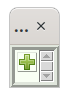

If there are variables defined, the dialog looks something like shown in the example below:

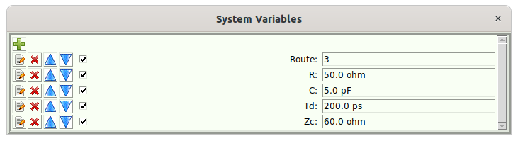

These are global variables defined for the entire system.

From within this dialog, you can:

- [Add Schematic Variable](15-Main-Schematic-Dialog.md#par:Add-Schematic-Variable)– Add a variable by pressing .

- [Edit the Value](15-Main-Schematic-Dialog.md#par:Edit-the-Value) – Edit the value of a variable by entering a new value in the entry box.

- [Edit a Variable](15-Main-Schematic-Dialog.md#par:Edit-a-Variable) – Edit a variable definition by pressing  next to the desired variable.

- Delete a Variable – Delete a variable by pressing  next to the desired variable.

- Move a Variable Up – Move a variable up in the list by pressing  next to the desired variable.

- Move a Variable Down – Move a variable down in the list by pressing  next to the desired variable.

#### Add Schematic Variables {#par:Add-Schematic-Variable}

Note that it is rare to add a schematic variable directly. Most variables are added as a result of the [Parameterize Schematic](15-Main-Schematic-Dialog.md#Control-Help:Parameterize-Project) command, or by issuing Parameterize Project from the variables dialog for a device.

Pressing  in the Variables dialog pops up a new dialog containing the properties of the variable to add:

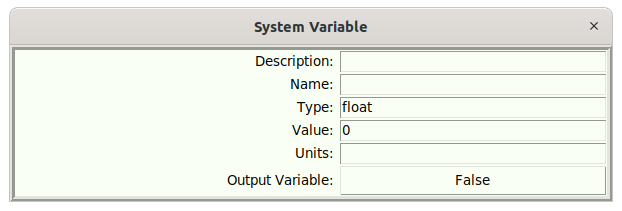

- Description – This is what will be shown on the tooltip when hovering over the entry box for the variable in the Variables dialog.

- Name – This is the name of the variable

- Type – This is the type of the variable. Recognized types are:

  - float – (default) a floating point number.

  - int – an integer number.

  - file – a name of a file.

  - string – a text string.

- Value – (0 by default) The value of the variable. When the value of a variable is entered from this dialog, they are entered without any SI units, like they are usually entered. For example, a capacitance like 10 pF would be entered as 10e-12.

- Output Variable –(False by default) whether the variable is an output variable. See [Equations](26-Equations.md#sec:Equations) for the usage of output variables.

Before a variable is added, it is checked for validity, meaning mostly that it has a variable name.

#### Edit the Value of a Variable {#par:Edit-the-Value}

When in the schematic variable dialog, enter variables directly in the entry box. If they have units, you should use SI units. For example, the capacitance 10 pF can be entered as 10p.

Files will have a browse button that allows you to browse to the file chosen.

#### Edit a Variable Definition {#par:Edit-a-Variable}

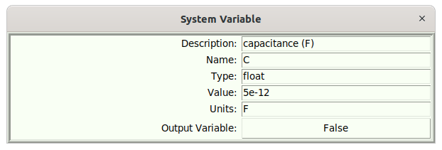

Pressing  next to the desired variable allows you to edit the definition. See [Add Schematic Variable](15-Main-Schematic-Dialog.md#par:Add-Schematic-Variable) for a discussion of these entries.

### Schematic Equations {#Control-Help:Edit-Schematic-Equations}

|    *Dialog*    | [Main Schematic Dialog](15-Main-Schematic-Dialog.md#sec:Main-Schematic-Dialog) |
|:--------------:|:---------------------------------------------------:|
| *Menu System*  |   [Variables](15-Main-Schematic-Dialog.md#sub:Variables) Schematic Equations   |
|  *Navigation*  |                       Alt+R,E                       |
| *Key Binding*  |                        None                         |
|   *Toolbar*    |                        None                         |
| *Availability* |                    Not Available                    |

This let’s you edit a schematic equation (script). See [Equations](26-Equations.md#sec:Equations) for a complete discussion.

This opens a text editor dialog that looks like this:

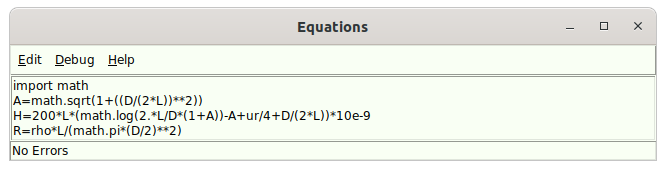

It allows the editing of a script that connects the input variables to the output variables (see [Schematic Variables](15-Main-Schematic-Dialog.md#Control-Help:Schematic-Variables)), whereby both input and output variables can be referenced by elements within the schematic.

The example shown assumes that the input variables are L, D, and ur. It assumes that possible output variables are A, H, and R.

Note the status bar at the bottom, if in the Debug menu, Auto debug is selected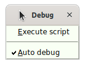, then each time you edit something in the script, the script is checked for errors, and the errors are shown on the status bar. If no errors are detected, ’No Errors’ is shown.

Also, the script can be forcibly executed from inside the equation editor to see the effect directly on the parent schematic.

### Parameterize Schematic {#Control-Help:Parameterize-Project}

|    *Dialog*    | [Main Schematic Dialog](15-Main-Schematic-Dialog.md#sec:Main-Schematic-Dialog) |
|:--------------:|:---------------------------------------------------:|
| *Menu System*  | [Variables](15-Main-Schematic-Dialog.md#sub:Variables) Parameterize Schematic  |
|  *Navigation*  |                       Alt+R,P                       |
| *Key Binding*  |                        None                         |
|   *Toolbar*    |                        None                         |
| *Availability* |                    Not Available                    |

Parameterizing the schematic is the primary way of adding schematic variables to a project (as opposed to the [Add Schematic Variable](15-Main-Schematic-Dialog.md#par:Add-Schematic-Variable) method).

Below is an example of a schematic prior to parameterization:

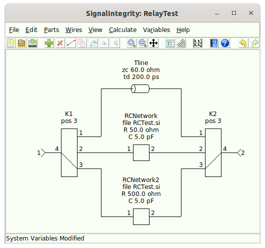

When the [Variables.ParameterizeOnlyVisible](29-Preferences.md#sub:Variables.ParameterizeOnlyVisible) preference is set to True, then only the visible device properties will be parameterized, otherwise, all device properties will be parameterized.

The result of parameterizing this schematic with the parameterization of only visible device properties set is shown below:

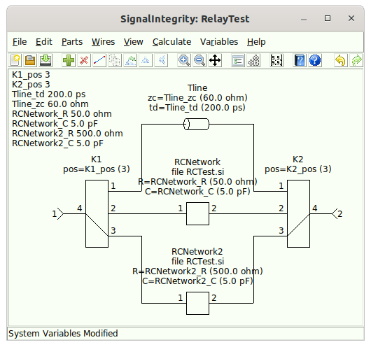

Here, we can see that every property in every device created a visible schematic variable that is visible and shown in the upper left of the schematic. Each variable name was created from a concatenation of the reference designator and the property name with an underscore in between. Note also that device property value was copied to the schematic variable and the device property now references the schematic variable.

In this particular case, we wanted all of the R, C, td, zc and pos values to be the same. To do this, the [Schematic Variables](15-Main-Schematic-Dialog.md#Control-Help:Schematic-Variables) dialog is opened, and the variables are edited to remove the reference designator, with duplicate variable names deleted <u>after</u> the renaming of the variables. This is because as each variable is renamed, the reference to that variable is automatically modified on the device property. Afterwards, the schematic looks like this:

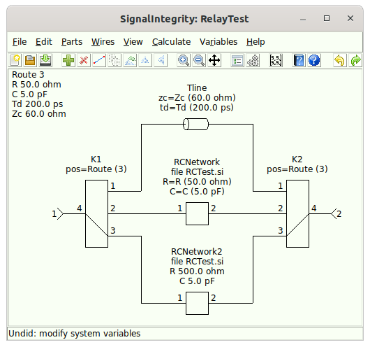

Note the steps to produce this desired result:

1.  `K1_pos` was renamed to `Route`.

2.  `K2_pos` was renamed to `Route`.

3.  One of the duplicate `Route` variables was deleted.

4.  `RCNetwork2_R` was deleted. This caused the value of `R` on `RCNetwork2` to revert back to being a constant.

5.  `RCNetwork2_C` was deleted. This caused the value of `C` on `RCNetwork2` to revert back to being a constant.

6.  `RCNetwork_R` was renamed to `R`.

7.  `RCNetwork_C` was renamed to `C`.

8.  `Tline_td` was renamed to `td`.

9.  Tline_zc was renamed to zc.

## Help {#sub:Help}

The Help tasks are a category in the [Main Schematic Dialog](15-Main-Schematic-Dialog.md#sec:Main-Schematic-Dialog) for dealing with the help system:

- [Open Help File](15-Main-Schematic-Dialog.md#Control-Help:Open-Help-File).

- [Control Help](15-Main-Schematic-Dialog.md#Control-Help:Control-Help) - for help on any menu elements or toolbar buttons.

- [Software Documentation](15-Main-Schematic-Dialog.md#Control-Help:Software-Documentation) – for accessing the *SignalIntegrity* library Python technical documentation.

- [Preferences](29-Preferences.md#sec:Preferences) - for editing any global preferences.

### Open Help File {#Control-Help:Open-Help-File}

| *Dialog* | [Main Schematic Dialog](15-Main-Schematic-Dialog.md#sec:Main-Schematic-Dialog), [S-parameter Viewer](13-S-parameter-Viewer.md#sec:S-parameter-Viewer), and [Simulator Dialog](14-Simulator-Dialog.md#sec:Simulator-Dialog) |
|:--:|:--:|
| *Menu System* | [Help](15-Main-Schematic-Dialog.md#sub:Help) Open Help File |
| *Navigation* | Alt+H,O |
| *Key Binding* | None |
| *Toolbar* |  |
| *Availability* | Always |

This command opens this file that you are currently viewing from the application.

### Control Help {#Control-Help:Control-Help}

| *Dialog* | [Main Schematic Dialog](15-Main-Schematic-Dialog.md#sec:Main-Schematic-Dialog), [S-parameter Viewer](13-S-parameter-Viewer.md#sec:S-parameter-Viewer), and [Simulator Dialog](14-Simulator-Dialog.md#sec:Simulator-Dialog) |
|:--:|:--:|
| *Menu System* | [Help](15-Main-Schematic-Dialog.md#sub:Help) Control Help |
| *Navigation* | Alt+H,C |
| *Key Binding* | None |
| *Toolbar* |  |
| *Availability* | Always |

Control help allows you to get help on any command.

When in control help, all of the commands are activated. This includes key bindings, toolbar buttons, and menu elements. However, issuing any of the possible commands takes you to a location in the help system corresponding to the desired control instead of actually issuing the command.

Control help stays active until you either press the escape key, or touch somewhere in the canvas.

### Software Documentation {#Control-Help:Software-Documentation}

| *Dialog* | [Main Schematic Dialog](15-Main-Schematic-Dialog.md#sec:Main-Schematic-Dialog), [S-parameter Viewer](13-S-parameter-Viewer.md#sec:S-parameter-Viewer), and [Simulator Dialog](14-Simulator-Dialog.md#sec:Simulator-Dialog) |
|:--:|:--:|
| *Menu System* | [Help](15-Main-Schematic-Dialog.md#sub:Help) [Archiving](#sec:Archiving)Software Documentation |
| *Navigation* | Alt+H,S |
| *Key Binding* | None |
| *Toolbar* | None |
| *Availability* | Always |

This opens a web browser, leading the user to the software documentation. This is not the help file, but is the Python documentation for the *SignalIntegrity* library. In other words, it is a technical manual for the software.

### Preferences {#Control-Help:Preferences}

|    *Dialog*    | [Main Schematic Dialog](15-Main-Schematic-Dialog.md#sec:Main-Schematic-Dialog) |
|:--------------:|:---------------------------------------------------:|
| *Menu System*  |            [Help](15-Main-Schematic-Dialog.md#sub:Help) Preferences            |
|  *Navigation*  |                       Alt+H,P                       |
| *Key Binding*  |                        None                         |
|   *Toolbar*    |                        None                         |
| *Availability* |                       Always                        |

Preferences allows editing of any of the various global [Preferences](29-Preferences.md#sec:Preferences) for the application.

