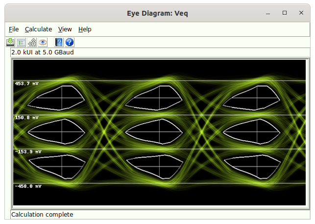

# Eye Diagram Dialog {#sec:Eye-Diagram-Dialog}

The Eye Diagram Dialog appears whenever a [Simulation](08-Simulation.md#sec:Simulation) or [Virtual Probing](10-Virtual-Probing.md#sec:Virtual-Probing) project is calculated, and the project contains an [Eye Probe](23-Built-in-Devices-Parts.md#device:Eye-Probe) or [Differential Eye Probe](23-Built-in-Devices-Parts.md#device:Differential-Eye-Probe).

See [Eye Diagram Calculation](17-Eye-Diagram-Calculation.md#sec:Eye-Diagram-Calculation) for how the eye diagram is calculated.

The Eye Diagram Dialog consists of a menu bar and toolbar buttons that enable certain tasks to be executed. These are:

- [File](16-Eye-Diagram-Dialog.md#sub:Eye-Diagram-File) - tasks for saving eye diagrams to files.

- [Calculate](16-Eye-Diagram-Dialog.md#sub:Eye-Diagram-Calculate) - tasks dealing with the simulation and calculation of the eye diagram.

- [View](16-Eye-Diagram-Dialog.md#sub:Eye-Diagram-View) - tasks for viewing eye diagram measurements.

- [Help](16-Eye-Diagram-Dialog.md#sub:Eye-Diagram-Help) - tasks dealing with the help system.

## File {#sub:Eye-Diagram-File}

The tasks in this category are used for saving eye diagrams to files. Currently, the only supported command is:

- [Save Image To File](16-Eye-Diagram-Dialog.md#Control-Help:Save-Eye-Diagram-Image) - for saving images to files.

### Save Image To File {#Control-Help:Save-Eye-Diagram-Image}

| *Dialog* | [Eye Diagram Dialog](16-Eye-Diagram-Dialog.md#sec:Eye-Diagram-Dialog) |
|:--:|:--:|
| *Menu System* | File Save |
| *Navigation* | Alt+F,S |
| *Key Binding* | None |
| *Toolbar* |  |
| *Availability* | Always |

Saves the eye diagram image to a variety of graphics formats including .png, .bmp, .jpg, .gif, and .tiff.

## Calculate {#sub:Eye-Diagram-Calculate}

The tasks in this category are for dealing with calculation. These tasks are:

- [Calculation Properties](15-Main-Schematic-Dialog.md#Control-Help:Calculation-Properties) - for editing the simulation calculation properties.

- [Eye Diagram Properties](16-Eye-Diagram-Dialog.md#Control-Help:Eye-Diagram-Properties) - for editing the eye diagram calculation properties.

- [Recalculate](14-Simulator-Dialog.md#Control-Help:Recalculate) - for recalculating the entire simulation.

- [Only Recalculate Eye Diagram](16-Eye-Diagram-Dialog.md#Control-Help:Only-Recalculate-Eye-Diagram) - for only recalculating the eye diagram.

### Eye Diagram Properties {#Control-Help:Eye-Diagram-Properties}

|    *Dialog*    |   [Eye Diagram Dialog](16-Eye-Diagram-Dialog.md#sec:Eye-Diagram-Dialog)    |
|:--------------:|:--------------------------------------------------:|
| *Menu System*  | [Calculate](15-Main-Schematic-Dialog.md#sub:Calculate) Eye Diagram Properties |
|  *Navigation*  |                      Alt+C,E                       |
| *Key Binding*  |                        None                        |
|   *Toolbar*    |                        None                        |
| *Availability* |                       Always                       |

Issuing the Eye Diagram Properties command brings up the [Eye Diagram Properties Dialog](21-Eye-Diagram-Properties-Dialog.md#sec:Eye-Diagram-Properties-Dialog) dialog for configuring how the eye diagram is calculated and shown.

### Only Recalculate Eye Diagram {#Control-Help:Only-Recalculate-Eye-Diagram}

| *Dialog* | [Eye Diagram Dialog](16-Eye-Diagram-Dialog.md#sec:Eye-Diagram-Dialog) |
|:--:|:--:|
| *Menu System* | [Calculate](15-Main-Schematic-Dialog.md#sub:Calculate) Only Recalculate Eye Diagram |
| *Navigation* | Alt+C,O |
| *Key Binding* | None |
| *Toolbar* |  |
| *Availability* | Always |

Issuing this command causes only the eye diagram to be recalculated (see [Eye Diagram Calculation](17-Eye-Diagram-Calculation.md#sec:Eye-Diagram-Calculation) for more information). This command is useful when only changes to the [Eye Diagram Properties](16-Eye-Diagram-Dialog.md#Control-Help:Eye-Diagram-Properties) have been made, and there is no need to redo the entire simulation.

## View {#sub:Eye-Diagram-View}

The tasks in this category are for dealing with viewing measurement results. These tasks are:

- [Eye Measurements](16-Eye-Diagram-Dialog.md#Control-Help:Eye-Measurements) - for viewing eye measurements.

- [Bathtub Curve](16-Eye-Diagram-Dialog.md#Control-Help:Bathtub-Curve) - for viewing bathtub curves.

- [Sampled Waveforms](16-Eye-Diagram-Dialog.md#Control-Help:Sampled-Waveforms) – for view waveforms overlaid with the sample points.

### Eye Measurements {#Control-Help:Eye-Measurements}

|    *Dialog*    | [Eye Diagram Dialog](16-Eye-Diagram-Dialog.md#sec:Eye-Diagram-Dialog)  |
|:--------------:|:----------------------------------------------:|
| *Menu System*  | [View](16-Eye-Diagram-Dialog.md#sub:Eye-Diagram-View) Eye Measurements |
|  *Navigation*  |                    Alt+V,E                     |
| *Key Binding*  |                      None                      |
|   *Toolbar*    |                      None                      |
| *Availability* |                     Always                     |

Issuing the Eye Measurements command brings up the [Eye Diagram Measurements Dialog](18-Eye-Diagram-Measurements-Dialog.md#sec:Eye-Diagram-Measurements-Dialog) for viewing eye measurements.

### Bathtub Curve {#Control-Help:Bathtub-Curve}

|    *Dialog*    | [Eye Diagram Dialog](16-Eye-Diagram-Dialog.md#sec:Eye-Diagram-Dialog) |
|:--------------:|:---------------------------------------------:|
| *Menu System*  |  [View](16-Eye-Diagram-Dialog.md#sub:Eye-Diagram-View) Bathtub Curve  |
|  *Navigation*  |                    Alt+V,B                    |
| *Key Binding*  |                     None                      |
|   *Toolbar*    |                     None                      |
| *Availability* |                    Always                     |

Issuing this command brings up the [Bathtub Curves Dialog](19-Bathtub-Curves-Dialog.md#sec:Bathtub-Curves-Dialog) for viewing bathtub curves.

### Sampled Waveforms {#Control-Help:Sampled-Waveforms}

|    *Dialog*    |  [Eye Diagram Dialog](16-Eye-Diagram-Dialog.md#sec:Eye-Diagram-Dialog)  |
|:--------------:|:-----------------------------------------------:|
| *Menu System*  | [View](16-Eye-Diagram-Dialog.md#sub:Eye-Diagram-View) Sampled Waveforms |
|  *Navigation*  |                     Alt+V,S                     |
| *Key Binding*  |                      None                       |
|   *Toolbar*    |                      None                       |
| *Availability* |                     Always                      |

Issuing this command brings up the [Sampled Waveforms Dialog](20-Sampled-Waveforms-Dialog.md#sec:Sampled-Waveforms-Dialog) for viewing the waveform overlaid with the sample points.

## Help {#sub:Eye-Diagram-Help}

The tasks in this category are for dealing with the eye diagram help system.

The tasks are:

- [Open Help File](16-Eye-Diagram-Dialog.md#Control-Help:Eye-Diagram-Open-Help-File) - opens the help system to the [Eye Diagram Dialog](16-Eye-Diagram-Dialog.md#sec:Eye-Diagram-Dialog) section.

- [Control Help](16-Eye-Diagram-Dialog.md#Control-Help:Eye-Diagram-Control-Help) - enables control help for the elements in the [Eye Diagram Dialog](16-Eye-Diagram-Dialog.md#sec:Eye-Diagram-Dialog).

### Open Help File {#Control-Help:Eye-Diagram-Open-Help-File}

| *Dialog* | [Eye Diagram Dialog](16-Eye-Diagram-Dialog.md#sec:Eye-Diagram-Dialog) |
|:--:|:--:|
| *Menu System* | [Help](16-Eye-Diagram-Dialog.md#sub:Eye-Diagram-Help) Open Help File |
| *Navigation* | Alt+H,O |
| *Key Binding* | None |
| *Toolbar* |  |
| *Availability* | Always |

This command opens the help system to the [Eye Diagram Dialog](16-Eye-Diagram-Dialog.md#sec:Eye-Diagram-Dialog) section.

### Control Help {#Control-Help:Eye-Diagram-Control-Help}

| *Dialog* | [Eye Diagram Dialog](16-Eye-Diagram-Dialog.md#sec:Eye-Diagram-Dialog) |
|:--:|:--:|
| *Menu System* | [Help](16-Eye-Diagram-Dialog.md#sub:Eye-Diagram-Help) Control Help |
| *Navigation* | Alt+H,C |
| *Key Binding* | None |
| *Toolbar* |  |
| *Availability* | Always |

Control help allows you to get help on any command.

When in control help, all of the commands are activated. This includes key bindings, toolbar buttons, and menu elements. However, issuing any of the possible commands takes you to a location in the help system corresponding to the desired control instead of actually issuing the command.

Control help stays active until you either press the escape key, or touch somewhere in the canvas.

