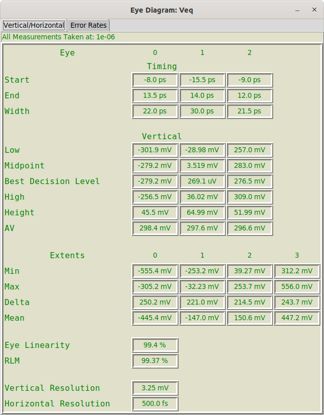
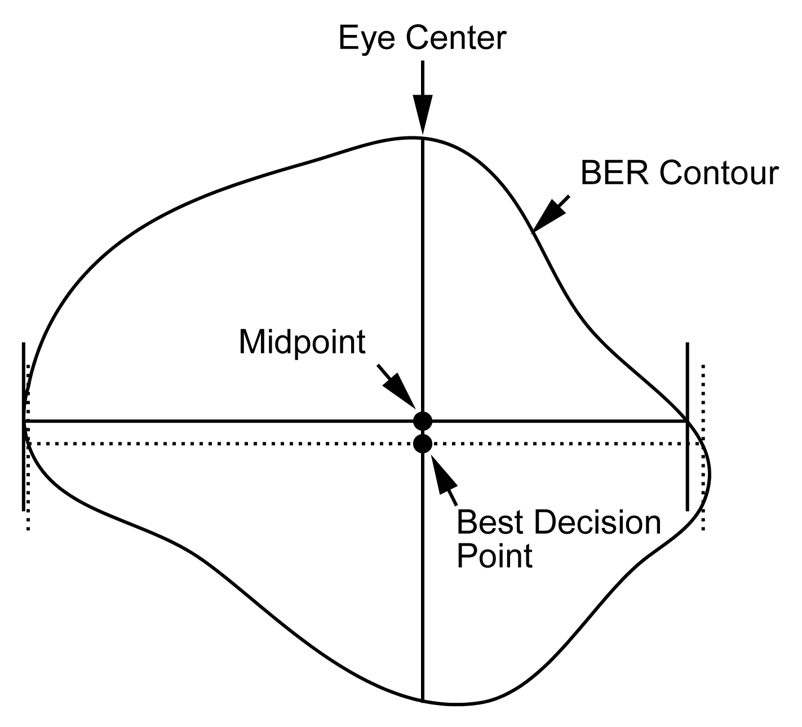
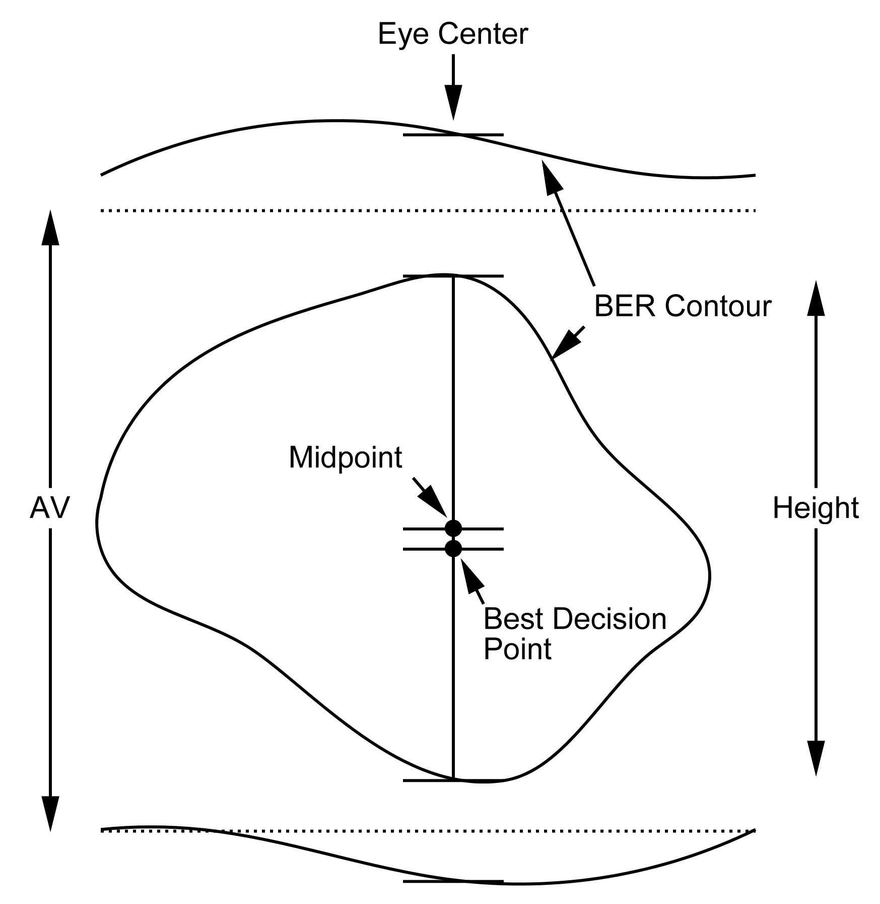
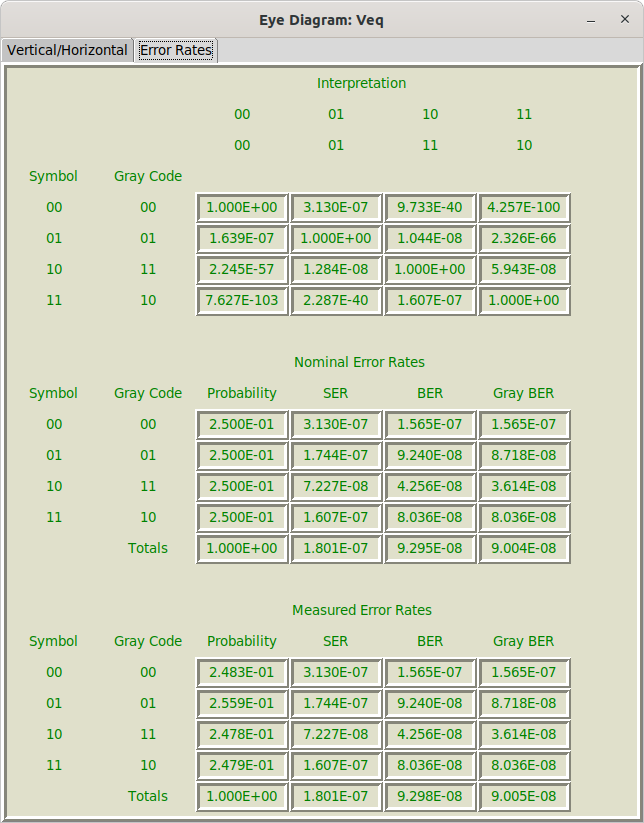

# Eye Diagram Measurements Dialog {#sec:Eye-Diagram-Measurements-Dialog}

Eye diagram measurements are configured in the [Eye Diagram Properties Dialog](21-Eye-Diagram-Properties-Dialog.md#sec:Eye-Diagram-Properties-Dialog) when configuring an [Eye Probe](23-Built-in-Devices-Parts.md#device:Eye-Probe) in a schematic. See [Eye Diagram Measurement Properties](21-Eye-Diagram-Properties-Dialog.md#sub:Eye-Diagram-Measurement).

After eye diagram creation, following the start of [Simulation](08-Simulation.md#sec:Simulation), the [Eye Diagram Dialog](16-Eye-Diagram-Dialog.md#sec:Eye-Diagram-Dialog) is opened.

Eye diagram measurements are available by selecting [Eye Measurements](16-Eye-Diagram-Dialog.md#Control-Help:Eye-Measurements) from the [Eye Diagram Dialog](16-Eye-Diagram-Dialog.md#sec:Eye-Diagram-Dialog).

If [Eye Measurements](16-Eye-Diagram-Dialog.md#Control-Help:Eye-Measurements) is not available in the dialog, then either the [Measure Eye Parameters](22-Eye-Diagram-Properties.md#sub:Measure-Eye-Parameters) property is set to False, or the measurements could not be made.

There are two tabs in the Eye Measurements Dialog:

- [Vertical/Horizontal](18-Eye-Diagram-Measurements-Dialog.md#sub:Vertical/Horizontal) – standard measurements of eye height, eye width, etc.

- [Error Rates](18-Eye-Diagram-Measurements-Dialog.md#sub:Error-Rates) - measurements of, and the breakdown of bit error rate (BER) calculations.

## Vertical/Horizontal {#sub:Vertical/Horizontal}

The vertical/horizontal measurements are, as the name implies, various vertical and horizontal measurements that are made on the eye.

The very first thing to note is the BER that the measurements are taken at. This is shown on top of the dialog and is the value configured in [BER Exponent for Measure](22-Eye-Diagram-Properties.md#sub:BER-Exponent-for-Measure) in the [Eye Diagram Properties Dialog](21-Eye-Diagram-Properties-Dialog.md#sec:Eye-Diagram-Properties-Dialog). (see [Eye Measurement Properties](21-Eye-Diagram-Properties-Dialog.md#pc:Eye-Measurement-Properties)). This value is the probability contour used to denote the perimeter of the eye.

The first section of the measurements regards the eye itself, with measurements in each column representing the eye number (from 0 to $2^{BitsPerSymbol}-1$), where eye zero is on the bottom. The measurements are broken into two sections:

1.  [Timing](18-Eye-Diagram-Measurements-Dialog.md#sub:Timing) – Horizontal (time) measurements of the eye.

2.  [Vertical](18-Eye-Diagram-Measurements-Dialog.md#sub:Vertical) – Vertical (voltage) measurements of the eye. These also include measurements of the levels, or extents.

Below all of this, optionally shown for PAM-4 and above, are measurements of [Linearity](18-Eye-Diagram-Measurements-Dialog.md#sub:Linearity).

At the end, the [Resolution](18-Eye-Diagram-Measurements-Dialog.md#sub:Resolution) is indicated.

### Timing {#sub:Timing}

Timing measurements are made from a line that spans the contour horizontally. This line is defined by a few properties, not to mention the actual alignment of the eye:

1.  The horizontal extent of the line is governed by the [BER Exponent for Measure](22-Eye-Diagram-Properties.md#sub:BER-Exponent-for-Measure). See [Eye Measurement Properties](21-Eye-Diagram-Properties-Dialog.md#pc:Eye-Measurement-Properties).

2.  The vertical placement of the line is governed by the choice of [Decision Level](22-Eye-Diagram-Properties.md#sub:Decision-Level).

Given these choices, the following measurements are made, for each eye:

- Start – the start time.

- End – the end time.

- Width – the width of the eye.

### Vertical {#sub:Vertical}

Vertical measurements are made from a line that spans the contour vertically. The extents of the line is based on the [BER Exponent for Measure](22-Eye-Diagram-Properties.md#sub:BER-Exponent-for-Measure). See [Eye Measurement Properties](21-Eye-Diagram-Properties-Dialog.md#pc:Eye-Measurement-Properties). Each column in the vertical measurements contains, for each eye:

- Low – the lowest point of the eye (where the vertical line touches the contour).

- Midpoint – the midpoint of the eye (the average of the Low and the High).

- Best Decision Level – the location along the line where the probability is the minimum. This is deemed the best threshold to employ, if possible, to sample the waveform.

- High – the highest point of the eye (where the vertical line touches the contour).

- Height – the difference between the High and the Low.

- AV – This is the distance between the mean levels. This is explained better in Extents below.

**(Vertical) Extents**

The vertical extents are measurements made not directly from the eye itself, but from the vertical levels that surround the eye. These levels are the intended voltages representing each bit. The measurements are made vertically between probabilities based on the [BER Exponent for Measure](22-Eye-Diagram-Properties.md#sub:BER-Exponent-for-Measure). See [Eye Measurement Properties](21-Eye-Diagram-Properties-Dialog.md#pc:Eye-Measurement-Properties).

There are $2^{BitsPerSymbol}$ vertical extents. The lowest extent is extent zero.

For each extent, the following measurements are made:

- Min – the lowest level of the extent, where it touches the lowest vertical value below the BER specified, or the top of the eye below.

- Max – the highest level of the extent, where it touches the highest vertical value below the BER specified, or the bottom of the eye above.

- Delta – the difference between the Max and Min.

- Mean – the mean vertical value between the Max and the Min. This is not the average of the Max and the Min. It is the best value to describe the level based on the probabilities in the vertical histogram slice through the eye.

Note that normally, in serial data testing, these extents are measured using a specific pattern to estimate the intended transmitted levels. This software tries to measure these extents statistically from the eye.

### Linearity {#sub:Linearity}

Linearity is only defined for PAM-4 and above. It is a measure of the similarity in height of the eyes, or more properly, the evenness in the level extents.

There are two measures, where 100% is the best, and 0% is the worst:

1.  Eye Linearity – This is the simplest and preferred measurement. It is the ratio of the minimum Delta Extent to the maximum Delta Extent (expressed as a percentage).

2.  RLM (Relative Level Mismatch) – Defined according to a complicated formula according to AN-835, 2019.03.12 from Intel. Assuming that the four level extents for PAM-4 are denoted $V_{0}$, $V_{1}$, $V_{2}$, and $V_{3}$, and that $V_{min}=\left(V_{0}+V_{3}\right)/2$. We define $ES1=\left(V_{1}-V_{min}\right)/\left(V_{0}-V_{min}\right)$ and $ES2=\left(V_{2}-V_{min}\right)/\left(V_{3}-V_{min}\right)$. RLM is defined as:

    

    $RLM=\min\left(3\cdot ES1,3\cdot ES2,2-3\cdot ES1,2-3\cdot ES2\right)$

    

    expressed as a percentage.

### Resolution {#sub:Resolution}

The vertical and horizontal resolution is shown at the bottom:

- Vertical Resolution – the vertical height of each pixel in the eye diagram. Vertical resolution can be improved by increasing [Number of Rows](22-Eye-Diagram-Properties.md#sub:Number-of-Rows).

- Horizontal Resolution – the horizontal width of each pixel in the eye diagram. Horizontal resolution can be improved by increasing [Number of Columns](22-Eye-Diagram-Properties.md#sub:Number-of-Columns).

## Error Rates {#sub:Error-Rates}

The error rates tab on the [Eye Diagram Measurements Dialog](18-Eye-Diagram-Measurements-Dialog.md#sec:Eye-Diagram-Measurements-Dialog) is available only when [Measure Bathtub Curves](22-Eye-Diagram-Properties.md#sub:Measure-Bathtub-Curves) is set to True. This is because the information in the bathtub curves (see [Bathtub Curves Dialog](19-Bathtub-Curves-Dialog.md#sec:Bathtub-Curves-Dialog)) is used to make all of the error rate computations.

The error rates are broken into three sections:

1.  [Interpretation](18-Eye-Diagram-Measurements-Dialog.md#pc:Interpretation) – information showing the probability that various bits intended are decoded as the intended bit, or other bits.

2.  [Nominal Error Rates](18-Eye-Diagram-Measurements-Dialog.md#pc:Nominal-Error-Rates) – based on the bit interpretations, along with a uniform bit density (all probabilities of symbols transmitted are equal), the symbol error rate (SER) and bit error rate (BER) is computed.

3.  [Measured Error Rates](18-Eye-Diagram-Measurements-Dialog.md#pc:Measured-Error-Rates) – based on the bit interpretations, along with the measured bit density (the measured probability of symbols transmitted from the eye diagram), the symbol error rate (SER) and bit error rate (BER) is computed.

Note that even if the actual symbol probabilities are all equal, small errors in the extrapolation of histograms can lead to small errors in the measured symbol densities. If the user knows that the symbol density is uniform, then the Nominal Error Rate can be used, otherwise, the Measured Error Rate is what was actually measured. In practice, they ought not to differ by a lot.

### Interpretation {#pc:Interpretation}

The interpretation table has the symbol transmitted along each row and the probability of the symbol interpretation along each column. If PAM-4 and above are employed, then Gray coding information is also provided (with the normal bit identification as 00, 01, 10, 11 first, with the Gray code as 00, 01, 11, 10, second).

If the user is unfamiliar with Gray coding, it is a method of encoding the bits employed so that on each side of a symbol, there is only a single bit transition. Gray coding is always employed for PAM-4 and above and tends to make the BER identical the SER divided by the [Bits per Symbol](22-Eye-Diagram-Properties.md#sub:Eye-Diagram-Bits-per-Symbol). This is because symbol errors are usually such that a symbol is accidentally interpreted as an adjacent Gray coded symbol, thus causing a single bit error.

The probabilities for interpretation is derived from the vertical bathtub curve (see [Bathtub Curves Dialog](19-Bathtub-Curves-Dialog.md#sec:Bathtub-Curves-Dialog)).

### Nominal Error Rates {#pc:Nominal-Error-Rates}

The nominal error rate table shows each transmitted symbol in each row (along with its Gray coded symbol), and in each column provides:

- Probability – the probability that a given symbol is transmitted. Nominally, this is the reciprocal of the [Bits per Symbol](22-Eye-Diagram-Properties.md#sub:Eye-Diagram-Bits-per-Symbol).

- SER – the symbol error rate. Based on the [Interpretation](18-Eye-Diagram-Measurements-Dialog.md#pc:Interpretation), this is the probability that, if the symbol is transmitted, it is transmitted in error.

- BER – the bit error rate. Based on the [Interpretation](18-Eye-Diagram-Measurements-Dialog.md#pc:Interpretation), this is the probability that, if the symbol is transmitted, of bits in error. This does not assume Gray coding.

- Gray BER – the Gray coded bit error rate. Based on the [Interpretation](18-Eye-Diagram-Measurements-Dialog.md#pc:Interpretation), this is the probability that, if the symbol is transmitted, of bits in error. This assumes Gray coding.

At the bottom of the table, all values are totaled. The probability it totaled by summing the probabilities. The SER, BER, and Gray BER are sums of the values in the column, weighted by the probability of transmitting the corresponding symbol.

### Measured Error Rates {#pc:Measured-Error-Rates}

The measured error rate table shows each transmitted symbol in each row (along with its Gray coded symbol), and in each column provides:

- Probability – the probability that a given symbol is transmitted. This probability is the measured probability for each symbol in the measured eye.

- SER – the symbol error rate. Based on the [Interpretation](18-Eye-Diagram-Measurements-Dialog.md#pc:Interpretation), this is the probability that, if the symbol is transmitted, it is transmitted in error.

- BER – the bit error rate. Based on the [Interpretation](18-Eye-Diagram-Measurements-Dialog.md#pc:Interpretation), this is the probability that, if the symbol is transmitted, of bits in error. This does not assume Gray coding.

- Gray BER – the Gray coded bit error rate. Based on the [Interpretation](18-Eye-Diagram-Measurements-Dialog.md#pc:Interpretation), this is the probability that, if the symbol is transmitted, of bits in error. This assumes Gray coding.

At the bottom of the table, all values are totaled. The probability it totaled by summing the probabilities. The SER, BER, and Gray BER are sums of the values in the column, weighted by the probability of transmitting the corresponding symbol.

