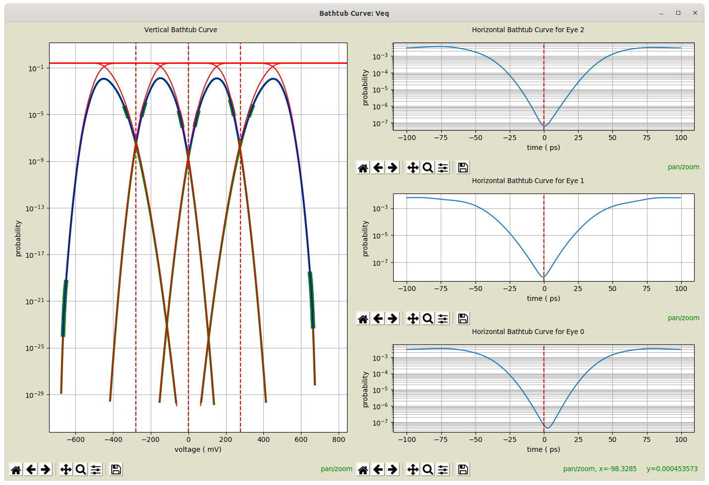

# Bathtub Curves Dialog {#sec:Bathtub-Curves-Dialog}

Eye diagram measurements are configured in the [Eye Diagram Properties Dialog](21-Eye-Diagram-Properties-Dialog.md#sec:Eye-Diagram-Properties-Dialog) when configuring an [Eye Probe](23-Built-in-Devices-Parts.md#device:Eye-Probe) in a schematic. See [Eye Diagram Measurement Properties](21-Eye-Diagram-Properties-Dialog.md#sub:Eye-Diagram-Measurement).

After eye diagram creation, following the start of [Simulation](08-Simulation.md#sec:Simulation), the [Eye Diagram Dialog](16-Eye-Diagram-Dialog.md#sec:Eye-Diagram-Dialog) is opened.

The Bathtub Curve Dialog is available by selecting [Bathtub Curve](16-Eye-Diagram-Dialog.md#Control-Help:Bathtub-Curve) from the [Eye Diagram Dialog](16-Eye-Diagram-Dialog.md#sec:Eye-Diagram-Dialog).

If [Bathtub Curve](16-Eye-Diagram-Dialog.md#Control-Help:Bathtub-Curve) is not available in the dialog, then either the [Measure Bathtub Curves](22-Eye-Diagram-Properties.md#sub:Measure-Bathtub-Curves) property is set to False, or the measurements could not be made.

The dialog is broken into a left and right half:

- Vertical Bathtub Curve – on the left. This shows:

  - a histogram, in blue, of the vertical slice of the eye diagram. These probabilities are directly measured.

  - fitted tails of the histogram, in fat green lines, showing the region of the histogram used to perform each tail fit. The location of these areas is governed by the [Decades Above for Fit](22-Eye-Diagram-Properties.md#sub:Decades-Above-for) and the [Minimum Points for Fit](22-Eye-Diagram-Properties.md#sub:Minimum-Points-for-Fit). See [Bathtub Curve Measurement Properties](21-Eye-Diagram-Properties-Dialog.md#pc:Bathtub-Curve-Measurement-Properties).

  - histograms for each symbol transmitted, in green, resulting from fitted and actual data.

  - cumulative distribution functions (CDFs), in red, representing probabilities for how the given symbols are interpreted.

  - decision levels, in red, vertical, dashed lines, indicating where decisions are made.

- Horizontal Bathtub Curves – on the right. This shows, for each eye, the probabilities for a horizontal slice taken through the histogram at the decision point (governed by the [Decision Level](22-Eye-Diagram-Properties.md#sub:Decision-Level)), along with a vertical, dashed, red line showing the middle of the eye.

