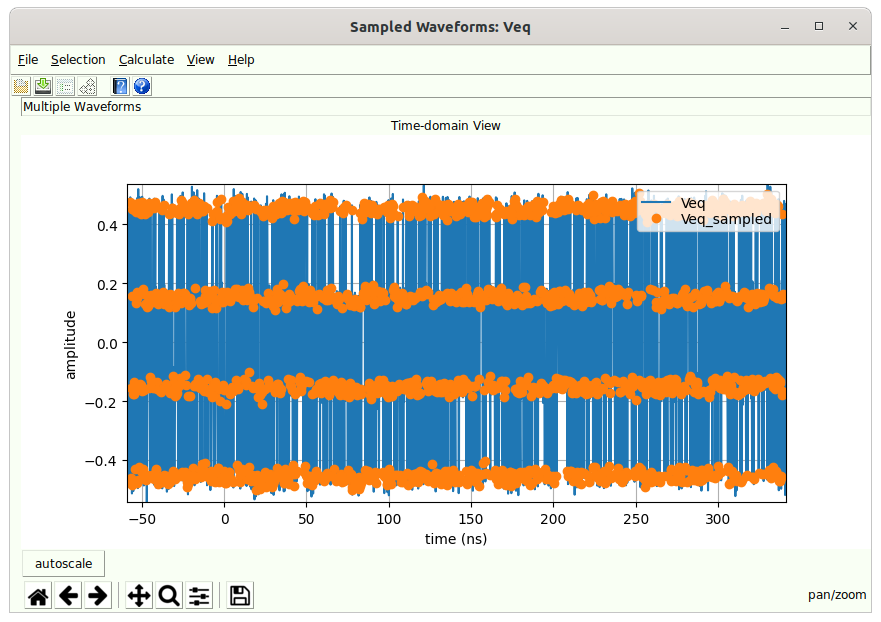
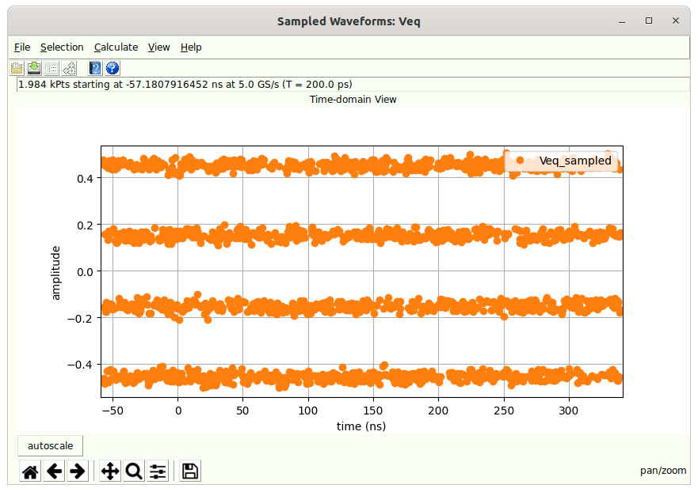

# Sampled Waveforms Dialog {#sec:Sampled-Waveforms-Dialog}

This dialog is a [Simulator Dialog](14-Simulator-Dialog.md#sec:Simulator-Dialog) showing two waveforms:

- The underlying waveform used to measure the eye.

- The sampled waveform, where the samples are taken at the sample location at the middle of the eye.

If desired, the underlying waveform can be turned off to reveal only the samples taken in a so-called constellation plot:

