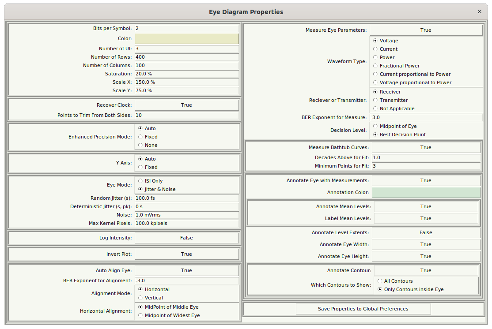
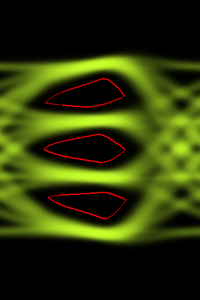
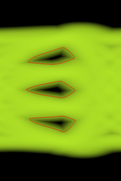
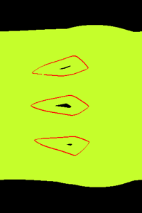

# Eye Diagram Properties Dialog {#sec:Eye-Diagram-Properties-Dialog}

The Eye Diagram Properties are accessed either from the device properties dialog for an [Eye Probe](23-Built-in-Devices-Parts.md#device:Eye-Probe) or [Differential Eye Probe](23-Built-in-Devices-Parts.md#device:Differential-Eye-Probe) placed in the schematic, or by using the [Eye Diagram Properties](16-Eye-Diagram-Dialog.md#Control-Help:Eye-Diagram-Properties) command in an [Eye Diagram Dialog](16-Eye-Diagram-Dialog.md#sec:Eye-Diagram-Dialog) from an already created eye.

The properties control the [Eye Diagram Calculation](17-Eye-Diagram-Calculation.md#sec:Eye-Diagram-Calculation).

When an [Eye Probe](23-Built-in-Devices-Parts.md#device:Eye-Probe) or [Differential Eye Probe](23-Built-in-Devices-Parts.md#device:Differential-Eye-Probe) is placed in a schematic, the properties are initialized by values held in the [Preferences](29-Preferences.md#sec:Preferences) file. Once initialized however, any changes to the properties are for the particular device (i.e. unique settings can be used for multiple [Eye Probe](23-Built-in-Devices-Parts.md#device:Eye-Probe)s in a schematic). If you like, the settings for a particular device may be saved globally to the preferences file, causing all new eye probe devices to default to these new settings.

The Eye Diagram Properties can be broken into several categories:

- The [Eye Diagram Image Properties](21-Eye-Diagram-Properties-Dialog.md#sub:Eye-Diagram-Image-Properties) – Provides properties that determine how the eye diagram bitmap and image will be generated (essentially the entire left half of the dialog).

- The [Eye Diagram Measurement Properties](21-Eye-Diagram-Properties-Dialog.md#sub:Eye-Diagram-Measurement) – Provides Alignment, Measurement, and Annotation Properties (the entire right half of the dialog).

## Eye Diagram Image Properties {#sub:Eye-Diagram-Image-Properties}

The main image is controlled by the properties in the upper left of the dialog:

- [Bits per Symbol](22-Eye-Diagram-Properties.md#sub:Eye-Diagram-Bits-per-Symbol) – defines the type of signaling used. This is really only important for automatic alignment and measurements made from the eye diagram:

  - 1 = NRZ, or PAM-2,

  - 2 = PAM-4.

- [Eye Diagram Color](22-Eye-Diagram-Properties.md#sub:Eye-Diagram-Color) – any 24 bit RGB color can be selected. If the plot is inverted, then this is the color of the eye against a black background. If not inverted, the eye is black against the background color specified.

- [Number of UI](22-Eye-Diagram-Properties.md#sub:Number-of-UI) – this is the number of unit intervals (UI) shown in the eye. Regardless of this setting, the eye is created for a single UI, and then the image is multiplied this many times horizontally.

- [Number of Rows](22-Eye-Diagram-Properties.md#sub:Number-of-Rows) – the number of pixels vertically in the bitmap representing the eye.

- [Number of Columns](22-Eye-Diagram-Properties.md#sub:Number-of-Columns) – the number of pixels horizontally in the bitmap representing a single unit interval of the eye.

- [Saturation](22-Eye-Diagram-Properties.md#sub:Saturation) – determines 50% point setting of a saturation curve used to enhance the drawing of the eye. Lower numbers make more infrequent hits in the eye brighter. Higher numbers make them lower. A setting of 50% makes the eye intensity linear with hit probability. Generally, numbers like 20-30 % yield the best results.

- [Scale X](22-Eye-Diagram-Properties.md#sub:Scale-X) – determines the initial scaling horizontally of the resulting bitmap.

- [Scale Y](22-Eye-Diagram-Properties.md#sub:Scale-Y) – determines the initial scaling vertically of the resulting bitmap.

**Clock Recovery**

Normally, the sample clock is assumed to be perfectly aligned with the clock assumed for the data. In other words, it is assumed that there are exactly a certain number of sample points (not necessarily integer) that make up one unit interval, or one symbol. This usually ensured in the simulation environment. Sometimes, however, waveforms are acquired by an oscilloscope, and there is some, generally small, inaccuracy between the sample clock and the data clock. In this case, drawing the eye will result in a smeared out useless eye.

When waveforms are acquired by an oscilloscope, setting [Recover Clock](22-Eye-Diagram-Properties.md#sub:Recover-Clock) to True enables the simulator to recover the clock for the data, and resample the waveform such that it this clock inaccuracy is removed. In such case, the waveforms are resampled to a sample rate equivalent to two samples per unit interval, and a timing error waveform is generated. To avoid failure from the resampling to reach beyond the extents of the input waveform, set [Points to Trim From Both Sides](22-Eye-Diagram-Properties.md#sub:Points-to-Trim) to some number (like 20) to trim the edge points, making the waveform smaller, but avoiding failure.

**Enhanced Precision Mode**

The eye is drawn by first resampling the waveform such that its sample period is exactly one pixel horizontally. This can cause problems in regions of the eye that have a fast slew rate (i.e. slew many pixels vertically in a given sample period). To improve the situation, [Enhanced Precision Mode](22-Eye-Diagram-Properties.md#sub:Enhanced-Precision-Mode) is provided. If the mode is set to None, then it is off, and enhanced precision is not provided. This results in the fastest calculation speed, with the aforementioned problems.

When set to fixed, every probability is calculated from a line segment between each pixel, which is divided into the number of [Enhanced Precision Steps](22-Eye-Diagram-Properties.md#sub:Enhanced-Precision-Steps) specified. This results in the slowest calculation speed, but with a prettier and more accurate eye.

Auto, the preferred mode, causes the algorithm to automatically determine the number of precision steps based on how many pixels the waveform slews vertically in a given sample. The number of steps is twice the vertical delta. Auto is the best balance between speed and accuracy.

The example above is for a change of two pixels. Here, the step size is shown as five (the first pixel is not counted, as it has already been calculated, usually). Since there are five pixel steps, the probability for each pixel is $1/5$. Then, for each pixel step, the probability that the pixel occupies in the four possible pixels it straddles is apportioned to the four pixels based on how much area is overlapping. In the end, the result is that probabilities have been accumulated for all of the six pixels shown above.

**Y Axis Control**

Generally, the Y Axis is determined automatically as 10% beyond the maximum and minimum extents of the waveform. This can be fixed to specified voltage levels by setting [Y Axis](22-Eye-Diagram-Properties.md#sub:Y-Axis) to Fixed, and entering the [Minimum Y](22-Eye-Diagram-Properties.md#sub:Minimum-Y) and [Maximum Y](22-Eye-Diagram-Properties.md#sub:Maximum-Y) values.

**Jitter and Noise Addition**

Eyes can be generated from only the input supplied waveform by specifying the [Eye Mode](22-Eye-Diagram-Properties.md#sub:Eye-Mode) as ISI Only. Specifying the [Eye Mode](22-Eye-Diagram-Properties.md#sub:Eye-Mode) as Jitter & Noise allows for the addition of jitter and noise statistically through the creation of a smoothing kernel.

The kernel is specified as the convolution of two 2D kernels (to produce a 3D kernel). The vertical 2D kernel is a Gaussian determined by the specified amount of [Noise](22-Eye-Diagram-Properties.md#sub:Noise) (in rms voltage). The horizontal 2D kernel is again two kernels convolved with each other horizontally. The first is a Gaussian determined by the amount of [Random Jitter](22-Eye-Diagram-Properties.md#sub:Random-Jitter) specified (as rms jitter), and the other is a dual Dirac, where each delta function is $1/2$ in area, separated by the amount of [Deterministic Jitter](22-Eye-Diagram-Properties.md#sub:Deterministic-Jitter) specified.

The vertical [Noise](22-Eye-Diagram-Properties.md#sub:Noise) is entered as an **Inherent Noise** value. A companion read-only **External Noise** box holds the total integrated output noise computed by a [Statistical Noise Analysis](31-Statistical-Noise-Dialog.md#sub:Statistical-Noise-Analysis) for this eye probe. The noise used to build the vertical kernel is the root-sum-square of the two, $\sqrt{\mathrm{Inherent\ Noise}^{2}+\mathrm{External\ Noise}^{2}}$, so any noise integrated by the statistical noise analysis is automatically added to the eye diagram.

The desired size of the kernel is such that 10 standard deviations exist on all sides of the kernel. This is for good probability calculations, even when probabilities are low.

To prevent pathological situations resulting from the incorrect entry of jitter and noise amounts, the resulting kernel is limited in size to the amount specified as the [Max Kernel Pixels](22-Eye-Diagram-Properties.md#sub:Max-Kernel-Pixels).

**Log Intensity**

|  |  |  |
|:---|:---|:---|
| No log intensity | Log intensity (0 to -18 exponent) | Log intensity (-17.999 to -18 exponent) |

[Log Intensity](22-Eye-Diagram-Properties.md#sub:Log-Intensity) is used to further enhance the eye diagram. Normally, the intensity is linear (mostly) with the probability. In Log Intensity mode, the intensity is linear with the log of the probability, with the [Min Exponent](22-Eye-Diagram-Properties.md#sub:Min-Exponent) specifying zero intensity, and the [Max Exponent](22-Eye-Diagram-Properties.md#sub:Max-Exponent) specifying full intensity. This is particularly useful to identify the low probability areas of the eye.

In the above plots, all are shown with their -6 probability exponent (1 in $10^{6}$) contour shown. The left plot is shown normally, where the contour is in the middle of a large dark area. The middle plot shows it in Log Intensity mode with the max exponent of 0 and the min exponent of -18. This shows better the gradation of probabilities throughout the eye center. The right plot is showing all probabilities above 1 in $10^{18}$ as max intensity, and all probabilities below that as black. This is useful for seeing regions where a given specification should be met.

Note that the [Min Exponent](22-Eye-Diagram-Properties.md#sub:Min-Exponent) specified must be less than the [Max Exponent](22-Eye-Diagram-Properties.md#sub:Max-Exponent) specified, otherwise the calculation will fail.

**Invert Plot**

Inversion of the eye diagram plot is controlled by [Invert Plot](22-Eye-Diagram-Properties.md#sub:Invert-Plot). Normally, the plot is inverted. When inverted, the eye is the specified color against a black background. If not inverted, the eye is black against the background color specified.

**Eye Alignment**

The simplest way to generate eye diagrams is to ensure that the waveform passes through the midpoint of the eye at zero time. In this situation, eye alignment is unnecessary. It is, however, very convenient to have the eye aligned automatically. Setting [Auto Align Eye](22-Eye-Diagram-Properties.md#sub:Auto-Align-Eye) to True, enables this and shows a number of other parameters in the dialog.

Eye alignment is performed using measurements on a contour of the eye at a certain probability, specified by the [BER Exponent for Alignment](22-Eye-Diagram-Properties.md#sub:BER-Exponent-for-Alignment). Usually, this is set to -3 (i.e. the contour used is at the internal boundary of the eye with a probability of one in $10^{-3}$. Using a relatively high probability allows for eyes to be aligned even in extreme cases where the BER is very poor.

In the case of PAM-2, the algorithm searches the vertical extents of these contours searching for the single widest opening. For PAM-2, it searches for the widest minimum opening. Once the horizontal location of these vertical extents are found, there are four options for alignment in the [Alignment Mode](22-Eye-Diagram-Properties.md#sub:Alignment-Mode):

- Horizontal Alignment – the eye is aligned based on horizontal measurements using the [Horizontal Alignment](22-Eye-Diagram-Properties.md#sub:Horizontal-Alignment) mode:

  - Middle – The center of the eye is found by first computing the vertical location of the widest horizontal opening of the middle eye, then computing the horizontal midpoint.

  - Max – The center of the eye is found by first computing the vertical location of the widest horizontal opening of the widest eye, then computing the horizontal midpoint.

- Vertical Alignment – the eye is aligned based on vertical measurements using the [Vertical Alignment](22-Eye-Diagram-Properties.md#sub:Vertical-Alignment) mode:

  - MaxMin – The center of the eye is found by finding the horizontal location where the vertical opening is maximized for the narrowest eye.

  - Max – The center of the eye is found by finding the horizontal location where the vertical opening is maximized for any eye.

If auto alignment fails, the eye is still produced, but not aligned. In these cases, try making the [BER Exponent for Alignment](22-Eye-Diagram-Properties.md#sub:BER-Exponent-for-Alignment) larger.

## Eye Diagram Measurement Properties {#sub:Eye-Diagram-Measurement}

If [Measure Eye Parameters](22-Eye-Diagram-Properties.md#sub:Measure-Eye-Parameters) is set to False, no measurements are made on the eye. Turn this to False when debugging eye diagram creation that is failing due to any inability to perform eye diagram measurements.

Setting [Measure Eye Parameters](22-Eye-Diagram-Properties.md#sub:Measure-Eye-Parameters) to True enables a large amount of other parameter choices:

- [Eye Measurement Properties](21-Eye-Diagram-Properties-Dialog.md#pc:Eye-Measurement-Properties) – the properties that determine how [Vertical/Horizontal](18-Eye-Diagram-Measurements-Dialog.md#sub:Vertical/Horizontal) eye measurements are made. These measurements appear in the left tab of the [Eye Diagram Measurements Dialog](18-Eye-Diagram-Measurements-Dialog.md#sec:Eye-Diagram-Measurements-Dialog).

- [Bathtub Curve Measurement Properties](21-Eye-Diagram-Properties-Dialog.md#pc:Bathtub-Curve-Measurement-Properties) – The properties that determine the bathtub curve generation, which allows the [Error Rates](18-Eye-Diagram-Measurements-Dialog.md#sub:Error-Rates) measurements. These measurements appear in the right tab of the [Eye Diagram Measurements Dialog](18-Eye-Diagram-Measurements-Dialog.md#sec:Eye-Diagram-Measurements-Dialog). These can be analyzed looking at the [Bathtub Curves Dialog](19-Bathtub-Curves-Dialog.md#sec:Bathtub-Curves-Dialog).

- [Eye Annotation Properties](21-Eye-Diagram-Properties-Dialog.md#pc:Eye-Annotation-Properties) – measurements made on the eye can be shown by painting directly on the eye.

### Eye Measurement Properties {#pc:Eye-Measurement-Properties}

There are two properties that effect how the eye diagram measurements are made:

- [BER Exponent for Measure](22-Eye-Diagram-Properties.md#sub:BER-Exponent-for-Measure) – this is the probability contour on each eye where the measurements are made. This is usually at the BER specified by a given standard.

- [Decision Level](22-Eye-Diagram-Properties.md#sub:Decision-Level) – either of:

  - Midpoint of Eye – as it says, the decision level is taken at the vertical midpoint of the eye.

  - Best Decision Point – the least likely vertical location in the eye.

Note that the best decision point is always calculated and shown in the [Vertical/Horizontal](18-Eye-Diagram-Measurements-Dialog.md#sub:Vertical/Horizontal) tab of the [Eye Diagram Measurements Dialog](18-Eye-Diagram-Measurements-Dialog.md#sec:Eye-Diagram-Measurements-Dialog), but if Best Decision Point is chosen, the eye width will be calculated at this vertical location.

### Bathtub Curve Measurement Properties {#pc:Bathtub-Curve-Measurement-Properties}

When [Measure Bathtub Curves](22-Eye-Diagram-Properties.md#sub:Measure-Bathtub-Curves) is set to True, bathtub curves are calculated and accessed through the [Bathtub Curve](16-Eye-Diagram-Dialog.md#Control-Help:Bathtub-Curve) command in the [Eye Diagram Dialog](16-Eye-Diagram-Dialog.md#sec:Eye-Diagram-Dialog), and [Error Rates](18-Eye-Diagram-Measurements-Dialog.md#sub:Error-Rates) measurements tab in the [Eye Diagram Measurements Dialog](18-Eye-Diagram-Measurements-Dialog.md#sec:Eye-Diagram-Measurements-Dialog).

The bathtub curve measurement properties are:

- [Decades Above for Fit](22-Eye-Diagram-Properties.md#sub:Decades-Above-for) – Because many bathtub curves intersect vertically, at some point, meaning the channel is not error free, it becomes somewhat difficult to separate the histograms representing each bit being transmitted. The parameter specifies how many decades above the location where the histograms overlap to begin fitting the histogram. Larger numbers mean that the fit is performed higher on the histogram with less interaction of the other overlapping histogram. Smaller numbers mean that the fit is performed closer to the overlap point. Larger is better, but specifying this as too large may cause the measurement to fail. If so, set this to a small number (like zero) to debug the situation.

- [Minimum Points for Fit](22-Eye-Diagram-Properties.md#sub:Minimum-Points-for-Fit) – This is the number of points on the tail of the histogram to use for the fit. At least three points are needed (a quadratic is fit). A few more points are better to provide an overconstrained fit, but too many points cause the fit to deviate from the tail of the histogram. It is desirable to fit the tail.

### Eye Annotation Properties {#pc:Eye-Annotation-Properties}

When [Annotate Eye with Measurements](22-Eye-Diagram-Properties.md#sub:Annotate-Eye-with-Measurements) is set to True, the resulting eye diagram is decorated with indicators of the measurements made:

- [Annotation Color](22-Eye-Diagram-Properties.md#sub:Annotation-Color) – the color of the annotations. Generally, it’s best to choose a highly contrasting color to the color of the eye (like a complementary color: Green for red eye diagrams, Violet for yellow eye diagrams, Orange for blue eye diagrams, and vice versa.)

- [Annotate Mean Levels](22-Eye-Diagram-Properties.md#sub:Annotate-Mean-Levels) – draw a horizontal line through the most probable levels at each bit.

- [Annotate Levels Extents](22-Eye-Diagram-Properties.md#sub:Annotate-Levels-Extents) – draw horizontal dotted lines at the extents of the bit levels (also the extent of the eye height).

- [Annotate Eye Width](22-Eye-Diagram-Properties.md#sub:Annotate-Eye-Width) – draw a horizontal line representing the horizontal start, stop and width of the eye. This is drawn at a vertical location that depends on the choice of [Decision Level](22-Eye-Diagram-Properties.md#sub:Decision-Level).

- [Annotate Eye Height](22-Eye-Diagram-Properties.md#sub:Annotate-Eye-Height) – draw a vertical line representing the bottom, top and height of the eye. This is always drawn at the horizontal midpoint of the eye.

- [Annotate Contour](22-Eye-Diagram-Properties.md#sub:Annotate-Contour) – try to draw a line around the contour of the eye representing the [BER Exponent for Measure](22-Eye-Diagram-Properties.md#sub:BER-Exponent-for-Measure). It says try, because it is not always perfectly joined. The method used is based on [Which Contours to Show](22-Eye-Diagram-Properties.md#sub:Which-Contours-to-Show):

  - All Contours – at the perimeter of any probability contour having the probability specified. This performs better on more closed eyes.

  - Only Contours inside Eye – at the perimeter of the contour bounded by the eye height and width. This performs better on more open eyes.

## Saving Properties to Global Preferences

The properties assigned whenever an [Eye Probe](23-Built-in-Devices-Parts.md#device:Eye-Probe) is placed in a schematic always come from the [Preferences](29-Preferences.md#sec:Preferences). Oftentimes, it gets annoying to keep editing the properties when there is a setup that you commonly use. When you want all future eye probes to start with a given set of properties, pressing the Save Properties to Global Preference button saves these to the preferences.

