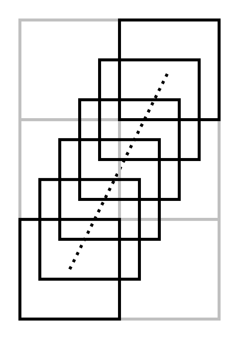
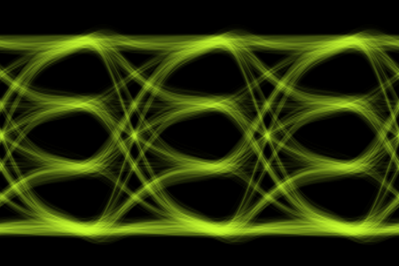
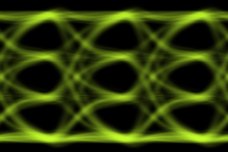
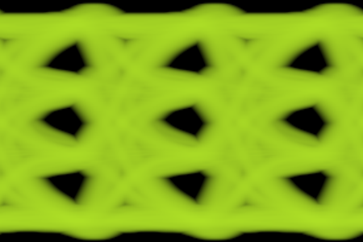

# Eye Diagram Properties {#sec:Eye-Diagram-Properties}

The Eye Diagram Properties are:

| **Preference Description** | **Preference Name** | **Type** | **(Default) Value** | **Availability** |
|:---|:---|:---|:---|:---|
| Bits per Symbol | [Bits per Symbol](22-Eye-Diagram-Properties.md#sub:Eye-Diagram-Bits-per-Symbol) | Int | 1 | Always |
| Color | [Bits per Symbol](22-Eye-Diagram-Properties.md#sub:Eye-Diagram-Bits-per-Symbol) | RGB color (string) | ’#ffffff’ (white) | Always |
| Number of UI | [Number of UI](22-Eye-Diagram-Properties.md#sub:Number-of-UI) | Int | 3 | Always |
| Number of Rows | [Number of Rows](22-Eye-Diagram-Properties.md#sub:Number-of-Rows) | Int | 200 | Always |
| Number of Columns | [Number of Columns](22-Eye-Diagram-Properties.md#sub:Number-of-Columns) | Int | 200 | Always |
| Saturation | [Saturation](22-Eye-Diagram-Properties.md#sub:Saturation) | Float | 20% | Always |
| Scale X | [Scale X](22-Eye-Diagram-Properties.md#sub:Scale-X) | Float | 75% | Always |
| Scale Y | [Scale Y](22-Eye-Diagram-Properties.md#sub:Scale-Y) | Float | 200% | Always |
| Y Axis | [Y Axis](22-Eye-Diagram-Properties.md#sub:Y-Axis) | Enum | Auto | Always |
| Maximum Y | [Maximum Y](22-Eye-Diagram-Properties.md#sub:Maximum-Y) | Float | 1.0 | Y Axis is Fixed |
| Minimum Y | [Minimum Y](22-Eye-Diagram-Properties.md#sub:Minimum-Y) | Float | 0.0 | Y Axis is Fixed |
| Recover Clock | [Recover Clock](22-Eye-Diagram-Properties.md#sub:Recover-Clock) | Bool | False | Always |
| Points to Trim From Both Side | [Points to Trim From Both Sides](22-Eye-Diagram-Properties.md#sub:Points-to-Trim) | Int | 20 | Recover Clock is True |
| Enhanced Precision Mode | [Enhanced Precision Mode](22-Eye-Diagram-Properties.md#sub:Enhanced-Precision-Mode) | Enum | Auto | Always |
| Enhanced Precision Steps | [Enhanced Precision Steps](22-Eye-Diagram-Properties.md#sub:Enhanced-Precision-Steps) | Int | 10 | Enhanced Precision Mode is Fixed |
| Eye Mode | [Eye Mode](22-Eye-Diagram-Properties.md#sub:Eye-Mode) | Enum | ISI Only | Always |
| Random Jitter | [Random Jitter](22-Eye-Diagram-Properties.md#sub:Random-Jitter) | Float | 0 s | Eye Mode is Jitter & Noise |
| Deterministic Jitter | [Deterministic Jitter](22-Eye-Diagram-Properties.md#sub:Deterministic-Jitter) | Float | 0 s | Eye Mode is Jitter & Noise |
| Noise | [Noise](22-Eye-Diagram-Properties.md#sub:Noise) | Float | 0 V | Eye Mode is Jitter & Noise |
| Max Kernel Pixels | [Max Kernel Pixels](22-Eye-Diagram-Properties.md#sub:Max-Kernel-Pixels) | Int | 100,000 | Eye Mode is Jitter & Noise |
| Log Intensity | [Log Intensity](22-Eye-Diagram-Properties.md#sub:Log-Intensity) | Bool | False | Always |
| Min Exponent | [Max Exponent](22-Eye-Diagram-Properties.md#sub:Max-Exponent) | Float | 0 | Log Intensity is True |
| Min Exponent | [Min Exponent](22-Eye-Diagram-Properties.md#sub:Min-Exponent) | Float | -12 | Log Intensity is True |
| Invert Plot | [Invert Plot](22-Eye-Diagram-Properties.md#sub:Invert-Plot) | Bool | True | Always |
| Auto Align Eye | [Auto Align Eye](22-Eye-Diagram-Properties.md#sub:Auto-Align-Eye) | Bool | False | Always |
| BER Exponent for Alignment | [BER Exponent for Alignment](22-Eye-Diagram-Properties.md#sub:BER-Exponent-for-Alignment) | Float | -3 | Auto Align Eye is True |
| Alignment Mode | [Alignment Mode](22-Eye-Diagram-Properties.md#sub:Alignment-Mode) | Enum | Horizontal | Auto Align Eye is True |
| Horizonal Alignment | [Horizontal Alignment](22-Eye-Diagram-Properties.md#sub:Horizontal-Alignment) | Enum | Middle | Auto Align Eye is True and Alignment Mode is Horizontal |
| Vertical Alignment | [Vertical Alignment](22-Eye-Diagram-Properties.md#sub:Vertical-Alignment) | Enum | MaxMin | Auto Align Eye is True and Alignment Mode is Vertical |
| Measure Eye Parameters | [Measure Eye Parameters](22-Eye-Diagram-Properties.md#sub:Measure-Eye-Parameters) | Bool | False | Always |
| BER Exponent for Measure | [BER Exponent for Measure](22-Eye-Diagram-Properties.md#sub:BER-Exponent-for-Measure) | Float | -6 | Measure Eye Parameters is True |
| Decision Level | [Decision Level](22-Eye-Diagram-Properties.md#sub:Decision-Level) | Enum | Mid | Measure Eye Parameters is True |
| Measure Bathtub Curves | [Measure Bathtub Curves](22-Eye-Diagram-Properties.md#sub:Measure-Bathtub-Curves) | Bool | False | Measure Eye Parameters is True |
| Decades Above for Fit | [Decades Above for Fit](22-Eye-Diagram-Properties.md#sub:Decades-Above-for) | Float | 0.5 | Measure Eye Parameters is True and Measure Bathtub Curves is True |
| Minimum Points for Fit | [Minimum Points for Fit](22-Eye-Diagram-Properties.md#sub:Minimum-Points-for-Fit) | Int | 6 | Measure Eye Parameters is True and Measure Bathtub Curves is True |
| Annotate Eye with Measurements | [Annotate Eye with Measurements](22-Eye-Diagram-Properties.md#sub:Annotate-Eye-with-Measurements) | Bool | False | Measure Eye Parameters is True |
| Annotation Color | [Annotation Color](22-Eye-Diagram-Properties.md#sub:Annotation-Color) | RGB color (string) | ’#ffffff’ (white) | Measure Eye Parameters is True and Annotate Eye with Measurements is True |
| Annotate Mean Levels | [Annotate Mean Levels](22-Eye-Diagram-Properties.md#sub:Annotate-Mean-Levels) | Bool | True | Measure Eye Parameters is True and Annotate Eye with Measurements is True |
| Label Mean Levels | [Label Mean Levels](22-Eye-Diagram-Properties.md#sub:Label-Mean-Levels) | Bool | False | Measure Eye Parameters is True and Annotate Eye with Measurements is True and Annotate Mean Levels is True |
| Annotate Level Extents | [Annotate Levels Extents](22-Eye-Diagram-Properties.md#sub:Annotate-Levels-Extents) | Bool | False | Measure Eye Parameters is True and Annotate Eye with Measurements is True |
| Annotate Eye Width | [Annotate Eye Width](22-Eye-Diagram-Properties.md#sub:Annotate-Eye-Width) | Bool | True | Measure Eye Parameters is True and Annotate Eye with Measurements is True |
| Annotate Eye Height | [Annotate Eye Height](22-Eye-Diagram-Properties.md#sub:Annotate-Eye-Height) | Bool | True | Measure Eye Parameters is True and Annotate Eye with Measurements is True |
| Annotate Contour | [Annotate Contour](22-Eye-Diagram-Properties.md#sub:Annotate-Contour) | Bool | False | Measure Eye Parameters is True and Annotate Eye with Measurements is True |
| Which Contours to Show | [Which Contours to Show](22-Eye-Diagram-Properties.md#sub:Which-Contours-to-Show) | Enum | Eye | Measure Eye Parameters is True and Annotate Eye with Measurements is True and Annotate Contour is True |

## Bits per Symbol {#sub:Eye-Diagram-Bits-per-Symbol}

<table>
<thead>
<tr>
<th style="text-align: left;"><strong>Preference Description</strong></th>
<th style="text-align: left;"><strong>Preference Name</strong></th>
<th style="text-align: left;"><strong>Type</strong></th>
<th style="text-align: left;"><strong>(Default) Value</strong></th>
</tr>
</thead>
<tbody>
<tr>
<td style="text-align: left;">Bits per Symbol</td>
<td style="text-align: left;">EyeDiagram.Alignment.BitsPerSymbol</td>
<td style="text-align: left;">Integer</td>
<td style="text-align: left;">

1 or 2

1 is default.
</td>
</tr>
</tbody>
</table>

This sets the number of bits per symbol and defines the type of signaling used. This is really only important for automatic alignment and measurements made from the eye diagram:

- 1 = NRZ, or PAM-2,

- 2 = PAM-4.

## Eye Diagram Color {#sub:Eye-Diagram-Color}

| **Preference Description** | **Preference Name** | **Type** | **(Default) Value** |
|:---|:---|:---|:---|
| Color | EyeDiagram.Color | RGB color (string) | ’#ffffff’ (white) |

This sets the color of the eye diagram. If [Invert Plot](22-Eye-Diagram-Properties.md#sub:Invert-Plot) is set to True, then the background is black and the eye diagram traces are shown in this color. Otherwise, if [Invert Plot](22-Eye-Diagram-Properties.md#sub:Invert-Plot) is set to False, the background is set to this color and the eye diagram traces are shown in black.

The color is edited with the [Color Picker](29-Preferences.md#sub:Color-Picker).

## Number of UI {#sub:Number-of-UI}

| **Preference Description** | **Preference Name** | **Type** | **(Default) Value** |
|:---------------------------|:--------------------|:---------|:--------------------|
| Number of UI               | EyeDiagram.UI       | Int      | 3                   |

This sets the number of unit intervals (UI) shown in the eye diagram. The default value of 3 ensures that even an improperly centered eye can be examined. The unit interval is the reciprocal of the baud rate.

## Number of Rows {#sub:Number-of-Rows}

| **Preference Description** | **Preference Name** | **Type** | **(Default) Value** |
|:---------------------------|:--------------------|:---------|:--------------------|
| Number of Rows             | EyeDiagram.Rows     | Int      | 200                 |

This sets the number of pixels vertically in the underlying eye diagram (the actual image is zoomed by the [Scale Y](22-Eye-Diagram-Properties.md#sub:Scale-Y)). Setting this number too low causes excessive pixelation, while setting it too high causes there to be vertical spaces between dots in the waveform.

The number of rows also affects the measurement [Resolution](18-Eye-Diagram-Measurements-Dialog.md#sub:Resolution).

The default value of 200 is thought to be just the right number.

## Number of Columns {#sub:Number-of-Columns}

| **Preference Description** | **Preference Name** | **Type** | **(Default) Value** |
|:---------------------------|:--------------------|:---------|:--------------------|
| Number of Columns          | EyeDiagram.Columns  | Int      | 200                 |

This sets the number of pixels horizontally in the underlying eye diagram (the actual image is zoomed by the [Scale X](22-Eye-Diagram-Properties.md#sub:Scale-X)). Setting this number too low causes excessive pixelation, while setting it too high causes too much work to be performed, as the waveform is upsampled such that each point lands on these pixels.

The number of columns also affects the measurement [Resolution](18-Eye-Diagram-Measurements-Dialog.md#sub:Resolution).

The default value of 200 is thought to be just the right number, although it is highly advantageous to set this number to a direct multiple of the number of samples in a single unit interval.

## Saturation {#sub:Saturation}

| **Preference Description** | **Preference Name** | **Type** | **(Default) Value** |
|:---|:---|:---|:---|
| Saturation | EyeDiagram.Saturation | Float | 20% |

This sets the saturation of the eye diagram image by setting the brightness to 100% when this percentage of hits in a pixel are reached. This causes the eye to be brightened (or darkened if Invert is False). Higher values cause the eye diagram to be fainter and wispier, and lower values cause it to be darker.

The default value of 20 is thought to be just the right number.

## Scale X {#sub:Scale-X}

| **Preference Description** | **Preference Name** | **Type** | **(Default) Value** |
|:---------------------------|:--------------------|:---------|:--------------------|
| Scale X                    | EyeDiagram.ScaleX   | Float    | 75%                 |

This sets the horizontal scaling of the pixels set in the [Number of Columns](22-Eye-Diagram-Properties.md#sub:Number-of-Columns) and sets the final size of the image. The image can be zoomed to be larger or smaller – this simply sets the scaling when the image is initially shown. The actual size depends on your monitor. The default value causes the image to be relatively small but nice sized initially on most monitors and a good initial size for scaling.

## Scale Y {#sub:Scale-Y}

| **Preference Description** | **Preference Name** | **Type** | **(Default) Value** |
|:---------------------------|:--------------------|:---------|:--------------------|
| Scale Y                    | EyeDiagram.ScaleY   | Float    | 150%                |

This sets the vertical scaling of the pixels set in the [Number of Rows](22-Eye-Diagram-Properties.md#sub:Number-of-Rows) and sets the final size of the image. The image can be zoomed to be larger or smaller – this simply sets the scaling when the image is initially shown. The actual size depends on your monitor. The default value causes the image to be relatively small but nice sized initially on most monitors and a good initial size for scaling.

## Recover Clock {#sub:Recover-Clock}

| **Preference Description** | **Preference Name** | **Type** | **(Default) Value** |
|:---|:---|:---|:---|
| Recover Clock | EyeDiagram.ClockRecovery.Recover | Bool | False |

This sets the eye diagram to be calculated only after the data clock is recovered and the waveform is resampled. See [clock recovery](21-Eye-Diagram-Properties-Dialog.md#sub:clock-recovery).

## Points to Trim From Both Sides {#sub:Points-to-Trim}

| **Preference Description** | **Preference Name** | **Type** | **(Default) Value** |
|:---|:---|:---|:---|
| Points to Trim From Both Sides | EyeDiagram.ClockRecovery.TrimLeftRight | Int | 20 |

When [Recover Clock](22-Eye-Diagram-Properties.md#sub:Recover-Clock) is set to True, this sets the number of points of the clock recovery waveform to trim from the left and the right of the waveform after the timing error is calculated. The timing error generates an error that, during interpolation of the resampled waveform, might reach beyond the extents of the input waveform, causing the calculation to fail. If this happens, increase the number of points to trim to avoid this failure. See [clock recovery](21-Eye-Diagram-Properties-Dialog.md#sub:clock-recovery).

## Enhanced Precision Mode {#sub:Enhanced-Precision-Mode}

<table>
<thead>
<tr>
<th style="text-align: left;"><strong>Preference Description</strong></th>
<th style="text-align: left;"><strong>Preference Name</strong></th>
<th style="text-align: left;"><strong>Type</strong></th>
<th style="text-align: left;"><strong>(Default) Value</strong></th>
</tr>
</thead>
<tbody>
<tr>
<td style="text-align: left;">Enhanced Precision Mode</td>
<td style="text-align: left;">EyeDiagram.EnhancedPrecision.Mode</td>
<td style="text-align: left;">enum</td>
<td style="text-align: left;">

Auto, Fixed, or None

Auto is the default
</td>
</tr>
</tbody>
</table>

The eye is drawn by first resampling the waveform such that its sample period is exactly one pixel horizontally. This can cause problems in regions of the eye that have a fast slew rate (i.e. slew many pixels vertically in a given sample period). To improve the situation, Enhanced Precision Mode is provided. If the mode is set to None, then it is off, and enhanced precision is not provided. This results in the fastest calculation speed, with the aforementioned problems.

When set to fixed, every probability is calculated from a line segment between each pixel, which is divided into the number of [Enhanced Precision Steps](22-Eye-Diagram-Properties.md#sub:Enhanced-Precision-Steps) specified. This results in the slowest calculation speed, but with a prettier and more accurate eye.

Auto, the preferred mode, causes the algorithm to automatically determine the number of precision steps based on how many pixels the waveform slews vertically in a given sample. The number of steps is twice the vertical delta. Auto is the best balance between speed and accuracy.

The example above is for a change of two pixels. Here, the step size is shown as five (the first pixel is not counted, as it has already been calculated, usually). Since there are five pixel steps, the probability for each pixel is $1/5$. Then, for each pixel step, the probability that the pixel occupies in the four possible pixels it straddles is apportioned to the four pixels based on how much area is overlapping. In the end, the result is that probabilities have been accumulated for all of the six pixels shown above.

## Enhanced Precision Steps {#sub:Enhanced-Precision-Steps}

| **Preference Description** | **Preference Name** | **Type** | **(Default) Value** |
|:---|:---|:---|:---|
| Enhanced Precision Steps | EyeDiagram.EnhancedPrecision.Mode | Int | 10 |

When [Enhanced Precision Mode](22-Eye-Diagram-Properties.md#sub:Enhanced-Precision-Mode) is set to fixed, this parameter defines the fixed number steps used.

## Y Axis {#sub:Y-Axis}

<table>
<thead>
<tr>
<th style="text-align: left;"><strong>Preference Description</strong></th>
<th style="text-align: left;"><strong>Preference Name</strong></th>
<th style="text-align: left;"><strong>Type</strong></th>
<th style="text-align: left;"><strong>(Default) Value</strong></th>
</tr>
</thead>
<tbody>
<tr>
<td style="text-align: left;">Y Axis</td>
<td style="text-align: left;">EyeDiagram.YAxis.Mode</td>
<td style="text-align: left;">Enum</td>
<td style="text-align: left;">

Auto or Fixed

Auto is default
</td>
</tr>
</tbody>
</table>

If Y Axis is set to Auto, the vertical extent of the eye diagram is calculated automatically. The automatic calculation is such that if [Eye Mode](22-Eye-Diagram-Properties.md#sub:Eye-Mode) is ISI Only, then the vertical extents are 10% higher and lower than the maximum and minimum extents of the waveform. If the [Eye Mode](22-Eye-Diagram-Properties.md#sub:Eye-Mode) is Jitter & Noise, then the minimum and maximum extents extend to the maximum and minimum value plus or minus ten standard deviations of the vertical [Noise](22-Eye-Diagram-Properties.md#sub:Noise) specified.

If Y Axis is set to Fixed, then the vertical extents are specified by [Maximum Y](22-Eye-Diagram-Properties.md#sub:Maximum-Y) and [Minimum Y](22-Eye-Diagram-Properties.md#sub:Minimum-Y).

## Maximum Y {#sub:Maximum-Y}

| **Preference Description** | **Preference Name** | **Type** | **(Default) Value** |
|:---|:---|:---|:---|
| Maximum Y | EyeDiagram.YAxis.Max | Float | 1.0 |

If [Y Axis](22-Eye-Diagram-Properties.md#sub:Y-Axis) mode is set to Fixed, this value sets the maximum vertical extent of the eye diagram.

If [Y Axis](22-Eye-Diagram-Properties.md#sub:Y-Axis) mode is set to Auto, this value is unused and is not shown in the [Eye Diagram Properties Dialog](21-Eye-Diagram-Properties-Dialog.md#sec:Eye-Diagram-Properties-Dialog).

## Minimum Y {#sub:Minimum-Y}

| **Preference Description** | **Preference Name** | **Type** | **(Default) Value** |
|:---|:---|:---|:---|
| Minimum Y | EyeDiagram.YAxis.Min | Float | 0.0 |

If [Y Axis](22-Eye-Diagram-Properties.md#sub:Y-Axis) mode is set to Fixed, this value sets the minimum vertical extent of the eye diagram.

If [Y Axis](22-Eye-Diagram-Properties.md#sub:Y-Axis) mode is set to Auto, this value is unused and is not shown in the [Eye Diagram Properties Dialog](21-Eye-Diagram-Properties-Dialog.md#sec:Eye-Diagram-Properties-Dialog).

## Eye Mode {#sub:Eye-Mode}

<table>
<thead>
<tr>
<th style="text-align: left;"><strong>Preference Description</strong></th>
<th style="text-align: left;"><strong>Preference Name</strong></th>
<th style="text-align: left;"><strong>Type</strong></th>
<th style="text-align: left;"><strong>(Default) Value</strong></th>
</tr>
</thead>
<tbody>
<tr>
<td style="text-align: left;">Eye Mode</td>
<td style="text-align: left;"><a href="#sub:Eye-Mode">Eye Mode</a></td>
<td style="text-align: left;">Enum</td>
<td style="text-align: left;">

ISI Only or Jitter &amp; Noise

Default is ISI Only
</td>
</tr>
</tbody>
</table>

If this mode is set to ISI Only, then the eye diagram is produced with the waveform exactly as presented with no additional noise or jitter added to it. This is the default mode. If this mode is set to Jitter & Noise, then a kernel is created (with a maximum number of pixels specified by [Max Kernel Pixels](22-Eye-Diagram-Properties.md#sub:Max-Kernel-Pixels)) with Gaussian [Noise](22-Eye-Diagram-Properties.md#sub:Noise) added vertically, and [Deterministic Jitter](22-Eye-Diagram-Properties.md#sub:Deterministic-Jitter) (dual-dirac) and [Random Jitter](22-Eye-Diagram-Properties.md#sub:Random-Jitter) (Gaussian, unbounded) horizontally, which is convolved with the ISI only eye diagram. This creates a blurry, statistical eye diagram.

In the above plots, the left plot is ISI Only, and the right plot is Jitter & Noise.

## Random Jitter {#sub:Random-Jitter}

| **Preference Description** | **Preference Name** | **Type** | **(Default) Value** |
|:---|:---|:---|:---|
| Random Jitter | [Random Jitter](22-Eye-Diagram-Properties.md#sub:Random-Jitter) | Float | 0 s |

In the industry, random jitter generally refers to jitter with a Gaussian, unbounded distribution. Random jitter refers to that here (even though there are many other types of random jitter, both bounded and unbounded.

When the [Eye Mode](22-Eye-Diagram-Properties.md#sub:Eye-Mode) is set to Jitter & Noise, this jitter forms the Gaussian portion.

When [Eye Mode](22-Eye-Diagram-Properties.md#sub:Eye-Mode) is set to ISI Only, this jitter value is not used and not shown.

## Deterministic Jitter {#sub:Deterministic-Jitter}

| **Preference Description** | **Preference Name** | **Type** | **(Default) Value** |
|:---|:---|:---|:---|
| Deterministic Jitter | [Deterministic Jitter](22-Eye-Diagram-Properties.md#sub:Deterministic-Jitter) | Float | 0 s |

In the industry, (at least pertaining to the dual-Dirac model), deterministic jitter generally refers to the dual-Dirac delta functions, that are convolved with the [Random Jitter](22-Eye-Diagram-Properties.md#sub:Random-Jitter).

When the [Eye Mode](22-Eye-Diagram-Properties.md#sub:Eye-Mode) is set to Jitter & Noise, this jitter forms the dual-Dirac delta portion.

The deterministic jitter is the pk-pk separation of the dual-Dirac deltas.

When [Eye Mode](22-Eye-Diagram-Properties.md#sub:Eye-Mode) is set to ISI Only, this jitter value is not used and not shown.

## Noise {#sub:Noise}

| **Preference Description** | **Preference Name** | **Type** | **(Default) Value** |
|:---------------------------|:--------------------|:---------|:--------------------|
| Noise                      | [Noise](22-Eye-Diagram-Properties.md#sub:Noise) | Float    | 0 V                 |

When [Eye Mode](22-Eye-Diagram-Properties.md#sub:Eye-Mode) is set to Jitter & Noise, the noise specified is the rms value of Gaussian, unbounded noise added vertically to the waveform.

When [Eye Mode](22-Eye-Diagram-Properties.md#sub:Eye-Mode) is set to ISI Only, this jitter value is not used and not shown.

## Max Kernel Pixels {#sub:Max-Kernel-Pixels}

| **Preference Description** | **Preference Name** | **Type** | **(Default) Value** |
|:---|:---|:---|:---|
| Max Window Dimensions | [Max Kernel Pixels](22-Eye-Diagram-Properties.md#sub:Max-Kernel-Pixels) | Int | 100,000 |

When [Eye Mode](22-Eye-Diagram-Properties.md#sub:Eye-Mode) is set to Jitter & Noise, a kernel is created and convolved with the ISI only eye diagram to create the jitter and noise effect. To protect against pathological cases where this kernel grows too large, a limit is set on its number of pixels. The default value is nearly a kernel that is 300 x 300 pixels.

When [Eye Mode](22-Eye-Diagram-Properties.md#sub:Eye-Mode) is set to ISI Only, no kernel is used and this value is not shown.

## Log Intensity {#sub:Log-Intensity}

| **Preference Description** | **Preference Name** | **Type** | **(Default) Value** |
|:---|:---|:---|:---|
| Log Intensity | [Log Intensity](22-Eye-Diagram-Properties.md#sub:Log-Intensity) | Bool | False |

When [Eye Mode](22-Eye-Diagram-Properties.md#sub:Eye-Mode) is set to Jitter & Noise, it is sometimes useful to view the eye diagram with an intensity that is proportional to the Log of the intensity, rather than proportional to the intensity itself. This sometimes help see the eye in a manner more related to the bit-error-rate (BER).

In the plot above, the [Max Exponent](22-Eye-Diagram-Properties.md#sub:Max-Exponent) is set to zero and the [Min Exponent](22-Eye-Diagram-Properties.md#sub:Min-Exponent) is set to -12.

the color is completely saturated wherever the chance of hitting the pixel is above 1.0, (which is almost never, but some come close to that), and is completely dark and black where the chance is below one in 1e-12.

When [Eye Mode](22-Eye-Diagram-Properties.md#sub:Eye-Mode) is set to ISI Only, Log Intensity is not used and this value is not shown.

## Max Exponent {#sub:Max-Exponent}

| **Preference Description** | **Preference Name** | **Type** | **(Default) Value** |
|:---|:---|:---|:---|
| Min Exponent | [Max Exponent](22-Eye-Diagram-Properties.md#sub:Max-Exponent) | Float | 0 |

When [Eye Mode](22-Eye-Diagram-Properties.md#sub:Eye-Mode) is set to Jitter & Noise, and [Log Intensity](22-Eye-Diagram-Properties.md#sub:Log-Intensity) is True, the Max Exponent sets the saturation of the eye diagram to 100% at or above a pixel hit probability that is above 10 raised to this number.

When [Eye Mode](22-Eye-Diagram-Properties.md#sub:Eye-Mode) is set to ISI Only, or [Log Intensity](22-Eye-Diagram-Properties.md#sub:Log-Intensity) is False, this value is not used and not shown.

## Min Exponent {#sub:Min-Exponent}

| **Preference Description** | **Preference Name** | **Type** | **(Default) Value** |
|:---|:---|:---|:---|
| Min Exponent | [Min Exponent](22-Eye-Diagram-Properties.md#sub:Min-Exponent) | Float | -12 |

When [Eye Mode](22-Eye-Diagram-Properties.md#sub:Eye-Mode) is set to Jitter & Noise, and [Log Intensity](22-Eye-Diagram-Properties.md#sub:Log-Intensity) is True, the Min Exponent sets the saturation of the eye diagram to 0 at or below a pixel hit probability that is below 10 raised to this number.

When [Eye Mode](22-Eye-Diagram-Properties.md#sub:Eye-Mode) is set to ISI Only, or [Log Intensity](22-Eye-Diagram-Properties.md#sub:Log-Intensity) is False, this value is not used and not shown.

## Invert Plot {#sub:Invert-Plot}

<table>
<thead>
<tr>
<th style="text-align: left;"><strong>Preference Description</strong></th>
<th style="text-align: left;"><strong>Preference Name</strong></th>
<th style="text-align: left;"><strong>Type</strong></th>
<th style="text-align: left;"><strong>(Default) Value</strong></th>
</tr>
</thead>
<tbody>
<tr>
<td style="text-align: left;">Invert Plot</td>
<td style="text-align: left;">EyeDiagram.Invert</td>
<td style="text-align: left;">Bool</td>
<td style="text-align: left;">

True or False

True is default
</td>
</tr>
</tbody>
</table>

If Invert is set to True, then the background is black and the eye diagram traces are shown in the color specified by the [Bits per Symbol](22-Eye-Diagram-Properties.md#sub:Eye-Diagram-Bits-per-Symbol). Otherwise, if Invert is set to False, the background is set to the color specified by the [Bits per Symbol](22-Eye-Diagram-Properties.md#sub:Eye-Diagram-Bits-per-Symbol) and the eye diagram traces are shown in black.

## Auto Align Eye {#sub:Auto-Align-Eye}

<table>
<thead>
<tr>
<th style="text-align: left;"><strong>Preference Description</strong></th>
<th style="text-align: left;"><strong>Preference Name</strong></th>
<th style="text-align: left;"><strong>Type</strong></th>
<th style="text-align: left;"><strong>(Default) Value</strong></th>
</tr>
</thead>
<tbody>
<tr>
<td style="text-align: left;">Auto Align Eye</td>
<td style="text-align: left;">EyeDiagram.Alignment.AutoAlign</td>
<td style="text-align: left;">Bool</td>
<td style="text-align: left;">
True or False

False is default
</td>
</tr>
</tbody>
</table>

The simplest way to generate eye diagrams is to ensure that the waveform passes through the midpoint of the eye at zero time. In this situation, eye alignment is unnecessary. It is, however, very convenient to have the eye aligned automatically. Setting [Auto Align Eye](22-Eye-Diagram-Properties.md#sub:Auto-Align-Eye) to True, enables this and shows a number of other parameters in the dialog.

Eye alignment is performed using measurements on a contour of the eye at a certain probability, specified by the [BER Exponent for Alignment](22-Eye-Diagram-Properties.md#sub:BER-Exponent-for-Alignment). Usually, this is set to -3 (i.e. the contour used is at the internal boundary of the eye with a probability of one in $10^{-3}$. Using a relatively high probability allows for eyes to be aligned even in extreme cases where the BER is very poor.

In the case of PAM-2, the algorithm searches the vertical extents of these contours searching for the single widest opening. For PAM-2, it searches for the widest minimum opening. Once the horizontal location of these vertical extents are found, there are four options for alignment in the [Alignment Mode](22-Eye-Diagram-Properties.md#sub:Alignment-Mode):

- Horizontal Alignment – the eye is aligned based on horizontal measurements using the [Horizontal Alignment](22-Eye-Diagram-Properties.md#sub:Horizontal-Alignment) mode:

  - Middle – The center of the eye is found by first computing the vertical location of the widest horizontal opening of the middle eye, then computing the horizontal midpoint.

  - Max – The center of the eye is found by first computing the vertical location of the widest horizontal opening of the widest eye, then computing the horizontal midpoint.

- Vertical Alignment – the eye is aligned based on vertical measurements using the [Vertical Alignment](22-Eye-Diagram-Properties.md#sub:Vertical-Alignment) mode:

  - MaxMin – The center of the eye is found by finding the horizontal location where the vertical opening is maximized for the narrowest eye.

  - Max – The center of the eye is found by finding the horizontal location where the vertical opening is maximized for any eye.

If auto alignment fails, the eye is still produced, but not aligned. In these cases, try making the [BER Exponent for Alignment](22-Eye-Diagram-Properties.md#sub:BER-Exponent-for-Alignment) larger.

## BER Exponent for Alignment {#sub:BER-Exponent-for-Alignment}

| **Preference Description** | **Preference Name** | **Type** | **(Default) Value** |
|:---|:---|:---|:---|
| BER Exponent for Alignment | EyeDiagram.BERForAlignment | Float | -3 |

If [Auto Align Eye](22-Eye-Diagram-Properties.md#sub:Auto-Align-Eye) is set to True, eye alignment is performed using measurements on a contour of the eye at a certain probability, specified by the [BER Exponent for Alignment](22-Eye-Diagram-Properties.md#sub:BER-Exponent-for-Alignment). Usually, this is set to -3 (i.e. the contour used is at the internal boundary of the eye with a probability of one in $10^{-3}$. Using a relatively high probability allows for eyes to be aligned even in extreme cases where the BER is very poor.

## Alignment Mode {#sub:Alignment-Mode}

<table>
<thead>
<tr>
<th style="text-align: left;"><strong>Preference Description</strong></th>
<th style="text-align: left;"><strong>Preference Name</strong></th>
<th style="text-align: left;"><strong>Type</strong></th>
<th style="text-align: left;"><strong>(Default) Value</strong></th>
</tr>
</thead>
<tbody>
<tr>
<td style="text-align: left;">Alignment Mode</td>
<td style="text-align: left;">EyeDiagram.Alignment.Mode</td>
<td style="text-align: left;">Enum</td>
<td style="text-align: left;">
Horizontal or Vertical

Horizontal is default
</td>
</tr>
</tbody>
</table>

When [Auto Align Eye](22-Eye-Diagram-Properties.md#sub:Auto-Align-Eye) is set to True, there are four options for alignment in the [Alignment Mode](22-Eye-Diagram-Properties.md#sub:Alignment-Mode):

- Horizontal Alignment – the eye is aligned based on horizontal measurements using the [Horizontal Alignment](22-Eye-Diagram-Properties.md#sub:Horizontal-Alignment) mode:

  - Middle – The center of the eye is found by first computing the vertical location of the widest horizontal opening of the middle eye, then computing the horizontal midpoint.

  - Max – The center of the eye is found by first computing the vertical location of the widest horizontal opening of the widest eye, then computing the horizontal midpoint.

- Vertical Alignment – the eye is aligned based on vertical measurements using the [Vertical Alignment](22-Eye-Diagram-Properties.md#sub:Vertical-Alignment) mode:

  - MaxMin – The center of the eye is found by finding the horizontal location where the vertical opening is maximized for the narrowest eye.

  - Max – The center of the eye is found by finding the horizontal location where the vertical opening is maximized for any eye.

## Horizontal Alignment {#sub:Horizontal-Alignment}

<table>
<thead>
<tr>
<th style="text-align: left;"><strong>Preference Description</strong></th>
<th style="text-align: left;"><strong>Preference Name</strong></th>
<th style="text-align: left;"><strong>Type</strong></th>
<th style="text-align: left;"><strong>(Default) Value</strong></th>
</tr>
</thead>
<tbody>
<tr>
<td style="text-align: left;">Horizonal Alignment</td>
<td style="text-align: left;">EyeDiagram.Alignment.Horizontal</td>
<td style="text-align: left;">Enum</td>
<td style="text-align: left;">
Middle or Max

Middle is default
</td>
</tr>
</tbody>
</table>

When [Auto Align Eye](22-Eye-Diagram-Properties.md#sub:Auto-Align-Eye) is set to True, and the [Alignment Mode](22-Eye-Diagram-Properties.md#sub:Alignment-Mode) is set to Horizontal,

the eye is aligned based on horizontal measurements using the [Horizontal Alignment](22-Eye-Diagram-Properties.md#sub:Horizontal-Alignment) mode:

- Middle – The center of the eye is found by first computing the vertical location of the widest horizontal opening of the middle eye, then computing the horizontal midpoint.

- Max – The center of the eye is found by first computing the vertical location of the widest horizontal opening of the widest eye, then computing the horizontal midpoint.

## Vertical Alignment {#sub:Vertical-Alignment}

<table>
<thead>
<tr>
<th style="text-align: left;"><strong>Preference Description</strong></th>
<th style="text-align: left;"><strong>Preference Name</strong></th>
<th style="text-align: left;"><strong>Type</strong></th>
<th style="text-align: left;"><strong>(Default) Value</strong></th>
</tr>
</thead>
<tbody>
<tr>
<td style="text-align: left;">Vertical Alignment</td>
<td style="text-align: left;">EyeDiagram.Alignment.Vertical</td>
<td style="text-align: left;">Enum</td>
<td style="text-align: left;">
MaxMin or Max

MaxMin is default
</td>
</tr>
</tbody>
</table>

When [Auto Align Eye](22-Eye-Diagram-Properties.md#sub:Auto-Align-Eye) is set to True, and the [Alignment Mode](22-Eye-Diagram-Properties.md#sub:Alignment-Mode) is set to Vertical,

the eye is aligned based on vertical measurements using the [Vertical Alignment](22-Eye-Diagram-Properties.md#sub:Vertical-Alignment) mode:

- MaxMin – The center of the eye is found by finding the horizontal location where the vertical opening is maximized for the narrowest eye.

- Max – The center of the eye is found by finding the horizontal location where the vertical opening is maximized for any eye.

## Measure Eye Parameters {#sub:Measure-Eye-Parameters}

<table>
<thead>
<tr>
<th style="text-align: left;"><strong>Preference Description</strong></th>
<th style="text-align: left;"><strong>Preference Name</strong></th>
<th style="text-align: left;"><strong>Type</strong></th>
<th style="text-align: left;"><strong>(Default) Value</strong></th>
</tr>
</thead>
<tbody>
<tr>
<td style="text-align: left;">Measure Eye Parameters</td>
<td style="text-align: left;">EyeDiagram.Measure.Measure</td>
<td style="text-align: left;">Enum</td>
<td style="text-align: left;">
True or False

False is default
</td>
</tr>
</tbody>
</table>

If [Measure Eye Parameters](22-Eye-Diagram-Properties.md#sub:Measure-Eye-Parameters) is set to False, no measurements are made on the eye. Turn this to False when debugging eye diagram creation that is failing due to any inability to perform eye diagram measurements.

Setting [Measure Eye Parameters](22-Eye-Diagram-Properties.md#sub:Measure-Eye-Parameters) to True enables a large amount of other parameter choices:

- [Eye Measurement Properties](21-Eye-Diagram-Properties-Dialog.md#pc:Eye-Measurement-Properties) – the properties that determine how [Vertical/Horizontal](18-Eye-Diagram-Measurements-Dialog.md#sub:Vertical/Horizontal) eye measurements are made. These measurements appear in the left tab of the [Eye Diagram Measurements Dialog](18-Eye-Diagram-Measurements-Dialog.md#sec:Eye-Diagram-Measurements-Dialog).

- [Bathtub Curve Measurement Properties](21-Eye-Diagram-Properties-Dialog.md#pc:Bathtub-Curve-Measurement-Properties) – The properties that determine the bathtub curve generation, which allows the [Error Rates](18-Eye-Diagram-Measurements-Dialog.md#sub:Error-Rates) measurements. These measurements appear in the right tab of the [Eye Diagram Measurements Dialog](18-Eye-Diagram-Measurements-Dialog.md#sec:Eye-Diagram-Measurements-Dialog). These can be analyzed looking at the [Bathtub Curves Dialog](19-Bathtub-Curves-Dialog.md#sec:Bathtub-Curves-Dialog).

- [Eye Annotation Properties](21-Eye-Diagram-Properties-Dialog.md#pc:Eye-Annotation-Properties) – measurements made on the eye can be shown by painting directly on the eye.

## BER Exponent for Measure {#sub:BER-Exponent-for-Measure}

| **Preference Description** | **Preference Name** | **Type** | **(Default) Value** |
|:---|:---|:---|:---|
| BER Exponent for Measure | EyeDiagram.BERForMeasure | Float | -6 |

If [Measure Eye Parameters](22-Eye-Diagram-Properties.md#sub:Measure-Eye-Parameters) is set to True, the [BER Exponent for Measure](22-Eye-Diagram-Properties.md#sub:BER-Exponent-for-Measure) is the probability contour on each eye where the measurements are made. This is usually at the BER specified by a given standard.

## Decision Level {#sub:Decision-Level}

<table>
<thead>
<tr>
<th style="text-align: left;"><strong>Preference Description</strong></th>
<th style="text-align: left;"><strong>Preference Name</strong></th>
<th style="text-align: left;"><strong>Type</strong></th>
<th style="text-align: left;"><strong>(Default) Value</strong></th>
</tr>
</thead>
<tbody>
<tr>
<td style="text-align: left;">Decision Level</td>
<td style="text-align: left;">EyeDiagram.Decision.Mode</td>
<td style="text-align: left;">Enum</td>
<td style="text-align: left;">
Mid or Best

Mid is default
</td>
</tr>
</tbody>
</table>

If [Measure Eye Parameters](22-Eye-Diagram-Properties.md#sub:Measure-Eye-Parameters) is set to True, [Decision Level](22-Eye-Diagram-Properties.md#sub:Decision-Level) determines where the decisiont threshold is. It is either of:

- Midpoint of Eye – as it says, the decision level is taken at the vertical midpoint of the eye.

- Best Decision Point – the least likely vertical location in the eye.

Note that the best decision point is always calculated and shown in the [Vertical/Horizontal](18-Eye-Diagram-Measurements-Dialog.md#sub:Vertical/Horizontal) tab of the [Eye Diagram Measurements Dialog](18-Eye-Diagram-Measurements-Dialog.md#sec:Eye-Diagram-Measurements-Dialog), but if Best Decision Point is chosen, the eye width will be calculated at this vertical location.

## Measure Bathtub Curves {#sub:Measure-Bathtub-Curves}

<table>
<thead>
<tr>
<th style="text-align: left;"><strong>Preference Description</strong></th>
<th style="text-align: left;"><strong>Preference Name</strong></th>
<th style="text-align: left;"><strong>Type</strong></th>
<th style="text-align: left;"><strong>(Default) Value</strong></th>
</tr>
</thead>
<tbody>
<tr>
<td style="text-align: left;">Measure Bathtub Curves</td>
<td style="text-align: left;">EyeDiagram.Bathtub.Measure</td>
<td style="text-align: left;">Bool</td>
<td style="text-align: left;">
True or False

False is default
</td>
</tr>
</tbody>
</table>

When [Measure Bathtub Curves](22-Eye-Diagram-Properties.md#sub:Measure-Bathtub-Curves) is set to True, bathtub curves are calculated and accessed through the [Bathtub Curve](16-Eye-Diagram-Dialog.md#Control-Help:Bathtub-Curve) command in the [Eye Diagram Dialog](16-Eye-Diagram-Dialog.md#sec:Eye-Diagram-Dialog), and [Error Rates](18-Eye-Diagram-Measurements-Dialog.md#sub:Error-Rates) measurements tab in the [Eye Diagram Measurements Dialog](18-Eye-Diagram-Measurements-Dialog.md#sec:Eye-Diagram-Measurements-Dialog).

The bathtub curve measurement properties are:

- [Decades Above for Fit](22-Eye-Diagram-Properties.md#sub:Decades-Above-for) – Because many bathtub curves intersect vertically, at some point, meaning the channel is not error free, it becomes somewhat difficult to separate the histograms representing each bit being transmitted. The parameter specifies how many decades above the location where the histograms overlap to begin fitting the histogram. Larger numbers mean that the fit is performed higher on the histogram with less interaction of the other overlapping histogram. Smaller numbers mean that the fit is performed closer to the overlap point. Larger is better, but specifying this as too large may cause the measurement to fail. If so, set this to a small number (like zero) to debug the situation.

- [Minimum Points for Fit](22-Eye-Diagram-Properties.md#sub:Minimum-Points-for-Fit) – This is the number of points on the tail of the histogram to use for the fit. At least three points are needed (a quadratic is fit). A few more points are better to provide an overconstrained fit, but too many points cause the fit to deviate from the tail of the histogram. It is desirable to fit the tail.

## Decades Above for Fit {#sub:Decades-Above-for}

| **Preference Description** | **Preference Name** | **Type** | **(Default) Value** |
|:---|:---|:---|:---|
| Decades Above for Fit | EyeDiagram.Bathtub.DeadesFromJoinForFit | Float | 0.5 |

When [Measure Bathtub Curves](22-Eye-Diagram-Properties.md#sub:Measure-Bathtub-Curves) is set to True, [Decades Above for Fit](22-Eye-Diagram-Properties.md#sub:Decades-Above-for) specifies how many decades above the location where the histograms overlap to begin fitting the histogram.

This is used because many bathtub curves intersect vertically, at some point, meaning the channel is not error free, it becomes somewhat difficult to separate the histograms representing each bit being transmitted.

Larger numbers mean that the fit is performed higher on the histogram with less interaction of the other overlapping histogram. Smaller numbers mean that the fit is performed closer to the overlap point. Larger is better, but specifying this as too large may cause the measurement to fail. If so, set this to a small number (like zero) to debug the situation.

## Minimum Points for Fit {#sub:Minimum-Points-for-Fit}

| **Preference Description** | **Preference Name** | **Type** | **(Default) Value** |
|:---|:---|:---|:---|
| Minimum Points for Fit | EyeDiagram.Bathtub.MinPointsForFit | Int | 6 |

When [Measure Bathtub Curves](22-Eye-Diagram-Properties.md#sub:Measure-Bathtub-Curves) is set to True, [Minimum Points for Fit](22-Eye-Diagram-Properties.md#sub:Minimum-Points-for-Fit) specifies the number of points on the tail of the histogram to use for the fit. At least three points are needed (a quadratic is fit). A few more points are better to provide an overconstrained fit, but too many points cause the fit to deviate from the tail of the histogram. It is desirable to fit the tail.

## Annotate Eye with Measurements {#sub:Annotate-Eye-with-Measurements}

<table>
<thead>
<tr>
<th style="text-align: left;"><strong>Preference Description</strong></th>
<th style="text-align: left;"><strong>Preference Name</strong></th>
<th style="text-align: left;"><strong>Type</strong></th>
<th style="text-align: left;"><strong>(Default) Value</strong></th>
</tr>
</thead>
<tbody>
<tr>
<td style="text-align: left;">Annotate Eye with Measurements</td>
<td style="text-align: left;">EyeDiagram.Annotation.Annotate</td>
<td style="text-align: left;">Bool</td>
<td style="text-align: left;">
True or False

False is default
</td>
</tr>
</tbody>
</table>

When [Annotate Eye with Measurements](22-Eye-Diagram-Properties.md#sub:Annotate-Eye-with-Measurements) is set to True, the resulting eye diagram is decorated with indicators of the measurements made:

- [Annotation Color](22-Eye-Diagram-Properties.md#sub:Annotation-Color) – the color of the annotations. Generally, it’s best to choose a highly contrasting color to the color of the eye (like a complementary color: Green for red eye diagrams, Violet for yellow eye diagrams, Orange for blue eye diagrams, and vice versa.)

- [Annotate Mean Levels](22-Eye-Diagram-Properties.md#sub:Annotate-Mean-Levels) – draw a horizontal line through the most probable levels at each bit.

- [Label Mean Levels](22-Eye-Diagram-Properties.md#sub:Label-Mean-Levels) – label the level of the horizontal line through the most probable levels at each bit.

- [Annotate Levels Extents](22-Eye-Diagram-Properties.md#sub:Annotate-Levels-Extents) – draw horizontal dotted lines at the extents of the bit levels (also the extent of the eye height).

- [Annotate Eye Width](22-Eye-Diagram-Properties.md#sub:Annotate-Eye-Width) – draw a horizontal line representing the horizontal start, stop and width of the eye. This is drawn at a vertical location that depends on the choice of [Decision Level](22-Eye-Diagram-Properties.md#sub:Decision-Level).

- [Annotate Eye Height](22-Eye-Diagram-Properties.md#sub:Annotate-Eye-Height) – draw a vertical line representing the bottom, top and height of the eye. This is always drawn at the horizontal midpoint of the eye.

- [Annotate Contour](22-Eye-Diagram-Properties.md#sub:Annotate-Contour) – try to draw a line around the contour of the eye representing the [BER Exponent for Measure](22-Eye-Diagram-Properties.md#sub:BER-Exponent-for-Measure). It says try, because it is not always perfectly joined. The method used is based on [Which Contours to Show](22-Eye-Diagram-Properties.md#sub:Which-Contours-to-Show):

  - All Contours – at the perimeter of any probability contour having the probability specified. This performs better on more closed eyes.

  - Only Contours inside Eye – at the perimeter of the contour bounded by the eye height and width. This performs better on more open eyes.

## Annotation Color {#sub:Annotation-Color}

| **Preference Description** | **Preference Name** | **Type** | **(Default) Value** |
|:---|:---|:---|:---|
| Annotation Color | EyeDiagram.Annotation.Color | RGB color (string) | ’#ffffff’ (white) |

When [Annotate Eye with Measurements](22-Eye-Diagram-Properties.md#sub:Annotate-Eye-with-Measurements) is set to True, [Annotation Color](22-Eye-Diagram-Properties.md#sub:Annotation-Color) specifies the color of the annotations. Generally, it’s best to choose a highly contrasting color to the color of the eye (like a complementary color: Green for red eye diagrams, Violet for yellow eye diagrams, Orange for blue eye diagrams, and vice versa.)

## Annotate Mean Levels {#sub:Annotate-Mean-Levels}

<table>
<thead>
<tr>
<th style="text-align: left;"><strong>Preference Description</strong></th>
<th style="text-align: left;"><strong>Preference Name</strong></th>
<th style="text-align: left;"><strong>Type</strong></th>
<th style="text-align: left;"><strong>(Default) Value</strong></th>
</tr>
</thead>
<tbody>
<tr>
<td style="text-align: left;">Annotate Mean Levels</td>
<td style="text-align: left;">EyeDiagram.Annotation.MeanLevels</td>
<td style="text-align: left;">Bool</td>
<td style="text-align: left;">
True or False

True is default
</td>
</tr>
</tbody>
</table>

When [Annotate Eye with Measurements](22-Eye-Diagram-Properties.md#sub:Annotate-Eye-with-Measurements) is set to True, [Annotate Mean Levels](22-Eye-Diagram-Properties.md#sub:Annotate-Mean-Levels) specifies whether to draw a horizontal line through the most probable levels at each bit.

## Label Mean Levels {#sub:Label-Mean-Levels}

<table>
<thead>
<tr>
<th style="text-align: left;"><strong>Preference Description</strong></th>
<th style="text-align: left;"><strong>Preference Name</strong></th>
<th style="text-align: left;"><strong>Type</strong></th>
<th style="text-align: left;"><strong>(Default) Value</strong></th>
</tr>
</thead>
<tbody>
<tr>
<td style="text-align: left;">Annotate Mean Levels</td>
<td style="text-align: left;">EyeDiagram.Annotation.MeanLevels</td>
<td style="text-align: left;">Bool</td>
<td style="text-align: left;">
True or False

True is default
</td>
</tr>
</tbody>
</table>

When [Annotate Mean Levels](22-Eye-Diagram-Properties.md#sub:Annotate-Mean-Levels) is set to True, [Label Mean Levels](22-Eye-Diagram-Properties.md#sub:Label-Mean-Levels) specifies whether to label the level of the most probable levels at each bit.

## Annotate Levels Extents {#sub:Annotate-Levels-Extents}

<table>
<thead>
<tr>
<th style="text-align: left;"><strong>Preference Description</strong></th>
<th style="text-align: left;"><strong>Preference Name</strong></th>
<th style="text-align: left;"><strong>Type</strong></th>
<th style="text-align: left;"><strong>(Default) Value</strong></th>
</tr>
</thead>
<tbody>
<tr>
<td style="text-align: left;">Annotate Level Extents</td>
<td style="text-align: left;">EyeDiagram.Annotation.LevelExtents</td>
<td style="text-align: left;">Bool</td>
<td style="text-align: left;">
True or False

False is default
</td>
</tr>
</tbody>
</table>

When [Annotate Eye with Measurements](22-Eye-Diagram-Properties.md#sub:Annotate-Eye-with-Measurements) is set to True, [Annotate Levels Extents](22-Eye-Diagram-Properties.md#sub:Annotate-Levels-Extents) specifies whether to draw horizontal dotted lines at the extents of the bit levels (also the extent of the eye height).

## Annotate Eye Width {#sub:Annotate-Eye-Width}

<table>
<thead>
<tr>
<th style="text-align: left;"><strong>Preference Description</strong></th>
<th style="text-align: left;"><strong>Preference Name</strong></th>
<th style="text-align: left;"><strong>Type</strong></th>
<th style="text-align: left;"><strong>(Default) Value</strong></th>
</tr>
</thead>
<tbody>
<tr>
<td style="text-align: left;">Annotate Eye Width</td>
<td style="text-align: left;">EyeDiagram.Annotation.EyeWidth</td>
<td style="text-align: left;">Bool</td>
<td style="text-align: left;">
True or False

True is default
</td>
</tr>
</tbody>
</table>

When [Annotate Eye with Measurements](22-Eye-Diagram-Properties.md#sub:Annotate-Eye-with-Measurements) is set to True, [Annotate Eye Width](22-Eye-Diagram-Properties.md#sub:Annotate-Eye-Width) specifies whether to draw a horizontal line representing the horizontal start, stop and width of the eye. This is drawn at a vertical location that depends on the choice of [Decision Level](22-Eye-Diagram-Properties.md#sub:Decision-Level).

## Annotate Eye Height {#sub:Annotate-Eye-Height}

<table>
<thead>
<tr>
<th style="text-align: left;"><strong>Preference Description</strong></th>
<th style="text-align: left;"><strong>Preference Name</strong></th>
<th style="text-align: left;"><strong>Type</strong></th>
<th style="text-align: left;"><strong>(Default) Value</strong></th>
</tr>
</thead>
<tbody>
<tr>
<td style="text-align: left;">Annotate Eye Height</td>
<td style="text-align: left;">EyeDiagram.Annotation.EyeHeight</td>
<td style="text-align: left;">Bool</td>
<td style="text-align: left;">
True or False

True is default
</td>
</tr>
</tbody>
</table>

When [Annotate Eye with Measurements](22-Eye-Diagram-Properties.md#sub:Annotate-Eye-with-Measurements) is set to True, [Annotate Eye Height](22-Eye-Diagram-Properties.md#sub:Annotate-Eye-Height) specifies whether to draw a vertical line representing the bottom, top and height of the eye. This is always drawn at the horizontal midpoint of the eye.

[Annotate Contour](22-Eye-Diagram-Properties.md#sub:Annotate-Contour) – try to draw a line around the contour of the eye representing the [BER Exponent for Measure](22-Eye-Diagram-Properties.md#sub:BER-Exponent-for-Measure). It says try, because it is not always perfectly joined. The method used is based on [Which Contours to Show](22-Eye-Diagram-Properties.md#sub:Which-Contours-to-Show):

All Contours – at the perimeter of any probability contour having the probability specified. This performs better on more closed eyes.

Only Contours inside Eye – at the perimeter of the contour bounded by the eye height and width. This performs better on more open eyes.

## Annotate Contour {#sub:Annotate-Contour}

<table>
<thead>
<tr>
<th style="text-align: left;"><strong>Preference Description</strong></th>
<th style="text-align: left;"><strong>Preference Name</strong></th>
<th style="text-align: left;"><strong>Type</strong></th>
<th style="text-align: left;"><strong>(Default) Value</strong></th>
</tr>
</thead>
<tbody>
<tr>
<td style="text-align: left;">Annotate Contour</td>
<td style="text-align: left;">EyeDiagram.Annotation.Contours.Show</td>
<td style="text-align: left;">Bool</td>
<td style="text-align: left;">
True or False

False is default
</td>
</tr>
</tbody>
</table>

When [Annotate Eye with Measurements](22-Eye-Diagram-Properties.md#sub:Annotate-Eye-with-Measurements) is set to True, [Annotate Contour](22-Eye-Diagram-Properties.md#sub:Annotate-Contour) specifies whether to try to draw a line around the contour of the eye representing the [BER Exponent for Measure](22-Eye-Diagram-Properties.md#sub:BER-Exponent-for-Measure). It says try, because it is not always perfectly joined. The method used is based on [Which Contours to Show](22-Eye-Diagram-Properties.md#sub:Which-Contours-to-Show):

- All Contours – at the perimeter of any probability contour having the probability specified. This performs better on more closed eyes.

- Only Contours inside Eye – at the perimeter of the contour bounded by the eye height and width. This performs better on more open eyes.

## Which Contours to Show {#sub:Which-Contours-to-Show}

<table>
<thead>
<tr>
<th style="text-align: left;"><strong>Preference Description</strong></th>
<th style="text-align: left;"><strong>Preference Name</strong></th>
<th style="text-align: left;"><strong>Type</strong></th>
<th style="text-align: left;"><strong>(Default) Value</strong></th>
</tr>
</thead>
<tbody>
<tr>
<td style="text-align: left;">Which Contours to Show</td>
<td style="text-align: left;">EyeDiagram.Annotation.Contours.Which</td>
<td style="text-align: left;">Enum</td>
<td style="text-align: left;">
Eye or All

Eye is default
</td>
</tr>
</tbody>
</table>

When [Annotate Eye with Measurements](22-Eye-Diagram-Properties.md#sub:Annotate-Eye-with-Measurements) is set to True, and [Annotate Contour](22-Eye-Diagram-Properties.md#sub:Annotate-Contour) is set to True, [Which Contours to Show](22-Eye-Diagram-Properties.md#sub:Which-Contours-to-Show) specifies how the contour will be drawn:

- All Contours – at the perimeter of any probability contour having the probability specified. This performs better on more closed eyes.

- Only Contours inside Eye – at the perimeter of the contour bounded by the eye height and width. This performs better on more open eyes.

