# Built-in Devices (Parts) {#sec:Built-in-Devices}

***SignalIntegrity*** defines the following built-in parts. If you don’t see what you want, you can always supply an s-parameter file through a [File](23-Built-in-Devices-Parts.md#device:File) part.

File Devices

- [File](23-Built-in-Devices-Parts.md#device:File)

Resistor Devices

- [Resistor](23-Built-in-Devices-Parts.md#device:Resistor)

- [Resistor](23-Built-in-Devices-Parts.md#device:Skin-Effect-Resistor)

Capacitor Devices

- [Capacitor](23-Built-in-Devices-Parts.md#device:Capacitor)

Inductor Devices

- [Inductor](23-Built-in-Devices-Parts.md#device:Inductor)

- [Mutual](23-Built-in-Devices-Parts.md#device:Mutual)

- [IdealTransformer](23-Built-in-Devices-Parts.md#device:IdealTransformer)

- [Ideal Balun](23-Built-in-Devices-Parts.md#device:Balun)

- [Reference](23-Built-in-Devices-Parts.md#device:Reference)

Miscellaneous Devices

- [Ground](23-Built-in-Devices-Parts.md#device:Ground)

- [Open](23-Built-in-Devices-Parts.md#device:Open)

- [Directional Coupler](23-Built-in-Devices-Parts.md#device:DirectionalCoupler)

- [Net Name](23-Built-in-Devices-Parts.md#device:Net-Name)

- [Power Mixed Mode Converter](23-Built-in-Devices-Parts.md#device:Power-Mixed-Mode-Converter)

- [Voltage Mixed Mode Converter](23-Built-in-Devices-Parts.md#device:Voltage-Mixed-Mode-Converter)

- [Relay](23-Built-in-Devices-Parts.md#device:Relay)

- [Parallel](23-Built-in-Devices-Parts.md#device:Parallel)

- [Series](23-Built-in-Devices-Parts.md#device:Series)

- [Thru](23-Built-in-Devices-Parts.md#device:Thru)

Transmission Line Devices

- [Transmission Line](23-Built-in-Devices-Parts.md#device:Transmission-Line)

- [COM Transmission Line](23-Built-in-Devices-Parts.md#device:Transmission-Line-COM)

- [Lossy Transmission Line](23-Built-in-Devices-Parts.md#device:Transmission-Line-Lossy)

- [Telegrapher - Two Port](23-Built-in-Devices-Parts.md#device:Telegrapher---Two-Port)

- [Telegrapher - Four Port](23-Built-in-Devices-Parts.md#device:Telegrapher---Four-Port)

- [RLGC Fit](23-Built-in-Devices-Parts.md#device:RLGC-Fit)

- [W Element](23-Built-in-Devices-Parts.md#device:W-Element)

Sources

- [Voltage Source](23-Built-in-Devices-Parts.md#device:Voltage-Source)

- [Voltage DC Source](23-Built-in-Devices-Parts.md#device:Voltage-DC-Source)

- [Current Source](23-Built-in-Devices-Parts.md#device:Current-Source)

- [Current DC Source](23-Built-in-Devices-Parts.md#device:Current-DC-Source)

Generators

- [Voltage Noise Generator](23-Built-in-Devices-Parts.md#device:Voltage-Noise-Generator)

- [Voltage Step Generator](23-Built-in-Devices-Parts.md#device:Voltage-Step-Generator)

- [Voltage Pulse Generator](23-Built-in-Devices-Parts.md#device:Voltage-Pulse-Generator)

- [Voltage Impulse Generator](23-Built-in-Devices-Parts.md#device:Voltage-Impulse-Generator)

- [Voltage PRBS Generator](23-Built-in-Devices-Parts.md#device:Voltage-PRBS-Generator)

- [Voltage Multi-Level Waveform Generator](23-Built-in-Devices-Parts.md#device:Voltage-Multi-Level-Waveform-Generator) (deprecated)

- [Voltage Levels Multi-Level Waveform Generator](23-Built-in-Devices-Parts.md#device:Voltage-Levels-Multi-Level-Waveform-Generator)

- [Voltage Clock Generator](23-Built-in-Devices-Parts.md#device:Voltage-Clock-Generator)

- [Voltage Sine Generator](23-Built-in-Devices-Parts.md#device:Voltage-Sine-Generator)

- [Current Step Generator](23-Built-in-Devices-Parts.md#device:Current-Step-Generator)

- [Current Pulse Generator](23-Built-in-Devices-Parts.md#device:Current-Pulse-Generator)

- [Current Impulse Generator](23-Built-in-Devices-Parts.md#device:Current-Impulse-Generator)

- [Current Sine Generator](23-Built-in-Devices-Parts.md#device:Current-Sine-Generator)

Statistical Noise Sources

- [Voltage Statistical Noise Source](23-Built-in-Devices-Parts.md#device:Voltage-StatisticaL-Noise-Source)

- [Voltage Statistical Noise Source (Project)](23-Built-in-Devices-Parts.md#device:Voltage-StatisticaL-Noise-Source-Project)

- [Current Statistical Noise Source](23-Built-in-Devices-Parts.md#device:Current-StatisticaL-Noise-Source)

- [Current Statistical Noise Source (Project)](23-Built-in-Devices-Parts.md#device:Current-StatisticaL-Noise-Source-Project)

Probes and Ports

- [Port](23-Built-in-Devices-Parts.md#device:Port)

- [Voltage Output Probe](23-Built-in-Devices-Parts.md#device:Output-Probe)

- [Current Probe](23-Built-in-Devices-Parts.md#device:Current-Probe)

- [Voltage Diff Probe](23-Built-in-Devices-Parts.md#device:Voltage-Diff-Probe)

- [Eye Probe](23-Built-in-Devices-Parts.md#device:Eye-Probe)

- [Differential Eye Probe](23-Built-in-Devices-Parts.md#device:Differential-Eye-Probe)

Virtual Probe Elements

- [Voltage Measure Probe](23-Built-in-Devices-Parts.md#device:Measure-Probe)

- [Stim](23-Built-in-Devices-Parts.md#device:Stim)

Dependent Sources

- [Voltage Controlled Voltage Source](23-Built-in-Devices-Parts.md#device:Voltage-Controlled-Voltage-Source)

- [Current Controlled Current Source](23-Built-in-Devices-Parts.md#device:Current-Controlled-Current-Source)

- [Voltage Controlled Current Source](23-Built-in-Devices-Parts.md#device:Voltage-Controlled-Current-Source)

- [Current Controlled Voltage Source](23-Built-in-Devices-Parts.md#device:Current-Controlled-Voltage-Source)

Amplifiers

- [Voltage Amplifier](23-Built-in-Devices-Parts.md#device:Voltage-Amplifier)

- [Operational Amplifier](23-Built-in-Devices-Parts.md#device:Operational-Amplifier)

- [Current Amplifier](23-Built-in-Devices-Parts.md#device:Current-Amplifier)

- [Transconductance Amplifier](23-Built-in-Devices-Parts.md#device:Transconductance-Amplifier)

- [Transresistance Amplifier](23-Built-in-Devices-Parts.md#device:Transresistance-Amplifier)

Network Analysis Devices

- [Short Standard](23-Built-in-Devices-Parts.md#device:Short-Standard)

- [Open Standard](23-Built-in-Devices-Parts.md#device:Open-Standard)

- [Load Standard](23-Built-in-Devices-Parts.md#device:Load-Standard)

- [Thru Standard](23-Built-in-Devices-Parts.md#device:Thru-Standard)

- [Reflect Measurement](23-Built-in-Devices-Parts.md#device:Reflect-Measurement)

- [Xtalk Measurement](23-Built-in-Devices-Parts.md#device:Xtalk-Measurement)

- [Thru Measurement](23-Built-in-Devices-Parts.md#device:Thru-Measurement)

- [Network Analyzer](23-Built-in-Devices-Parts.md#device:Network-Analyzer)

- [Network Analyzer Stimulus](23-Built-in-Devices-Parts.md#device:Network-Analyzer-Stimulus)

- [Network Analyzer Model](23-Built-in-Devices-Parts.md#device:Network-Analyzer-Model)

- [Network Analyzer Device-Under-Test](23-Built-in-Devices-Parts.md#device:Device-Under-Test)

Equalizers

- [Continuous Time Linear Equalizer](23-Built-in-Devices-Parts.md#device:CTLE)

- [Feed-Forward Linear Equalizer](23-Built-in-Devices-Parts.md#device:FFE)

Filters

- [Bessel Low-Pass Filter](23-Built-in-Devices-Parts.md#device:BesselLp)

- [Butterworth Low-Pass Filter](23-Built-in-Devices-Parts.md#device:ButterworthLp)

- [Laplace](23-Built-in-Devices-Parts.md#device:Laplace)

- [Impulse Response Filter](23-Built-in-Devices-Parts.md#device:ImpulseResponseFilter)

- [Raised Cosine Risetime Filter](23-Built-in-Devices-Parts.md#device:RaisedCosineRisetimeFilter)

- [Gaussian Risetime Filter](23-Built-in-Devices-Parts.md#device:GaussianRisetimeFilter)

Waveforms

- [Eye Waveform](23-Built-in-Devices-Parts.md#device:Eye-Waveform)

- [Waveform](23-Built-in-Devices-Parts.md#device:Waveform)

De-embedding Elements

- [Unknown](23-Built-in-Devices-Parts.md#device:Unknown)

- [System](23-Built-in-Devices-Parts.md#device:System)

## File {#device:File}

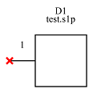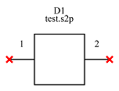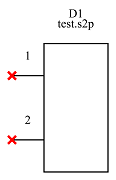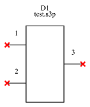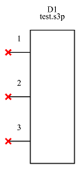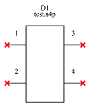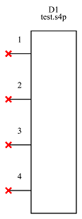

| Property Name     | Type   | Keyword               | Units | (Default) Value |
|:------------------|:-------|:----------------------|:------|:----------------|
| category          |        |                       |       | Files           |
| default reference | string |                       |       | D?              |
| reference         | string |                       |       |                 |
| file name         | file   |                       |       | None            |
| port reordering   | string | reorder               |       | None            |
| element state     | string | none - not in netlist |       | None            |
| ports             | string |                       |       |                 |

File Devices are the most generic. They take an s-parameter file name in the file name property. The in the Part Properties Dialog, you can browse to the file and view the file in the [S-parameter Viewer](13-S-parameter-Viewer.md#sec:S-parameter-Viewer) if you want.

When files read in during calculations, file devices are resampled according to the [Calculation Properties](15-Main-Schematic-Dialog.md#Control-Help:Calculation-Properties).

File names can be projects. When browsing for file names, the default files type shown will be s-parameter files, but you can click on the files type and the choice of project files is shown. Then other projects can be selected as the source of the s-parameters. This allows nesting of projects. When you do this, you must ensure that the project you select for the s-parameter file is a project that produces s-parameters (i.e. a de-embedding or s-parameter generation project) and that the number of ports in the s-parameters produced matches the number of ports in your file type.

When a variable port file device is selected, the number of ports can be specified.

Port reordering allows the user to specify the port order in the file device that correspond to the final device, in port order. For example, port reorder = 3,4,1,2 means that ports 3,4,1, and 2 correspond to ports 1,2,3, and 4 of the four-port device drawn. Note that there must be no spaces in the port reordering string. Note that this can be used to extract less ports from a device easily. For example, suppose you have an .s16p file corresponding to four differential lanes and lane 1 has ports 3 and 4 at the input and ports 11 and 12 at the output. If you wanted to only use that lane in your schematic, you would specify a variable port file that is 16 ports, select the .s16p file from the browser, change to the ports to 4, and enter 1,3,11,12 as the port reordering.

The element state allows devices to be changed from their normal state. The element state can (currently) be one of four values:

1.  ” or an empty string – the device behaves normally.

2.  ’disabled’ – the device is disabled. This means that as far as SignalIntegrity is concerned, the device is not even in the schematic during simulation. In the SignalIntegrity application, the device turns red. It is the user’s responsibility to deal with any unconnected device port problems when a device is disabled.

3.  ’thru’ – the device functions as a thru. This means that the device is replaced with a thru device with the left ports connected to the right ports. While this device state has no unconnected port problems, and the thru device used does not have frequency dependent s-parameters, it still adds computation. Consider using the ’thru_wires’ state below, if you can get away with it.

4.  ’thru_wires’ – the device is removed from the internal schematic during calculation and wires are added between the left ports and the right ports, like a thru connection. This is good for computation, but can lead to unconnected device port problems.

Note that the ’thru’ and ’thru_wires’ state can only be used with devices with the same number of ports on the left and the right. Thus, the device must have an even number of ports and be drawn in a way such that the software can figure out the thru connections.

## Resistor {#device:Resistor}

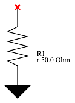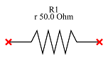

| Property Name     | Type   | Keyword | Units | (Default) Value |
|:------------------|:-------|:--------|:------|:----------------|
| category          |        |         |       | Resistors       |
| default reference | string |         |       | R?              |
| reference         | string |         |       |                 |
| resistance        | float  | r       | ohms  | 50 Ω            |

This is a one and two port resistor with the given resistance.

## Resistor {#device:Skin-Effect-Resistor}

| Property Name     | Type   | Keyword | Units              | (Default) Value |
|:------------------|:-------|:--------|:-------------------|:----------------|
| category          |        |         |                    | Resistors       |
| default reference | string |         |                    | R?              |
| reference         | string |         |                    |                 |
| skin effect       | float  | rse     | $\Omega/\sqrt{Hz}$ | 0               |

This is a two port skin-effect resistor. This resistor has its impedance vary as the square root of frequency and is intended to augment resistor capability when constructing transmission lines.

## Capacitor {#device:Capacitor}

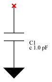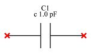

| Property Name      | Type   | Keyword | Units | (Default) Value |
|:-------------------|:-------|:--------|:------|:----------------|
| category           |        |         |       | capacitors      |
| default reference  | string |         |       | C?              |
| reference          | string |         |       |                 |
| capacitance        | float  | c       | F     | 1 pF            |
| ESR                | float  | esr     | ohm   |                 |
| dissipation factor | float  | df      |       |                 |

This is a one and two port capacitor with the given capacitance.

It allows specification of certain non-idealities like effective series resistance (ESR), which is a fixed resistance in series with the capacitance, and a dissipation factor.

## Inductor {#device:Inductor}

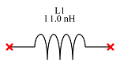

| Property Name     | Type   | Keyword | Units | (Default) Value |
|:------------------|:-------|:--------|:------|:----------------|
| category          |        |         |       | Inductors       |
| default reference | string |         |       | L?              |
| reference         | string |         |       |                 |
| inductance        | float  | l       | H     | 1 nH            |

This is a two port inductor with the given inductance.

## Mutual {#device:Mutual}

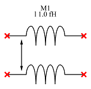

| Property Name     | Type   | Keyword | Units | (Default) Value |
|:------------------|:-------|:--------|:------|:----------------|
| category          |        |         |       | Inductors       |
| default reference | string |         |       | M?              |
| reference         | string |         |       |                 |
| inductance        | float  | l       | H     | 1 nH            |

This is a four-port mutual inductance. Their no self inductance and only the mutual inductance is specified and modeled. For self inductance, you need to use the

The sense of the self inductance is indicated by the arrows in the part picture.

## IdealTransformer {#device:IdealTransformer}

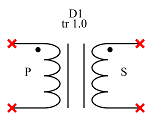

| Property Name     | Type   | Keyword | Units | (Default) Value |
|:------------------|:-------|:--------|:------|:----------------|
| category          |        |         |       | Inductors       |
| default reference | string |         |       | D?              |
| reference         | string |         |       |                 |
| turns ratio       | float  | tr      |       |                 |

This is a four-port ideal transformer with a given turns ratio.

The primary and secondary are labelled with P and S

The sense of the relationship between the primary and secondary is given by the dot locations.

The turns ratio is secondary relative to primary, so a higher number indicates more secondary windings relative to the secondary.

## Ideal Balun {#device:Balun}

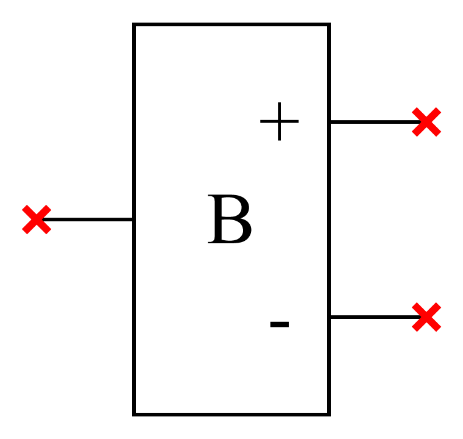

| Property Name     | Type   | Keyword | Units | (Default) Value |
|:------------------|:-------|:--------|:------|:----------------|
| category          |        |         |       | Inductors       |
| default reference | string |         |       | B?              |
| reference         | string |         |       |                 |

An ideal balun is a device that converts a single-ended signal entering the unmarked port into a differential signal between the + and - ports, and does the bidirectionally. It is constructed such that the single-ended impedance at the unmarked port is the reference impedance, the odd-mode impedance at the + and - ports is the reference impedance (i.e. the differential mode impedance is twice the reference impedance), and the common-mode impedance is open at the + and - marked ports.

## Reference {#device:Reference}

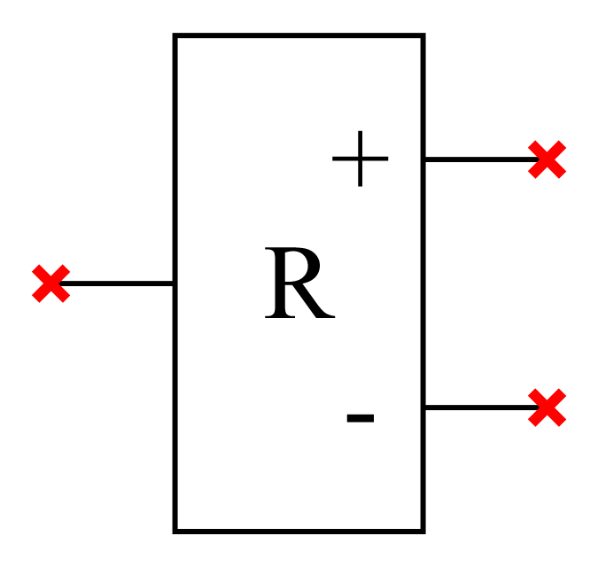

| Property Name     | Type   | Keyword | Units | (Default) Value |
|:------------------|:-------|:--------|:------|:----------------|
| category          |        |         |       | Inductors       |
| default reference | string |         |       | Ref?            |
| reference         | string |         |       |                 |

A reference device is used for two purposes:

1.  to convert an s-parameter that has been calculated relative to a local port reference, where that reference is not exposed as a signal (i.e. the port is specified such that the voltage is the difference between a local reference and the signal of interest) to an s-parameter that exposes that local reference.

2.  to convert an s-parameter that has its port specified in a manner whereby the local reference for the port is exposed as a signal into an s-parameter without this exposed port, like above.

The reference device is sometimes needed to connect these different style of port referenced devices, as frequency occurs when connecting s-parameters from a field solver to circuits with actual circuit elements.

The reference device is a shorthand. It is constructed such that the two devices below are equivalent:

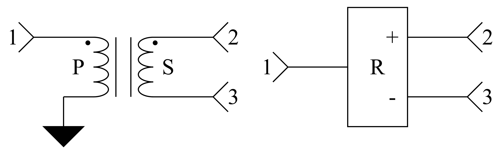

## Ground {#device:Ground}

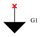

| Property Name     | Type   | Keyword | Units | (Default) Value |
|:------------------|:-------|:--------|:------|:----------------|
| category          |        |         |       | Miscellaneous   |
| default reference | string |         |       | G?              |
| reference         | string |         |       |                 |

This is a one-port ground, which could also be considered as a one-port ideal short.

## Open {#device:Open}

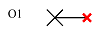

| Property Name     | Type   | Keyword | Units | (Default) Value |
|:------------------|:-------|:--------|:------|:----------------|
| category          |        |         |       | Miscellaneous   |
| default reference | string |         |       | O?              |
| reference         | string |         |       |                 |

This is a one-port ideal open.

## Directional Coupler {#device:DirectionalCoupler}

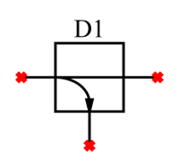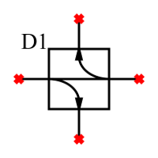

| Property Name     | Type   | Keyword | Units | (Default) Value |
|:------------------|:-------|:--------|:------|:----------------|
| category          |        |         |       | Miscellaneous   |
| default reference | string |         |       | D?              |
| reference         | string |         |       |                 |

Three and four port directional couplers.

Directional couplers are ideal thru elements between the ports connected by a straight line. Waves going in the direction shown by the arrows are picked off in the direction shown.

A three port directional coupler picks off one wave, while a four port picks off both. In the end, the waves are voltage waves and when probed are the wave multiplied by $\sqrt{Z0}$.

Note that these devices are not passive and are completely ideal. A real directional coupler could not pick a wave off entirely while simultaneously passing waves between two ports.

## Net Name {#device:Net-Name}

| Property Name | Type   | Keyword | Units | (Default) Value |
|:--------------|:-------|:--------|:------|:----------------|
| category      |        |         |       | Miscellaneous   |
| Net Name      | string | netname |       | ???             |

A net name is shown with text and a single connection point. When the connection point is joined to a device pin or wire in the same manner any other device is joined, the net assumes that name. Thus multiple connections of net names with the same name essentially joins the nets.

The net names do not appear in the netlist. Only the fact that the device pins are connected together will be obvious.

Net names have no effect on the [Netlist](24-Netlist.md#sec:Netlist) generated.

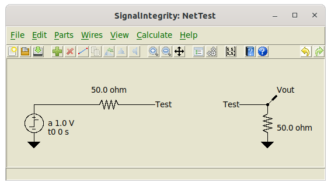

## Power Mixed Mode Converter {#device:Power-Mixed-Mode-Converter}

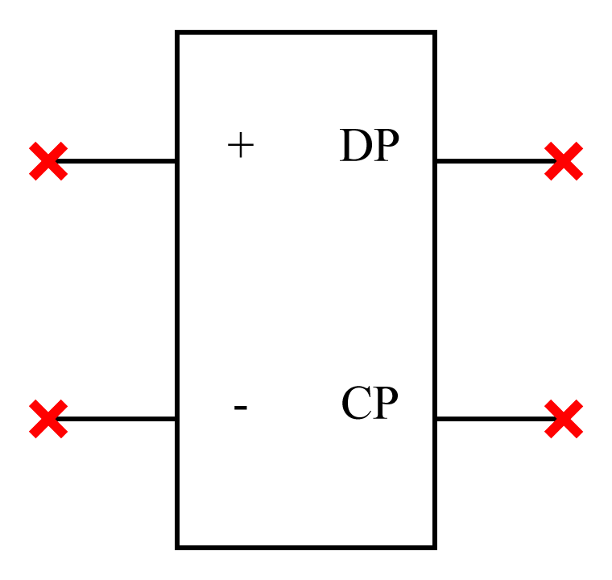

| Property Name     | Type   | Keyword | Units | (Default) Value |
|:------------------|:-------|:--------|:------|:----------------|
| category          |        |         |       | Miscellaneous   |
| default reference | string |         |       | D?              |
| reference         | string |         |       |                 |

This is a power mixed-mode converter. The power mixed-mode converter is one that defines differential and common mode voltage with respect to positive and negative voltages as:

$$V_{d}=\frac{V_{+}-V_{-}}{\sqrt{2}}$$

$$V_{c}=\frac{V_{+}+V_{-}}{\sqrt{2}}$$

This is the standard definition for s-parameters and this device is used primarily to convert from single-ended to mixed-mode s-parameters and vice versa.

The other kind of mixed-mode converter is the [Voltage Mixed Mode Converter](23-Built-in-Devices-Parts.md#device:Voltage-Mixed-Mode-Converter).

See [S-parameter Generation Example](07-S-Parameter-Generation.md#sub:S-parameter-Generation-Example) for an example of how this device is used.

## Voltage Mixed Mode Converter {#device:Voltage-Mixed-Mode-Converter}

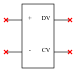

| Property Name     | Type   | Keyword | Units | (Default) Value |
|:------------------|:-------|:--------|:------|:----------------|
| category          |        |         |       | Miscellaneous   |
| default reference | string |         |       | D?              |
| reference         | string |         |       |                 |

The voltage mixed mode converter is one that defines differential and common mode voltage with respect to positive and negative voltages as:

$$V_{d}=V_{+}-V_{-}$$

$$V_{c}=\frac{V_{+}+V_{-}}{2}$$

This is the standard definition in industry for the time-domain and this device is used primarily to expose differential- and common-mode voltages in time-domain simulation or virtual probing applications.

The other kind of mixed-mode converter is the [Power Mixed Mode Converter](23-Built-in-Devices-Parts.md#device:Power-Mixed-Mode-Converter).

See [Virtual Probing Example](10-Virtual-Probing.md#sub:Virtual-Probing-Example) for an example of this type of device is used.

## Relay {#device:Relay}

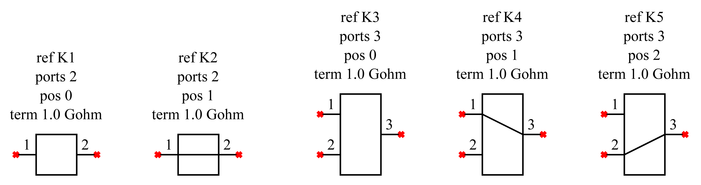

| Property Name     | Type   | Keyword | Units | (Default) Value |
|:------------------|:-------|:--------|:------|:----------------|
| category          |        |         |       | Miscellaneous   |
| default reference | string |         |       | K?              |
| reference         | string |         |       | K1              |
| position          | int    | pos     |       |                 |
| termination       | float  | term    | ohms  | 1e9             |

Ideal relay with a given number of ports. For a given number of ports $P$, port $P$ is always the common and ports 1 through $P-1$ are the throws of the relay.

Ports may be specified from 2 to 16.

The position keyword determines the position of the relay contact, meaning which throw is connected to the common. A position of 0 means nothing is connected. A position of 1 through $P-1$ indicates which port is connected to the common on port $P$.

Any unconnected port (including the common) is terminated in the resistance supplied by the term keyword.

## Parallel {#device:Parallel}

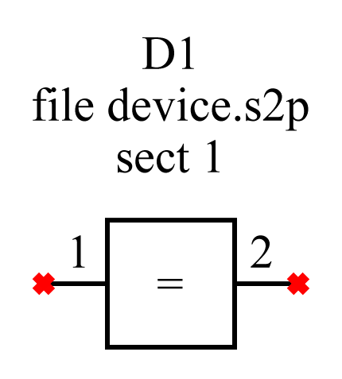

| Property Name     | Type   | Keyword | Units | (Default) Value |
|:------------------|:-------|:--------|:------|:----------------|
| category          |        |         |       | Miscellaneous   |
| default reference | string |         |       | D?              |
| reference         | string |         |       | D1              |
| file name         | file   | file    |       | None            |
| sections          | int    | sect    |       |                 |

This is a two-port device that is calculated by placing the device referenced by the file name in a parallel arrangement. The number of such devices in parallel is given by the number of sections.

This device is particularly useful in PDN analysis, were there are often parallel combinations of bypass capacitors and connector pins. Using the parallel device greatly simplifies these types of schematics.

## Series {#device:Series}

| Property Name     | Type   | Keyword | Units | (Default) Value |
|:------------------|:-------|:--------|:------|:----------------|
| category          |        |         |       | Miscellaneous   |
| default reference | string |         |       | D?              |
| reference         | string |         |       | D1              |
| ports             | int    | ports   |       |                 |
| file name         | file   | file    |       | None            |
| sections          | int    | sect    |       |                 |

This is a multi-port device (usually 2, but must be an even number of ports) that is calculated by placing the device referenced by the file name in a series arrangement. The number of such devices in series is given by the number of sections.

Essentially, the result is the cascade of multiple devices. In the cascade, the ports on the left of the unrotated or mirrored device are connected to ports on the right of another such device. The solution is performed using T-parameters.

## Thru {#device:Thru}

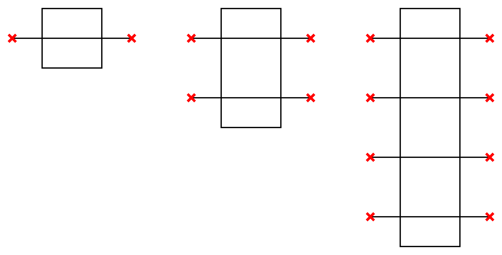

| Property Name     | Type   | Keyword | Units | (Default) Value |
|:------------------|:-------|:--------|:------|:----------------|
| category          |        |         |       | Miscellaneous   |
| default reference | string |         |       | D?              |
| reference         | string |         |       |                 |

This is a multi-port device (usually 2, but must be an even number of ports) that its ports on the left connected thru to the ports on the right.

It is the device used when a [File](23-Built-in-Devices-Parts.md#device:File) device has an element state of ’thru’.

## Transmission Line {#device:Transmission-Line}

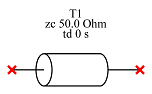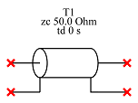

| Property Name            | Type   | Keyword | Units | (Default) Value    |
|:-------------------------|:-------|:--------|:------|:-------------------|
| category                 |        |         |       | Transmission Lines |
| default reference        | string |         |       | T?                 |
| reference                | string |         |       |                    |
| characteristic impedance | float  | zc      | ohms  |                    |
| time delay               | float  | td      | s     |                    |

This is a one- and two-port ideal transmission line with given characteristic impedance and delay.

The four-port ideal transmission line only transmits the differential mode.

A two-port ideal transmission line with zero delay is simply and ideal thru (no matter what the characteristic impedance).

## COM Transmission Line {#device:Transmission-Line-COM}

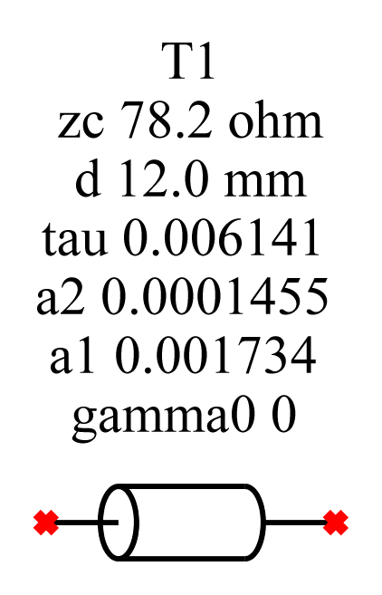

| Property Name | Type | Keyword | Units | (Default) Value |
|:---|:---|:---|:---|:---|
| category |  |  |  | Transmission Lines |
| default reference | string |  |  | T? |
| reference | string |  |  |  |
| gamma0 ($\mathrm{mm}^{-1}$) | float | gamma0 |  |  |
| a1 ($\sqrt{\mathrm{ns}}/\mathrm{mm}$) | float | a1 |  |  |
| a2 ($\mathrm{ns}/\mathrm{mm})$ | float | a2 |  |  |
| tau ($\mathrm{ns}/\mathrm{mm})$ | float | tau |  |  |
| length | float | d | m |  |
| characteristic impedance | float | zc | $\Omega$ |  |

This is the transmission line model used in COM.

Note that the units for all of the values are defined as COM defines the units, with the exception of length, which uses the units of meters instead of millimeters.

Also note that the characteristic impedance specified in COM is the differential mode impedance, even though the transmission line model is single-ended. So, specifying $100\,\Omega$ for the transmission line impedance produces a $50\,\Omega$ single-ended impedance line model, where the intent is to use one for each leg of a differential pair to obtain the specified differential mode characteristic impedance.

See <https://www.ieee802.org/3/bj/public/mar14/healey_3bj_01_0314.pdf> for more information.

## Lossy Transmission Line {#device:Transmission-Line-Lossy}

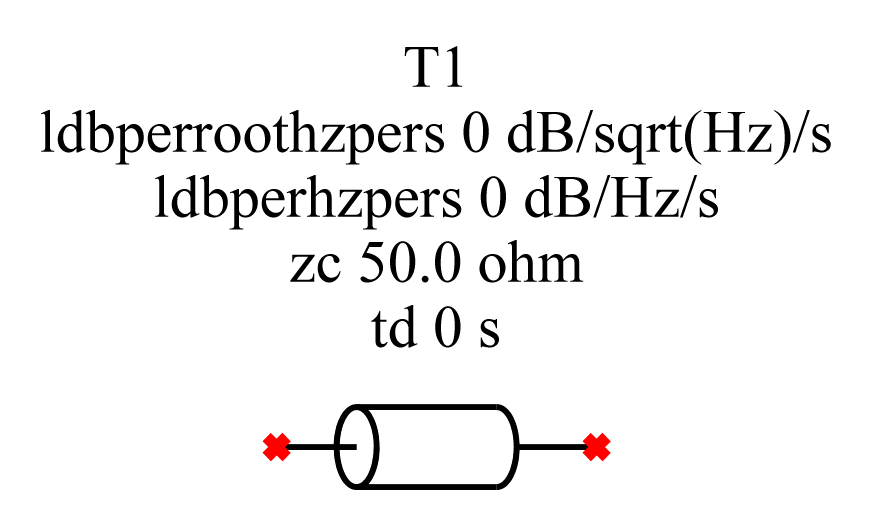

| Property Name | Type | Keyword | Units | (Default) Value |
|:---|:---|:---|:---|:---|
| default reference | string |  |  | T? |
| reference | string |  |  |  |
| characteristic impedance | float | zc | ohms |  |
| time delay | float | td | s |  |
| linear loss | float | ldbperhzpers | $\mathrm{dB}/\mathrm{Hz}/\mathrm{s}$ |  |
| skin-effect loss | float | ldbperroothzpers | $\mathrm{dB}/\sqrt{\mathrm{Hz}}/\mathrm{s}$ |  |

This is the a lossy transmission line model.

It is a transmission line similar to [Transmission Line](23-Built-in-Devices-Parts.md#device:Transmission-Line) as it has a time delay and characteristic impedance specified, but it has additionally a linear loss and a skin-effect loss term.

## Telegrapher - Two Port {#device:Telegrapher---Two-Port}

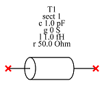

| Property Name | Type | Keyword | Units | (Default) Value |
|:---|:---|:---|:---|:---|
| category |  |  |  | Transmission Lines |
| default reference | string |  |  | T? |
| reference | string |  |  |  |
| sections | int | sect |  |  |
| scale | float | scale |  |  |
| capacitance | float | c | F | $1.0\,\mathrm{pF}$ |
| dissipation factor | float | df |  |  |
| conductance | float | g | S | $0\,\mathrm{S}$ |
| inductance | float | l | H | $1.0\,\mathrm{nH}$ |
| resistance | float | r | $\Omega$ | $0\,\Omega$ |
| skin-effect resistance | float | rse | $\Omega/\sqrt{\mathrm{Hz}}$ | $0\,\Omega/\sqrt{\mathrm{Hz}}$ |

The telegrapher two-port is a model of a single-ended transmission line based on the telegrapher circuit.

If sections are set to 1 (the default), then the circuit is the lumped element model as shown below:

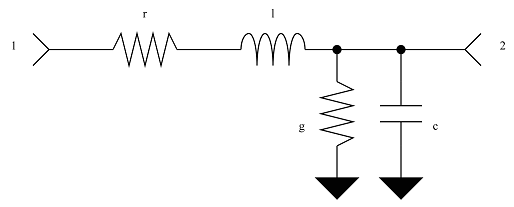

In the model, not shown is the skin-effect resistance, a resistance proportional to the square-root of frequency that is implied with the resistance r. Also not shown is the dissipation factor, or loss-tangent, which is the dissipation factor of the capacitance c.

Otherwise, if sections are large, then the model is created by cascading the sections with parameters that are divided by the number of sections. In other words, the parameters are for the total line, and each section has a value of the parameter divided by the number of sections.

This is used to approximated distributed parameters.

If zero sections are specified (the default), an analytic solution is provided based on complete distribution of the parameters specified.

To facilitate per-unit values, the model can be scaled by the amount specified. In this way, half-size models can be made (such as for 2x thru situations), or values can be considered as, for example, per meter, and the the scale can be considered as the number of meters.

## Telegrapher - Four Port {#device:Telegrapher---Four-Port}

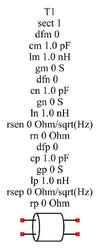

| Property Name | Type | Keyword | Units | (Default) Value |
|:---|:---|:---|:---|:---|
| category |  |  |  | Transmission Lines |
| default reference | string |  |  | T? |
| reference | string |  |  |  |
| sections | int | sect |  |  |
| scale | float | scale |  |  |
| mutual capacitance | float | cm | F | $1.0\,\mathrm{pF}$ |
| mutual dissipation factor | float | dfm |  |  |
| mutual inductance | float | lm | H | $1.0\,\mathrm{nH}$ |
| mutual conductance | float | gm | S | $0\,\mathrm{S}$ |
| negative capacitance | float | cn | F | $1.0\,\mathrm{pF}$ |
| negative dissipation factor | float | dfn |  |  |
| negative conductance | float | gn | S | $0\,\mathrm{S}$ |
| negative inductance | float | ln | H | $1.0\,\mathrm{nH}$ |
| negative resistance | float | rn | $\Omega$ | $0\,\Omega$ |
| negative skin-effect resistance | float | rsen | $\Omega/\sqrt{\mathrm{Hz}}$ | $0\,\Omega/\sqrt{\mathrm{Hz}}$ |
| positive capacitance | float | cp | F | $1.0\,\mathrm{pF}$ |
| positive dissipation factor | float | dfp |  |  |
| positive conductance | float | gp | S | $0\,\mathrm{S}$ |
| positive inductance | float | lp | H | $1.0\,\mathrm{nH}$ |
| positive resistance | float | rp | $\Omega$ | $0\,\Omega$ |
| positive skin-effect resistance | float | rsep | $\Omega/\sqrt{\mathrm{Hz}}$ | $0\,\Omega/\sqrt{\mathrm{Hz}}$ |

The telegrapher four-port is a model of a differential transmission line based on the telegrapher circuit.

If sections are set to 1, then the circuit is the lumped element model as shown below:

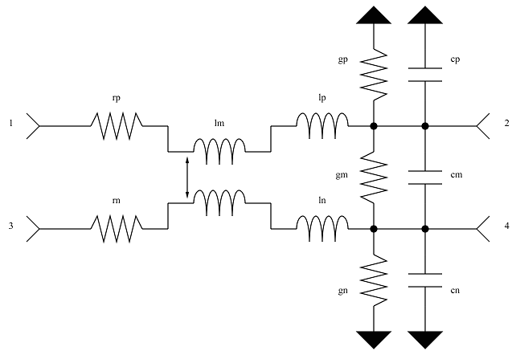

In the model, not shown are the skin-effect resistances, a resistance proportional to the square-root of frequency that is implied with the resistance rp and rn. Also not shown are the dissipation factors, or loss-tangents, which are the dissipation factors of the capacitances cp, cn, and cm.

Otherwise, if sections are large, then the model is created by cascading the sections with parameters that are divided by the number of sections. In other words, the parameters are for the total line, and each section has a value of the parameter divided by the number of sections.

This is used to approximated distributed parameters.

If sections are specified as zero (the default), then an analytic solutions is attempted. If the lines are uncoupled, then an uncoupled, analytic solution is employed using two of the [COM Transmission Line](23-Built-in-Devices-Parts.md#device:Transmission-Line-COM) models. Otherwise, if the lines are balanced, then a balanced, analytic solution is employed, again using two of the [COM Transmission Line](23-Built-in-Devices-Parts.md#device:Transmission-Line-COM) models, but one for the odd mode and the other for the even mode and using two [Power Mixed Mode Converter](23-Built-in-Devices-Parts.md#device:Power-Mixed-Mode-Converter) devices to perform the conversion to single-ended.

Otherwise, if zero sections are specified and the lines are neither uncoupled nor balanced, the numerical approximation is used. In this case, the number of sections is calculated such that the round-trip time delay through any small section of the line is no longer than one percent of the fastest possible risetime.

To facilitate per-unit values, the model can be scaled by the amount specified. In this way, half-size models can be made (such as for 2x thru situations), or values can be considered as, for example, per meter, and the the scale can be considered as the number of meters.

## RLGC Fit {#device:RLGC-Fit}

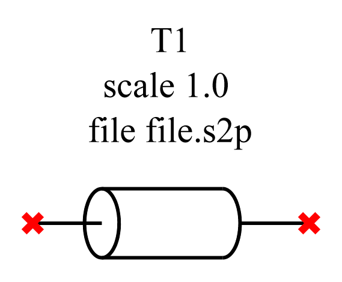

| Property Name     | Type   | Keyword | Units | (Default) Value    |
|:------------------|:-------|:--------|:------|:-------------------|
| category          |        |         |       | Transmission Lines |
| default reference | string |         |       | T?                 |
| reference         | string |         |       |                    |
| file name         | file   | file    |       | None               |
| scale             | float  | scale   |       |                    |

This device is a two-port transmission line as in [COM Transmission Line](23-Built-in-Devices-Parts.md#device:Transmission-Line-COM) where the constants for the transmission line are formed by fitting the s-parameters contained in the file specified to an RLGC transmission line.

The fit is performed by estimating the impedance and the delay through the line and using that to form a guess of the inductance and capacitance of the line. Initially no series resistance, skin-effect resistance, dissipation factor of conductance is in the guess.

The fit proceeds until it converges and the fitted s-parameters are used as the device.

The scale variable allows the fitted line to be scaled. This is particularly useful when model fitting to perform a 2x thru de-embedding where a scale of 0.5 splits the model in half.

## W Element {#device:W-Element}

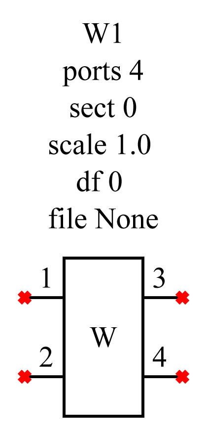

| Property Name      | Type   | Keyword | Units | (Default) Value    |
|:-------------------|:-------|:--------|:------|:-------------------|
| category           |        |         |       | Transmission Lines |
| default reference  | string |         |       | W?                 |
| reference          | string |         |       | W1                 |
| file name          | file   |         |       | None               |
| dissipation factor | float  | df      |       |                    |
| scale              | float  | scale   |       |                    |
| sections           | int    | sect    |       |                    |
| ports              | int    | ports   |       |                    |

W elements are distributed transmission lines. A two-port W element is equivalent to an [COM Transmission Line](23-Built-in-Devices-Parts.md#device:Transmission-Line-COM) transmission line and a four-port W element is equivalent to a [Telegrapher - Four Port](23-Built-in-Devices-Parts.md#device:Telegrapher---Four-Port). Usually the transmission line model is provided numerically with values per meter. So if you want something different from 1 meter, you must scale the line.

The user can specify the number of sections to be utilized for analytic approximation, but 0 is recommended. When zero sections are specified, the number of sections is intelligently calculated based on the fastest risetime possible (based on the end frequency used in the calculation) and the worst case electrical length possible determined from the inductance and capacitance values in the model.

The number of ports should always be even and match those in the W element file name specified. The transmission line elements in the model are always such that for $P$ ports, transmission line $m$ goes from port $m$ to port $P/2+m$ .

Because the model does not seem to support dissipation factor, it can be entered globally for the model.

More documentation on this device may be found here: <http://www2.ece.rochester.edu/courses/ECE222/hspice/hspice_devmod.pdf>

## Voltage Source {#device:Voltage-Source}

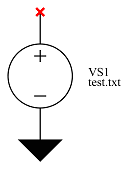

| Property Name                      | Type   | Keyword    | Units | (Default) Value |
|:-----------------------------------|:-------|:-----------|:------|:----------------|
| category                           |        |            |       | Sources         |
| default reference                  | string |            |       | VS?             |
| reference                          | string |            |       |                 |
| file name                          | file   |            |       | None            |
| show                               | bool   | show       |       | true            |
| waveform project name              | string | wfprojname |       | None            |
| use project calculation properties | bool   | calcprop   |       | false           |

The voltage source is used in [Simulation](08-Simulation.md#sec:Simulation) applications to provide a voltage [Waveform](28-Waveform.md#sec:Waveform) specified by the file name to the system. When [Simulating](08-Simulation.md#sub:Simulating), the waveform is read in and sampled to base sample rate specified in the [Calculation Properties](15-Main-Schematic-Dialog.md#Control-Help:Calculation-Properties).

The [Waveform](28-Waveform.md#sec:Waveform) file can be viewed using [Edit Properties](15-Main-Schematic-Dialog.md#Control-Help:Edit-Properties) with the device selected and pressing the View button on the Part Properties dialog.

If show is true, when the simulation completes, the waveform created by the source is added to the waveform list and displayed in the [Simulator Dialog](14-Simulator-Dialog.md#sec:Simulator-Dialog).

For the file name, a user may specify another *SignalIntegrity* project, which ought to be a [Simulation](08-Simulation.md#sec:Simulation) project that produces waveforms. In this case, two additional properties must be chosen: The name of the probe that produces the [Waveform](28-Waveform.md#sec:Waveform) in the project, and whether to perform that simulation in that project using the [Calculation Properties](15-Main-Schematic-Dialog.md#Control-Help:Calculation-Properties) of the current project.

If show is true, when the simulation completes, the waveform created by the source is added to the waveform list and displayed in the [Simulator Dialog](14-Simulator-Dialog.md#sec:Simulator-Dialog).

## Current Source {#device:Current-Source}

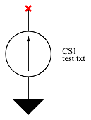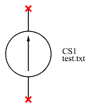

| Property Name                      | Type   | Keyword    | Units | (Default) Value |
|:-----------------------------------|:-------|:-----------|:------|:----------------|
| category                           |        |            |       | Sources         |
| default reference                  | string |            |       | CS?             |
| reference                          | string |            |       |                 |
| file name                          | file   |            |       | None            |
| show                               | bool   | show       |       | true            |
| waveform project name              | string | wfprojname |       | None            |
| use project calculation properties | bool   | calcprop   |       | false           |

The current source is used in [Simulation](08-Simulation.md#sec:Simulation) applications to provide a current [Waveform](28-Waveform.md#sec:Waveform) specified by the file name to the system. When [Simulating](08-Simulation.md#sub:Simulating), the waveform is read in and sampled to base sample rate specified in the [Calculation Properties](15-Main-Schematic-Dialog.md#Control-Help:Calculation-Properties).

The [Waveform](28-Waveform.md#sec:Waveform) file can be viewed using [Edit Properties](15-Main-Schematic-Dialog.md#Control-Help:Edit-Properties) with the device selected and pressing the View button on the Part Properties dialog.

If show is true, when the simulation completes, the waveform created by the source is added to the waveform list and displayed in the [Simulator Dialog](14-Simulator-Dialog.md#sec:Simulator-Dialog).

For the file name, a user may specify another *SignalIntegrity* project, which ought to be a [Simulation](08-Simulation.md#sec:Simulation) project that produces waveforms. In this case, two additional properties must be chosen: The name of the probe that produces the [Waveform](28-Waveform.md#sec:Waveform) in the project, and whether to perform that simulation in that project using the [Calculation Properties](15-Main-Schematic-Dialog.md#Control-Help:Calculation-Properties) of the current project.

If show is true, when the simulation completes, the waveform created by the source is added to the waveform list and displayed in the [Simulator Dialog](14-Simulator-Dialog.md#sec:Simulator-Dialog).

## Voltage DC Source {#device:Voltage-DC-Source}

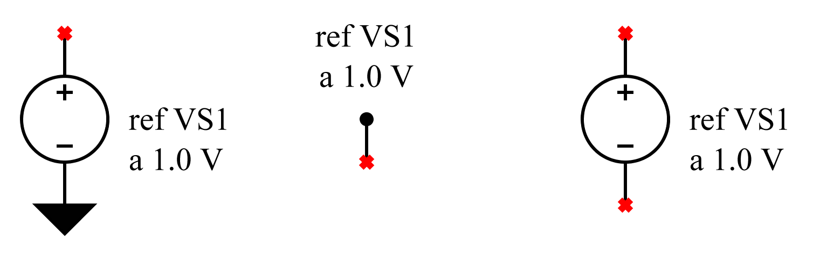

| Property Name     | Type   | Keyword | Units | (Default) Value |
|:------------------|:-------|:--------|:------|:----------------|
| category          |        |         |       | Sources         |
| default reference | string |         |       | VS?             |
| reference         | string |         |       | VS1             |
| amplitude         | float  | a       | V     | 1 V             |
| show              | bool   | show    |       | true            |

The DC voltage source is used in [Simulation](08-Simulation.md#sec:Simulation) applications to provide a DC voltage.

The DC voltage source is handled specially in that it does not provide a waveform, but rather a number representing the DC voltage. Unlike other waveforms applied to the system, it has no startup effects, and in fact, no concept of a time axis - it simply is the voltage specified. The transfer characteristics of a DC voltage source through the system is to take the DC response of the system.

If show is true, when the simulation completes, the waveform created by the source is added to the waveform list and displayed in the [Simulator Dialog](14-Simulator-Dialog.md#sec:Simulator-Dialog).

## Current DC Source {#device:Current-DC-Source}

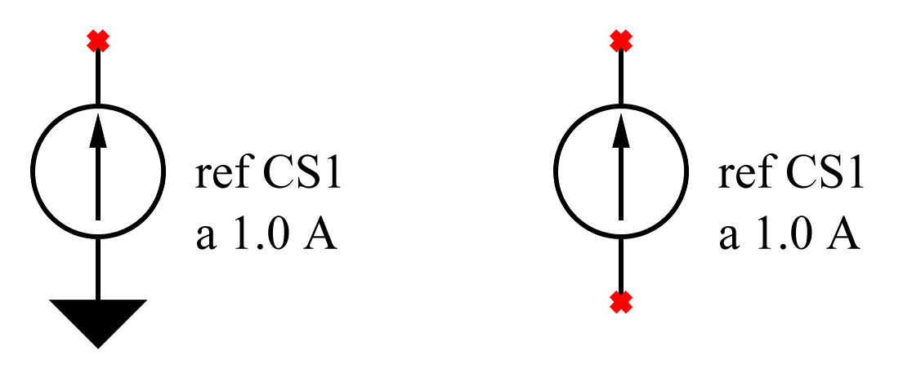

| Property Name     | Type   | Keyword | Units | (Default) Value |
|:------------------|:-------|:--------|:------|:----------------|
| category          |        |         |       | Sources         |
| default reference | string |         |       | CS?             |
| reference         | string |         |       | CS1             |
| amplitude         | float  | a       | A     | 1 A             |
| show              | bool   | show    |       | true            |

The DC current source is used in [Simulation](08-Simulation.md#sec:Simulation) applications to provide a DC current.

The DC current source is handled specially in that it does not provide a waveform, but rather a number representing the DC current. Unlike other waveforms applied to the system, it has no startup effects, and in fact, no concept of a time axis - it simply is the current specified. The transfer characteristics of a DC current source through the system is to take the DC response of the system.

If show is true, when the simulation completes, the [Simulation](08-Simulation.md#sec:Simulation) created by the source is added to the waveform list and displayed in the [Simulator Dialog](14-Simulator-Dialog.md#sec:Simulator-Dialog).

## Voltage Noise Generator {#device:Voltage-Noise-Generator}

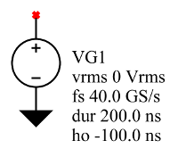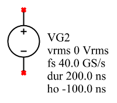

| Property Name     | Type   | Keyword | Units              | (Default) Value |
|:------------------|:-------|:--------|:-------------------|:----------------|
| category          |        |         |                    | Generators      |
| default reference | string |         |                    | VG?             |
| reference         | string |         |                    |                 |
| amplitude         | float  | vrms    | $\mathrm{V_{rms}}$ | $0\,V_{rms}$    |
| sample rate       | float  | fs      | S/s                | 40 GS/s         |
| start time        | float  | t0      | s                  | 0 s             |
| duration          | float  | dur     | s                  | 200 ns          |
| horizontal offset | float  | ho      | s                  | -100 ns         |
| show              | bool   | show    |                    | true            |

The voltage noise generator generates random, normally distributed, zero-mean noise with an rms voltage as specified.

If show is true, when the simulation completes, the [Simulation](08-Simulation.md#sec:Simulation) created by the source is added to the waveform list and displayed in the [Simulator Dialog](14-Simulator-Dialog.md#sec:Simulator-Dialog).

## Voltage Step Generator {#device:Voltage-Step-Generator}

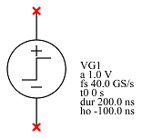

| Property Name     | Type   | Keyword | Units | (Default) Value |
|:------------------|:-------|:--------|:------|:----------------|
| category          |        |         |       | Generators      |
| default reference | string |         |       | VG?             |
| reference         | string |         |       |                 |
| amplitude         | float  | a       | V     | 1 V             |
| sample rate       | float  | fs      | S/s   | 40 GS/s         |
| start time        | float  | t0      | s     | 0 s             |
| risetime          | float  | rt      | s     | 0 s             |
| duration          | float  | dur     | s     | 200 ns          |
| horizontal offset | float  | ho      | s     | -100 ns         |
| show              | bool   | show    |       | true            |

The voltage step generator is used in [Simulation](08-Simulation.md#sec:Simulation) applications to provide a voltage step [Waveform](28-Waveform.md#sec:Waveform) to the system.

The waveform created has a sample rate as provided and extends in time from the horizontal offset, the time of the first point in the waveform, for the duration specified.

If zero risetime is specified, the waveform is 0 V until the start time, after which it jumps immediately to the amplitude specified for the remaining duration of the waveform.

If a nonzero risetime is specified, the edge crosses 50% at the start time. The risetime is implemented as a raised-cosine.

Note that because of the number of ways that risetime is specified, specifying it in the device is deprecated and users are advised to instead set the risetime to 0, and to cascade the waveform generator with one of the risetime filters such as the [Gaussian Risetime Filter](23-Built-in-Devices-Parts.md#device:GaussianRisetimeFilter) and the [Raised Cosine Risetime Filter](23-Built-in-Devices-Parts.md#device:RaisedCosineRisetimeFilter).

If show is true, when the simulation completes, the [Simulation](08-Simulation.md#sec:Simulation) created by the source is added to the waveform list and displayed in the [Simulator Dialog](14-Simulator-Dialog.md#sec:Simulator-Dialog).

## Voltage Pulse Generator {#device:Voltage-Pulse-Generator}

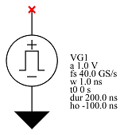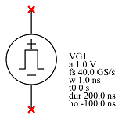

| Property Name     | Type   | Keyword | Units | (Default) Value |
|:------------------|:-------|:--------|:------|:----------------|
| category          |        |         |       | Generators      |
| default reference | string |         |       | VG?             |
| reference         | string |         |       |                 |
| amplitude         | float  | a       | V     | 1 V             |
| sample rate       | float  | fs      | S/s   | 40 GS/s         |
| pulse width       | float  | w       | s     | 1 ns            |
| start time        | float  | t0      | s     | 0 s             |
| risetime          | float  | rt      | s     | 0 s             |
| duration          | float  | dur     | s     | 200 ns          |
| horizontal offset | float  | ho      | s     | -100 ns         |
| show              | bool   | show    |       | true            |

The voltage pulse generator is used in [Simulation](08-Simulation.md#sec:Simulation) applications to provide a voltage pulse [Waveform](28-Waveform.md#sec:Waveform) to the system.

The waveform created has a sample rate as provided and extends in time from the horizontal offset, the time of the first point in the waveform, for the duration specified.

The waveform is 0 V until the start time, after which it jumps immediately to the amplitude specified for the duration specified by the pulse width.

If a nonzero risetime is specified, the first edge crosses 50% at the start time.

Note that because of the number of ways that risetime is specified, specifying it in the device is deprecated and users are advised to instead set the risetime to 0, and to cascade the waveform generator with one of the risetime filters such as the [Gaussian Risetime Filter](23-Built-in-Devices-Parts.md#device:GaussianRisetimeFilter) and the [Raised Cosine Risetime Filter](23-Built-in-Devices-Parts.md#device:RaisedCosineRisetimeFilter).

If show is true, when the simulation completes, the [Simulation](08-Simulation.md#sec:Simulation) created by the source is added to the waveform list and displayed in the [Simulator Dialog](14-Simulator-Dialog.md#sec:Simulator-Dialog).

## Voltage Impulse Generator {#device:Voltage-Impulse-Generator}

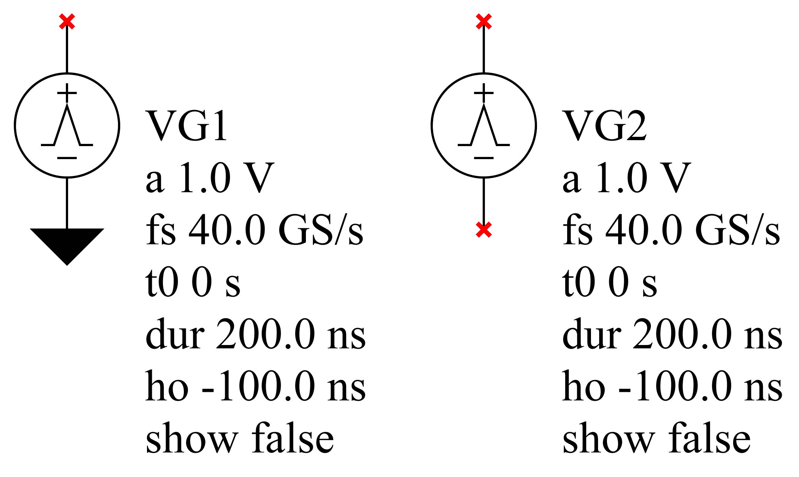

| Property Name     | Type   | Keyword | Units | (Default) Value |
|:------------------|:-------|:--------|:------|:----------------|
| category          |        |         |       | Generators      |
| default reference | string |         |       | VG?             |
| reference         | string |         |       |                 |
| amplitude         | float  | a       | V     | 1 V             |
| sample rate       | float  | fs      | S/s   | 40 GS/s         |
| start time        | float  | t0      | s     | 0 s             |
| duration          | float  | dur     | s     | 200 ns          |
| horizontal offset | float  | ho      | s     | -100 ns         |
| show              | bool   | show    |       | false           |

The voltage impulse generator is used in [Simulation](08-Simulation.md#sec:Simulation) applications to provide a voltage impulse [Waveform](28-Waveform.md#sec:Waveform) to the system.

The waveform created has a sample rate as provided and extends in time from the horizontal offset, the time of the first point in the waveform, for the duration specified.

The waveform is 0 V until the start time, after which it jumps immediately to the amplitude specified for exactly one sample.

If show is true, when the simulation completes, the [Simulation](08-Simulation.md#sec:Simulation) created by the source is added to the waveform list and displayed in the [Simulator Dialog](14-Simulator-Dialog.md#sec:Simulator-Dialog).

## Voltage PRBS Generator {#device:Voltage-PRBS-Generator}

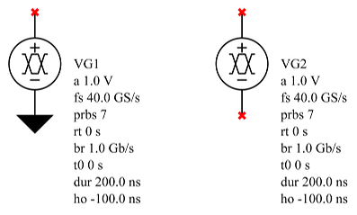

| Property Name     | Type   | Keyword | Units | (Default) Value |
|:------------------|:-------|:--------|:------|:----------------|
| category          |        |         |       | Generators      |
| default reference | string |         |       | VG?             |
| reference         | string |         |       |                 |
| amplitude         | float  | a       | V     | 1 V             |
| sample rate       | float  | fs      | S/s   | 40 GS/s         |
| prbs              | int    | prbs    |       |                 |
| risetime          | float  | rt      | s     | 0 s             |
| bitrate           | float  | br      | b/s   | Gb/s            |
| start time        | float  | t0      | s     | 0 s             |
| duration          | float  | dur     | s     | 200 ns          |
| horizontal offset | float  | ho      | s     | -100 ns         |
| show              | bool   | show    |       | true            |

The voltage PRBS generator is used in [Simulation](08-Simulation.md#sec:Simulation) applications to provide a voltage pseudo-random NRZ [Waveform](28-Waveform.md#sec:Waveform) to the system.

The waveform created has a sample rate as provided and extends in time from the horizontal offset, the time of the first point in the waveform, for the duration specified.

The waveform uses the PRBS polynomial specified at the bitrate specified.

If a nonzero risetime is specified, the first edge crosses 50% at the start time.

The maximum risetime is 59% of the unit interval (the reciprocal of the bitrate).

Note that because of the number of ways that risetime is specified, specifying it in the device is deprecated and users are advised to instead set the risetime to 0, and to cascade the waveform generator with one of the risetime filters such as the [Gaussian Risetime Filter](23-Built-in-Devices-Parts.md#device:GaussianRisetimeFilter) and the [Raised Cosine Risetime Filter](23-Built-in-Devices-Parts.md#device:RaisedCosineRisetimeFilter).

The PRBS pattern calculated is such that the entire duration of the waveform contains however many bits of the PRBS polynomial dictated sequence fits into the waveform. If the waveform starts at zero, this is what would be expected, but if it starts at negative time, the negative time contains the PRBS bits wrapped around.

If show is true, when the simulation completes, the [Simulation](08-Simulation.md#sec:Simulation) created by the source is added to the waveform list and displayed in the [Simulator Dialog](14-Simulator-Dialog.md#sec:Simulator-Dialog).

## Voltage Multi-Level Waveform Generator {#device:Voltage-Multi-Level-Waveform-Generator}

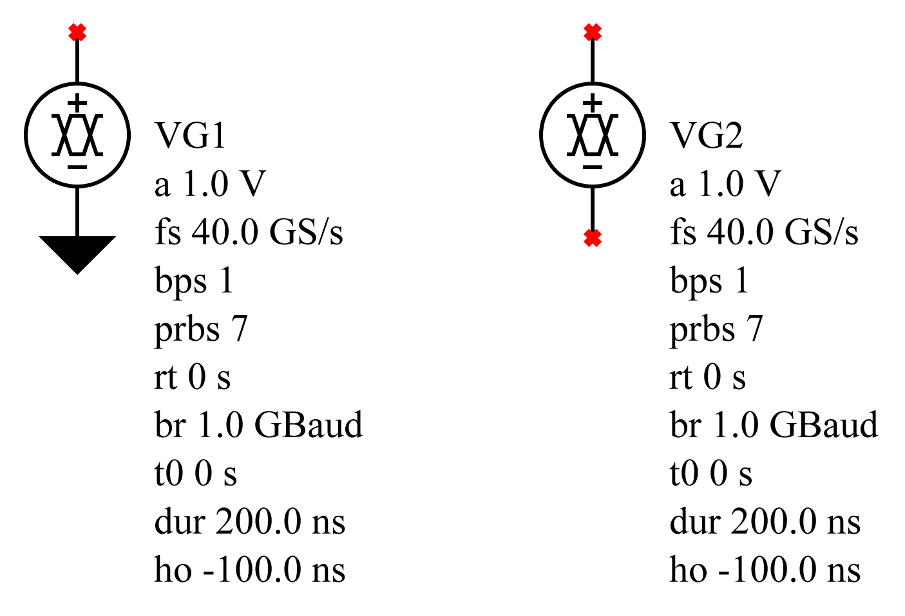

| Property Name     | Type   | Keyword | Units | (Default) Value |
|:------------------|:-------|:--------|:------|:----------------|
| category          |        |         |       | Generators      |
| default reference | string |         |       | VG?             |
| reference         | string |         |       |                 |
| amplitude         | float  | a       | V     | 1 V             |
| sample rate       | float  | fs      | S/s   | 40 GS/s         |
| prbs              | int    | prbs    |       |                 |
| risetime          | float  | rt      | s     | 0 s             |
| bits per symbol   | int    | bps     |       |                 |
| baudrate          | float  | br      | Baud  | 1 GBaud         |
| start time        | float  | t0      | s     | 0 s             |
| duration          | float  | dur     | s     | 200 ns          |
| horizontal offset | float  | ho      | s     | -100 ns         |
| show              | bool   | show    |       | true            |

This device is deprecated and should be replaced with the [Voltage Levels Multi-Level Waveform Generator](23-Built-in-Devices-Parts.md#device:Voltage-Levels-Multi-Level-Waveform-Generator)

The voltage multi-level waveform generator is used in [Simulation](08-Simulation.md#sec:Simulation) applications to provide a voltage pseudo-random PAM [Waveform](28-Waveform.md#sec:Waveform) to the system.

The bits per symbol dictates the type of PAM waveform generated, with 1 specifying NRZ, 2 specifying PAM-4, 3 specifying PAM-8, etc.

The waveform created has a sample rate as provided and extends in time from the horizontal offset, the time of the first point in the waveform, for the duration specified.

The waveform uses the PRBS polynomial specified at the baud rate specified. For PAM waveforms, bits of the polynomial are grouped to produce the PAM waveform. For example, for PAM-4, the first two bits of the polynomial form the two bit specification of the PAM level.

If a nonzero risetime is specified, the first edge crosses 50% at the start time.

The maximum risetime is 59% of the unit interval (the reciprocal of the baud rate).

The PRBS pattern calculated is such that the entire duration of the waveform contains however many bits of the PRBS polynomial dictated sequence fits into the waveform. If the waveform starts at zero, this is what would be expected, but if it starts at negative time, the negative time contains the PRBS bits wrapped around.

If show is true, when the simulation completes, the [Simulation](08-Simulation.md#sec:Simulation) created by the source is added to the waveform list and displayed in the [Simulator Dialog](14-Simulator-Dialog.md#sec:Simulator-Dialog).

## Voltage Levels Multi-Level Waveform Generator {#device:Voltage-Levels-Multi-Level-Waveform-Generator}

| Property Name     | Type   | Keyword | Units | (Default) Value |
|:------------------|:-------|:--------|:------|:----------------|
| category          |        |         |       | Generators      |
| default reference | string |         |       | VG?             |
| reference         | string |         |       |                 |
| amplitude         | float  | a       | V     | 1 V             |
| sample rate       | float  | fs      | S/s   | 40 GS/s         |
| prbs              | int    | prbs    |       |                 |
| number of levels  | int    | lvl     |       |                 |
| number of symbols | int    | sym     |       |                 |
| baudrate          | float  | br      | Baud  | 1 GBaud         |
| start time        | float  | t0      | s     | 0 s             |
| duration          | float  | dur     | s     | 200 ns          |
| horizontal offset | float  | ho      | s     | -100 ns         |
| show              | bool   | show    |       | true            |

The levels voltage multi-level waveform generator is a replacement for the [Voltage Multi-Level Waveform Generator](23-Built-in-Devices-Parts.md#device:Voltage-Multi-Level-Waveform-Generator), which is deprecated.

The number of levels dictate the type of PAM waveform generated.

The number of symbols dictate how many symbols represent an encoded block. This is used to handle PAM that cannot represent an integer number of bits per symbol. If the number of levels is a power of two, then symbols should be set to 1, otherwise, it needs to be calculated or specified in a standard. For example, a PAM-6 generator has 6 levels per symbol, and can transmit 2.585 bits per symbol. If symbols is 7, then 18 bits can be transmitted per block at 99.5% efficiency. Using 12 symbols, would be 99.9% efficient.

The waveform created has a sample rate as provided and extends in time from the horizontal offset, the time of the first point in the waveform, for the duration specified.

The waveform uses the PRBS polynomial specified at the baud rate specified. For PAM waveforms, bits of the polynomial are grouped according to the symbols specified to produce the PAM waveform. For example, for PAM-4, the first two bits of the polynomial form the two bit specification of the PAM level.

This device has infinitely fast risetime and is meant to be used with the risetime filters, if desired.

(See the [Gaussian Risetime Filter](23-Built-in-Devices-Parts.md#device:GaussianRisetimeFilter) and the [Raised Cosine Risetime Filter](23-Built-in-Devices-Parts.md#device:RaisedCosineRisetimeFilter).)

The PRBS pattern calculated is such that the entire duration of the waveform contains however many bits of the PRBS polynomial dictated sequence fits into the waveform. If the waveform starts at zero, this is what would be expected, but if it starts at negative time, the negative time contains the PRBS bits wrapped around.

If show is true, when the simulation completes, the [Simulation](08-Simulation.md#sec:Simulation) created by the source is added to the waveform list and displayed in the [Simulator Dialog](14-Simulator-Dialog.md#sec:Simulator-Dialog).

## Voltage Clock Generator {#device:Voltage-Clock-Generator}

| Property Name     | Type   | Keyword | Units | (Default) Value |
|:------------------|:-------|:--------|:------|:----------------|
| category          |        |         |       | Generators      |
| default reference | string |         |       | VG?             |
| reference         | string |         |       |                 |
| amplitude         | float  | a       | V     | 1 V             |
| sample rate       | float  | fs      | S/s   | 40 GS/s         |
| risetime          | float  | rt      | s     | 0 s             |
| frequency         | float  | f       | Hz    | 1 MHz           |
| start time        | float  | t0      | s     | 0 s             |
| duration          | float  | dur     | s     | 200 ns          |
| horizontal offset | float  | ho      | s     | -100 ns         |
| show              | bool   | show    |       | true            |

The voltage clock generator is used in [Simulation](08-Simulation.md#sec:Simulation) applications to provide a voltage clock [Waveform](28-Waveform.md#sec:Waveform) to the system.

The waveform created has a clock rate as specified and extends in time from the horizontal offset, the time of the first point in the waveform, for the duration specified.

If a nonzero risetime is specified, the first edge crosses 50% at the start time.

The maximum risetime is 59% of the clock period.

Note that because of the number of ways that risetime is specified, specifying it in the device is deprecated and users are advised to instead set the risetime to 0, and to cascade the waveform generator with one of the risetime filters such as the [Gaussian Risetime Filter](23-Built-in-Devices-Parts.md#device:GaussianRisetimeFilter) and the [Raised Cosine Risetime Filter](23-Built-in-Devices-Parts.md#device:RaisedCosineRisetimeFilter).

If show is true, when the simulation completes, the [Simulation](08-Simulation.md#sec:Simulation) created by the source is added to the waveform list and displayed in the [Simulator Dialog](14-Simulator-Dialog.md#sec:Simulator-Dialog).

## Voltage Sine Generator {#device:Voltage-Sine-Generator}

| Property Name     | Type   | Keyword | Units | (Default) Value |
|:------------------|:-------|:--------|:------|:----------------|
| category          |        |         |       | Generators      |
| default reference | string |         |       | VG?             |
| reference         | string |         |       |                 |
| phase             | float  | ph      | deg   | 0 deg           |
| frequency         | float  | f       | Hz    | 1 MHz           |
| amplitude         | float  | a       | V     | 1 V             |
| sample rate       | float  | fs      | S/s   | 40 GS/s         |
| duration          | float  | dur     | s     | 200 ns          |
| horizontal offset | float  | ho      | s     | -100 ns         |
| start time        | float  | t0      | s     | 0 s             |
| stop time         | float  | tf      | s     | s               |
| show              | bool   | show    |       | true            |

The voltage sine generator is used in [Simulation](08-Simulation.md#sec:Simulation) applications to provide a voltage sine [Waveform](28-Waveform.md#sec:Waveform) to the system.

The waveform created has a sample rate as provided and extends in time from the horizontal offset, the time of the first point in the waveform, for the duration specified.

The waveform is such that it has the frequency specified and has the phase specified at time zero.

When the sine wave is active can be controlled by the start and stop time. Before the start time and after the stop time, the waveform is zero.

If show is true, when the simulation completes, the [Simulation](08-Simulation.md#sec:Simulation) created by the source is added to the waveform list and displayed in the [Simulator Dialog](14-Simulator-Dialog.md#sec:Simulator-Dialog).

## Current Step Generator {#device:Current-Step-Generator}

| Property Name     | Type   | Keyword | Units | (Default) Value |
|:------------------|:-------|:--------|:------|:----------------|
| category          |        |         |       | Generators      |
| default reference | string |         |       | CG?             |
| reference         | string |         |       |                 |
| amplitude         | float  | a       | A     | 1 A             |
| sample rate       | float  | fs      | S/s   | 40 GS/s         |
| start time        | float  | t0      | s     | 0 s             |
| risetime          | float  | rt      | s     | 0 s             |
| duration          | float  | dur     | s     | 200 ns          |
| horizontal offset | float  | ho      | s     | -100 ns         |
| show              | bool   | show    |       | true            |

The current step generator is used in [Simulation](08-Simulation.md#sec:Simulation) applications to provide a current step [Waveform](28-Waveform.md#sec:Waveform) to the system.

The waveform created has a sample rate as provided and extends in time from the horizontal offset, the time of the first point in the waveform, for the duration specified.

The waveform is 0 V until the start time, after which it jumps immediately to the amplitude specified for the remaining duration of the waveform.

If a nonzero risetime is specified, the first edge crosses 50% at the start time.

Note that because of the number of ways that risetime is specified, specifying it in the device is deprecated and users are advised to instead set the risetime to 0, and to cascade the waveform generator with one of the risetime filters such as the [Gaussian Risetime Filter](23-Built-in-Devices-Parts.md#device:GaussianRisetimeFilter) and the [Raised Cosine Risetime Filter](23-Built-in-Devices-Parts.md#device:RaisedCosineRisetimeFilter).

If show is true, when the simulation completes, the [Simulation](08-Simulation.md#sec:Simulation) created by the source is added to the waveform list and displayed in the [Simulator Dialog](14-Simulator-Dialog.md#sec:Simulator-Dialog).

## Current Pulse Generator {#device:Current-Pulse-Generator}

| Property Name     | Type   | Keyword | Units | (Default) Value |
|:------------------|:-------|:--------|:------|:----------------|
| category          |        |         |       | Generators      |
| default reference | string |         |       | CG?             |
| reference         | string |         |       |                 |
| amplitude         | float  | a       | A     | 1 A             |
| sample rate       | float  | fs      | S/s   | 40 GS/s         |
| pulse width       | float  | w       | s     | 1 ns            |
| start time        | float  | t0      | s     | 0 s             |
| risetime          | float  | rt      | s     | 0 s             |
| duration          | float  | dur     | s     | 200 ns          |
| horizontal offset | float  | ho      | s     | -100 ns         |
| show              | bool   | show    |       | true            |

The current pulse generator is used in [Simulation](08-Simulation.md#sec:Simulation) applications to provide a current pulse [Waveform](28-Waveform.md#sec:Waveform) to the system.

The waveform created has a sample rate as provided and extends in time from the horizontal offset, the time of the first point in the waveform, for the duration specified.

The waveform is 0 V until the start time, after which it jumps immediately to the amplitude specified for the duration specified by the pulse width.

If a nonzero risetime is specified, the first edge crosses 50% at the start time.

Note that because of the number of ways that risetime is specified, specifying it in the device is deprecated and users are advised to instead set the risetime to 0, and to cascade the waveform generator with one of the risetime filters such as the [Gaussian Risetime Filter](23-Built-in-Devices-Parts.md#device:GaussianRisetimeFilter) and the [Raised Cosine Risetime Filter](23-Built-in-Devices-Parts.md#device:RaisedCosineRisetimeFilter).

If show is true, when the simulation completes, the [Simulation](08-Simulation.md#sec:Simulation) created by the source is added to the waveform list and displayed in the [Simulator Dialog](14-Simulator-Dialog.md#sec:Simulator-Dialog).

## Current Impulse Generator {#device:Current-Impulse-Generator}

| Property Name     | Type   | Keyword | Units | (Default) Value |
|:------------------|:-------|:--------|:------|:----------------|
| category          |        |         |       | Generators      |
| default reference | string |         |       | VG?             |
| reference         | string |         |       |                 |
| amplitude         | float  | a       | A     | 1 A             |
| sample rate       | float  | fs      | S/s   | 40 GS/s         |
| start time        | float  | t0      | s     | 0 s             |
| duration          | float  | dur     | s     | 200 ns          |
| horizontal offset | float  | ho      | s     | -100 ns         |
| show              | bool   | show    |       | false           |

The current impulse generator is used in [Simulation](08-Simulation.md#sec:Simulation) applications to provide a current impulse [Waveform](28-Waveform.md#sec:Waveform) to the system.

The waveform created has a sample rate as provided and extends in time from the horizontal offset, the time of the first point in the waveform, for the duration specified.

The waveform is 0 A until the start time, after which it jumps immediately to the amplitude specified for exactly one sample.

If show is true, when the simulation completes, the [Simulation](08-Simulation.md#sec:Simulation) created by the source is added to the waveform list and displayed in the [Simulator Dialog](14-Simulator-Dialog.md#sec:Simulator-Dialog).

## Current Sine Generator {#device:Current-Sine-Generator}

| Property Name     | Type   | Keyword | Units | (Default) Value |
|:------------------|:-------|:--------|:------|:----------------|
| category          |        |         |       | Generators      |
| default reference | string |         |       | CG?             |
| reference         | string |         |       |                 |
| phase             | float  | ph      | deg   | 0 deg           |
| frequency         | float  | f       | Hz    | 1 MHz           |
| amplitude         | float  | a       | A     | 1 A             |
| sample rate       | float  | fs      | S/s   | 40 GS/s         |
| duration          | float  | dur     | s     | 200 ns          |
| horizontal offset | float  | ho      | s     | -100 ns         |
| start time        | float  | t0      | s     | 0 s             |
| stop time         | float  | tf      | s     | s               |
| show              | bool   | show    |       | true            |

The current sine generator is used in [Simulation](08-Simulation.md#sec:Simulation) applications to provide a current sine [Waveform](28-Waveform.md#sec:Waveform) to the system.

The waveform created has a sample rate as provided and extends in time from the horizontal offset, the time of the first point in the waveform, for the duration specified.

The waveform is such that it has the frequency specified and has the phase specified at time zero.

When the sine wave is active can be controlled by the start and stop time. Before the start time and after the stop time, the waveform is zero.

If show is true, when the simulation completes, the [Simulation](08-Simulation.md#sec:Simulation) created by the source is added to the waveform list and displayed in the [Simulator Dialog](14-Simulator-Dialog.md#sec:Simulator-Dialog).

## Port {#device:Port}

| Property Name | Type  | Keyword | Units | (Default) Value  |
|:--------------|:------|:--------|:------|:-----------------|
| category      |       |         |       | Ports and Probes |
| delay         | float | td      | s     |                  |
| port number   | int   | pn      |       | ?                |

The port is used in [S-Parameter Generation](07-S-Parameter-Generation.md#sec:S-parameter-Generation) and [Deembedding](09-Deembedding.md#sec:Deembedding) applications to define locations where waves enter and exit the system.

In [S-Parameter Generation](07-S-Parameter-Generation.md#sec:S-parameter-Generation), they define the how the s-parameters will be produced. For example Sxy will be the reflected wave at port x due to the incident wave at port y, with all other ports terminated in the reference impedance. See [Attaching Ports to a Schematic for S-parameter Calculation](07-S-Parameter-Generation.md#sub:Attaching-Ports-to-a-Schematic).

In [Deembedding](09-Deembedding.md#sec:Deembedding), they match the port numbers in the circuit with the ports on the [System](23-Built-in-Devices-Parts.md#device:System). See [Attaching Ports to a Schematic for Deembedding](09-Deembedding.md#sub:Attaching-Ports-to-a-Schematic-for-Deembedding)

They are added to the schematic with the [Add Port](15-Main-Schematic-Dialog.md#Control-Help:Add-Port) command.

Ports can be optionally specified with a delay value. This is amount to peel from the port using impedance peeling techniques. Peeling is performed by de-embedding a portion of the line from the port, with the de-embedded device corresponding to an ideal transmission line with the desired length, and characteristic impedance equal to the impedance profile calculated for the length specified (see [Show Impedance](13-S-parameter-Viewer.md#Control-Help:Show-Impedance)).

## Voltage Measure Probe {#device:Measure-Probe}

| Property Name     | Type   | Keyword | Units | (Default) Value |
|:------------------|:-------|:--------|:------|:----------------|
| category          |        |         |       | Virtual Probing |
| default reference | string |         |       | VM?             |
| reference         | string |         |       |                 |
| file name         | file   |         |       | None            |

The measure probe is used in [Virtual Probing](10-Virtual-Probing.md#sec:Virtual-Probing) applications to specify measurements actually made in the system. See [Measure Probes](10-Virtual-Probing.md#sub:Measure-Probes).

The file specified is for a [Waveform](28-Waveform.md#sec:Waveform) file containing the actual measurement.

The [Waveform](28-Waveform.md#sec:Waveform) file can be viewed using [Edit Properties](15-Main-Schematic-Dialog.md#Control-Help:Edit-Properties) with the device selected and pressing the View button on the Part Properties dialog.

## Voltage Output Probe {#device:Output-Probe}

| Property Name     | Type               | Keyword | Units | (Default) Value  |
|:------------------|:-------------------|:--------|:------|:-----------------|
| category          |                    |         |       | Ports and Probes |
| default reference | string             |         |       | VO?              |
| reference         | string             |         |       |                  |
| delay             | float              | td      | s     | s                |
| voltage offset    | float              | offset  | V     | 0 V              |
| voltage gain      | float              | gain    |       |                  |
| state             | string (on or off) | state   |       | on               |
| include in noise  | string (on or off) | noise   |       | on               |

The output probe is used in [Virtual Probing](10-Virtual-Probing.md#sec:Virtual-Probing) and [Simulation](08-Simulation.md#sec:Simulation) applications to specify output waveforms to be produced as a result of the calculation. See [Output Probes for Simulation](08-Simulation.md#sub:Output-Probes-for-Simulation) and [Output Probes for Virtual Probing](10-Virtual-Probing.md#sub:Output-Probes-for-Virtual-Probing).

When the waveforms are produced as a result of the calculation, you have the capability of applying gain, offset and delay to the resulting waveform.

When placing an output probe, the default reference other references prefixed with ’VO’ and the first value not found will be inserted as the reference. For example, if three other probes are in the circuit with references VO1, VO2, V08, then placing a probe will assign the value VO3 to the probe reference designator. This, of course, can be changed by the user.

There are some special prefixes on the reference that cause the calculation result to be special calculations:

- ’d/’ – causes the derivative of the waveform to be calculated.

- ’i/’ – causes the integral of the waveform to be calculated.

- ’di/’ – causes the integral of the derivative to be calculated.

If the state is set to off, the waveform is not calculated.

The *include in noise* property determines whether this probe is included in a [Statistical Noise Analysis](31-Statistical-Noise-Dialog.md#sub:Statistical-Noise-Analysis). When set to *on*, the output noise spectral density propagated to this probe is computed, shown in the spectral density plots of the [Statistical Noise Dialog](31-Statistical-Noise-Dialog.md#sec:Statistical-Noise-Dialog), and listed in the [Noise Measurements](31-Statistical-Noise-Dialog.md#Control-Help:Noise-Measurements); when set to *off*, this probe is omitted from those results. This property is only visible when the statistical noise feature is enabled in the [Preferences](29-Preferences.md#sec:Preferences).

## Stim {#device:Stim}

| Property Name     | Type   | Keyword | Units | (Default) Value |
|:------------------|:-------|:--------|:------|:----------------|
| category          |        |         |       | Virtual Probing |
| default reference | string |         |       | M?              |
| reference         | string |         |       |                 |
| weight            | float  | weight  |       |                 |

The stim is used only in [Virtual Probing](10-Virtual-Probing.md#sec:Virtual-Probing) applications to specify sources of stimulus in the system. See [Stimuli](10-Virtual-Probing.md#sub:Stimuli) where this is explained in the context of setting up a virtual probing application.

It defines a source of waves in a system.

The stim is an arrow with two pins - one at the head of the arrow and one at the tail. The one at the tail is usually not connected so it does not show up with a red x at the connection point when unconnected.

There are three types of situations for a stim:

- independent stims - stims that define a source of wave emanation from a device pin whose waves are not related to any other waves in the system.

- dependent stims - stims that define a source of wave emanation from a device pin but that are interrelated in some way with another.

- defining stims - stims that define other stims. These are the stims that other dependent stims depend on.

If an independent or dependent stim is placed in a circuit, the arrow must connect directly to one and only one device port pin. It cannot be connected in the middle of a net and cannot be connected to two device pins directly connected together. This is because these stims define wave emanation from a device pin and if the arrow were connected to more than one device port, or in the middle of a wire, the device pin specified would be ambiguous.

A defining stim must have it’s arrow on a net containing only the tails of other dependent stims. This net can be formed by placing the arrow of a defining stim directly on the tails of other independent stims, or through wires connecting to the dependent stims, but again, the wire can only be connecting the arrow of a defining stim to the tails of one or more dependent stims with nothing else on the net.

When a defining stim exists in the circuit, the netlist will contain a *stimdef* statement. The stimdef will define the relationship between the defining stims and the dependent stims determined by the weight property value for the stim.

As stims define sources of wave emanation, they *constrain* the solution to the system. In some sense, you can view the solution of determining the waves emanating from each stim with respect to each [Voltage Measure Probe](23-Built-in-Devices-Parts.md#device:Measure-Probe). Thus, for a properly constrained system, you should have a number of measure probes equal to the number of independent stims in the system (if there is no defining stim), or equal to the number of defining stims (see note above). You have an overconstrained system if you have more measurement probes and an underconstrained system if you have less.

That is actually the purpose of the defining stim - to reduce the number of unknowns by enforcing a relationship between waves emanating from device ports.

Note that the reference designator of the stim is not used for anything. See [stim](24-Netlist.md#sub:stim) under [Netlist](24-Netlist.md#sec:Netlist) for more information.

## Current Probe {#device:Current-Probe}

| Property Name     | Type               | Keyword | Units | (Default) Value  |
|:------------------|:-------------------|:--------|:------|:-----------------|
| category          |                    |         |       | Ports and Probes |
| default reference | string             |         |       | IO?              |
| reference         | string             |         |       |                  |
| delay             | float              | td      | s     | s                |
| offset            | float              | offset  | V     | 0 V              |
| transconductance  | float              | gain    | V/A   |                  |
| state             | string (on or off) | state   |       | on               |
| include in noise  | string (on or off) | noise   |       | on               |

The current probe is used in [Virtual Probing](10-Virtual-Probing.md#sec:Virtual-Probing) and [Simulation](08-Simulation.md#sec:Simulation) applications to specify output current waveforms to be produced as a result of the calculation. See [Output Probes for Simulation](08-Simulation.md#sub:Output-Probes-for-Simulation) and [Output Probes for Virtual Probing](10-Virtual-Probing.md#sub:Output-Probes-for-Virtual-Probing).

When the waveforms are produced as a result of the calculation, you have the capability of applying gain, offset and delay to the resulting waveform.

Despite the fact that the probe measures current, it behaves like a scope current probe, producing a voltage waveform.

When placing a current probe, the default reference other references prefixed with ’IO’ and the first value not found will be inserted as the reference. For example, if three other probes are in the circuit with references IO1, IO2, I08, then placing a probe will assign the value IO3 to the probe reference designator. This, of course, can be changed by the user.

There are some special prefixes on the reference that cause the calculation result to be special calculations:

- ’d/’ – causes the derivative of the waveform to be calculated.

- ’i/’ – causes the integral of the waveform to be calculated.

- ’di/’ – causes the integral of the derivative to be calculated.

When examining the [Netlist](24-Netlist.md#sec:Netlist), you will not find a current probe in it. Instead, during netlist creation, a [Current Controlled Voltage Source](23-Built-in-Devices-Parts.md#device:Current-Controlled-Voltage-Source) is created with the current sense aligned with the direction of current in the current probe, and the voltage output connected with the minus pin to ground and the plus pin connected to an [Open](23-Built-in-Devices-Parts.md#device:Open). A voltage [Voltage Output Probe](23-Built-in-Devices-Parts.md#device:Output-Probe) then probes the open.

If the state is set to off, the waveform is not calculated.

The *include in noise* property determines whether this probe is included in a [Statistical Noise Analysis](31-Statistical-Noise-Dialog.md#sub:Statistical-Noise-Analysis). When set to *on*, the output noise spectral density propagated to this probe is computed, shown in the spectral density plots of the [Statistical Noise Dialog](31-Statistical-Noise-Dialog.md#sec:Statistical-Noise-Dialog), and listed in the [Noise Measurements](31-Statistical-Noise-Dialog.md#Control-Help:Noise-Measurements); when set to *off*, this probe is omitted from those results. Because the current probe measures current, its noise is reported in current units. This property is only visible when the statistical noise feature is enabled in the [Preferences](29-Preferences.md#sec:Preferences).

## Voltage Diff Probe {#device:Voltage-Diff-Probe}

| Property Name     | Type               | Keyword | Units | (Default) Value  |
|:------------------|:-------------------|:--------|:------|:-----------------|
| category          |                    |         |       | Ports and Probes |
| default reference | string             |         |       | VO?              |
| reference         | string             |         |       |                  |
| delay             | float              | td      | s     | s                |
| voltage offset    | float              | offset  | V     | 0 V              |
| voltage gain      | float              | gain    |       |                  |
| state             | string (on or off) | state   |       | on               |
| include in noise  | string (on or off) | noise   |       | on               |

The voltage diff probe is used in [Virtual Probing](10-Virtual-Probing.md#sec:Virtual-Probing) and [Simulation](08-Simulation.md#sec:Simulation) applications to specify output waveforms to be produced as a result of the calculation. See [Output Probes for Simulation](08-Simulation.md#sub:Output-Probes-for-Simulation) and [Output Probes for Virtual Probing](10-Virtual-Probing.md#sub:Output-Probes-for-Virtual-Probing).

The voltage diff probe calculates the difference between the two voltages at the plus and minus labeled connection points.

When the waveforms are produced as a result of the calculation, you have the capability of applying gain, offset and delay to the resulting waveform.

When placing an diff probe, the default reference other references prefixed with ’VO’ and the first value not found will be inserted as the reference. For example, if three other probes are in the circuit with references VO1, VO2, V08, then placing a probe will assign the value VO3 to the probe reference designator. This, of course, can be changed by the user.

There are some special prefixes on the reference that cause the calculation result to be special calculations:

- ’d/’ – causes the derivative of the waveform to be calculated.

- ’i/’ – causes the integral of the waveform to be calculated.

- ’di/’ – causes the integral of the derivative to be calculated.

When examining the [Netlist](24-Netlist.md#sec:Netlist), you will not find a differential probe in it. Instead, during netlist creation, a [Voltage Diff Probe](23-Built-in-Devices-Parts.md#device:Voltage-Diff-Probe) is created with the voltage sense aligned according to the diff probe, and the voltage output connected with the minus pin to ground and the plus pin connected to an [Open](23-Built-in-Devices-Parts.md#device:Open). A voltage [Voltage Output Probe](23-Built-in-Devices-Parts.md#device:Output-Probe) then probes the open.

If the state is set to off, the waveform is not calculated.

The *include in noise* property determines whether this probe is included in a [Statistical Noise Analysis](31-Statistical-Noise-Dialog.md#sub:Statistical-Noise-Analysis). When set to *on*, the output noise spectral density propagated to this probe is computed, shown in the spectral density plots of the [Statistical Noise Dialog](31-Statistical-Noise-Dialog.md#sec:Statistical-Noise-Dialog), and listed in the [Noise Measurements](31-Statistical-Noise-Dialog.md#Control-Help:Noise-Measurements); when set to *off*, this probe is omitted from those results. This property is only visible when the statistical noise feature is enabled in the [Preferences](29-Preferences.md#sec:Preferences).

## Eye Probe {#device:Eye-Probe}

| Property Name     | Type               | Keyword  | Units | (Default) Value  |
|:------------------|:-------------------|:---------|:------|:-----------------|
| category          |                    |          |       | Ports and Probes |
| default reference | string             |          |       | VO?              |
| reference         | string             |          |       |                  |
| baud rate         | float              | br       | Baud  | 1 GBaud          |
| delay             | float              | td       | s     | s                |
| voltage offset    | float              | offset   | V     | 0 V              |
| voltage gain      | float              | gain     |       |                  |
| state             | string (on or off) | state    |       | on               |
| include in noise  | string (on or off) | noise    |       | on               |
| eye state         | string (on or off) | eyestate |       | on               |

The eye probe is used in [Virtual Probing](10-Virtual-Probing.md#sec:Virtual-Probing) and [Simulation](08-Simulation.md#sec:Simulation) applications to specify output waveforms along with eye diagrams to be produced as a result of the calculation. See [Output Probes for Simulation](08-Simulation.md#sub:Output-Probes-for-Simulation) and [Output Probes for Virtual Probing](10-Virtual-Probing.md#sub:Output-Probes-for-Virtual-Probing). As such, this probe behaves exactly like a [Voltage Diff Probe](23-Built-in-Devices-Parts.md#device:Voltage-Diff-Probe), with the addition of the eye diagram.

When the waveforms are produced as a result of the calculation, you have the capability of applying gain, offset and delay to the resulting waveform.

When placing an eye probe, the default reference other references prefixed with ’VO’ and the first value not found will be inserted as the reference. For example, if three other probes are in the circuit with references VO1, VO2, V08, then placing a probe will assign the value VO3 to the probe reference designator. This, of course, can be changed by the user.

There are some special prefixes on the reference that cause the calculation result to be special calculations:

- ’d/’ – causes the derivative of the waveform to be calculated.

- ’i/’ – causes the integral of the waveform to be calculated.

- ’di/’ – causes the integral of the derivative to be calculated.

If the state is set to off, the waveform is not calculated.

If the state is set to on, but the eyestate is set to off, the waveform is produced, but the eye diagram is not.

The *include in noise* property determines whether this probe is included in a [Statistical Noise Analysis](31-Statistical-Noise-Dialog.md#sub:Statistical-Noise-Analysis). When set to *on*, the output noise spectral density propagated to this probe is computed, shown in the spectral density plots of the [Statistical Noise Dialog](31-Statistical-Noise-Dialog.md#sec:Statistical-Noise-Dialog), and listed in the [Noise Measurements](31-Statistical-Noise-Dialog.md#Control-Help:Noise-Measurements). For eye probes, this property only controls whether the probe appears in the [Statistical Noise Dialog](31-Statistical-Noise-Dialog.md#sec:Statistical-Noise-Dialog); even when it is set to *off*, the total integrated output noise is still applied to the eye diagram as its external noise (see [Statistical Noise Analysis](31-Statistical-Noise-Dialog.md#sub:Statistical-Noise-Analysis)). This property is only visible when the statistical noise feature is enabled in the [Preferences](29-Preferences.md#sec:Preferences).

When simulations are complete, for each Eye Probe, the [Eye Diagram Dialog](16-Eye-Diagram-Dialog.md#sec:Eye-Diagram-Dialog) is opened, and an eye diagram calculated, using the specified baud rate to determine the unit interval.

The eye diagram and other post-processing is performed according to the [Eye Diagram Properties Dialog](21-Eye-Diagram-Properties-Dialog.md#sec:Eye-Diagram-Properties-Dialog), that are unique for each eye probe, and can be accessed through the eye diagram configuration in the Eye Probe properties dialog in the button below:

When adding an eye probe, the default values are read from the [Preferences](29-Preferences.md#sec:Preferences). If you don’t like these default values, you are free to set these preferences from the [Eye Diagram Properties Dialog](21-Eye-Diagram-Properties-Dialog.md#sec:Eye-Diagram-Properties-Dialog) permanently, so that all newly added eye probes inherit these default values.

## Differential Eye Probe {#device:Differential-Eye-Probe}

| Property Name     | Type               | Keyword  | Units | (Default) Value  |
|:------------------|:-------------------|:---------|:------|:-----------------|
| category          |                    |          |       | Ports and Probes |
| default reference | string             |          |       | VO?              |
| reference         | string             |          |       |                  |
| baud rate         | float              | br       | Baud  | 1 GBaud          |
| delay             | float              | td       | s     | s                |
| voltage offset    | float              | offset   | V     | 0 V              |
| voltage gain      | float              | gain     |       |                  |
| state             | string (on or off) | state    |       | on               |
| include in noise  | string (on or off) | noise    |       | on               |
| eye state         | string (on or off) | eyestate |       | on               |

There are some special prefixes on the reference that cause the calculation result to be special calculations:

- ’d/’ – causes the derivative of the waveform to be calculated.

- ’i/’ – causes the integral of the waveform to be calculated.

- ’di/’ – causes the integral of the derivative to be calculated.

If the state is set to off, the waveform is not calculated.

If the state is set to on, but the eyestate is set to off, the waveform is produced, but the eye diagram is not.

The *include in noise* property determines whether this probe is included in a [Statistical Noise Analysis](31-Statistical-Noise-Dialog.md#sub:Statistical-Noise-Analysis). When set to *on*, the output noise spectral density propagated to this probe is computed, shown in the spectral density plots of the [Statistical Noise Dialog](31-Statistical-Noise-Dialog.md#sec:Statistical-Noise-Dialog), and listed in the [Noise Measurements](31-Statistical-Noise-Dialog.md#Control-Help:Noise-Measurements). For eye probes, this property only controls whether the probe appears in the [Statistical Noise Dialog](31-Statistical-Noise-Dialog.md#sec:Statistical-Noise-Dialog); even when it is set to *off*, the total integrated output noise is still applied to the eye diagram as its external noise (see [Statistical Noise Analysis](31-Statistical-Noise-Dialog.md#sub:Statistical-Noise-Analysis)). This property is only visible when the statistical noise feature is enabled in the [Preferences](29-Preferences.md#sec:Preferences).

When examining the [Netlist](24-Netlist.md#sec:Netlist), you will not find a differential probe in it. Instead, during netlist creation, a [Voltage Diff Probe](23-Built-in-Devices-Parts.md#device:Voltage-Diff-Probe) is created with the voltage sense aligned according to the diff probe, and the voltage output connected with the minus pin to ground and the plus pin connected to an [Open](23-Built-in-Devices-Parts.md#device:Open). A voltage [Voltage Output Probe](23-Built-in-Devices-Parts.md#device:Output-Probe) then probes the open.

When simulations are complete, for each Eye Probe, the [Eye Diagram Dialog](16-Eye-Diagram-Dialog.md#sec:Eye-Diagram-Dialog) is opened, and an eye diagram calculated, using the specified baud rate to determine the unit interval.

The eye diagram and other post-processing is performed according to the [Eye Diagram Properties Dialog](21-Eye-Diagram-Properties-Dialog.md#sec:Eye-Diagram-Properties-Dialog), that are unique for each eye probe, and can be accessed through the eye diagram configuration in the Eye Probe properties dialog in the button below:

When adding an eye probe, the default values are read from the [Preferences](29-Preferences.md#sec:Preferences). If you don’t like these default values, you are free to set these preferences from the [Eye Diagram Properties Dialog](21-Eye-Diagram-Properties-Dialog.md#sec:Eye-Diagram-Properties-Dialog) permanently, so that all newly added eye probes inherit these default values.

## Voltage Controlled Voltage Source {#device:Voltage-Controlled-Voltage-Source}

| Property Name     | Type   | Keyword | Units | (Default) Value   |
|:------------------|:-------|:--------|:------|:------------------|
| category          |        |         |       | Dependent Sources |
| default reference | string |         |       | D?                |
| reference         | string |         |       |                   |
| gain              | float  | gain    |       |                   |

This is a voltage source that is proportional to the voltage across the voltage measurement terminals with the proportionality set by the gain.

The input impedance of the voltage measurement pins is infinite.

The output impedance of the voltage source is zero.

## Current Controlled Current Source {#device:Current-Controlled-Current-Source}

| Property Name     | Type   | Keyword | Units | (Default) Value   |
|:------------------|:-------|:--------|:------|:------------------|
| category          |        |         |       | Dependent Sources |
| default reference | string |         |       | D?                |
| reference         | string |         |       |                   |
| gain              | float  | gain    |       |                   |

This is a current source that is proportional to the current through the current measurement terminals with the proportionality set by the gain.

The input impedance of the current measurement pins is zero.

The output impedance of the current source is infinite.

## Voltage Controlled Current Source {#device:Voltage-Controlled-Current-Source}

| Property Name     | Type   | Keyword | Units | (Default) Value   |
|:------------------|:-------|:--------|:------|:------------------|
| category          |        |         |       | Dependent Sources |
| default reference | string |         |       | D?                |
| reference         | string |         |       |                   |
| gain              | float  | gain    |       |                   |

This is a current source that is proportional to the voltage across the voltage measurement terminals with the proportionality set by the gain.

The input impedance of the voltage measurement pins is infinite.

The output impedance of the current source is infinite.

## Current Controlled Voltage Source {#device:Current-Controlled-Voltage-Source}

| Property Name     | Type   | Keyword | Units | (Default) Value   |
|:------------------|:-------|:--------|:------|:------------------|
| category          |        |         |       | Dependent Sources |
| default reference | string |         |       | D?                |
| reference         | string |         |       |                   |
| gain              | float  | gain    |       |                   |

This is a voltage source that is proportional to the current through the current measurement terminals with the proportionality set by the gain.

The input impedance of the current measurement pins is zero.

The output impedance of the voltage source is zero.

## Voltage Amplifier {#device:Voltage-Amplifier}

| Property Name     | Type   | Keyword | Units | (Default) Value |
|:------------------|:-------|:--------|:------|:----------------|
| category          |        |         |       | Amplifiers      |
| default reference | string |         |       | D?              |
| reference         | string |         |       |                 |
| output impedance  | float  | zo      | ohm   | ohm             |
| input impedance   | float  | zi      | ohm   | Mohm            |
| gain              | float  | gain    |       |                 |

The voltage amplifier is like a [Voltage Controlled Voltage Source](23-Built-in-Devices-Parts.md#device:Voltage-Controlled-Voltage-Source) except that the input impedance of the voltage sense is settable and the output impedance of the voltage source is settable.

## Current Amplifier {#device:Current-Amplifier}

| Property Name     | Type   | Keyword | Units | (Default) Value |
|:------------------|:-------|:--------|:------|:----------------|
| category          |        |         |       | Amplifiers      |
| default reference | string |         |       | D?              |
| reference         | string |         |       |                 |
| output impedance  | float  | zo      | ohm   | Mohm            |
| input impedance   | float  | zi      | ohm   | ohm             |
| gain              | float  | gain    |       |                 |

The current amplifier is like a [Current Controlled Current Source](23-Built-in-Devices-Parts.md#device:Current-Controlled-Current-Source) except that the input impedance of the current sense is settable and the output impedance of the current source is settable.

## Transconductance Amplifier {#device:Transconductance-Amplifier}

| Property Name     | Type   | Keyword | Units | (Default) Value |
|:------------------|:-------|:--------|:------|:----------------|
| category          |        |         |       | Amplifiers      |
| default reference | string |         |       | D?              |
| reference         | string |         |       |                 |
| output impedance  | float  | zo      | ohm   | Mohm            |
| input impedance   | float  | zi      | ohm   | Mohm            |
| gain              | float  | gain    |       |                 |

The transconductance amplifier is like a [Voltage Controlled Current Source](23-Built-in-Devices-Parts.md#device:Voltage-Controlled-Current-Source) except that the input impedance of the voltage sense is settable and the output impedance of the current source is settable.

## Transresistance Amplifier {#device:Transresistance-Amplifier}

| Property Name     | Type   | Keyword | Units | (Default) Value |
|:------------------|:-------|:--------|:------|:----------------|
| category          |        |         |       | Amplifiers      |
| default reference | string |         |       | D?              |
| reference         | string |         |       |                 |
| output impedance  | float  | zo      | ohm   | ohm             |
| input impedance   | float  | zi      | ohm   | ohm             |
| gain              | float  | gain    |       |                 |

The transresistance amplifier is like a [Current Controlled Voltage Source](23-Built-in-Devices-Parts.md#device:Current-Controlled-Voltage-Source) except that the input impedance of the current sense is settable and the output impedance of the voltage source is settable.

## Operational Amplifier {#device:Operational-Amplifier}

| Property Name     | Type   | Keyword | Units    | (Default) Value         |
|:------------------|:-------|:--------|:---------|:------------------------|
| category          |        |         |          | Amplifiers              |
| default reference | string |         |          | D?                      |
| reference         | string |         |          |                         |
| output impedance  | float  | zo      | $\Omega$ | $0\,\Omega$             |
| input impedance   | float  | zi      | $\Omega$ | $100\,\mathrm{M\Omega}$ |
| gain              | float  | gain    |          | 100000                  |

The operational amplifier is an amplifier that outputs a voltage proportional to the difference between the voltages at the input terminals.

Despite the default value of 100000, the gain is usually set to a very large number. This input impedance is the impedance at each of the plus and minus input terminals to ground. The impedance between the inputs is infinite.

## Eye Waveform {#device:Eye-Waveform}

| Property Name     | Type               | Keyword  | Units | (Default) Value |
|:------------------|:-------------------|:---------|:------|:----------------|
| category          |                    |          |       | Waveforms       |
| default reference | string             |          |       | Wf?             |
| reference         | string             |          |       | Wf1             |
| waveform filename | string             | wffile   |       | ”               |
| baud rate         | float              | br       | Baud  | 1 GBaud         |
| delay             | float              | td       | s     | s               |
| voltage offset    | float              | offset   | V     | 0 V             |
| voltage gain      | float              | gain     |       |                 |
| state             | string (on or off) | state    |       | on              |
| eye state         | string (on or off) | eyestate |       | on              |

The waveform is used in [Virtual Probing](10-Virtual-Probing.md#sec:Virtual-Probing) and [Simulation](08-Simulation.md#sec:Simulation) applications to specify waveforms to be directly read in after a simulation and added to the waveform list.

When the waveforms are not resampled using the [Calculation Properties](15-Main-Schematic-Dialog.md#Control-Help:Calculation-Properties), but you have the capability of applying gain, offset and delay to the resulting waveform. If the state is set to off, the waveform is not read in. If the waveform is not found at the end of the simulation, the simulation will fail, unless the [Calculation Properties](15-Main-Schematic-Dialog.md#Control-Help:Calculation-Properties) preference in the [Standard Preferences](29-Preferences.md#sub:Standard-Preferences) is true. In that case, the missing waveform is ignored.

If the state is set to off, the waveform is not read in and processed.

If the state is set to on, but the eyestate is set to off, the waveform is produced, but the eye diagram is not.

In addition to reading in waveforms, eye diagrams are produced as a result of the calculation. As such, this device behaves exactly like a [Waveform](23-Built-in-Devices-Parts.md#device:Waveform), with the addition of the eye diagram.

When placing an eye waveform, the default reference other references prefixed with ’VO’ and the first value not found will be inserted as the reference. For example, if three other probes are in the circuit with references VO1, VO2, V08, then placing an eye waveform device will assign the value VO3 to the device reference designator. This, of course, can be changed by the user.

If the state is set to off, the waveform is not calculated.

When simulations are complete, for each eye waveform, the [Eye Diagram Dialog](16-Eye-Diagram-Dialog.md#sec:Eye-Diagram-Dialog) is opened, and an eye diagram calculated, using the specified baud rate to determine the unit interval.

The eye diagram and other post-processing is performed according to the [Eye Diagram Properties Dialog](21-Eye-Diagram-Properties-Dialog.md#sec:Eye-Diagram-Properties-Dialog), that are unique for each eye waveform, and can be accessed through the eye diagram configuration in the eye waveform properties dialog in the button below:

When adding an eye waveform, the default values are read from the [Preferences](29-Preferences.md#sec:Preferences). If you don’t like these default values, you are free to set these preferences from the [Eye Diagram Properties Dialog](21-Eye-Diagram-Properties-Dialog.md#sec:Eye-Diagram-Properties-Dialog) permanently, so that all newly added eye probes inherit these default values.

## Waveform {#device:Waveform}

| Property Name     | Type               | Keyword | Units | (Default) Value |
|:------------------|:-------------------|:--------|:------|:----------------|
| category          |                    |         |       | Waveforms       |
| default reference | string             |         |       | VO?             |
| reference         | string             |         |       | VO1             |
| delay             | float              | td      | s     | s               |
| waveform filename | string             | wffile  |       | ”               |
| voltage offset    | float              | offset  | V     | 0 V             |
| voltage gain      | float              | gain    |       |                 |
| state             | string (on or off) | state   |       | on              |

The waveform is used in [Virtual Probing](10-Virtual-Probing.md#sec:Virtual-Probing) and [Simulation](08-Simulation.md#sec:Simulation) applications to specify waveforms to be directly read in after a simulation and added to the waveform list.

When the waveforms are not resampled using the [Calculation Properties](15-Main-Schematic-Dialog.md#Control-Help:Calculation-Properties), but you have the capability of applying gain, offset and delay to the resulting waveform. If the state is set to off, the waveform is not read in. If the waveform is not found at the end of the simulation, the simulation will fail, unless the [Calculation Properties](15-Main-Schematic-Dialog.md#Control-Help:Calculation-Properties) preference in the [Standard Preferences](29-Preferences.md#sub:Standard-Preferences) is true. In that case, the missing waveform is ignored.

When placing a waveform, the default reference other references prefixed with ’VO’ and the first value not found will be inserted as the reference. For example, if three other probes are in the circuit with references VO1, VO2, V08, then placing a waveform will assign the value VO3 to the waveform reference designator. This, of course, can be changed by the user.

## Unknown {#device:Unknown}

| Property Name     | Type   | Keyword | Units | (Default) Value |
|:------------------|:-------|:--------|:------|:----------------|
| category          |        |         |       | Unknowns        |
| default reference | string |         |       | U?              |
| reference         | string |         |       |                 |

Unknown devices are only used in [Deembedding](09-Deembedding.md#sec:Deembedding) applications and are used to specify the devices whose s-parameters are unknown and are to be solved for.

See [Unknowns](09-Deembedding.md#sub:Unknowns) for more information on their use.

Unknowns are provided with fixed one, two, three, and four ports. If more ports are needed, use the variable port unknown.

Unknowns are placed in the schematic using [Add Unknown](15-Main-Schematic-Dialog.md#Control-Help:Add-Unknown) or by using [Add Part](15-Main-Schematic-Dialog.md#Control-Help:Add-Part) and selecting [Unknown](23-Built-in-Devices-Parts.md#device:Unknown) devices from the Unknowns category.

Unknown devices have only a reference designator which provides the name for the unknown, which will be the default name given for the unknown s-parameters calculated.

## System {#device:System}

| Property Name     | Type   | Keyword | Units | (Default) Value |
|:------------------|:-------|:--------|:------|:----------------|
| category          |        |         |       | Systems         |
| default reference | string |         |       | D?              |
| reference         | string |         |       |                 |
| file name         | file   |         |       | None            |

System devices are only used in [Deembedding](09-Deembedding.md#sec:Deembedding) applications and are used to specify the s-parameters of the system as defined by each [Port](23-Built-in-Devices-Parts.md#device:Port) in the schematic.

See [Defining the System](09-Deembedding.md#sub:Defining-the-System) for more information on their use.

Systems are provided with fixed one, two, three, and four ports. If more ports are needed, use the variable port system.

The system is defined by placing a special part in the schematic using [Add System](15-Main-Schematic-Dialog.md#Control-Help:Add-System) or by using [Add Part](15-Main-Schematic-Dialog.md#Control-Help:Add-Part) and selecting [System](23-Built-in-Devices-Parts.md#device:System) devices from the Systems category.

System devices are the same as [File](23-Built-in-Devices-Parts.md#device:File) devices except their internal type.

They take an s-parameter file name in the file name property. The in the Part Properties Dialog, you can browse to the file and view the file in the S-parameter Viewer if you want.

File names can be projects. When browsing for file names, the default files type shown will be s-parameter files, but you can click on the files type and the choice of project files is shown. Then other projects can be selected as the source of the s-parameters. This allows nesting of projects. When you do this, you must ensure that the project you select for the s-parameter file is a project that produces s-parameters (i.e. a de-embedding or s-parameter generation project) and that the number of ports in the s-parameters produced matches the number of ports in your file type.

## Short Standard {#device:Short-Standard}

| Property Name | Type | Keyword | Units | (Default) Value |
|:---|:---|:---|:---|:---|
| category |  |  |  | Network Analysis |
| default reference | string |  |  | Short? |
| reference | string | ref |  | Short1 |
| offset delay | float | od | s |  |
| offset characteristic impedance | float | oz0 | $\Omega$ |  |
| offset loss | float | ol | $\Omega/s$ |  |
| loss frequency | float | f0 | GHz |  |
|  | float | l0 | H |  |
|  | float | l1 | $\mathrm{e}-24\,\mathrm{H}/\mathrm{Hz}$ |  |
|  | float | l2 | $\mathrm{e}-33\,\mathrm{H}/\mathrm{Hz}^{2}$ |  |
|  | float | l3 | $\mathrm{e}-42\,\mathrm{H}/\mathrm{Hz}^{3}$ |  |

Calibration standards are generally used in [Network Analyzer Calibration](12-Network-Analyzer-Measurements.md#sub:Network-Analyzer-Calibration) as a step in [Network Analyzer Measurements](12-Network-Analyzer-Measurements.md#sec:Network-Analyzer-Measurements), and are used in conjunction with a [Reflect Measurement](23-Built-in-Devices-Parts.md#device:Reflect-Measurement).

The definition of the short standard is an *offset* with given delay (s), characteristic impedance ($\Omega$), and loss ($\mathrm{G\Omega}/\mathrm{s}$) (specified at the loss frequency, usually $1\,\mathrm{GHz}$), which is terminated in an inductance, to account for an imperfect short. The terminating inductance is defined as:

$$L=\left(\left(l3\cdot f+l2\right)\cdot f+l1\right)\cdot f+l0$$

where $L$ is the inductance (H) and f is frequency (Hz). Note that the exponents are built into the units for the polynomial coefficients, which usually makes the values simple numbers.

## Open Standard {#device:Open-Standard}

| Property Name | Type | Keyword | Units | (Default) Value |
|:---|:---|:---|:---|:---|
| category |  |  |  | Network Analysis |
| default reference | string |  |  | Open? |
| reference | string | ref |  | Open1 |
| offset delay | float | od | s |  |
| offset characteristic impedance | float | oz0 | $\Omega$ |  |
| offset loss | float | ol | $\Omega/s$ |  |
| loss frequency | float | f0 | GHz |  |
|  | float | c0 | fF |  |
|  | float | c1 | $\mathrm{e}-27\,\mathrm{F}/\mathrm{Hz}$ |  |
|  | float | c2 | $\mathrm{e}-36\,\mathrm{F}/\mathrm{Hz}^{2}$ |  |
|  | float | c3 | $\mathrm{e}-45\,\mathrm{F}/\mathrm{Hz}^{3}$ |  |

Calibration standards are generally used in [Network Analyzer Calibration](12-Network-Analyzer-Measurements.md#sub:Network-Analyzer-Calibration) as a step in [Network Analyzer Measurements](12-Network-Analyzer-Measurements.md#sec:Network-Analyzer-Measurements), and are used in conjunction with a [Reflect Measurement](23-Built-in-Devices-Parts.md#device:Reflect-Measurement).

The definition of the open standard is an *offset* with given delay (s), characteristic impedance ($\Omega$), and loss ($\mathrm{G\Omega}/\mathrm{s}$) (specified at the loss frequency, usually $1\,\mathrm{GHz}$), which is terminated in a capacitance, to account for an imperfect open. The terminating capacitance is defined as:

$$C=\left(\left(c3\cdot f+c2\right)\cdot f+c1\right)\cdot f+c0$$ where $C$ is the capacitance (F) and f is frequency (Hz). Note that the exponents are built into the units for the polynomial coefficients, which usually makes the values simple numbers.

## Load Standard {#device:Load-Standard}

| Property Name                   | Type   | Keyword | Units      | (Default) Value  |
|:--------------------------------|:-------|:--------|:-----------|:-----------------|
| category                        |        |         |            | Network Analysis |
| default reference               | string |         |            | Load?            |
| reference                       | string | ref     |            | Load1            |
| offset delay                    | float  | od      | s          |                  |
| offset characteristic impedance | float  | oz0     | $\Omega$   |                  |
| offset loss                     | float  | ol      | $\Omega/s$ |                  |
| loss frequency                  | float  | f0      | GHz        |                  |
| termination impedance           | float  | tz      | $\Omega$   |                  |

Calibration standards are generally used in [Network Analyzer Calibration](12-Network-Analyzer-Measurements.md#sub:Network-Analyzer-Calibration) as a step in [Network Analyzer Measurements](12-Network-Analyzer-Measurements.md#sec:Network-Analyzer-Measurements), and are used in conjunction with a [Reflect Measurement](23-Built-in-Devices-Parts.md#device:Reflect-Measurement).

The definition of the load standard is an *offset* with given delay (s), characteristic impedance ($\Omega$), and loss ($\mathrm{G\Omega}/\mathrm{s}$) (specified at the loss frequency, usually $1\,\mathrm{GHz}$), which is terminated in an real impedance.

## Thru Standard {#device:Thru-Standard}

| Property Name                   | Type   | Keyword | Units      | (Default) Value  |
|:--------------------------------|:-------|:--------|:-----------|:-----------------|
| category                        |        |         |            | Network Analysis |
| default reference               | string |         |            | Thru?            |
| reference                       | string | ref     |            | Thru1            |
| offset delay                    | float  | od      | s          |                  |
| offset characteristic impedance | float  | oz0     | $\Omega$   |                  |
| offset loss                     | float  | ol      | $\Omega/s$ |                  |
| loss frequency                  | float  | f0      | Hz         | 1 GHz            |

Calibration standards are generally used in [Network Analyzer Calibration](12-Network-Analyzer-Measurements.md#sub:Network-Analyzer-Calibration) as a step in [Network Analyzer Measurements](12-Network-Analyzer-Measurements.md#sec:Network-Analyzer-Measurements), and are used in conjunction with a [Thru Measurement](23-Built-in-Devices-Parts.md#device:Thru-Measurement).

The definition of the thru standard is an *offset* with given delay (s), characteristic impedance ($\Omega$), and loss ($\mathrm{G\Omega}/\mathrm{s}$) (specified at the loss frequency, usually $1\,\mathrm{GHz}$).

## Reflect Measurement {#device:Reflect-Measurement}

| Property Name          | Type           | Keyword | Units | (Default) Value  |
|:-----------------------|:---------------|:--------|:------|:-----------------|
| category               |                |         |       | Network Analysis |
| file name              | file           | file    |       | None             |
| cal standard file name | string or file | std     |       | None             |
| port number            | int            | pn      |       |                  |

Calibration measurements are only used in [Network Analyzer Calibration](12-Network-Analyzer-Measurements.md#sub:Network-Analyzer-Calibration) as a step in [Network Analyzer Measurements](12-Network-Analyzer-Measurements.md#sec:Network-Analyzer-Measurements), and are used in conjunction with a one-port calibration standard, specified as s-parameters, a project producing s-parameters, or as a calibration standard such as a [Short Standard](23-Built-in-Devices-Parts.md#device:Short-Standard), [Open Standard](23-Built-in-Devices-Parts.md#device:Open-Standard), or a [Load Standard](23-Built-in-Devices-Parts.md#device:Load-Standard).

The file name refers to a one-port s-parameter file, or a project producing one-port s-parameters, or as the reference designator of a calibration standard placed in a [Network Analyzer Calibration](12-Network-Analyzer-Measurements.md#sub:Network-Analyzer-Calibration) project.

The port number corresponds to the port of a network analyzer where the reflect measurement is made.

## Thru Measurement {#device:Thru-Measurement}

<table>
<thead>
<tr>
<th style="text-align: left;">Property Name</th>
<th style="text-align: left;">Type</th>
<th style="text-align: left;">Keyword</th>
<th style="text-align: left;">Units</th>
<th style="text-align: left;">(Default) Value</th>
</tr>
</thead>
<tbody>
<tr>
<td style="text-align: left;">category</td>
<td style="text-align: left;"></td>
<td style="text-align: left;"></td>
<td style="text-align: left;"></td>
<td style="text-align: left;">Network Analysis</td>
</tr>
<tr>
<td style="text-align: left;">file name</td>
<td style="text-align: left;">file</td>
<td style="text-align: left;">file</td>
<td style="text-align: left;"></td>
<td style="text-align: left;">None</td>
</tr>
<tr>
<td style="text-align: left;">cal standard file name</td>
<td style="text-align: left;">string or file</td>
<td style="text-align: left;">std</td>
<td style="text-align: left;"></td>
<td style="text-align: left;">None</td>
</tr>
<tr>
<td style="text-align: left;">port number</td>
<td style="text-align: left;">int</td>
<td style="text-align: left;">pn</td>
<td style="text-align: left;"></td>
<td style="text-align: left;"></td>
</tr>
<tr>
<td style="text-align: left;">other port number</td>
<td style="text-align: left;">int</td>
<td style="text-align: left;">opn</td>
<td style="text-align: left;"></td>
<td style="text-align: left;"></td>
</tr>
<tr>
<td style="text-align: left;">calibration type</td>
<td style="text-align: left;">
enum

SOLT

or

SOLR
</td>
<td style="text-align: left;">ct</td>
<td style="text-align: left;"></td>
<td style="text-align: left;">SOLT</td>
</tr>
</tbody>
</table>

Calibration measurements are only used in [Network Analyzer Calibration](12-Network-Analyzer-Measurements.md#sub:Network-Analyzer-Calibration) as a step in [Network Analyzer Measurements](12-Network-Analyzer-Measurements.md#sec:Network-Analyzer-Measurements), and are used in conjunction with a two-port calibration standard, specified as s-parameters, a project producing s-parameters, or as a calibration standard such as a [Thru Standard](23-Built-in-Devices-Parts.md#device:Thru-Standard).

The file name refers to a two-port s-parameter file, or a project producing one-port s-parameters, or as the reference designator of a calibration standard placed in a [Network Analyzer Calibration](12-Network-Analyzer-Measurements.md#sub:Network-Analyzer-Calibration) project.

The port number corresponds to the port of a network analyzer where port 1 of the thru standard is connected and to port 1 of the two-port raw s-parameter measurement. The other port number corresponds to the port of the network analyzer where port 2 of the thru standard is connected and to port 2 of the two-port raw s-parameter measurement. This is to properly deal with (the unusual case) of an asymmetric standard.

The calibration types supported are either (Short-Open-Load-Thru) SOLT or (Short-Open-Load-Reciprocal) SOLR.

SOLT is the most typical and assumes that the thru is perfectly specified.

SOLR uses assumptions of reciprocity to recover the thru standard, using the thru standard provided as an estimate. The thru standard specified is used to resolve ambiguities in the phase. SOLR, while relying on the accuracy of the [Reflect Measurement](23-Built-in-Devices-Parts.md#device:Reflect-Measurement), is useful when the thru standard is not precisely known or defined, hence it is also called *the method of the unknown thru*.

## Xtalk Measurement {#device:Xtalk-Measurement}

| Property Name     | Type | Keyword | Units | (Default) Value  |
|:------------------|:-----|:--------|:------|:-----------------|
| category          |      |         |       | Network Analysis |
| file name         | file | file    |       | None             |
| port number       | int  | pn      |       |                  |
| other port number | int  | opn     |       |                  |

Calibration measurements are only used in [Network Analyzer Calibration](12-Network-Analyzer-Measurements.md#sub:Network-Analyzer-Calibration) as a step in [Network Analyzer Measurements](12-Network-Analyzer-Measurements.md#sec:Network-Analyzer-Measurements).

The file name refers to a two-port s-parameter file, or a project producing one-port s-parameters.

The port number corresponds to the port of a network analyzer where port 1 of the thru standard is connected and to port 1 of the two-port raw s-parameter measurement. The other port number corresponds to the port of the network analyzer where port 2 of the thru standard is connected and to port 2 of the two-port raw s-parameter measurement.

Ideally, the ports are not connected during a crosstalk measurement.

## Network Analyzer {#device:Network-Analyzer}

<table>
<thead>
<tr>
<th style="text-align: left;">Property Name</th>
<th style="text-align: left;">Type</th>
<th style="text-align: left;">Keyword</th>
<th style="text-align: left;">Units</th>
<th style="text-align: left;">(Default) Value</th>
</tr>
</thead>
<tbody>
<tr>
<td style="text-align: left;">category</td>
<td style="text-align: left;"></td>
<td style="text-align: left;"></td>
<td style="text-align: left;"></td>
<td style="text-align: left;">Network Analysis</td>
</tr>
<tr>
<td style="text-align: left;">default reference</td>
<td style="text-align: left;">string</td>
<td style="text-align: left;"></td>
<td style="text-align: left;"></td>
<td style="text-align: left;">D?</td>
</tr>
<tr>
<td style="text-align: left;">reference</td>
<td style="text-align: left;">string</td>
<td style="text-align: left;">ref</td>
<td style="text-align: left;"></td>
<td style="text-align: left;">D1</td>
</tr>
<tr>
<td style="text-align: left;">ports</td>
<td style="text-align: left;">int</td>
<td style="text-align: left;">ports</td>
<td style="text-align: left;"></td>
<td style="text-align: left;">4</td>
</tr>
<tr>
<td style="text-align: left;">port list</td>
<td style="text-align: left;">int (comma separated)</td>
<td style="text-align: left;">pl</td>
<td style="text-align: left;"></td>
<td style="text-align: left;">,2,3,4</td>
</tr>
<tr>
<td style="text-align: left;">error terms</td>
<td style="text-align: left;">file</td>
<td style="text-align: left;">et</td>
<td style="text-align: left;"></td>
<td style="text-align: left;">None</td>
</tr>
<tr>
<td style="text-align: left;">file name</td>
<td style="text-align: left;">file</td>
<td style="text-align: left;">file</td>
<td style="text-align: left;"></td>
<td style="text-align: left;">None</td>
</tr>
<tr>
<td style="text-align: left;">calculation direction</td>
<td style="text-align: left;">
enum

calculate

or

uncalculate
</td>
<td style="text-align: left;">cd</td>
<td style="text-align: left;"></td>
<td style="text-align: left;">calculate</td>
</tr>
</tbody>
</table>

The [Network Analyzer](23-Built-in-Devices-Parts.md#device:Network-Analyzer) is a device used for [Network Analyzer Measurement](12-Network-Analyzer-Measurements.md#sub:Network-Analyzer-Measurement) that produces calibrated s-parameters from raw, uncalibrated s-parameters in conjunction with error terms produced from a [Network Analyzer Calibration](12-Network-Analyzer-Measurements.md#sub:Network-Analyzer-Calibration).

The error terms are supplied in a .cal file in a LeCroy format. The format is for each driven port, for each port, for each term, for each frequency, a real number followed by an imaginary number for the error term. The order of the error terms is ED, ER, ES for when the driven port equals the other port and EX, ET, EL otherwise. See the [Software Documentation](https://teledynelecroy.github.io/SignalIntegrity/Doc/xhtml/index.xhtml), specifically [Calibration](https://teledynelecroy.github.io/SignalIntegrity/Doc/xhtml/classSignalIntegrity_1_1Lib_1_1Measurement_1_1Calibration_1_1Calibration_1_1Calibration.xhtml#details) and [ErrorTerms](https://teledynelecroy.github.io/SignalIntegrity/Doc/xhtml/classSignalIntegrity_1_1Lib_1_1Measurement_1_1Calibration_1_1ErrorTerms_1_1ErrorTerms.xhtml) for more information). See [Network Analyzer Calibration](12-Network-Analyzer-Measurements.md#sub:Network-Analyzer-Calibration) for the brief description of these error terms.

The file name name supplied is for an s-parameter file, or for a project file that produces s-parameters. The s-parameters must have the number of ports specified. To provide some flexibility, but mostly to provide the capability of making measurements of devices with less ports than the calibration is provided for (i.e. a two-port measurement using a four-port VNA), the ports refers to the number of ports in the measurement, and the port list corresponds to the ports of the VNA used for the measurement, in order of the ports in the output s-parameters. As an example, if ports is specified as 2, and the port list is 4,3, then two-port calibrated s-parameters are produced with port 1 of the result corresponding to the connection at port 4 of the VNA and port 2 corresponding to the connection of port 3 of the VNA.

A calculation direction is provided. Normally, this calculation direction is specified as calculate, and the input s-parameters are uncalibrated and the output s-parameters are calibrated. The device offers a capability useful in debugging and analyzing VNA measurement accuracy of reversing the calculation direction. If the calculation direction is specified as uncalculate, then the supplied s-parameters are assumed to be calibrated s-parameters, and the output is the s-parameters that the VNA ought to have measured raw in order to have computed these calibrated s-parameters.

## Network Analyzer Stimulus {#device:Network-Analyzer-Stimulus}

This is an undocumented feature.

## Network Analyzer Model {#device:Network-Analyzer-Model}

This is an undocumented feature.

## Network Analyzer Device-Under-Test {#device:Device-Under-Test}

This is an undocumented feature.

## Continuous Time Linear Equalizer {#device:CTLE}

| Property Name                 | Type   | Keyword | Units | (Default) Value |
|:------------------------------|:-------|:--------|:------|:----------------|
| category                      |        |         |       | Equalizers      |
| default reference             | string |         |       | F?              |
| reference                     | string | ref     |       | F1              |
| DC Gain 1                     | float  | gdc     | dB    | -2 dB           |
| DC Gain 2                     | float  | gdc2    | dB    | 0 dB            |
| Scaled Zero Frequency         | float  | fz      | Hz    | 400 MHz         |
| LF pole/Scaled Zero Frequency | float  | flf     | Hz    | 12.5 MHz        |
| Pole Frequency 1              | float  | fp1     | Hz    | 400 MHz         |
| Pole Frequency 2              | float  | fp2     | Hz    | 1 GHz           |

The equation for the CTLE is:

$$H(f)=\frac{\left(10^{{\displaystyle \frac{gdc}{20}}}+j\cdot{\displaystyle \frac{f}{fz}}\right)\cdot\left(10^{{\displaystyle \frac{gdc2}{20}}}+j\cdot{\displaystyle \frac{f}{flf}}\right)}{\left(1+j\cdot{\displaystyle \frac{f}{fp1}}\right)\cdot\left(1+j\cdot{\displaystyle \frac{f}{fp2}}\right)\cdot\left(1+j\cdot{\displaystyle \frac{f}{flf}}\right)}\mbox{.}$$

The default settings are reasonably set for a 1 GBaud signal (albeit with 2 dB of boost). The reasonable settings, give $fbaud$ are:

$$fz=fbaud/2.5\mbox{,}$$

$$flf=fbaud/80\mbox{,}$$

$$fp1=fbaud/2.5\mbox{,}$$

$$fp2=fbaud\mbox{.}$$

The equalizer element is constructed like an active device which has infinite input impedance at port 1, zero output impedance at port 2, The transfer characteristics from port 1 to 2 as $H(f)$ as described, and perfect reverse isolation.

## Feed-Forward Linear Equalizer {#device:FFE}

| Property Name            | Type          | Keyword | Units | (Default) Value |
|:-------------------------|:--------------|:--------|:------|:----------------|
| category                 |               |         |       | Equalizers      |
| default reference        | string        |         |       | F?              |
| reference                | string        | ref     |       | F1              |
| Tap Delay                | float         | td      | s     | 0 s             |
| number of precursor taps | int           | pre     |       | 0               |
| tap values               | list of float | taps    |       | [1.0]           |

The equation for the FFE, for given number of taps $M$:

$$H(f)=\sum_{m=0}^{M-1}taps\left[m\right]\cdot e^{{\displaystyle -j\cdot2\pi\cdot f\cdot\left(m-pre\right)\cdot td}}$$

The equalizer element is constructed like an active device which has infinite input impedance at port 1, zero output impedance at port 2, The transfer characteristics from port 1 to 2 as $H(f)$ as described, and perfect reverse isolation.

Generally, in order to have unity gain at DC, the list of taps is constructed such that their sum equals unity.

Usually the tap delay is the reciprocal of the baud rate for which the equalizer is used. When constructed in this manner, it response will peak at half the baud rate, and will repeatedly peak 1.5, 2.5, 3.5, etc. times half the baud rate.

## Butterworth Low-Pass Filter {#device:ButterworthLp}

| Property Name     | Type   | Keyword | Units | (Default) Value |
|:------------------|:-------|:--------|:------|:----------------|
| category          |        |         |       | Filters         |
| default reference | string |         |       | F?              |
| reference         | string | ref     |       | F1              |
| cutoff frequency  | float  | fc      | Hz    | 1 GHz           |
| order             | int    | order   |       | 4               |

This is a Butterworth filter of the specified order and cutoff frequency, where it reaches -3 dB.

It is built as an analog filter whose frequency response is sampled.

The filter element is constructed like an active device which has infinite input impedance at port 1, zero output impedance at port 2, The transfer characteristics from port 1 to 2 as the filter response, and perfect reverse isolation.

Note: This element requires the installation of the scipy package, which is not automatically installed by this software.

## Bessel Low-Pass Filter {#device:BesselLp}

| Property Name     | Type   | Keyword | Units | (Default) Value |
|:------------------|:-------|:--------|:------|:----------------|
| category          |        |         |       | Filters         |
| default reference | string |         |       | F?              |
| reference         | string | ref     |       | F1              |
| cutoff frequency  | float  | fc      | Hz    | 1 GHz           |
| order             | int    | order   |       | 4               |

This is a Bessel filter of the specified order and cutoff frequency, where it reaches -3 dB.

It is built as an analog filter whose frequency response is sampled.

The filter element is constructed like an active device which has infinite input impedance at port 1, zero output impedance at port 2, The transfer characteristics from port 1 to 2 as the filter response, and perfect reverse isolation.

Note: This element requires the installation of the scipy package, which is not automatically installed by this software.

## Laplace {#device:Laplace}

| Property Name     | Type   | Keyword | Units | (Default) Value |
|:------------------|:-------|:--------|:------|:----------------|
| category          |        |         |       | Filters         |
| default reference | string |         |       | F?              |
| reference         | string | ref     |       | F1              |
| eq                | string | eq      |       |                 |

This is a Laplace domain device.

The equation supplied is typically an equation in $s$ that gets directly evaluated in Python (so you have to know a little Python equation syntax, but as you can see in the example, it’s straightforward). To facilitate more versatility, equations can be supplied in $s$, $\omega$ (w), and $f$, as well as $z$ where, during evaluation, $\omega=2\cdot\pi\cdot f$, $s=j\cdot\omega$, and $z=e^{s\cdot Ts}$. $Fs$ is twice the last frequency point supplied in the list (the end frequency), and $Ts$, the sample period, is $1/Fs$.

Normally in Python, the complex variable must be supplied as 1j, but that is not necessary here. Similarly, $\pi$ is defined as the variable pi.

It is built as an analog system whose frequency response is sampled.

The filter element is constructed like an active device which has infinite input impedance at port 1, zero output impedance at port 2, The transfer characteristics from port 1 to 2 as the filter response, and perfect reverse isolation.

Note that the variables Fs, Ts, pi, w, j, s, and z are defined prior to equation evaluation and are reserved variables. Your equation should use any of these.

## Impulse Response Filter {#device:ImpulseResponseFilter}

| Property Name             | Type   | Keyword    | Units | (Default) Value |
|:--------------------------|:-------|:-----------|:------|:----------------|
| category                  |        |            |       | Filters         |
| default reference         | string |            |       | F?              |
| reference                 | string | ref        |       | F1              |
| waveform filename         | string | wffile     |       | ”               |
| waveform in project       | string | wfprojname |       | None            |
| normalized DC gain        | float  | dcgain     |       |                 |
| multiply by sample period | string | mults      |       | true            |
| calculate derivative      | string | derivative |       | false           |

This is an filter generated from an impulse response.

The filter element is constructed like an active device which has infinite input impedance at port 1, zero output impedance at port 2, The transfer characteristics from port 1 to 2 as the filter response, and perfect reverse isolation.

An impulse response is provided in two manners:

1.  Through a file containing a waveform in the [Waveform](28-Waveform.md#sec:Waveform) format.

2.  Through a project that produces waveforms, such as a [Simulation](08-Simulation.md#sec:Simulation) or a [Virtual Probing](10-Virtual-Probing.md#sec:Virtual-Probing) project.

If a [Waveform](28-Waveform.md#sec:Waveform) file is supplied, the keyword *wfprojname* is ignored, otherwise it is the reference designator for the probe used (i.e. a [Voltage Output Probe](23-Built-in-Devices-Parts.md#device:Output-Probe), [Voltage Diff Probe](23-Built-in-Devices-Parts.md#device:Voltage-Diff-Probe), or a [Current Probe](23-Built-in-Devices-Parts.md#device:Current-Probe)).

If a waveform is not actually in the form of an impulse response, it is traditional to multiply the waveform values by the sample period. To do this, *mults* is set to true. This is the usual case, so true is the default value.

It is also common to enforce the DC gain of the filter. By default, *dcgain* is set to 0., meaning to not enforce this, but if *dcgain* is set to any non-zero value, the DC gain is enforced by ensuring that all of the values in the impulse response add up to the value specified.

Oftentimes, the impulse response desired comes in the form of a step response provided. To handle this option, the time derivative must be taken of the waveform. This is handled by setting *derivative* to true. The default is to not take the derivative.

## Raised Cosine Risetime Filter {#device:RaisedCosineRisetimeFilter}

| Property Name     | Type   | Keyword | Units | (Default) Value |
|:------------------|:-------|:--------|:------|:----------------|
| category          |        |         |       | Filters         |
| default reference | string |         |       | F?              |
| reference         | string |         |       |                 |
| risetime type     | string | rt_type |       |                 |
| risetime          | float  | rt      | s     |                 |

The raised cosine risetime filter is applied to a waveform generator (with 0 risetime) to set the risetime of the waveform.

It can be specified as either ’1090’ (10-90 risetime) or ’2080’ (20-80 risetime) in the risetime type.

The filter is a raised cosine with sufficient width that the integral of this raised cosine supplies the specified time distance between the threshold crossings specified.

See also the [Gaussian Risetime Filter](23-Built-in-Devices-Parts.md#device:GaussianRisetimeFilter).

## Gaussian Risetime Filter {#device:GaussianRisetimeFilter}

| Property Name     | Type   | Keyword | Units | (Default) Value |
|:------------------|:-------|:--------|:------|:----------------|
| category          |        |         |       | Filters         |
| default reference | string |         |       | F?              |
| reference         | string |         |       |                 |
| risetime type     | string | rt_type |       |                 |
| risetime          | float  | rt      | s     |                 |

The gaussian risetime filter is applied to a waveform generator (with 0 risetime) to set the risetime of the waveform.

It can be specified as either ’1090’ (10-90 risetime) or ’2080’ (20-80 risetime) in the risetime type.

The filter is a gaussian with sufficient width that the integral of this gaussian supplies the specified time distance between the threshold crossings specified.

Gaussian risetime filters are most commonly used in the standards, usually with a 20-80 risetime specified.

See also the [Raised Cosine Risetime Filter](23-Built-in-Devices-Parts.md#device:RaisedCosineRisetimeFilter).

## Voltage Statistical Noise Source {#device:Voltage-StatisticaL-Noise-Source}

| Property Name     | Type   | Keyword | Units | (Default) Value |
|:------------------|:-------|:--------|:------|:----------------|
| category          |        |         |       | Statistical Noise Sources |
| default reference | string |         |       | VN?             |
| reference         | string |         |       |                 |
| ports             | int    |         |       | 1, 2, or 4      |

The voltage statistical noise source injects a voltage noise spectral density into the circuit for a [Statistical Noise Analysis](31-Statistical-Noise-Dialog.md#sub:Statistical-Noise-Analysis). Unlike the time-domain [Voltage Noise Generator](23-Built-in-Devices-Parts.md#device:Voltage-Noise-Generator), it does not produce a random waveform; instead it contributes a spectral density that is propagated to the output probes and reported in the [Statistical Noise Dialog](31-Statistical-Noise-Dialog.md#sec:Statistical-Noise-Dialog).

The source is available as a one-port, two-port, differential, and common-mode element. The differential element injects its noise in series between the two conductors of a differential pair (differential-mode), while the common-mode element injects the same noise onto both conductors relative to ground (common-mode). The two variants inject noise into the circuit as illustrated below:

Its noise is configured through the [Edit Properties](15-Main-Schematic-Dialog.md#Control-Help:Edit-Properties) command, which opens the statistical noise properties dialog with the following fields:

- **Enable Noise** - enables noise generation for this device. When disabled, the source contributes no noise.

- **Noise Type** - one of `WhiteNoise`, `SpectralDensityFile` (read the spectral density from a file), `WaveformFile` (derive the spectral density from a waveform file), or `Crosstalk` (use another output probe's waveform as the noise source).

- **Lanes** - the number of identical, uncorrelated lanes of noise represented by this source; the spectral density is scaled by $\sqrt{\mathrm{Lanes}}$.

### White Noise

For the `WhiteNoise` type, the level can be specified in any one of several equivalent ways using the **White Noise Type** selection; changing one representation updates the others (using the **Noise Bandwidth** where a total-power figure is involved):

| White Noise Type | Description |
|:---|:---|
| dBm/Hz | noise power spectral density in dBm/Hz |
| V/√Hz | amplitude spectral density in volts per root Hz |
| V²/GHz (η0) | power spectral density in V² per GHz |
| Vrms | total rms noise integrated over the noise bandwidth |
| ENOB | derived from an effective number of bits and a peak-to-peak voltage |
| COM TX | derived from a COM transmitter cursor height, SNR, and 20-80 risetime (Gaussian spectral shaping) |
| Johnson | thermal noise derived from a temperature and resistance |

The equivalent quantities are related by the following formulas, where `BW` is the **Noise Bandwidth**.

#### ENOB

The **ENOB** (effective number of bits) representation derives the total rms noise from a peak-to-peak voltage $V_{pp}$ and an effective number of bits $N$ assuming an ideal quantizer:

$$V_{rms} = \frac{V_{pp}}{2^{N}\sqrt{12}}\mbox{,}$$

which is then converted to an amplitude spectral density $\rho = V_{rms}/\sqrt{\mathrm{BW}}$.

#### Johnson

The **Johnson** (thermal) representation derives the amplitude spectral density from an absolute temperature $T$ and a resistance $R$:

$$\rho = \sqrt{4\,k_B\,T\,R} \quad \left[\mathrm{V}/\sqrt{\mathrm{Hz}}\right]\mbox{,}$$

where $k_B$ is Boltzmann's constant.

A **Save Properties to Global Preferences** button stores the current settings as the defaults for new statistical noise sources (see [Statistical Noise Preferences](29-Preferences.md#sub:Statistical-Noise-Preferences)).

## Voltage Statistical Noise Source (Project) {#device:Voltage-StatisticaL-Noise-Source-Project}

| Property Name     | Type   | Keyword    | Units | (Default) Value |
|:------------------|:-------|:-----------|:------|:----------------|
| category          |        |            |       | Statistical Noise Sources |
| default reference | string |            |       | VN?             |
| reference         | string |            |       |                 |
| project name      | string | wfprojname |       |                 |
| waveform file     | string | wffile     |       |                 |
| lanes             | float  | lanes      |       | 1               |
| show              | bool   | show       |       |                 |

The project variant of the voltage statistical noise source obtains its noise spectral density from another SignalIntegrity project. The referenced project is calculated (optionally using the calculation properties and schematic variables of the current project) and the resulting waveform's spectral density becomes the injected noise, scaled by $\sqrt{\mathrm{Lanes}}$.

This is useful for building a hierarchy in which the noise of a sub-circuit, characterized in its own project, drives a statistical noise source in a higher-level design.

## Current Statistical Noise Source {#device:Current-StatisticaL-Noise-Source}

| Property Name     | Type   | Keyword | Units | (Default) Value |
|:------------------|:-------|:--------|:------|:----------------|
| category          |        |         |       | Statistical Noise Sources |
| default reference | string |         |       | IN?             |
| reference         | string |         |       |                 |
| ports             | int    |         |       | 1, 2, or 4      |

The current statistical noise source is the current-injecting counterpart of the [Voltage Statistical Noise Source](23-Built-in-Devices-Parts.md#device:Voltage-StatisticaL-Noise-Source). It contributes a current noise spectral density to a [Statistical Noise Analysis](31-Statistical-Noise-Dialog.md#sub:Statistical-Noise-Analysis) and is configured through the same statistical noise properties dialog, with the **Enable Noise**, **Noise Type**, and **Lanes** fields.

Like the voltage source, it is available as a one-port, two-port, differential, and common-mode element. The differential element injects a noise current differentially between the two conductors of a differential pair (differential-mode), while the common-mode element injects an equal noise current onto both conductors relative to ground (common-mode). The two variants inject noise into the circuit as illustrated below:

The **Noise Type** may be one of `WhiteNoise`, `SpectralDensityFile` (read the spectral density from a file), `WaveformFile` (derive the spectral density from a waveform file), `Crosstalk` (use another output probe's waveform as the noise source), or `ShotNoise` (described below).

### White Noise

For the `WhiteNoise` type, the current source level is specified in current units using the **White Noise Type** selection:

| White Noise Type | Description |
|:---|:---|
| dBm/Hz | noise power spectral density in dBm/Hz |
| A/√Hz | amplitude spectral density in amperes per root Hz |
| A²/GHz | power spectral density in A² per GHz |
| Arms | total rms noise integrated over the noise bandwidth |

### Shot Noise

The `ShotNoise` type builds the current noise spectral density from the shot-noise associated with a flowing current. Shot noise has a white power spectral density

$$S_i(f) = 2\,q\,I \quad \left[\mathrm{A^2/Hz}\right]$$

where $q$ is the electron charge and $I$ is the current, so the equivalent amplitude spectral density is

$$\rho(f) = \sqrt{2\,q\,I} \quad \left[\mathrm{A}/\sqrt{\mathrm{Hz}}\right]\mbox{.}$$

The density is zeroed at DC and above the entered **Noise Bandwidth**. The **Current Source** selection controls how the current $I$ is obtained:

- **Mean** - a flat (white) density $\sqrt{2\,q\,I}$ is built directly from the entered **Mean (steady-state) Current** $I$.

- **Time-Varying Current** - the density is shaped by a referenced current output probe waveform (specified by **Probe Name**). The probe must exist and must be a [Current Probe](23-Built-in-Devices-Parts.md#device:Current-Probe) (its units must be amperes); otherwise the analysis fails. The white shot-noise level of the waveform's mean current is shaped by the waveform's own normalized spectrum, and the equivalent steady-state current that would produce the same total rms over the noise bandwidth is written back into the **Mean (steady-state) Current** field, namely

$$I_{eq} = \frac{\mathrm{rms}^2}{2\,q\,\mathrm{BW}}\mbox{.}$$

## Current Statistical Noise Source (Project) {#device:Current-StatisticaL-Noise-Source-Project}

| Property Name     | Type   | Keyword    | Units | (Default) Value |
|:------------------|:-------|:-----------|:------|:----------------|
| category          |        |            |       | Statistical Noise Sources |
| default reference | string |            |       | IN?             |
| reference         | string |            |       |                 |
| project name      | string | wfprojname |       |                 |
| waveform file     | string | wffile     |       |                 |
| lanes             | float  | lanes      |       | 1               |
| show              | bool   | show       |       |                 |

The project variant of the current statistical noise source obtains its current noise spectral density from another SignalIntegrity project, in the same manner as the [Voltage Statistical Noise Source (Project)](23-Built-in-Devices-Parts.md#device:Voltage-StatisticaL-Noise-Source-Project), scaled by $\sqrt{\mathrm{Lanes}}$.

