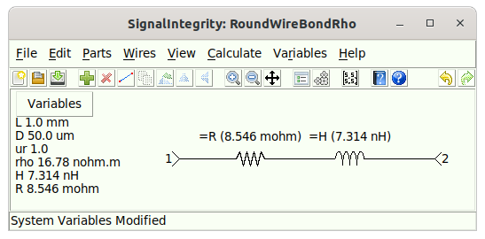
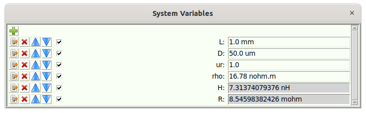
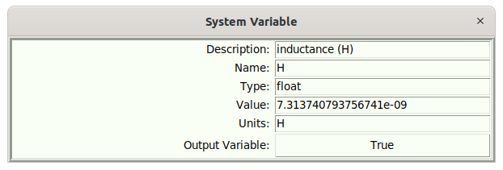

# Equations {#sec:Equations}

Equations allow for the running of a (small) Python script. The idea is that the script takes in input variables (non-output variables) and calculates a bunch of new variables (with some of these being output variables).

The input and output variables are held inside the schematic variables. Opening the [Schematic Variables](15-Main-Schematic-Dialog.md#Control-Help:Schematic-Variables) shows the schematic variables. For example, take the following schematic that utilizes equations:

<div class="center">



</div>

This schematic is intended to take in the variables for a round wire bond:

- L – the length of the wire bond, in m.

- D – the diameter of the wire bond, in m.

- ur – the relative permeability of the material used for the wire bond.

- rho – the resistivity of the material used for the wire bond, in ohm$\centerdot$m.

The idea is to compute the following:

- H – the inductance of the wire bond, in H.

- R – the resistance of the wire bond, in ohms.

You can see that the schematic is parameterized, such that the resistance and inductance are based on the values of R and H.

Opening the [Schematic Variables](15-Main-Schematic-Dialog.md#Control-Help:Schematic-Variables), reveals the following dialog:

<div class="center">



</div>

Here, the variables H and R are grayed out, indicating that they are not writable and and are output variables. Editing H, for example, shows this:

<div class="center">



</div>

So, for this example, We can see that there are input variables L, D, and ur, along with output variables H, and R, which are referenced in the schematic. The equations are what connects these two sets of variables. Opening the [Schematic Equations](15-Main-Schematic-Dialog.md#Control-Help:Edit-Schematic-Equations) allows editing of the equations:

<div class="center">


</div>

Here, we see that the script assumes that the variables L, D, and ur are defined prior to the script running. All the script does is produce the intermediate value A, along with the two variables H and R. When this script exits, the output variables H and R are updated, and any references to these values in the schematics are used.

## Referencing External Files in Equations {#sub:ArchiveFile}

Because an equations script is Python, it can open and read external files. For example, a script might read a `.csv` file that defines a set of channels:

```python
import csv
rows = list(csv.DictReader(open('ChannelDefinition.csv')))
```

A path like this is relative to the location of the project file. However, because the file is opened from inside the script, it is *not* one of the file references that [Archive Project](15-Main-Schematic-Dialog.md#Control-Help:Archive) can discover automatically. As a result it would be left out of an archive, and the extracted project would fail when its equations run.

To make a file that is used by the equations part of the archive, wrap its path in the `ArchiveFile()` function:

```python
import csv
rows = list(csv.DictReader(open(ArchiveFile('ChannelDefinition.csv'))))
```

`ArchiveFile(path)` returns `path` unchanged, so it can be wrapped directly around a call to `open()`, or called on its own line (for example `ArchiveFile(filename)`). During a normal calculation it simply returns its argument and does nothing else. During [Archive Project](15-Main-Schematic-Dialog.md#Control-Help:Archive) it additionally records the file, resolved relative to the project file, so that the file is copied into the archive alongside the project. The argument may be any Python expression, so computed paths are supported.

