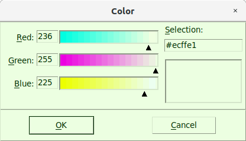
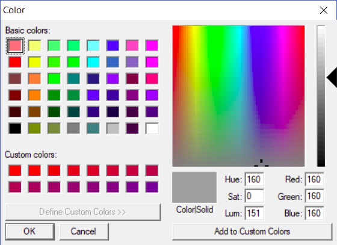
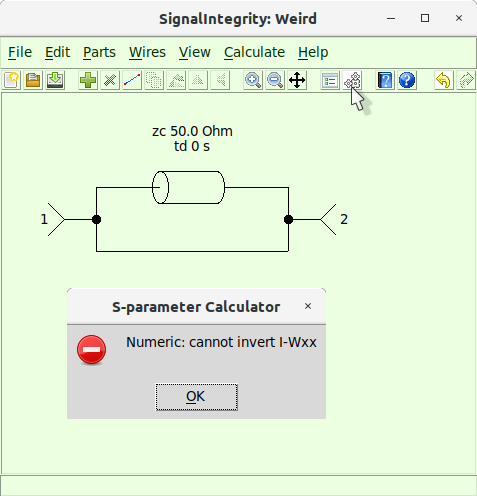
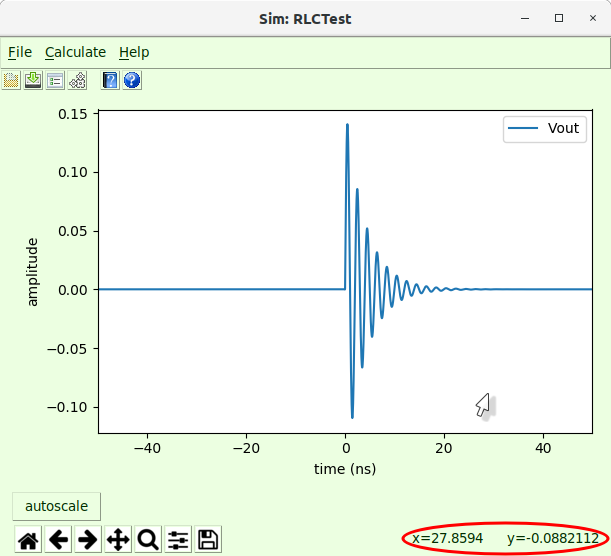

# Preferences {#sec:Preferences}

in ***SignalIntegrityApp***, there are a number of preferences that can be set by the user that alter the appearance, calculations, file handling, etc. When the application is opened for the first time, a default preference file is created with the default settings. These are located at:

- On Windows machines - c:\LeCroy\SignalIntegrity\preferences.xml.

- On Linux Machines - ~/.signalIntegrity/preferences.xml.

Currently, the preferences are broken into two groups:

- [Standard Preferences](29-Preferences.md#sub:Standard-Preferences) - Preferences that govern the basic operation of the schematic editor, file system, calculations, and help system.

- [S-Parameter Viewer Preferences](29-Preferences.md#sub:S-Parameter-Viewer-Preferences) - Preferences that govern the display of the s-parameters in the s-parameter viewer.

## Standard Preferences {#sub:Standard-Preferences}

The standard preferences are:

| **Preference Description** | **Preference Name** | **Type** | **(Default) Value** |
|:---|:---|:---|:---|
| font size | [Appearance.FontSize](29-Preferences.md#sub:Appearance.FontSize) | Int | 12 |
| initial grid | [Appearance.InitialGrid](29-Preferences.md#sub:Appearance.InitialGrid) | Int | 16 |
| background color | [Appearance.Color.Background](29-Preferences.md#sub:Appearance.Color.Background) | String | gray |
| foreground color | [Appearance.Color.Foreground](29-Preferences.md#sub:Appearance.Color.Foreground) | String | black |
| round displayed values | [Appearance.RoundDisplayedValues](29-Preferences.md#sub:Appearance.RoundDisplayedValues) | Int | 4 |
| limit text in displayed values | [Appearance.RoundDisplayedValues](29-Preferences.md#sub:Appearance.LimitText) | Int | 60 |
| show all pin numbers | [Appearance.RoundDisplayedValues](29-Preferences.md#sub:Appearance.RoundDisplayedValues) | Bool | False |
| use SinX/X for resampling | [Calculation.UseSinX/X](29-Preferences.md#sub:Calculation.UseSinX) | Bool | True |
| try SVD in calculations (experimental) | [Calculation.TrySVD](29-Preferences.md#sub:Calculation.TrySVD) | Bool | True |
| allow non-unique solutions with SVD | [Calculation.AllowNonUniqueSolutions](29-Preferences.md#sub:Calculation.AllowNonUniqueSolutions) | Bool | False |
| check condition number in calculations | [Calculation.AllowNonUniqueSolutions](29-Preferences.md#sub:Calculation.AllowNonUniqueSolutions) | Bool | True |
| employ mult-port tee elements | [Calculation.MultiPortTee](29-Preferences.md#sub:Calculation.MultiPortTee) | Bool | True |
| enforce 12458 sequence in calculation properties | [Calculation.Enforce12458](29-Preferences.md#sub:Calculation.Enforce12458) | Bool | True |
| enable logarithmically spaced frequencies solutions | [Calculation.LogarithmicSolutions](29-Preferences.md#sub:Calculation.LogarithmicSolutions) | Bool | False |
| enable non 50 ohm solutions | [Calculation.Non50OhmSolutions](29-Preferences.md#sub:Calculation.Non50OhmSolutions) | Bool | False |
| enable parallelization of calculations (experimental) | [Calculation.AllowParallelization](29-Preferences.md#sub:Calculation.AllowParallelization) | Bool | False |
| ignore missing other waveforms in calculations | [Calculation.IgnoreMissingOtherWaveforms](29-Preferences.md#sub:Calculation.IgnoreMissingOtherWaveforms) | Bool | True |
| maximum waveform size | [Calculation.MaximumWaveformPoints](29-Preferences.md#sub:Calculation.MaximumWaveformPoints) | Float | 5 Mpts |
| retain recent project files | [ProjectFiles.RetainLastFilesOpened](29-Preferences.md#sub:RetainLastFilesOpened) | Bool | True |
| open last file on start | [ProjectFiles.OpenLastFile](29-Preferences.md#sub:OpenLastFile) | Bool | True |
| ask to save current file | [ProjectFiles.AskToSaveCurrentFile](29-Preferences.md#sub:AskToSaveCurrentFile) | Bool | True |
| prefer saving waveforms in LeCroy format | [ProjectFiles.PreferSaveWaveformsLeCroyFormat](29-Preferences.md#sub:PreferSaveWaveformsLeCroyFormat) | Bool | False |
| cache results | [Cache.CacheResults](29-Preferences.md#sub:Cache.CacheResults) | Bool | True |
| cache files per project | [Cache.CacheFilesPerProject](29-Preferences.md#sub:Cache.CacheFilesPerProject) | Int | 1 |
| log cache (for debugging) | [Cache.LogCache](29-Preferences.md#sub:Cache.LogCache) | Bool | False |
| check cache file times | [Cache.CheckCacheFileTimes](29-Preferences.md#sub:Cache.CheckCacheFileTimes) | Bool | True |
| parameterize visible properties only | [Variables.ParameterizeOnlyVisible](29-Preferences.md#sub:Variables.ParameterizeOnlyVisible) | Bool | True |
| password for encryption | [Encryption.Password](29-Preferences.md#sub:Encryption.Password) | String | None |
| file ending for encryption | [Encryption.Ending](29-Preferences.md#sub:Encryption.Ending) | String | \$ |
| archive cached results | [ProjectFiles.ArchiveCachedResults](29-Preferences.md#sub:ArchiveCachedResults) | Bool | False |
| use online help | [OnlineHelp.UseOnlineHelp](29-Preferences.md#sub:OnlineHelp.UseOnlineHelp) | Bool | True |
| online help url | [OnlineHelp.URL](29-Preferences.md#sub:OnlineHelp.URL) | String | http://nubis-communications.github.io/SignalIntegrity/SignalIntegrity/App |

## Appearance.FontSize {#appearance.fontsize .unnumbered}

| **Preference Description** | **Preference Name** | **Type** | **(Default) Value** |
|:---|:---|:---|:---|
| font size | [Appearance.FontSize](29-Preferences.md#sub:Appearance.FontSize) | Int | 12 |

The font size preference controls the fonts everywhere from within the application.

Unfortunately, changing the font generally does not take effect until the application is closed and restarted.

Font sizes are not altered in any tikz or pgf plots outputs, which are geared to take the font of an enclosing document.

## Appearance.InitialGrid {#appearance.initialgrid .unnumbered}

| **Preference Description** | **Preference Name** | **Type** | **(Default) Value** |
|:---|:---|:---|:---|
| font size | [Appearance.InitialGrid](29-Preferences.md#sub:Appearance.InitialGrid) | Int | 16 |

The grid size is the number of pixels per grid unit. Smaller grid sizes make the objects in the drawing smaller and larger grid sizes make them bigger.

This grid size is affected by zooming (see [Zoom In](15-Main-Schematic-Dialog.md#Control-Help:Zoom-In) and [Zoom Out](15-Main-Schematic-Dialog.md#Control-Help:Zoom-Out)).

The initial grid is the size of the grid for all new projects.

## Appearance.Color.Background {#appearance.color.background .unnumbered}

| **Preference Description** | **Preference Name** | **Type** | **(Default) Value** |
|:---|:---|:---|:---|
| background color | [Appearance.Color.Background](29-Preferences.md#sub:Appearance.Color.Background) | String | gray |

The background color is the color of all of the dialogs, except for the plot window held within the [S-parameter Viewer](13-S-parameter-Viewer.md#sec:S-parameter-Viewer) or the [Simulator Dialog](14-Simulator-Dialog.md#sec:Simulator-Dialog) windows. This should be chosen as a light color.

The background color of the file, yes/no and error dialogs are unaffected by this color choice, as they are not controllable.

The background color of the plot window, the plot color ([Appearance.Color.Plot](29-Preferences.md#sub:Appearance.Color.Plot)), is not affected by this color choice.

Usually, right after picking the background color, if one chooses the plot color ([Appearance.Color.Plot](29-Preferences.md#sub:Appearance.Color.Plot)) and presses okay, they will be exactly the same.

The [Color Picker](29-Preferences.md#sub:Color-Picker) depends on the operating system.

## Color Picker {#sub:Color-Picker}

The color picker depends on which OS you are running on. Here is the Gnome or KDE look usually seen under Ubuntu Linux:

Here is the windows color picker:

## Appearance.Color.Foreground {#appearance.color.foreground .unnumbered}

| **Preference Description** | **Preference Name** | **Type** | **(Default) Value** |
|:---|:---|:---|:---|
| foreground color | [Appearance.Color.Foreground](29-Preferences.md#sub:Appearance.Color.Foreground) | String | black |

The foreground color controls the color of the characters in the menu. This should be chosen as a dark color.

The foreground color of the file, yes/no and error dialogs are unaffected by this color choice, as they are not controllable.

The foreground color of the plot windows, such as the [S-parameter Viewer](13-S-parameter-Viewer.md#sec:S-parameter-Viewer) or the [Simulator Dialog](14-Simulator-Dialog.md#sec:Simulator-Dialog) windows, are not affected by this color choice.

The [Color Picker](29-Preferences.md#sub:Color-Picker) depends on the operating system.

## Appearance.RoundDisplayedValues {#appearance.rounddisplayedvalues .unnumbered}

| **Preference Description** | **Preference Name** | **Type** | **(Default) Value** |
|:---|:---|:---|:---|
| digits to round displayed values | [Appearance.RoundDisplayedValues](29-Preferences.md#sub:Appearance.RoundDisplayedValues) | Int | 4 |

Sometimes, device properties (see [Edit Properties](15-Main-Schematic-Dialog.md#Control-Help:Edit-Properties)) or [Variables](15-Main-Schematic-Dialog.md#sub:Variables) have values that are very precise, but result in very long numbers when showing full precision. When displaying values in device properties on the screen, it is not desirable to show this full precision, as it can be distracting, and clutter up the schematic. Precision of numbers displayed is therefore limited to the number of digits provided in this preference. This does not affect the actual precision contained in the number.

## Appearance.RoundDisplayedValues {#appearance.rounddisplayedvalues-1 .unnumbered}

| **Preference Description** | **Preference Name** | **Type** | **(Default) Value** |
|:---|:---|:---|:---|
| limit text in displayed values | [Appearance.RoundDisplayedValues](29-Preferences.md#sub:Appearance.LimitText) | Int | 60 |

Sometimes, device properties (see [Edit Properties](15-Main-Schematic-Dialog.md#Control-Help:Edit-Properties)) or [Variables](15-Main-Schematic-Dialog.md#sub:Variables) contain text that is very long, especially when a device property is defined by a variable. When displaying the text in the schematic, it is not desirable to show all of the characters, as it can be distracting, and clutter up the schematic. Text is therefore limited to the number of characters provided in this preference. When text is limited, it is shown with ’...’ at the end, to show that the text display has been limited.

## Appearance.ShowAllPinNumbers {#appearance.showallpinnumbers .unnumbered}

| **Preference Description** | **Preference Name** | **Type** | **(Default) Value** |
|:---|:---|:---|:---|
| show all pin numbers | [Appearance.ShowAllPinNumbers](29-Preferences.md#sub:Appearance.ShowAllPinNumbers-1) | Bool | False |

By default, pin numbers are shown only for devices that require them, namely all devices that take in a file. In these cases, the pin numbering must match the port numbering of the file being read. Otherwise, internal devices known by the application have their pin numbers inherent in the symbol and therefore it is not really necessary to know how the pins are numbered. That being said, when viewing the s-parameters of the device, or when simply checking the symbol versus the s-parameters, it is sometimes useful to see this numbering. Setting this preference to True causes almost all devices to show pin numbers. Devices that will not show pin numbers ever are devices that are perfectly symmetric.

## Calculation.UseSinX/X {#calculation.usesinxx .unnumbered}

| **Preference Description** | **Preference Name** | **Type** | **(Default) Value** |
|:---|:---|:---|:---|
| use SinX/X for resampling | [Calculation.UseSinX/X](29-Preferences.md#sub:Calculation.UseSinX) | Bool | True |

Setting this preference to False causes linear interpolation is used for waveform processing to upsample from the base sample rate to the user sample rate (see [Setting Calculation Properties for Simulation](08-Simulation.md#sub:Setting-Calculation-Properties-for-Simulation)).

Setting this preference to True causes SinX/X interpolation to be used instead.

## Calculation.TrySVD {#calculation.trysvd .unnumbered}

| **Preference Description** | **Preference Name** | **Type** | **(Default) Value** |
|:---|:---|:---|:---|
| try SVD in calculations (experimental) | [Calculation.TrySVD](29-Preferences.md#sub:Calculation.TrySVD) | Bool | True |

Sometimes, there are circuit configurations that have valid answers, but cannot be calculated in traditional ways. A good example of such a circuit is shown above where there is a zero-length transmission line in parallel with a wire between two ports. Without try SVD set, this s-parameter calculation fails because the *weights matrix* cannot be inverted. Essentially, what this means is that the value of each and every node in the system cannot be calculated. Here, however, we are concerned only with the port-port behavior. Although the wave propagation through every path cannot be computed in this circuit, it is known that this circuit is essentially a zero length wire and the s-parameters of such a circuit is well known.

Try SVD allows the use of singular value decomposition in the inversion of the weights matrix. Singular value decomposition is a decomposition of the matrix into several others. While the decomposition itself does not enable inversion, the side matrices can be combined with any matrices that multiply on the sides, allowing portions of the matrix to be ignored. This is the same as saying that despite the fact that the inverse of the matrix does not exist, some of the elements of the matrix inverse can be calculated.

While the SVD is only necessary in somewhat odd situations, it does enable computation of the result. The reason why it’s experimental is that in some cases it computes nonsense answers.

Here are some of the reasons to use it:

- circuits containing parallel loops of wires causing indeterminate internal current flow.

- circuits where all nodes do not have a good ground reference.

- simulations involving current or differential voltage measurements where the circuit has no absolute ground reference.

Some failures of this method are:

- simulations determining the current in parallel loops of wire.

- simulations with voltage sources shorted to ground.

## Calculation.AllowNonUniqueSolutions {#calculation.allownonuniquesolutions .unnumbered}

| **Preference Description** | **Preference Name** | **Type** | **(Default) Value** |
|:---|:---|:---|:---|
| allow non-unique solutions with SVD | [Calculation.AllowNonUniqueSolutions](29-Preferences.md#sub:Calculation.AllowNonUniqueSolutions) | Bool | False |

During calculations, there are cases where nodes of the circuit cannot be solved, but the probed value being requested can actually be calculated. A good example of this is two parallel, zero length transmission lines. The current through either of the transmission lines cannot be calculated, but the total current can. Unfortunately, this can only be calculated using [Calculation.TrySVD](29-Preferences.md#sub:Calculation.TrySVD).

The current through either transmission line, in this example, does not have no solution, it just has many possible solutions. Sometimes (not usually) one is satisfied with one of those solutions. If that is the case, then set this preference to True. It defaults to False.

| **Preference Description** | **Preference Name** | **Type** | **(Default) Value** |
|:---|:---|:---|:---|
| check condition number in calculations | [Calculation.AllowNonUniqueSolutions](29-Preferences.md#sub:Calculation.AllowNonUniqueSolutions) | Bool | True |

## Calculation.CheckConditionNumber {#calculation.checkconditionnumber .unnumbered}

During calculations, many matrices require inversion. In some cases, matrices are ill-conditioned, meaning that although they invert, the result of the inversion, and therefore the solution result is questionable, or probably, incorrect. Setting this preference to True forces a check of the condition number during solution. If the condition number is very high, then the calculation fails with an error reported to the user. Otherwise, the solutions grind through to completion and the user must decide whether the results are valid.

| **Preference Description** | **Preference Name** | **Type** | **(Default) Value** |
|:---|:---|:---|:---|
| check condition number in calculations | [Calculation.CheckConditionNumber](29-Preferences.md#sub:Calculation.CheckConditionNumber) | Bool | True |

## Calculation.MultiPortTee {#calculation.multiporttee .unnumbered}

| **Preference Description** | **Preference Name** | **Type** | **(Default) Value** |
|:---|:---|:---|:---|
| employ mult-port tee elements | [Calculation.MultiPortTee](29-Preferences.md#sub:Calculation.MultiPortTee) | Bool | True |

Originally, whenever multiple device ports were connected in a schematic (denoted by a dot), a three-port tee was placed. If there were more than three device ports connected, multiple three-port tees were employed. It was found that in certain solutions, this caused the solution complexity to increase by up to a factor of three. To avoid this complexity, the possibility exists to make multiple device port connections with a multi-port tee, which can speed up the simulation significantly.

There is no drawback of the multi-port tee, which is why the preference defaults to True. The old way is retained simply for testing compatibility and will be removed at a later date.

## Calculation.Enforce12458 {#calculation.enforce12458 .unnumbered}

| **Preference Description** | **Preference Name** | **Type** | **(Default) Value** |
|:---|:---|:---|:---|
| enforce 12458 sequence in calculation properties | [Calculation.Enforce12458](29-Preferences.md#sub:Calculation.Enforce12458) | Bool | True |

Usually, when [Setting Calculation Properties](07-S-Parameter-Generation.md#sub:Setting-Calculation-Properties), using the [Calculation Properties](15-Main-Schematic-Dialog.md#Control-Help:Calculation-Properties) controls, it is desirable to use good, round numbers. This is enforced using a 12458 sequence (actually, the next higher). For example, if one enters 67.34 GS/s for the sample rate, the software automatically adjusts this to 80 GS/s (the next higher 12458 number). This is usually the best, but sometimes it is really necessary to enter, for example, an end frequency of 70 GHz and these enforcements will confound your efforts. In these cases, set this preference to False. Usually, I might set it to False, enter my odd-ball frequencies, and then set it back to True (it will not change already entered numbers).

## Calculation.LogarithmicSolutions {#calculation.logarithmicsolutions .unnumbered}

| **Preference Description** | **Preference Name** | **Type** | **(Default) Value** |
|:---|:---|:---|:---|
| enable logarithmically spaced frequencies solutions | [Calculation.LogarithmicSolutions](29-Preferences.md#sub:Calculation.LogarithmicSolutions) | Bool | False |

Normally, solutions are performed on a linear frequency scale, as defined in the [Calculation Properties](15-Main-Schematic-Dialog.md#Control-Help:Calculation-Properties). Sometimes, however, it is useful to preform the solution on a logarithmic scale. This is the case for solutions whose results are best viewed on a Bode plot, especially PDN type simulations.

If this preference is set to True, then the possibility for logarithmically spaced frequency point solutions is enabled. See [Logarithmically Spaced Frequencies Solutions](15-Main-Schematic-Dialog.md#sub:Logarithmically-Spaced-Frequencies-Solutions).

Be warned that this preference is experimental in nature and might not provide proper results.

## Calculation.Non50OhmSolutions {#calculation.non50ohmsolutions .unnumbered}

| **Preference Description** | **Preference Name** | **Type** | **(Default) Value** |
|:---|:---|:---|:---|
| enable non 50 ohm solutions | [Calculation.Non50OhmSolutions](29-Preferences.md#sub:Calculation.Non50OhmSolutions) | Bool | False |

Normally all solutions are performed in a $50\,\Omega$ reference impedance. In certain situations, especially in PDN analysis, it is helpful to perform the entire calculation in a different, specified reference impedance which can be specified in the [Calculation Properties](15-Main-Schematic-Dialog.md#Control-Help:Calculation-Properties).

If this preference is set to True, the possibility to perform simulations in a specified reference impedance is enabled.

Keep in mind, it usually sufficient to solve the system in a $50\,\Omega$ reference impedance, and convert the result to a new reference impedance using [Post-Processing](25-Post-Processing.md#sec:Post-Processing).

## Calculation.AllowParallelization {#calculation.allowparallelization .unnumbered}

| **Preference Description** | **Preference Name** | **Type** | **(Default) Value** |
|:---|:---|:---|:---|
| enable parallelization of calculations (experimental) | [Calculation.AllowParallelization](29-Preferences.md#sub:Calculation.AllowParallelization) | Bool | False |

This preference is the global, application-wide switch that permits calculations to be distributed across multiple processor cores. See [Parallel Calculations](32-Parallel-Calculations.md#sec:Parallel-Calculations) for a full explanation of how parallelization works and when it is beneficial.

It defaults to False. Because it is experimental, it is off by default.

This preference acts as a hard override: when it is False, no calculation will ever run in parallel, regardless of the per-project [Allow Parallelization](15-Main-Schematic-Dialog.md#sub:Allow-Parallelization) calculation property. When it is True, the feature becomes available, and the [Allow Parallelization](15-Main-Schematic-Dialog.md#sub:Allow-Parallelization) property becomes visible in the [Calculation Properties](15-Main-Schematic-Dialog.md#Control-Help:Calculation-Properties) dialog, where it can be enabled on a per-project basis.

A calculation is only permitted to run in parallel when both this preference and the per-project property are True. Even then, a cost model decides, per solve, whether parallel execution is actually worthwhile, so small problems continue to run serially.

## Calculation.IgnoreMissingOtherWaveforms {#calculation.ignoremissingotherwaveforms .unnumbered}

| **Preference Description** | **Preference Name** | **Type** | **(Default) Value** |
|:---|:---|:---|:---|
| ignore missing other waveforms in calculations | [Calculation.IgnoreMissingOtherWaveforms](29-Preferences.md#sub:Calculation.IgnoreMissingOtherWaveforms) | Bool | True |

This preference allows [Virtual Probing](10-Virtual-Probing.md#sec:Virtual-Probing) and [Simulation](08-Simulation.md#sec:Simulation) calculations to complete, even if missing waveforms specified by the special devices [Waveform](23-Built-in-Devices-Parts.md#device:Waveform) and [Eye Waveform](23-Built-in-Devices-Parts.md#device:Eye-Waveform) are not found on the disk. If this preference is false, missing waveforms specified by these devices cause the calculation to fail.

## Calculation.MaximumWaveformPoints {#calculation.maximumwaveformpoints .unnumbered}

| **Preference Description** | **Preference Name** | **Type** | **(Default) Value** |
|:---|:---|:---|:---|
| maximum waveform points | [Calculation.MaximumWaveformPoints](29-Preferences.md#sub:Calculation.MaximumWaveformPoints) | Float | 5 Mpts |

Sometimes waveforms are just too big to process, and instead of needing to kill the program, it would be better if the program just threw a [Waveform](27-Errors-and-Exceptions.md#sub:Waveform) exception. Pathological cases also occur accidentally, especially with regard to upsampling and [Eye Diagram Calculation](17-Eye-Diagram-Calculation.md#sec:Eye-Diagram-Calculation).

To protect things, a maximum value is set in the preferences for the sizes of waveforms. The user can set this value as high as desired, but setting it to a reasonably sized number is advised.

## ProjectFiles.RetainLastFilesOpened {#sub:RetainLastFilesOpened}

| **Preference Description** | **Preference Name** | **Type** | **(Default) Value** |
|:---|:---|:---|:---|
| retain recent project files | [ProjectFiles.RetainLastFilesOpened](29-Preferences.md#sub:RetainLastFilesOpened) | Bool | True |

This causes the application to maintain a list of the last four files opened. These files are shown on the [File](15-Main-Schematic-Dialog.md#sub:File) pulldown menu in the [Open Recent File](15-Main-Schematic-Dialog.md#Control-Help:Open-Recent-File) selection.

Also, the availability of the preference for the application to always open with the last file edited ([ProjectFiles.OpenLastFile](29-Preferences.md#sub:OpenLastFile)) is controlled by this preference. In other words, if this preference is not set to True, the preference to open the last file has no effect.

## ProjectFiles.OpenLastFile {#sub:OpenLastFile}

| **Preference Description** | **Preference Name** | **Type** | **(Default) Value** |
|:---|:---|:---|:---|
| open last file on start | [ProjectFiles.OpenLastFile](29-Preferences.md#sub:OpenLastFile) | Bool | True |

This preference determines whether the last file edited will be opened whenever the application is started.

It depends on the preference [ProjectFiles.RetainLastFilesOpened](29-Preferences.md#sub:RetainLastFilesOpened) being set to True.

## ProjectFiles.AskToSaveCurrentFile {#sub:AskToSaveCurrentFile}

| **Preference Description** | **Preference Name** | **Type** | **(Default) Value** |
|:---|:---|:---|:---|
| ask to save current file | [ProjectFiles.AskToSaveCurrentFile](29-Preferences.md#sub:AskToSaveCurrentFile) | Bool | True |

This preference determines whether the application will unconditionally ask whether you want to save the changes to the current project file prior to exiting the application.

Currently, it has no knowledge of whether the project was recently changed.

## ProjectFiles.PreferSaveWaveformsLeCroyFormat {#sub:PreferSaveWaveformsLeCroyFormat}

| **Preference Description** | **Preference Name** | **Type** | **(Default) Value** |
|:---|:---|:---|:---|
| ask to save current file | [ProjectFiles.PreferSaveWaveformsLeCroyFormat](29-Preferences.md#sub:PreferSaveWaveformsLeCroyFormat) | Bool | False |

Usually, waveforms are saved in the [Waveform](27-Errors-and-Exceptions.md#sub:Waveform) format with the .txt extension.

SignalIntegrity can also read and save files in the native format used by LeCroy oscilloscopes. This format is proprietary and produces smaller but slightly less accurate representations of waveforms.

When saving waveforms, they can always be saved in any format. Only the type preferred is controlled by this preference.

## Cache.CacheResults {#cache.cacheresults .unnumbered}

| **Preference Description** | **Preference Name** | **Type** | **(Default) Value** |
|:---|:---|:---|:---|
| cache results | [Cache.CacheResults](29-Preferences.md#sub:Cache.CacheResults) | Bool | True |

This preference determines whether results will be *cached* to speed up computation.

Caching is performed on transfer matrix calculations performed in [Simulation](08-Simulation.md#sec:Simulation) and [Virtual Probing](10-Virtual-Probing.md#sec:Virtual-Probing) and on s-parameter results in [S-Parameter Generation](07-S-Parameter-Generation.md#sec:S-parameter-Generation) and [Deembedding](09-Deembedding.md#sec:Deembedding). No caching is performed on any waveform results.

Caching is performed by:

- Generating a hash corresponding to the [Netlist](24-Netlist.md#sec:Netlist) and calculation properties (see [Setting Calculation Properties](07-S-Parameter-Generation.md#sub:Setting-Calculation-Properties)).

- Attempting to load a cache file.

- Comparing the hash to the hash stored in the cache file.

- Comparing the timestamp of the cache file to the timestamp of any of the files required in the calculation.

If this preference is True, whenever a calculation result is computed by the application, a cached result is written with a filename prefixed by the project file name, and suffixed with a concatenation of the word ’\_cached’ and either ’TransferMatrices.p’ for [Simulation](08-Simulation.md#sec:Simulation) and [Virtual Probing](10-Virtual-Probing.md#sec:Virtual-Probing) or ’SParameters.p’ for [S-Parameter Generation](07-S-Parameter-Generation.md#sec:S-parameter-Generation) and [Deembedding](09-Deembedding.md#sec:Deembedding).

For example, the simulation project file named ’RLCTest.xml’ would produce cached transfer matrices named ’RLCTest_cachedTransferMatrices.p’ and the s-parameter project file ’CascadedTwoPorts’ would produce the cached s-parameters named ’CascadedTwoPorts_cachedSParameters.p’.

Again, when this preference is set to True, transfer matrices or s-parameters from a cached file would be utilized whenever [Calculate](15-Main-Schematic-Dialog.md#sub:Calculate) is initiated, the cached file is found, the hash matches the hash of the netlist and calculation properties, and the timestamp of the cached file is later than any files utilized in the calculation.

Since only transfer matrices are cached in [Simulation](08-Simulation.md#sec:Simulation) and [Virtual Probing](10-Virtual-Probing.md#sec:Virtual-Probing) applications, waveform processing always proceeds as usual.

Using caching greatly speeds up computation, but tends to litter the disk with these files, which can be quite large. It’s useful to occasionally delete all of the files named ’\*\_cached\*.p’ from the system. This must be performed manually.

## Cache.CacheFilesPerProject {#cache.cachefilesperproject .unnumbered}

| **Preference Description** | **Preference Name** | **Type** | **(Default) Value** |
|:---|:---|:---|:---|
| cache files per project | [Cache.CacheFilesPerProject](29-Preferences.md#sub:Cache.CacheFilesPerProject) | int | 1 |

As stated in [Cache.CacheResults](29-Preferences.md#sub:Cache.CacheResults), the default is that there is one specific name of a cache file for each result object and each project. Sometimes, this is inconvenient, especially when performing parametric sweeps using projects with lots of input variables that combinations that are reused. A good example would be a parameterized project that computes the model of a cable given a specified cable length. Each time the length of the cable is changed, it would need to be recalculated and cached.

Let’s say, in this example, that 10 cable lengths are used throughout a parametric sweep. Setting cache files per project to a number like 10 means that each cable length will be calculated once and the cache will be reused.

To do this, the cache file name, as outlined in [Cache.CacheResults](29-Preferences.md#sub:Cache.CacheResults) has the long hash value attached to the name.

Just as caching can litter the disk with these cache files and use a lot of disk space, increasing the number of cache files per project makes this even worse, so you’ll want to delete these cache files periodically.

## Cache.LogCache {#cache.logcache .unnumbered}

| **Preference Description** | **Preference Name** | **Type** | **(Default) Value** |
|:---|:---|:---|:---|
| log cache (for debugging) | [Cache.LogCache](29-Preferences.md#sub:Cache.LogCache) | Bool | False |

This is for debugging caching - leave it False.

## Cache.CheckCacheFileTimes {#cache.checkcachefiletimes .unnumbered}

| **Preference Description** | **Preference Name** | **Type** | **(Default) Value** |
|:---|:---|:---|:---|
| log cache (for debugging) | [Cache.CheckCacheFileTimes](29-Preferences.md#sub:Cache.CheckCacheFileTimes) | Bool | False |

This is for debugging caching - leave it set to True

## Variables.ParameterizeOnlyVisible {#variables.parameterizeonlyvisible .unnumbered}

| **Preference Description** | **Preference Name** | **Type** | **(Default) Value** |
|:---|:---|:---|:---|
| parameterize visible properties only | [Variables.ParameterizeOnlyVisible](29-Preferences.md#sub:Variables.ParameterizeOnlyVisible) | Bool | True |

When using the [Parameterize Schematic](15-Main-Schematic-Dialog.md#Control-Help:Parameterize-Project) command, usually only the visible device properties are parameterized.

Setting this preference to false causes all device properties to be parameterized.

## Encryption.Password {#encryption.password .unnumbered}

| **Preference Description** | **Preference Name** | **Type** | **(Default) Value** |
|:---|:---|:---|:---|
| password for encryption | [Encryption.Password](29-Preferences.md#sub:Encryption.Password) | String | None |

When encrypting a file with the correct name ending (see [Encryption.Ending](29-Preferences.md#sub:Encryption.Ending)) or decrypting a file employing [\[sec:Encryption\]](30-Encryption.md#sec:Encryption){reference-type="ref" reference="sec:Encryption"}, this is the password used.

## Encryption.Ending {#encryption.ending .unnumbered}

| **Preference Description** | **Preference Name** | **Type** | **(Default) Value** |
|:---|:---|:---|:---|
| file ending for encryption | [Encryption.Ending](29-Preferences.md#sub:Encryption.Ending) | String | \$ |

This is the file name ending used to determine whether to encrypt a project file when it is saved. See [Encryption](30-Encryption.md#sec:Encryption) for more details.

## ProjectFiles.ArchiveCachedResults {#sub:ArchiveCachedResults}

| **Preference Description** | **Preference Name** | **Type** | **(Default) Value** |
|:---|:---|:---|:---|
| archive cached results | [ProjectFiles.ArchiveCachedResults](29-Preferences.md#sub:ArchiveCachedResults) | Bool | False |

Usually, when you [Archive Project](15-Main-Schematic-Dialog.md#Control-Help:Archive), only the source files (project files and referenced s-parameter files) are archived. When this preference is set to True, the cached solutions are also archived. In theory, this speeds up the calculations when archives are extracted (but can also make the archive quite large in size).

Currently, when the archive is created with cached solutions, the update time of the cached solution is retained as it is added to the archive. And, if the archive were to be extracted using archive extraction utilities, these update times would remain untouched. Unfortunately, there is a bug in the Python archive extraction tools that causes the update times to become modified, causing recalculation of the solution and defeating the purpose. Some workaround to this will be found and fixed in the future.

## OnlineHelp.UseOnlineHelp {#onlinehelp.useonlinehelp .unnumbered}

| **Preference Description** | **Preference Name** | **Type** | **(Default) Value** |
|:---|:---|:---|:---|
| use online help | [OnlineHelp.UseOnlineHelp](29-Preferences.md#sub:OnlineHelp.UseOnlineHelp) | Bool | True |

This preference determines whether the application uses online help. This is the preferred arrangement.

If True, the help system will be accessed according to the [OnlineHelp.URL](29-Preferences.md#sub:OnlineHelp.URL) preference.

If False, the help system is expected to be in a directory called ’Help’ under the ’SignalIntegrity/App’ directory.

## OnlineHelp.URL {#onlinehelp.url .unnumbered}

| **Preference Description** | **Preference Name** | **Type** | **(Default) Value** |
|:---|:---|:---|:---|
| online help url | [OnlineHelp.UseOnlineHelp](29-Preferences.md#sub:OnlineHelp.UseOnlineHelp) | String | http://nubis-communications.github.io/SignalIntegrity/SignalIntegrity/App |

This preference is created for the unlikely event that the online software help system has been moved. It’s more likely that you would receive an updated software version from the new site and it would have the correct URL for the new help system location.

Currently, the help system is located online at: ’http://nubis-communications.github.io/SignalIntegrity/SignalIntegrity/App’.

That being said, in a complicated manner, the help system can be retrieved from a branch called ’gh-pages’ from the git repository and placed on your local disk. This is especially useful for debugging as the help system is being modified. For example, if a git repository has been created in the directory ’SignalIntegrityPages’ and the gh-pages master branch pulled, the local help system can be accessed from the location of your SignalIntegrity/App folder under SignalIntegrity. Note that in this case the actual base of the help system will be below this directory at Help/Help.html.conv/Help.html’.

## S-Parameter Viewer Preferences {#sub:S-Parameter-Viewer-Preferences}

The s-parameter viewer preferences are:

- The [Plot Window Preferences](29-Preferences.md#sub:Plot-Window-Preferences).

- All of the zoom settings in the [S-Parameter Viewer Zoom Menu](13-S-parameter-Viewer.md#Control-Help:S-Parameter-Viewer-Zoom) are held in **SParameterProperties.Zoom**:

- All of the view settings in the [S-Parameter Viewer View Menu](13-S-parameter-Viewer.md#sub:S-Parameter-Viewer-View).

  - **SParameterProperties.Plot.LogScale** - see [Log Frequency Scale](13-S-parameter-Viewer.md#Control-Help:SP-Log-Scale)

  - **SParameterProperties.Plot.ShowCausalityViolations** - see [Show Causality Violations](13-S-parameter-Viewer.md#Control-Help:Show-Causality-Violations)

  - **SParameterProperties.Plot.ShowExcessCapacitance** - see [Show Excess Capacitance](13-S-parameter-Viewer.md#Control-Help:Show-Excess-Capacitance)

  - **SParameterProperties.Plot.ShowExcessInductance** - see [Show Excess Inductance](13-S-parameter-Viewer.md#Control-Help:Show-Excess-Inductance)

  - **SParameterProperties.Plot.ShowImpedance** - see [Show Impedance](13-S-parameter-Viewer.md#Control-Help:Show-Impedance)

  - **SParameterProperties.Plot.ShowPassivityViolations** - see [Show Passivity Violations](13-S-parameter-Viewer.md#Control-Help:Show-Passivity-Violations)

  - **SParameterProperties.Plot.VariableLineWidth** - see [Variable Line Width](13-S-parameter-Viewer.md#Control-Help:Variable-Line-Width)

## Simulator Dialog Preferences {#sub:Simulator-Dialog-Preferences}

The simulator dialog preferences are:

- The [Plot Window Preferences](29-Preferences.md#sub:Plot-Window-Preferences).

## Statistical Noise Preferences {#sub:Statistical-Noise-Preferences}

The statistical noise preferences control how values are displayed in the [Statistical Noise Measurements](31-Statistical-Noise-Dialog.md#sub:Statistical-Noise-Measurements) table:

| **Preference Description** | **Preference Name** | **Type** | **(Default) Value** |
|:---|:---|:---|:---|
| zero threshold | [StatisticalNoise.ZeroThreshold](29-Preferences.md#sub:StatisticalNoise.ZeroThreshold) | Float | 1e-15 |
| maximum SNR | [StatisticalNoise.MaximumSNR](29-Preferences.md#sub:StatisticalNoise.MaximumSNR) | Float | 150 |

## StatisticalNoise.ZeroThreshold {#statisticalnoise.zerothreshold .unnumbered}

| **Preference Description** | **Preference Name** | **Type** | **(Default) Value** |
|:---|:---|:---|:---|
| zero threshold | [StatisticalNoise.ZeroThreshold](29-Preferences.md#sub:StatisticalNoise.ZeroThreshold) | Float | 1e-15 |

Any rms or other linear (non-dB) noise quantity whose magnitude is below this threshold is treated as zero and left blank in the [Statistical Noise Measurements](31-Statistical-Noise-Dialog.md#sub:Statistical-Noise-Measurements) table. This suppresses meaningless near-zero values that arise from numerical round-off when a source contributes essentially no noise to an output.

## StatisticalNoise.MaximumSNR {#statisticalnoise.maximumsnr .unnumbered}

| **Preference Description** | **Preference Name** | **Type** | **(Default) Value** |
|:---|:---|:---|:---|
| maximum SNR | [StatisticalNoise.MaximumSNR](29-Preferences.md#sub:StatisticalNoise.MaximumSNR) | Float | 150 |

Signal-to-noise ratios above this value (in dB) are considered unphysical - they indicate that the noise at an output is effectively zero - and are left blank in the [Statistical Noise Measurements](31-Statistical-Noise-Dialog.md#sub:Statistical-Noise-Measurements) table rather than reported as an extremely large number.

## Plot Window Preferences {#sub:Plot-Window-Preferences}

The plot window preferences are:

| **Preference Description** | **Preference Name** | **Type** | **(Default) Value** |
|:---|:---|:---|:---|
| plot width | [Appearance.PlotWidth](29-Preferences.md#sub:Appearance.PlotWidth) | Float | 5 |
| plot height | [Appearance.PlotHeight](29-Preferences.md#sub:Appearance.PlotHeight) | Float | 2 |
| plot dpi | [Appearance.PlotDPI](29-Preferences.md#sub:Appearance.PlotDPI) | Int | 100 |
| plot color | [Appearance.Color.Plot](29-Preferences.md#sub:Appearance.Color.Plot) | String | gray |
| show cursor values on plots | [Appearance.PlotCursorValues](29-Preferences.md#sub:Appearance.PlotCursorValues) | Bool | False |
| significant digits | [SParameterProperties.SignificantDigits](29-Preferences.md#sub:SParameterProperties.SignificantDigits) | Int | 6 |

These preferences apply to the plot windows in both the [Simulator Dialog](14-Simulator-Dialog.md#sec:Simulator-Dialog) and those in the [S-parameter Viewer](13-S-parameter-Viewer.md#sec:S-parameter-Viewer), although in the [S-parameter Viewer](13-S-parameter-Viewer.md#sec:S-parameter-Viewer), the sizes are per window.

## Appearance.PlotWidth {#appearance.plotwidth .unnumbered}

| **Preference Description** | **Preference Name** | **Type** | **(Default) Value** |
|:---|:---|:---|:---|
| plot width | [Appearance.PlotWidth](29-Preferences.md#sub:Appearance.PlotWidth) | Float | 5 |

The plot width is the width of each plot quadrant in the s-parameter viewer (presumably sort of in inches).

The default value of 5 is fine for most displays, but for small displays, smaller numbers like 3 can be used so that the plots fit on the screen. For larger displays, larger values like 7 can be used.

Changes do not take effect until the viewer window is reopened.

## Appearance.PlotHeight {#appearance.plotheight .unnumbered}

| **Preference Description** | **Preference Name** | **Type** | **(Default) Value** |
|:---|:---|:---|:---|
| plot height | [Appearance.PlotHeight](29-Preferences.md#sub:Appearance.PlotHeight) | Float | 2 |

The plot height is the height of each plot quadrant in the s-parameter viewer (presumably sort of in inches).

The default value of 2 is fine for most displays, but for small displays, smaller numbers like 1.8 can be used so that the plots fit on the screen. For larger displays, larger values like 3 can be used.

Changes do not take effect until the viewer window is reopened.

## Appearance.PlotDPI {#appearance.plotdpi .unnumbered}

| **Preference Description** | **Preference Name** | **Type** | **(Default) Value** |
|:---|:---|:---|:---|
| plot dpi | [Appearance.PlotDPI](29-Preferences.md#sub:Appearance.PlotDPI) | Int | 100 |

The plot dpi is the number of dots per inch in the plots in the s-parameter viewer.

Altering this number makes the plot fonts, lines, etc. smaller.

It is not recommended to change this setting.

Changes do not take effect until the viewer window is reopened.

## Appearance.Color.Plot {#appearance.color.plot .unnumbered}

| **Preference Description** | **Preference Name** | **Type** | **(Default) Value** |
|:---|:---|:---|:---|
| plot color | [Appearance.Color.Plot](29-Preferences.md#sub:Appearance.Color.Plot) | String | gray |

The plot color controls the color in the *matplotlib* plot dialogs, such as the [S-parameter Viewer](13-S-parameter-Viewer.md#sec:S-parameter-Viewer) or the [Simulator Dialog](14-Simulator-Dialog.md#sec:Simulator-Dialog) windows. This should be chosen as a light color, and ideally the same as the background color ([Appearance.Color.Background](29-Preferences.md#sub:Appearance.Color.Background)).

Usually, right after picking the background color, if one chooses the plot color and presses okay, they will be exactly the same.

The [Color Picker](29-Preferences.md#sub:Color-Picker) depends on the operating system.

## Appearance.PlotCursorValues {#appearance.plotcursorvalues .unnumbered}

| **Preference Description** | **Preference Name** | **Type** | **(Default) Value** |
|:---|:---|:---|:---|
| show cursor values on plots | [Appearance.PlotCursorValues](29-Preferences.md#sub:Appearance.PlotCursorValues) | Bool | False |

In the embedded *matplotlib* plot dialogs, such as the [S-parameter Viewer](13-S-parameter-Viewer.md#sec:S-parameter-Viewer) or the [Simulator Dialog](14-Simulator-Dialog.md#sec:Simulator-Dialog) windows, if one hovers the mouse over the plots, the (x,y) coordinates within the plot are plotted in the lower right-hand corner of each. This can be useful and act as cursors, sort of. But they are also visually annoying and tend to cause constant, erratic changes to the plot size.

To remove the annoyance, this feature can be controlled by this preference.

## SParameterProperties.SignificantDigits {#sparameterproperties.significantdigits .unnumbered}

| **Preference Description** | **Preference Name** | **Type** | **(Default) Value** |
|:---|:---|:---|:---|
| significant digits | [SParameterProperties.SignificantDigits](29-Preferences.md#sub:SParameterProperties.SignificantDigits) | Int | 6 |

Normally, when s-parameters are written to a file, 6 significant digits are used, without exponent. This is in the interest of space (remember that 0.000001 is -100 dB). If you want more digits, you can raise this number to something higher. In the future, exponents might be allowed, but this is the best compromise for now.

