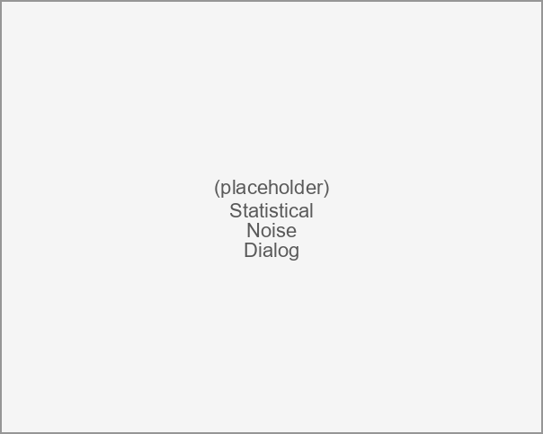
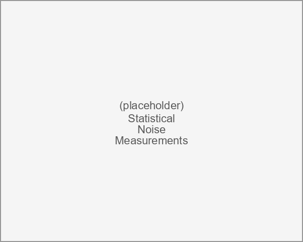

# Statistical Noise Dialog {#sec:Statistical-Noise-Dialog}

The statistical noise dialog displays the output noise spectral densities computed by a [Statistical Noise Analysis](31-Statistical-Noise-Dialog.md#sub:Statistical-Noise-Analysis). It appears under the following conditions:

- Automatically after [Simulating](08-Simulation.md#sub:Simulating) completes in a [Simulation](08-Simulation.md#sec:Simulation) application when the schematic contains at least one enabled statistical noise source (see the [Voltage Statistical Noise Source](23-Built-in-Devices-Parts.md#device:Voltage-StatisticaL-Noise-Source) and [Current Statistical Noise Source](23-Built-in-Devices-Parts.md#device:Current-StatisticaL-Noise-Source)) and at least one output probe designated to be included in the noise.

- When viewing the noise contribution of a statistical noise source through the [Edit Properties](15-Main-Schematic-Dialog.md#Control-Help:Edit-Properties) command.

Statistical noise is an optional feature that must be enabled in the [Preferences](29-Preferences.md#sec:Preferences).

The main part of the dialog is a MatPlotLib plot (see <http://matplotlib.org>) with control of panning and zooming. The plot shows the output noise spectral density in dBm/Hz (or dBm per displayed frequency unit) on the y axis versus frequency on the x axis, with a legend in the upper right naming each displayed output probe. The **autoscale** button below the plot returns to the automatic scaling of the axes.

This dialog has a menu and toolbar with commands that handle:

- [Statistical Noise Selection Menu](31-Statistical-Noise-Dialog.md#sub:Statistical-Noise-Selection-Menu)

- [Statistical Noise Calculate Menu](31-Statistical-Noise-Dialog.md#sub:Statistical-Noise-Calculate-Menu)

- [Statistical Noise View Menu](31-Statistical-Noise-Dialog.md#sub:Statistical-Noise-View-Menu)

- [Statistical Noise Help Menu](31-Statistical-Noise-Dialog.md#sub:Statistical-Noise-Help-Menu)

Along with context sensitive help.

## Statistical Noise Analysis {#sub:Statistical-Noise-Analysis}

A statistical noise analysis propagates the noise generated by each statistical noise source in the schematic to every output probe. During [Simulation](08-Simulation.md#sec:Simulation), the transfer matrices relating each source to each output are computed. The spectral density produced by each noise source is multiplied by the corresponding transfer matrix and the contributions are combined (as uncorrelated power) at each output probe to produce the total output noise spectral density.

Statistical noise sources come in both voltage and current forms (see the [Voltage Statistical Noise Source](23-Built-in-Devices-Parts.md#device:Voltage-StatisticaL-Noise-Source) and [Current Statistical Noise Source](23-Built-in-Devices-Parts.md#device:Current-StatisticaL-Noise-Source)), and each is available as a one-port, two-port, differential, and common-mode element. In addition to the differential source, which injects its noise differentially between the two conductors of a differential pair, there is a common-mode version that injects the same noise onto both conductors relative to ground. Both the differential and common-mode variants are propagated to the output probes in the same manner.

Each output probe reports its noise in units appropriate to the quantity it measures: a current output probe reports its noise in current units ($\mathrm{A_{rms}}$, $\mathrm{A_{rms}}/\sqrt{\mathrm{Hz}}$), while every other probe reports voltage units ($\mathrm{V_{rms}}$, $\mathrm{V_{rms}}/\sqrt{\mathrm{Hz}}$).

Only the outputs whose *include in noise* probe property is set are shown in the spectral density plots and listed in the [Noise Measurements](31-Statistical-Noise-Dialog.md#Control-Help:Noise-Measurements). Eye probes with the property turned off remain part of the underlying results (so their external noise is still applied to the eye diagrams) but are omitted from this dialog.

For each eye probe, the total integrated output noise (the rms noise reported in the [Noise Measurements](31-Statistical-Noise-Dialog.md#Control-Help:Noise-Measurements)) is placed into the read-only [External Noise](22-Eye-Diagram-Properties.md#sub:Noise) box of that eye's [Eye Diagram Properties](21-Eye-Diagram-Properties-Dialog.md#sec:Eye-Diagram-Properties-Dialog). There it is root-sum-squared with the user-entered [Inherent Noise](22-Eye-Diagram-Properties.md#sub:Noise) to form the total vertical noise applied to the eye diagram (i.e. $\sqrt{\mathrm{Inherent\ Noise}^{2}+\mathrm{External\ Noise}^{2}}$). In this way the noise computed by the statistical noise analysis is automatically added to the eye diagrams.

## Statistical Noise Selection Menu {#sub:Statistical-Noise-Selection-Menu}

The selection menu shows the selection tasks along with a list of all displayed output probes. This is a tear-off menu; clicking in the dotted line area causes this menu to be permanently displayed, which is useful for turning individual noise traces on and off. Clicking on any output in the list toggles its display. The selection tasks are:

- [Display All](14-Simulator-Dialog.md#Control-Help:Display-All) - selects all noise traces for displaying.

- [Display None](14-Simulator-Dialog.md#Control-Help:Display-None) - turns off display of all noise traces.

- [Toggle All](14-Simulator-Dialog.md#Control-Help:Toggle-Selections) - toggles all display states.

The selection menu is disabled when there is a single output probe.

## Statistical Noise Calculate Menu {#sub:Statistical-Noise-Calculate-Menu}

The Calculate tasks are:

- [Calculation Properties](15-Main-Schematic-Dialog.md#Control-Help:Calculation-Properties)

- [View Transfer Parameters](14-Simulator-Dialog.md#Control-Help:View-Transfer-Parameters) - views the noise transfer parameters relating each noise source to each output probe in the [S-parameter Viewer](13-S-parameter-Viewer.md#sec:S-parameter-Viewer).

- [Recalculate](14-Simulator-Dialog.md#Control-Help:Recalculate)

## Statistical Noise View Menu {#sub:Statistical-Noise-View-Menu}

The View tasks control the appearance of the spectral density plot and open the measurements table:

- [Show Grids](14-Simulator-Dialog.md#Control-Help:Show-Grids-1) - toggles the display of grids on the plot.

- [Log Frequency Scale](14-Simulator-Dialog.md#Control-Help:Sim-Log-Scale) - sets the frequency axis to a log scale.

- [Noise Measurements](31-Statistical-Noise-Dialog.md#Control-Help:Noise-Measurements)

### Noise Measurements {#Control-Help:Noise-Measurements}

|    *Dialog*    | [Statistical Noise Dialog](31-Statistical-Noise-Dialog.md#sec:Statistical-Noise-Dialog) |
|:--------------:|:----------------------------------:|
| *Menu System*  |        View Noise Measurements        |
|  *Navigation*  |              Alt+V,N               |
| *Key Binding*  |                None                |
|   *Toolbar*    |                None                |
| *Availability* | When there is at least one displayed output probe |

Opens the [Statistical Noise Measurements](31-Statistical-Noise-Dialog.md#sub:Statistical-Noise-Measurements) dialog, a table summarizing the integrated signal power, noise power, signal-to-noise ratio, average noise density, and per-source noise contributions for each displayed output probe.

## Statistical Noise Measurements {#sub:Statistical-Noise-Measurements}

The statistical noise measurements dialog presents the noise results in a column-oriented table, one column per displayed output probe. The rows are organized into the following groups:

| Group | Rows |
|:---|:---|
| Signal Power | Integrated signal power (rms) and (dBm) |
| Noise Power | Total noise (rms) and (dBm) |
| Signal-to-Noise Ratio | SNR (dB) and Salz SNR (dB) |
| Average Noise Density (Hz) | Average noise density in rms/$\sqrt{\mathrm{Hz}}$ and dBm/Hz |
| Average Noise Density (GHz) | Average noise density in rms/$\sqrt{\mathrm{GHz}}$ and dBm/GHz |
| Noise Contributors | One row per noise source, each reporting rms, dBm, and SNR (dB) of that source's contribution to the output |

The rms rows report voltage units ($\mathrm{V_{rms}}$) for voltage probes and current units ($\mathrm{A_{rms}}$) for current probes. Values whose magnitude is below the [ZeroThreshold](29-Preferences.md#sub:StatisticalNoise.ZeroThreshold) preference are left blank, and signal-to-noise ratios above the [MaximumSNR](29-Preferences.md#sub:StatisticalNoise.MaximumSNR) preference (which indicate essentially zero noise) are also left blank.

The measurements dialog has its own File and Help menus:

### Save to CSV {#Control-Help:Statistical-Noise-Save-CSV}

|    *Dialog*    | [Statistical Noise Measurements](31-Statistical-Noise-Dialog.md#sub:Statistical-Noise-Measurements) |
|:--------------:|:----------------------------------:|
| *Menu System*  |          File Save to CSV          |
|  *Navigation*  |              Alt+F,S               |
| *Key Binding*  |                None                |
|   *Toolbar*    |                None                |
| *Availability* |               Always               |

Saves the measurements table to a comma-separated-value (`.csv`) file, with one row per measurement and one column per output probe.

### Preferences {#Control-Help:Statistical-Noise-Preferences}

|    *Dialog*    | [Statistical Noise Measurements](31-Statistical-Noise-Dialog.md#sub:Statistical-Noise-Measurements) |
|:--------------:|:----------------------------------:|
| *Menu System*  |          Help Preferences          |
|  *Navigation*  |              Alt+H,P               |
| *Key Binding*  |                None                |
|   *Toolbar*    |                None                |
| *Availability* |               Always               |

Edits the [Statistical Noise Preferences](29-Preferences.md#sub:Statistical-Noise-Preferences), which control the display thresholds used to blank near-zero noise values and unphysically high signal-to-noise ratios in the measurements table.

## Statistical Noise Help Menu {#sub:Statistical-Noise-Help-Menu}

The Help tasks deal with the help system:

- [Open Help File](31-Statistical-Noise-Dialog.md#Control-Help:Statistical-Noise-Open-Help-File) - opens the help system to the [Statistical Noise Dialog](31-Statistical-Noise-Dialog.md#sec:Statistical-Noise-Dialog) page.

- [Control Help](31-Statistical-Noise-Dialog.md#Control-Help:Statistical-Noise-Control-Help) - for help on any menu element or toolbar button.

### Open Help File {#Control-Help:Statistical-Noise-Open-Help-File}

|    *Dialog*    | [Statistical Noise Dialog](31-Statistical-Noise-Dialog.md#sec:Statistical-Noise-Dialog) |
|:--------------:|:----------------------------------:|
| *Menu System*  |          Help Open Help File          |
|  *Navigation*  |              Alt+H,O               |
| *Key Binding*  |                None                |
|   *Toolbar*    |  |
| *Availability* |               Always               |

Opens the help system in a browser to the [Statistical Noise Dialog](31-Statistical-Noise-Dialog.md#sec:Statistical-Noise-Dialog) page.

### Control Help {#Control-Help:Statistical-Noise-Control-Help}

|    *Dialog*    | [Statistical Noise Dialog](31-Statistical-Noise-Dialog.md#sec:Statistical-Noise-Dialog) |
|:--------------:|:----------------------------------:|
| *Menu System*  |          Help Control Help          |
|  *Navigation*  |              Alt+H,C               |
| *Key Binding*  |                None                |
|   *Toolbar*    |  |
| *Availability* |               Always               |

Provides context-sensitive help on a control. Select this and then click on a control in the dialog to open the help for that control. Press Escape to cancel.
