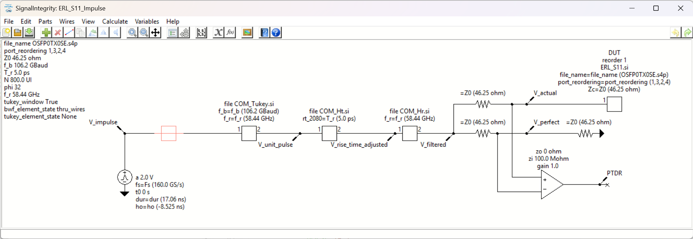
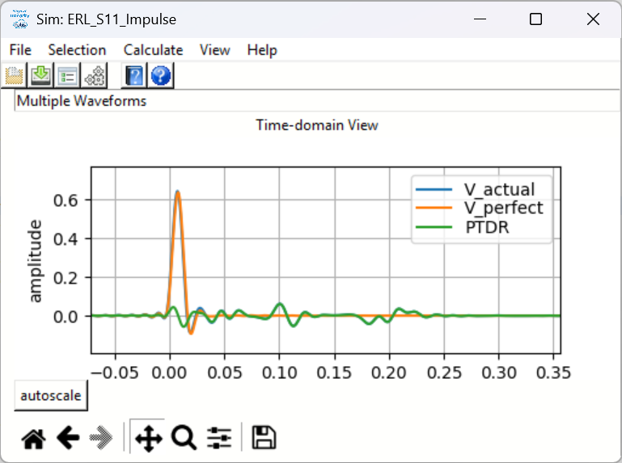
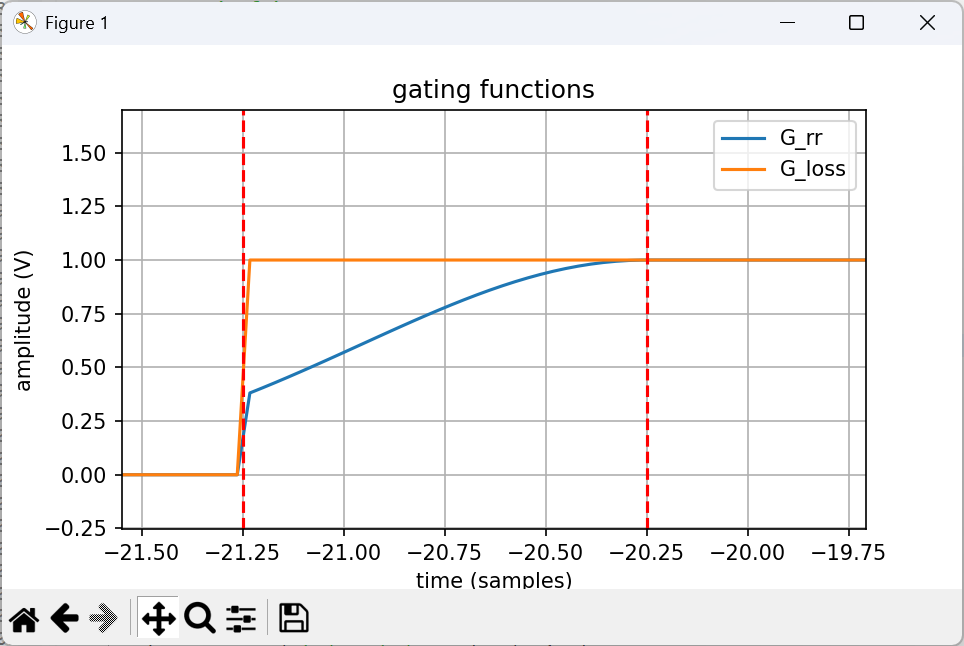
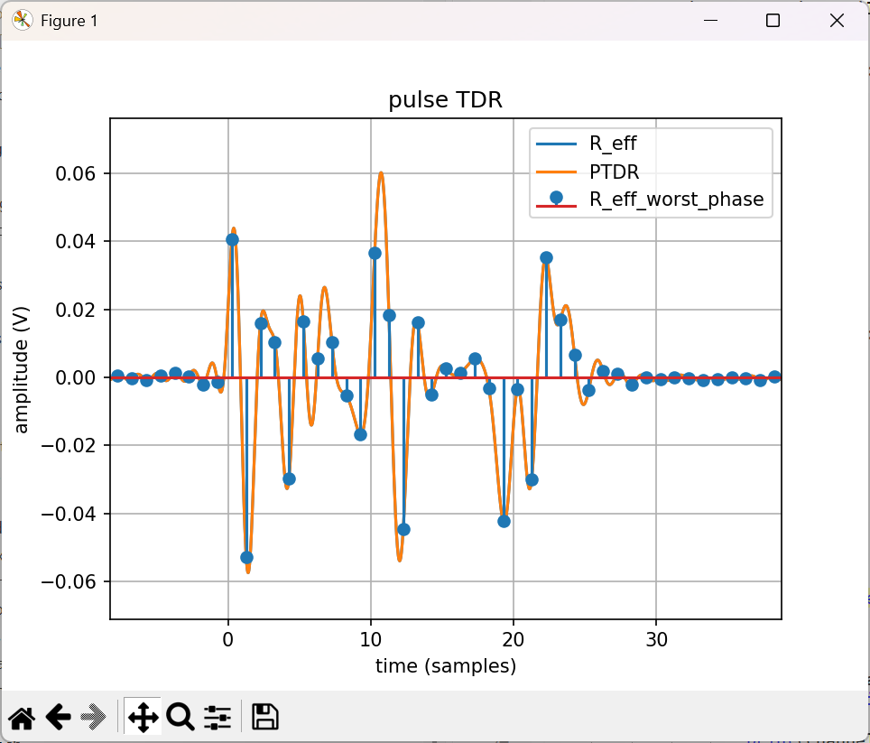
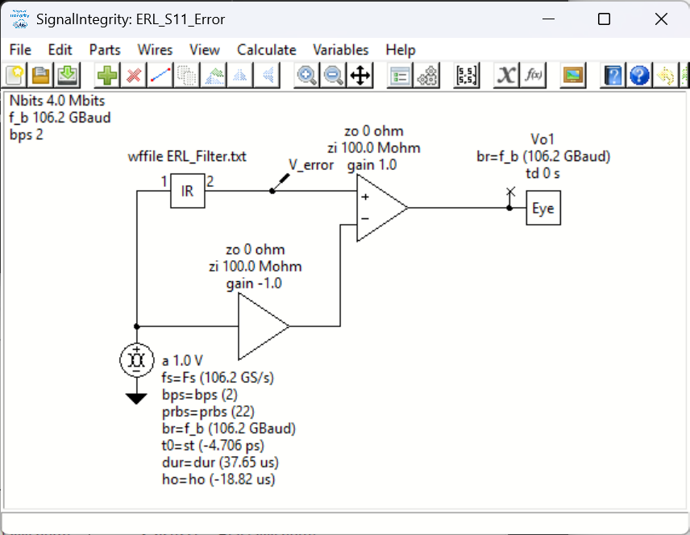
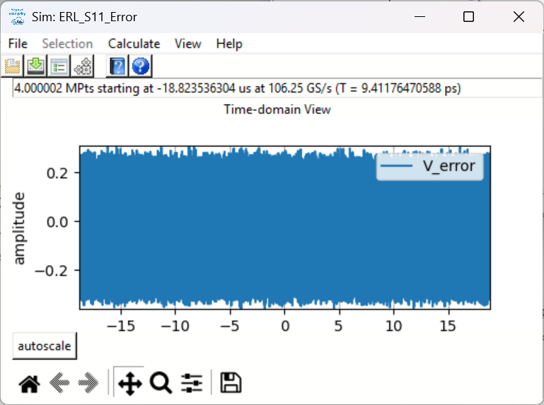
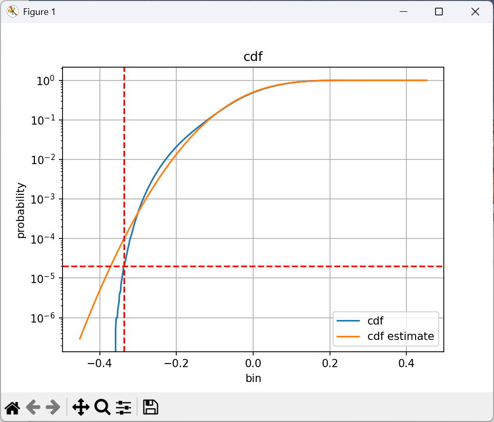
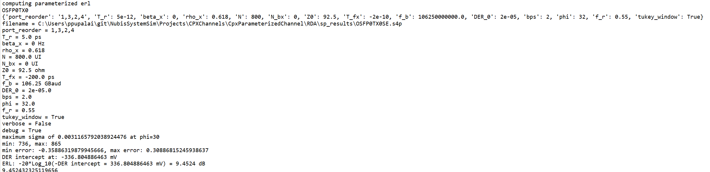
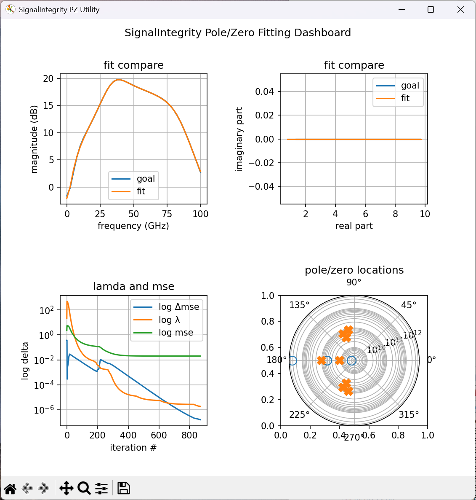

# Utilities {#sec:Utilities}

In addition to the main ***SignalIntegrityApp*** application, *SignalIntegrity* ships with a small collection of stand-alone command-line utilities. These utilities perform specialized signal integrity calculations that are convenient to run outside the graphical application &ndash; for example, as part of an automated measurement or characterization flow.

The utilities currently provided are:

1.  [Effective Return Loss (ERL)](33-Utilities.md#sub:Effective-Return-Loss) &ndash; computes the effective return loss of a channel from its s-parameters, mostly according to the IEEE COM standard.

2.  [Integrated Crosstalk (IXT)](33-Utilities.md#sub:Integrated-Crosstalk) &ndash; computes an integrated measure of the crosstalk coupled into a victim from one or more aggressors.

3.  [Pole/Zero Fitter (PZ)](33-Utilities.md#sub:Pole-Zero-Fitter) &ndash; fits a rational (pole/zero) model to a measured or simulated response.

Each utility is installed as a console entry point that can be invoked from a command prompt. Every utility accepts a `--help` (or `-h`) option that describes its arguments, and a `--verbose` option that prints information as the calculation proceeds.

## Effective Return Loss (ERL) {#sub:Effective-Return-Loss}

The **ERL** utility computes the effective return loss (ERL) of a channel, mostly according to the method defined in the IEEE COM (Channel Operating Margin) specification. ERL is a single-number, time-domain figure of merit that captures the impact of reflections on a channel. Unlike a simple frequency-domain return loss, ERL accounts for the way a receiver equalizer and the finite length of a reflection actually affect the signal, so it correlates better with system performance.

### Theory of Operation {#sub:ERL-Theory}

ERL is computed from the single-ended-to-differential return loss ($S_{11}$) of the device under test (DUT). The calculation proceeds in the following steps:

- The four-port s-parameters of the DUT are read and converted to a differential reflection response.

- A pulse time-domain reflection (PTDR) waveform is computed by exciting the reflection response with a pulse whose transition time is `T_r` at the Baud rate `f_b`, upsampled by a factor of `phi` sample phases and filtered by a receiver filter with a bandwidth of `f_r` times the Baud rate (optionally windowed with a Tukey window).

- The PTDR is gated by two functions that model the way reflections are suppressed near the DUT. The first, $G_{rr}$, models the permitted reflection `rho_x` from an external transmission line; the second, $G_{loss}$, models the incremental available signal loss `beta_x`. These gating functions are parameterized by the equalizer length `N_bx` and the time-gated propagation delay `T_fx` and applied over the reflection length `N`.

- The gated reflection is examined across all `phi` sample phases and the worst-case (largest standard deviation) phase is retained. This worst-case pulse response is used as a reflection filter.

- The reflection filter is driven with a long, random symbol sequence (NRZ for `bps` = 1 or PAM-4 for `bps` = 2) to produce a distribution of the reflected error voltage. The cumulative distribution of this error is formed and the voltage at which the distribution reaches the target detector error ratio `DER_0` is found by interpolation.

- ERL is reported as $-20\log_{10}(-v)$ (in dB), where $v$ is the error-voltage intercept at `DER_0`. An optional `bias` (in dB) may be subtracted from this result.

The pulse time-domain reflection (PTDR) waveform is generated by the ***SignalIntegrity*** schematic shown below, which produces the `PTDR` waveform that the remaining steps gate and analyze.



Simulating this schematic produces the raw PTDR waveform &ndash; the reflected response of the DUT to a single pulse &ndash; upsampled to `phi` sample phases per unit interval.



The two gating functions, $G_{rr}$ and $G_{loss}$, are then formed. $G_{rr}$ ramps in the permitted external reflection `rho_x` and $G_{loss}$ applies the incremental available signal loss `beta_x`, both taking effect after the equalizer length `N_bx` (measured from the time-gated propagation delay `T_fx`).



Multiplying the PTDR by the two gating functions gives the gated reflection $R_{eff}$. This is examined across all `phi` sample phases and the worst-case phase (the one with the largest standard deviation) is retained and trimmed to its significant extent, as shown below.



The worst-case sampled reflection is written out as a reflection filter and used in a second ***SignalIntegrity*** schematic, shown below, which drives the filter with a long, random symbol sequence (NRZ for `bps` = 1 or PAM-4 for `bps` = 2) to produce the reflected error voltage.



Simulating this schematic yields the error-voltage waveform, whose distribution characterizes the residual reflection seen by the receiver.



Finally, the cumulative distribution of the error voltage is formed and the voltage at which it reaches the target detector error ratio `DER_0` is found by interpolation; ERL follows as $-20\log_{10}(-v)$.



When run with `--verbose`, the utility prints the intermediate values and the final ERL result to the console.



### Arguments {#sub:ERL-Arguments}

The ERL utility takes the name of a four-port (`.s4p`) s-parameter file as its positional argument, followed by a set of keyword arguments. The keyword arguments are:

| Argument       | Units | Required | Description                                                                 |
|:--------------:|:-----:|:--------:|:----------------------------------------------------------------------------|
| `port_reorder` | &ndash; | no (default 1,2,3,4) | port ordering of 1p,1n,2p,2n of the `.s4p` file.                  |
| `T_r`          | s or UI | yes    | transition time associated with a pulse.                                    |
| `beta_x`       | Hz    | yes      | incremental available signal loss factor.                                   |
| `rho_x`        | &ndash; | yes    | permitted reflection from a transmission line external to the DUT (0 to 1). |
| `N`            | UI    | yes      | length of the reflection signal.                                            |
| `N_bx`         | UI    | yes      | equalizer length associated with the reflection signal.                     |
| `Z0`           | ohm   | no (default 100) | intended differential-mode characteristic impedance.                |
| `T_fx`         | s     | no (default 0) | time-gated propagation delay.                                         |
| `f_b`          | Baud  | yes      | Baud rate.                                                                  |
| `DER_0`        | &ndash; | yes    | target detector error ratio.                                                |
| `bps`          | &ndash; | no (default 1) | bits per symbol (1 = NRZ, 2 = PAM-4).                                |
| `phi`          | &ndash; | no (default 32) | number of sample phases in the PTDR (an upsample factor).          |
| `f_r`          | &ndash; | no (default 0.58) | receiver bandwidth as a fraction of the Baud rate.               |
| `tukey_window` | &ndash; | no (default False) | apply a Tukey window to the receiver filter.                    |
| `bias`         | dB    | no (default 0) | bias subtracted (in dB) from the final ERL result.                    |

Arguments that carry units may be entered either in SI form (for example `5ps`, `2.53GHz`, `106.25GBaud`) or as a plain number (for example `5e-12`, `2.53e9`, `106.25e9`). The transition time `T_r` may additionally be specified in UI (for example `0.5UI`), in which case it is converted using the Baud rate.

### Usage {#sub:ERL-Usage}

The utility is invoked from a command prompt. The positional argument is the s-parameter file name, followed by keyword/value pairs:

```
ERL channel.s4p -T_r 6.16ps -beta_x 2.53GHz -rho_x 0.618 -N 400UI -N_bx 8UI -f_b 106.25GBaud -DER_0 1e-4 -bps 2
```

The utility prints the computed ERL (in dB) to standard output. On success the ERL value is printed and the process exits with status 0; on any error the string `error` is printed and the process exits with status 1.

In addition to the keyword arguments above, the following options control the utility's output:

- `-v` / `--verbose` &ndash; prints information (the parsed arguments and intermediate results) as the calculation proceeds. Because the ERL value is returned on standard output, do **not** set this option if you are relying on standard output to capture the return value.

- `-debug` / `--debug` &ndash; shows debug information and additionally displays diagnostic plots (the gating functions, the pulse TDR, and the error CDF) as the computation proceeds.

- `-p` / `--profile` &ndash; profiles the software and prints timing statistics.

For example, to run the calculation with verbose progress messages:

```
ERL channel.s4p -T_r 6.16ps -beta_x 2.53GHz -rho_x 0.618 -N 400UI -N_bx 8UI -f_b 106.25GBaud -DER_0 1e-4 -bps 2 --verbose
```

### Command-Line Help {#sub:ERL-Help}

Running `ERL --help` prints the following summary of the utility's arguments:

```text
usage: ERL [-h] [-debug] [-p] [-v] [-port_reorder PORT_REORDER] [-T_r T_R] [-beta_x BETA_X] [-rho_x RHO_X] [-N N] [-N_bx N_BX]
           [-T_fx T_FX] [-f_b F_B] [-Z0 Z0] [-DER_0 DER_0] [-bps BPS] [-phi PHI] [-f_r F_R] [-tw] [-b BIAS]
           [filename]

Effective Return Loss Calculator

                    Calculates ERL mostly according to the IEEE standard.


positional arguments:
  filename              name of .s4p file for the ERL measurement

options:
  -h, --help            show this help message and exit
  -debug, --debug       shows debug information and plots as the computation proceeds
  -p, --profile         profiles the software
  -v, --verbose         prints information as calculation proceeds.
                        this should not be set if you are relying on stdout for the return value.
  -port_reorder PORT_REORDER
                        (optional) port ordering of 1p,1n,2p,2n of the .s4p file (default is 1,2,3,4).
  -T_r T_R              (required) transition time associated with a pulse,
                        specified with units of s or UI (like 5ps or 5e-12 or 0.5UI).
  -beta_x BETA_X        (required) incremental available signal loss factor,
                        specified with units of Hz (like 2.53GHz or 2.53e9).
  -rho_x RHO_X          (required) permitted reflection from a transmission line external to the DUT,
                        must be between 0 and 1, specified unitless (like 0.5).
  -N N                  (required) length of reflection signal,
                        specified with units of UI (like 400UI or 400).
  -N_bx N_BX            (required) equalizer length associated with reflection signal,
                        specified with units of UI (like 16UI or 16).
  -T_fx T_FX            (optional) time-gated propagation delay,
                        specified with units of s (like 1ns or 1e-9),
                        defaults to 0.
  -f_b F_B              (required) baud rate
                        specified with units of Baud (like 106.25GBaud or 106.25e9).
  -Z0 Z0                (optional) intended differential-mode characteristic impedance
                        specified with units of ohm (like 100ohm or 100),
                        defaults to 100.
  -DER_0 DER_0          (required) target detector error ratio
                        specified unitless (like 1e-6).
  -bps BPS              bits per symbol
                        1 is NRZ (default), 2 is PAM-4.
  -phi PHI              sample phases in ptdr (essentially upsample factor)
                        defaults to 32
  -f_r F_R              receiver bandwidth as a fraction of the Baud rate
                        specified unitless (like 0.58), defaults to 0.58.
  -tw, --tukey_window   apply a Tukey window to the receiver filter
  -b BIAS, --bias BIAS  bias (in dB) subtracted from the final ERL result,
                        specified unitless (like 0.4), defaults to 0.
```

## Integrated Crosstalk (IXT) {#sub:Integrated-Crosstalk}

The **IXT** utility computes an integrated measure of the crosstalk coupled into a victim channel from one or more aggressor channels. It reports a single figure of merit, in dB, that summarizes how strong the aggregate crosstalk is relative to the victim's through response, integrated over frequency.

### Theory of Operation {#sub:IXT-Theory}

The utility works from the s-parameters of a multi-port network that contains a victim path and one or more aggressor paths. The calculation proceeds in the following steps, applied in order:

- The s-parameter file is read.

- The optional **port reordering** (`port_reorder`) is applied. The resulting network keeps only the listed ports, in the listed order.

- The optional **single-ended ports** (`single_ended_ports`) are applied to convert the network to mixed mode. The number of single-ended ports must match the number of ports surviving the port reordering, given in the order p,n,p,n,&hellip;. After conversion, the new ports are all differential ports (in the order of each successive p,n pair) followed by all common-mode ports.

- The **reference impedances** (`reference_impedance`) are applied. You may supply a single value (applied to all ports), two values (the first applied to the first half of the ports and the second to the second half &ndash; for example differential and common-mode), or one value per surviving port.

- If the **voltage transfer function** option (`voltage_transfer_function`) is supplied, all differential and common-mode ports are converted to voltage transfer functions. Otherwise the raw s-parameters are used (note that $s_{21}$ is the ratio of the output wave to the incident wave, which is not the voltage transfer function $s_{21}/(1+s_{11})$).

- Finally, the **victim ports** (`victim_ports`) and **aggressor ports** (`aggressor_ports`) select the through response of the victim and each aggressor.

The integrated crosstalk is then formed by summing, over frequency, the squared ratio of the aggregate aggressor magnitude to the victim magnitude, averaging over the frequency points used, and expressing the result in dB. When multiple aggressors are given, their contributions are combined in a root-sum-of-squares sense at each frequency, so the reported value represents the aggregate crosstalk from all aggressors.

### Arguments {#sub:IXT-Arguments}

The IXT utility takes the name of an s-parameter file as its positional argument, followed by keyword arguments. Arguments that take a list of ports or numbers are given as comma-separated values. The keyword arguments are:

| Argument                     | Required | Description                                                                                          |
|:----------------------------:|:--------:|:-----------------------------------------------------------------------------------------------------|
| `port_reorder`               | no       | comma-separated list of ports to keep and their new order.                                           |
| `single_ended_ports`         | no       | comma-separated list of single-ended ports (p,n,p,n,&hellip;) for conversion to mixed mode.          |
| `reference_impedance`        | no       | comma-separated list of reference impedances (1 value for all ports, 2 values for each half, or one value per port). |
| `voltage_transfer_function`  | no       | fit the voltage transfer function $s_{21}/(1+s_{11})$ instead of the raw $s_{21}$.                    |
| `victim_ports`               | yes      | the two victim ports, given as input,output.                                                         |
| `aggressor_ports`            | yes      | aggressor ports, given as input1,output1,input2,output2,&hellip; (one input/output pair per aggressor). |
| `multiply`                   | no       | comma-separated list of factors to multiply each aggressor's crosstalk by.                           |
| `end_frequency`              | no       | end frequency to resample to (requires `frequency_points`).                                          |
| `frequency_points`           | no       | number of frequency points to resample to (requires `end_frequency`).                                |

If the s-parameters are not evenly spaced in frequency, `end_frequency` and `frequency_points` must both be specified so that the response can be resampled onto an evenly spaced grid.

### Usage {#sub:IXT-Usage}

The utility is invoked from a command prompt. The positional argument is the s-parameter file name, followed by keyword/value pairs. Port lists are comma-separated:

```
IXT network.s16p -vp 1,2 -ap 3,4,5,6
```

This computes the integrated crosstalk into the victim path (from port 1 to port 2) from two aggressor paths (port 3 to port 4 and port 5 to port 6).

The utility prints the computed integrated crosstalk (in dB) to standard output. On success the value is printed and the process exits with status 0; on any error the string `error` is printed and the process exits with status 1.

In addition to the arguments above, the following options control the utility's output:

- `-v` / `--verbose` &ndash; prints information as the calculation proceeds. Because the result is returned on standard output, do **not** set this option if you are relying on standard output to capture the return value.

- `-debug` / `--debug` &ndash; shows debug information and displays a plot comparing the victim and aggressor responses as the computation proceeds.

- `-p` / `--profile` &ndash; profiles the software and prints timing statistics.

### Command-Line Help {#sub:IXT-Help}

Running `IXT --help` prints the following summary of the utility's arguments:

```text
usage: IXT [-h] [-sp S_PARAMETERS] [-pr PORT_REORDER] [-se SINGLE_ENDED_PORTS] [-z0 REFERENCE_IMPEDANCE] [-vt]
           [-vp VICTIM_PORTS] [-vn VICTIM_NAME] [-ap AGGRESSOR_PORTS] [-an AGGRESSOR_NAMES] [-ps PLOT_SAVE] [-mult MULTIPLY]
           [-debug] [-p] [-v] [-fe END_FREQUENCY] [-n FREQUENCY_POINTS]
           [filename]

Integrated Crosstalk Calculator

                        Calculates integrated crosstalk

s-parameter file (-f) is read in.  Then, the port reordering (-pr) is applied.  The new s-parameter file has the number of ports
in the port reordering, in that order.
Then, single-ended ports (-se) are applied.  The number of these must match the number of ports surviving the port reordering
and are in order p,n,p,n,....  The new ports, after conversion to mixed mode, are all differential followed by all common.  The
differential are in order of the first p,n (differential port 1), the second p,n (differential port 2), etc. followed by the
common-mode ports.  Then, the reference impedances are applied (-z0).  There must be either one value (applied to all ports),
two values (applied to the two ports, or the first value is applied to the differential ports and the second to the common
ports) or one value per port surviving the mixed-mode conversion.  Then, if -vt is supplied, all differential and common mode
ports are converted to voltage transfer functions.  Finally, the victim ports (-vp) and aggressor ports (-ap) are used.


positional arguments:
  filename              s-parameter file name

options:
  -h, --help            show this help message and exit
  -sp S_PARAMETERS, --s_parameters S_PARAMETERS
  -pr PORT_REORDER, --port_reorder PORT_REORDER
                        optional comma seperated list of ports to use
  -se SINGLE_ENDED_PORTS, --single_ended_ports SINGLE_ENDED_PORTS
                        optional comma seperated list of single-ended ports for conversion to mixed-mode
  -z0 REFERENCE_IMPEDANCE, --reference_impedance REFERENCE_IMPEDANCE
                        optional comma seperated list of reference impedances
                        1 number means a reference impedance to apply to all ports.
                        2 numbers means a reference impedance to apply to the first half and the second half of ports (like
                        differential/common-mode.
                        otherwise one number per port.
  -vt, --voltage_transfer_function
                        (optional, applies to s-parameters) fit to the voltage transfer function
                        the default is to fit s21, which is the ratio of output
                        wave to incident wave. this is not the voltage transfer function, which is s21/(1+s11).
  -vp VICTIM_PORTS, --victim_ports VICTIM_PORTS
                        comma seperated list of the two victim ports: input,output
  -vn VICTIM_NAME, --victim_name VICTIM_NAME
  -ap AGGRESSOR_PORTS, --aggressor_ports AGGRESSOR_PORTS
                        comma seperated list of aggessor ports: input1,output1,input2,output2,... etc.
  -an AGGRESSOR_NAMES, --aggressor_names AGGRESSOR_NAMES
  -ps PLOT_SAVE, --plot_save PLOT_SAVE
  -mult MULTIPLY, --multiply MULTIPLY
                        comma seperated list of numbers to multiply by each aggressor port crosstalk
  -debug, --debug       shows debug information and plots as the computation proceeds
  -p, --profile         profiles the software
  -v, --verbose         prints information as calculation proceeds.
                        this should not be set if you are relying on stdout for the return value.
  -fe END_FREQUENCY, --end_frequency END_FREQUENCY
                        (optional) end frequency to resample to
                        if this is specified, then the number of frequency points must also be specified
                        (see --frequency_points).
  -n FREQUENCY_POINTS, --frequency_points FREQUENCY_POINTS
                        (optional) number of frequency points to resample to
                        if this is specified, then the end frequency must also be specified (see --end_frequency).
                        it's a good idea to use as few frequency points as needed to improve speed.
```

## Pole/Zero Fitter (PZ) {#sub:Pole-Zero-Fitter}



The **PZ** utility fits a rational (pole/zero) model &ndash; a gain, a delay, and a set of pole and zero pairs &ndash; to a measured or simulated frequency response. It is useful for extracting a compact, analytic model of a response so that it can be examined, reused, or synthesized.

### Theory of Operation {#sub:PZ-Theory}

The utility reads a frequency response and fits a transfer function to it consisting of a DC gain, a bulk delay, and the requested number of complex-conjugate pole pairs and zero pairs. The response to fit can be supplied as:

- an s-parameter file (in which case $s_{21}$ is fitted by default, or the voltage transfer function $s_{21}/(1+s_{11})$ if requested),

- a `.csv` file with a header line followed by rows of `frequency, real_part, imaginary_part`.

The fit is performed iteratively using the Levenberg-Marquardt algorithm. Poles are always restricted to the left-half plane (ensuring a stable model); zeros may optionally be restricted to the left-half plane (to force a minimum-phase result) and/or to be real. A maximum-Q constraint keeps the resulting resonances reasonably behaved and improves the chances of a successful fit. Progress (the iteration count and mean-squared error) is shown as the fit proceeds, and in debug mode a live dashboard displays the fit comparison, the convergence history, and the pole/zero locations.

When it finishes, the utility can write the full results &ndash; the gain, delay, and the location of every pole and zero (as $\omega_0$, Q, natural frequency, real/imaginary parts, magnitude and angle) &ndash; to a `.json` output file. A previous result (or a debug results text file) can also be supplied as the starting guess for a subsequent fit.

### Arguments {#sub:PZ-Arguments}

The PZ utility takes the name of the response file as its positional argument, followed by keyword arguments. The most important arguments are:

| Argument                     | Required | Description                                                                                          |
|:----------------------------:|:--------:|:-----------------------------------------------------------------------------------------------------|
| `fit_type`                   | yes      | type of fit &ndash; either `magnitude` or `complex`.                                                  |
| `zero_pairs`                 | yes      | number of zero pairs to fit.                                                                          |
| `pole_pairs`                 | yes      | number of pole pairs to fit.                                                                          |
| `guess_file`                 | no       | file containing an initial guess (a `.json` result file or a debug results text file).               |
| `output_file`                | no       | output file for the results (the `.json` extension is added automatically).                          |
| `end_frequency`              | no       | end frequency to resample to (requires `frequency_points`).                                          |
| `frequency_points`           | no       | number of frequency points to resample to (requires `end_frequency`).                                |
| `min_delay`                  | no (default 0) | minimum delay allowed in the fit.                                                              |
| `max_delay`                  | no       | maximum delay allowed in the fit.                                                                     |
| `initial_delay`              | no (default 0) | best-guess starting delay (strongly recommended, along with the delay limits).                |
| `max_q`                      | no (default 5) | maximum Q allowed for any pole or zero pair.                                                   |
| `iterations`                 | no (default medium) | iteration budget: `short`, `medium`, `long`, or `infinite`.                              |
| `precision`                  | no (default medium) | convergence precision: `low`, `medium`, `high`, or `super`.                              |
| `real_zeros`                 | no       | restrict the zeros to be real.                                                                        |
| `lhp_zeros`                  | no       | restrict the zeros to the left-half plane (minimum-phase result).                                     |
| `voltage_transfer_function`  | no       | (s-parameters only) fit the voltage transfer function $s_{21}/(1+s_{11})$ instead of $s_{21}$.        |
| `fix_gain`                   | no       | fix the DC gain to the first frequency point instead of fitting it.                                  |
| `fix_delay`                  | no       | fix the delay instead of fitting it (delay is always fixed for magnitude fits).                      |
| `reference_impedance`        | no       | (s-parameters only) reference impedance to use.                                                       |

### Usage {#sub:PZ-Usage}

The utility is invoked from a command prompt. The positional argument is the response file name, followed by keyword/value pairs:

```
PZ channel.s2p --fit_type complex --pole_pairs 3 --zero_pairs 1 --output_file channel_fit
```

This fits three pole pairs and one zero pair to $s_{21}$ of `channel.s2p` and writes the result to `channel_fit.json`.

The utility prints `done` when it completes (or `error` if it fails). It is best used with an explicit `output_file` so that the fitted model is saved for later use.

In addition to the arguments above, the following options control the utility's output:

- `-v` / `--verbose` &ndash; prints information (parameters, convergence progress, and results) as the calculation proceeds. Because a status value is returned on standard output, do **not** set this option if you are relying on standard output to capture the return value.

- `-debug` / `--debug` &ndash; shows debug information and displays the live fitting dashboard (fit comparison, convergence trackers, and pole/zero locations); it also writes intermediate results and goal files.

- `-pf` / `--profile` &ndash; profiles the software and prints timing statistics.

### Command-Line Help {#sub:PZ-Help}

Running `PZ --help` prints the following summary of the utility's arguments:

```text
usage: PZ [-h] [-ft FIT_TYPE] [-debug] [-pf] [-v] [-zp ZERO_PAIRS] [-pp POLE_PAIRS] [-gf GUESS_FILE] [-of OUTPUT_FILE]
          [-fe END_FREQUENCY] [-n FREQUENCY_POINTS] [-mind MIN_DELAY] [-maxd MAX_DELAY] [-maxq MAX_Q] [-id INITIAL_DELAY]
          [-i ITERATIONS] [-pr PRECISION] [-rz] [-lz] [-vt] [-xg] [-xdly] [-r REFERENCE_IMPEDANCE]
          [filename]

Pole/zero Fitter

                        Fits gain, delay, poles and zeros to response provided.


positional arguments:
  filename              name of file for the fit
                        this could be an:
                            s-parameter file (s21 assumed for fit),
                            SignalIntegrity frequency response file (not yet supported), or
                            a .csv file containing frequency, real part, imaginary part comma separated on each line.

options:
  -h, --help            show this help message and exit
  -ft FIT_TYPE, --fit_type FIT_TYPE
                        (required) type of fit -- either "magnitude" or "complex"
  -debug, --debug       shows debug information and plots as the computation proceeds
  -pf, --profile        profiles the software
  -v, --verbose         prints information as calculation proceeds.
                        this should not be set if you are relying on stdout for the return value.
  -zp ZERO_PAIRS, --zero_pairs ZERO_PAIRS
                        (required) number of zero pairs
  -pp POLE_PAIRS, --pole_pairs POLE_PAIRS
                        (required) number of pole pairs
  -gf GUESS_FILE, --guess_file GUESS_FILE
                        (optional) file containing initial guess
                        this file can be an output file (see --output_file), in which case, the raw fit results are
                        extracted and used as the starting guess.  this file must be a .json file with the .json
                        extension.  otherwise, it is assumed to be a text file produced in debug mode (see --debug),
                        which is usually called test_result.txt.
  -of OUTPUT_FILE, --output_file OUTPUT_FILE
                        (optional) output file
                        no matter how this file is specified, it will have the .json extension added to it.
  -fe END_FREQUENCY, --end_frequency END_FREQUENCY
                        (optional) end frequency to resample to
                        if this is specified, then the number of frequency points must also be specified
                        (see --frequency_points).
  -n FREQUENCY_POINTS, --frequency_points FREQUENCY_POINTS
                        (optional) number of frequency points to resample to
                        if this is specified, then the end frequency must also be specified (see --end_frequency).
                        it's a good idea to use as few frequency points as needed to improve speed.
  -mind MIN_DELAY, --min_delay MIN_DELAY
                        (optional) minimum delay - defaults to 0
  -maxd MAX_DELAY, --max_delay MAX_DELAY
                        (optional) maximum delay
  -maxq MAX_Q, --max_q MAX_Q
                        (optional) maximum Q - defaults to 5
                        limiting the maximum Q forces the result to be at least reasonably behaved and improves
                        the chances of a successful fit.
  -id INITIAL_DELAY, --initial_delay INITIAL_DELAY
                        (optional) initial delay - defaults to 0
                        it is highly recommended to supply the best guess at the delay for improving the success
                        of the fit and to limit the delay range (see --max_delay and --min_delay).
  -i ITERATIONS, --iterations ITERATIONS
                        (optional) iterations (short,medium,long,infinite) - defaults to medium
                        normally fit convergence should not end with the expiration of iterations.  if medium
                        iterations is used, iterations expire after about a minute.  long increases this to
                        several minutes max.
  -pr PRECISION, --precision PRECISION
                        (optional) precision for fit (low,medium,high,super)
                        this is the main way of controlling how convergence is determined and it determines how little
                        the error is decreasing before giving up.  low will be very quick, but will result in
                        sub-optimal fits.  medium is usually good enough, while high gives a very good fit.  super is
                        used for extremely good fits, but takes longer (possibly several minutes).
  -rz, --real_zeros     (optional) restrict zeros to be real
                        often the solution can only have real zeros.
  -lz, --lhp_zeros      (optional) restrict zeros to the LHP
                        left-half plane zeros enforces a minimum phase solution.
  -vt, --voltage_transfer_function
                        (optional, applies only to s-parameters) fit to the voltage transfer function
                        when s-parameters are used, the default is to fit s21, which is the ratio of output
                        wave to incident wave. this is not the voltage transfer function, which is s21/(1+s11).
  -xg, --fix_gain       (optional) fix the dc gain.
                        choosing this option fixes the dc point to the first frequency point, otherwise, the dc gain is part of
                        the fit.
  -xdly, --fix_delay    (optional) fix the delay value.
                        choosing this option fixes the delay value to 0, if -id not specified or what is specified by -id,
                        otherwise, the delay is part of the fit.
  -r REFERENCE_IMPEDANCE, --reference_impedance REFERENCE_IMPEDANCE
                        (optional, applies only to s-parameters) specify another reference impedance to use
```

### Output File {#sub:PZ-Output-File}

When an `output_file` is supplied, the fitted model is written as a JSON file (the `.json` extension is added automatically). The file is a single, nested object. Its overall shape is shown in the tree below, and the meaning of each field follows.

```text
├── raw ...................... raw parameter vector [gain, delay, w0, Q, w0, Q, ...]
├── configuration ............ the arguments the utility was run with
├── convergence
│   ├── iterations ........... number of iterations taken
│   ├── mse .................. final mean-squared error
│   ├── time ................. elapsed fitting time (s)
│   ├── completed ............ finish timestamp (MM/DD/YYYY HH:MM:SS)
│   ├── why stopped .......... reason the iteration stopped
│   └── frequency multiplier . internal frequency scaling factor
├── response
│   ├── frequency ............ list of frequencies
│   ├── goal
│   │   ├── magnitude ........ response being fitted (magnitude)
│   │   └── phase ............ response being fitted (degrees)
│   └── result
│       ├── magnitude ........ fitted model response (magnitude)
│       └── phase ............ fitted model response (degrees)
├── gain
│   ├── value ................ DC gain (linear)
│   └── dB ................... DC gain (dB)
├── delay
│   └── value ................ bulk delay (s)
├── pole pair / zero pair     (complex-conjugate pairs)
│   ├── number of ............ count of pairs
│   └── list [ ]             one entry per pair:
│       ├── w0 ............... natural angular frequency
│       ├── Q ................ quality factor
│       ├── zeta ............. damping ratio
│       ├── f0 ............... natural frequency (Hz)
│       ├── wr / fr .......... damped resonant frequency (rad/s and Hz)
│       └── peakdB ........... resonant peak height (dB)
└── pole / zero               (individual roots, two per pair)
    ├── number of ............ twice the number of pairs
    └── list [ ]             one entry per root:
        ├── real / imag ...... rectangular coordinates
        ├── mag .............. magnitude
        └── angle
            ├── rad .......... angle (radians)
            └── deg .......... angle (degrees)
```

The `raw` array holds the parameters in the order `[gain, delay, w0, Q, w0, Q, ...]` &ndash; the zero pairs first, then the pole pairs. This array (or a whole result file) can be fed back in through `guess_file` to seed a subsequent fit.
